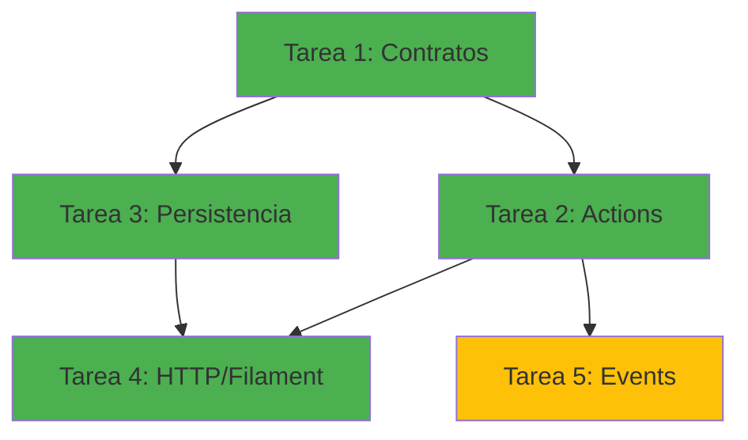

# Prompt: Generación de Tareas para Módulo Auth

## 🎯 Objetivo

Generar un conjunto completo de tareas ejecutables para implementar el **módulo Auth (Autenticación)** del proyecto
E-Commerce WhatsApp + Mercado Libre, siguiendo la arquitectura de agentes definida en `@laravel/AGENTS_ARCHITECTURE.md`.

---

## 📋 Contexto del Proyecto

### Proyecto: E-Commerce WhatsApp + Mercado Libre

**Arquitectura:** Monolito Single-Tenant con Laravel Modules  
**Stack:** Laravel 12 + Filament 4 + Livewire 3 + PostgreSQL 15 + Pest 4

**Características clave:**

- Sistema single-tenant (un merchant por instancia)
- Backoffice con Filament para merchants autenticados
- Frontend público con Livewire/Volt sin autenticación
- Tipado fuerte (PHP 8.5+, PHPStan level 6+)
- Value Objects con `Wireable` para Livewire
- Testing con Pest 4 (cobertura prácticamente 100%)
- Calidad de código: Pint + Rector + PHPStan

**Referencias completas:**

- Definición del proyecto: `@e-commerce-wa-ml/project_definition.md`
- Arquitectura modular: `@e-commerce-wa-ml/modular-architecture.md`

---

## 🏗️ Módulo: Auth (Autenticación)

### Responsabilidad

Autenticación y control de acceso **exclusivamente para el backoffice de Filament**. El frontend público NO requiere
autenticación.

### Alcance

**✅ Dentro del alcance:**

- Login de merchants con email y contraseña
- Gestión de sesiones seguras (database driver)
- Middleware de autenticación para proteger Filament
- Funcionalidad "Recordarme" (remember token)
- Rate limiting en intentos de login
- Protección CSRF en formularios
- Logout con invalidación de sesión

**❌ Fuera del alcance:**

- Registro de usuarios finales (no hay cuentas públicas)
- Autenticación en frontend público (no requerida)
- Sistema de roles/permisos complejos (single-tenant)
- Password reset (fuera del MVP)
- Two-factor authentication (fuera del MVP)
- Social login (fuera del MVP)
- Email verification enforcement (opcional, no obligatorio)

### Modelo de Dominio

**Entidades principales:**

- `User`: Merchant con acceso al backoffice

**Value Objects:**

- `Email`: Email normalizado con validación de formato

**Actions:**

- `AuthenticateMerchantAction`: Autenticar merchant con credenciales
- `LogoutMerchantAction`: Cerrar sesión de merchant
- `ValidateCredentialsAction`: Validar credenciales sin crear sesión

**Data Transfer Objects:**

- `AuthenticateData`: Input para autenticación
- `AuthResult`: Resultado de autenticación

**Eventos:**

- `UserLoginEvent`: Notifica login exitoso
- `UserLogoutEvent`: Notifica cierre de sesión

**Referencia completa:** `@e-commerce-wa-ml/auth/domain_model.md`

---

## 🔧 Sistema de Agentes

### Filosofía

**Agentes = Metodología Reutilizable**  
Los agentes definen **CÓMO hacer las cosas**, no **QUÉ hacer**.

**Separación de Concerns:**

```
Agentes (GENÉRICOS)
    +
Definición del Proyecto (ESPECÍFICA)
    +
Módulo (ESPECÍFICO)
    =
Tareas (EJECUTABLES)
```

### Los 5 Agentes

1. **Agente A: Contratos, Data, VOs y Enums**  
   Definir la frontera pública del módulo (contratos, DTOs, value objects, enums)

2. **Agente B: Actions y Tests Unitarios**  
   Implementar casos de uso del módulo (lógica de negocio desacoplada)

3. **Agente C: Repositorios, Modelos y Persistencia**  
   Implementar la capa de persistencia (modelos, migraciones, casts, factories)

4. **Agente D: HTTP, Livewire/Volt, Filament y Tests Feature**  
   Implementar puntos de entrada del sistema (controllers, Filament resources, tests)

5. **Agente E: Events, Listeners y Jobs**  
   Implementar efectos secundarios y comunicación asíncrona

**Referencia completa:** `@laravel/AGENTS_ARCHITECTURE.md`

---

## 📝 Estructura de Tareas a Generar

Debes generar **5 tareas ejecutables** siguiendo el orden de los agentes:

### Tarea 1: Auth - Contratos, Data, VOs y Enums

**Agente:** `@laravel/agents/agent-a-contracts.md`  
**Prioridad:** HIGH  
**Estimación:** 4 horas

**Artefactos a crear:**

- Value Object: `Email` (con `Wireable`)
- Data Object: `AuthenticateData` (Spatie Laravel Data)
- Data Object: `AuthResult` (Spatie Laravel Data)
- Tests unitarios para `Email` (validación, normalización, comparación)
- Tests unitarios para DTOs

**Reglas de negocio del módulo:**

- Email debe ser único y válido (RFC 5322)
- Email debe normalizarse (lowercase, trim) antes de comparación
- Contraseñas mínimo 8 caracteres
- Remember flag es opcional (default: false)

---

### Tarea 2: Auth - Actions y Tests Unitarios

**Agente:** `@laravel/agents/agent-b-actions.md`  
**Prioridad:** HIGH  
**Estimación:** 6 horas

**Artefactos a crear:**

- Action Command: `AuthenticateMerchantAction`
- Action Command: `LogoutMerchantAction`
- Action Query: `ValidateCredentialsAction`
- Excepciones de dominio:
    - `InvalidCredentialsException`
    - `EmailNotVerifiedException` (opcional)
- Tests unitarios con mocks para cada Action

**Reglas de negocio del módulo:**

- Validar credenciales antes de crear sesión
- Generar remember_token si remember=true
- Disparar evento `UserLoginEvent` después de login exitoso
- Disparar evento `UserLogoutEvent` después de logout
- Rate limiting: máximo 5 intentos por minuto por IP
- Sesiones expiran después de 120 minutos de inactividad

---

### Tarea 3: Auth - Repositorios, Modelos y Persistencia

**Agente:** `@laravel/agents/agent-c-persistence.md`  
**Prioridad:** HIGH  
**Estimación:** 5 horas

**Artefactos a crear:**

- Modelo Eloquent: `User` (implementa `FilamentUser`)
- Eloquent Cast: `EmailCast` (para Value Object `Email`)
- Migration: `create_users_table`
- Migration: `create_sessions_table` (driver: database)
- Factory: `UserFactory` (OBLIGATORIO)
- Tests de integración con DB:
    - Persistencia y recuperación de User
    - Unicidad de email
    - Sessions storage

**Reglas de negocio del módulo:**

- Email único en base de datos (unique index)
- Password siempre hasheado con bcrypt (costo: 10)
- Remember token nullable y único
- Email verified_at nullable (verificación opcional)
- Soft deletes NO habilitado (single-tenant)
- Índices: `users.email` (unique), `sessions.user_id`, `sessions.last_activity`

---

### Tarea 4: Auth - HTTP, Filament y Tests Feature

**Agente:** `@laravel/agents/agent-d-http.md`  
**Prioridad:** HIGH  
**Estimación:** 6 horas

**Artefactos a crear:**

- Integración con Filament Auth:
    - Configuración de Filament auth (plugin)
    - Customización de login page si necesario
    - Implementación de `FilamentUser` en modelo `User`
- Middleware: `AuthenticateFilament` (opcional, Filament ya provee)
- Tests Feature:
    - Login exitoso con credenciales válidas
    - Login fallido con credenciales inválidas
    - Login con remember_token
    - Logout y limpieza de sesión
    - Rate limiting en intentos de login
    - Protección CSRF
    - Sesiones expiradas
    - Dashboard solo accesible con autenticación
- Smoke tests: login page, dashboard protegido

**Reglas de negocio del módulo:**

- Frontend público (Livewire/Volt) NO requiere autenticación
- Solo rutas de Filament (/admin/*) requieren autenticación
- Rate limiting: 5 intentos por minuto por IP (configurable vía env)
- Sesiones con httpOnly, secure (en producción), SameSite=Lax
- CSRF obligatorio en todos los formularios
- Redirección a /admin/login si no autenticado

---

### Tarea 5: Auth - Events, Listeners y Jobs (Opcional en MVP)

**Agente:** `@laravel/agents/agent-e-events.md`  
**Prioridad:** MEDIUM  
**Estimación:** 3 horas

**Artefactos a crear:**

- Event: `UserLoginEvent` (para auditoría futura)
- Event: `UserLogoutEvent` (para auditoría futura)
- Tests de eventos (dispatch correcto)

**Nota:** En MVP, estos eventos se disparan pero NO tienen listeners asociados. Se dejan preparados para auditoría
futura.

**Reglas de negocio del módulo:**

- Eventos deben ser inmutables (`readonly`)
- Eventos deben incluir: user_id, email, timestamp, ip_address (login)
- Listeners en MVP: ninguno (preparación para futuro)

---

## 🎨 Convenciones Técnicas del Proyecto

### Arquitectura y Diseño

- **Clases `final`**: todas las clases deben ser `final`, sin métodos `protected`
- **Single responsibility**: Controllers y Actions con un solo método público
- **Sin arrays públicos**: métodos públicos solo reciben/devuelven Value Objects o Data Objects
- **Value Objects con `Wireable`**: compatibilidad obligatoria con Livewire
- **Value Objects organizados**: `Modules/Auth/ValueObjects/`
- **Validación con excepciones**: throw en lugar de null o valores por defecto
- **Factories obligatorios**: cada modelo debe tener su Factory

### Calidad de Código

- **Tipado fuerte**: type hints completos en parámetros, returns y propiedades
- **PHPStan level 6+**: análisis estático obligatorio
- **Pint**: formateo automático PSR-12 estricto
- **Rector**: refactoring automatizado cuando aplique
- **Cobertura de tests**: prácticamente 100% con Pest 4

### Testing

- **Smoke tests obligatorios**: todas las páginas UI
- **Estructura espejo**: `tests/Feature/` replica `Modules/Auth/`
- **Pest 4**: describe/it syntax, expectations encadenadas
- **Cobertura completa**: Feature tests preferidos sobre Unit tests

### Base de Datos

- **Índices obligatorios**: optimizar consultas frecuentes
- **Enums PHP**: preferir sobre enums de base de datos
- **Migraciones sensibles**: etiquetar con `migration-affects-production` si aplica

### Seguridad

- **Validaciones con excepciones**: throw, nunca null silencioso
- **Rate limiting específico**: configurable vía .env
- **CSRF obligatorio**: protección en todos los formularios
- **Sesiones seguras**: httponly, secure en producción, SameSite=Lax
- **Passwords**: bcrypt con costo 10, nunca expuestos en texto plano

---

## 📊 Checklist de Validación por Tarea

Cada tarea debe cumplir:

- [ ] Código con tipado fuerte completo (parámetros, returns, propiedades)
- [ ] PHPStan level 6 sin errores
- [ ] Pint ejecutado sin advertencias
- [ ] Tests con cobertura completa (prácticamente 100%)
- [ ] Value Objects implementan `Wireable`
- [ ] Factories creados para cada modelo
- [ ] Excepciones de dominio donde corresponda
- [ ] Documentación inline solo donde sea necesario
- [ ] Estructura de directorios según Laravel Modules
- [ ] Referencias a `project_definition.md` y `domain_model.md` verificadas

### Comandos de Validación

```bash
# Análisis estático
./vendor/bin/sail composer run phpstan

# Formateo de código
./vendor/bin/sail bin pint --dirty

# Tests
./vendor/bin/sail test --filter=Auth

# Refactoring (opcional)
./vendor/bin/sail composer run rector
```

---

## 🔗 Dependencias entre Tareas



**Orden de ejecución sugerido:**

1. Tarea 1 (base de contratos)
2. Tareas 2 y 3 en paralelo (Actions y Persistencia)
3. Tarea 4 (HTTP/Filament, requiere 2 y 3)
4. Tarea 5 (Events, opcional en MVP)

---

## 🚀 Instrucciones para el Agente IA

Cuando proceses este prompt:

1. **Parsear referencias** a documentos contextuales:
    - `@laravel/AGENTS_ARCHITECTURE.md` → metodología de agentes
    - `@e-commerce-wa-ml/project_definition.md` → contexto del proyecto
    - `@e-commerce-wa-ml/modular-architecture.md` → arquitectura modular
    - `@e-commerce-wa-ml/auth/domain_model.md` → modelo de dominio del módulo
    - `@laravel/conventions/value-objects.md` → guía de Value Objects
    - `@laravel/agents/agent-{x}.md` → metodología específica por agente

2. **Combinar contextos**:
   ```
   Metodología (Agente) + Proyecto + Módulo + Convenciones = Tarea Ejecutable
   ```

3. **Generar cada tarea** con:
    - Frontmatter YAML completo (task_id, title, agent, dependencies, priority, etc.)
    - Contexto claro (referencias a documentos)
    - Alcance específico (artefactos a crear con firmas/estructuras)
    - Reglas de negocio aplicables del dominio
    - Entregables (checklist de archivos)
    - Validación de calidad (comandos de verificación)
    - Criterios de aceptación

4. **Validar que cada tarea**:
    - Referencia un agente específico
    - Aplica las convenciones del proyecto
    - Implementa reglas de negocio del dominio
    - Incluye tests con cobertura completa
    - Cumple con checklist de calidad

5. **Guardar tareas en**:
   ```
   e-commerce-wa-ml/tasks/auth/
   ├── 001-contracts.md
   ├── 002-actions.md
   ├── 003-persistence.md
   ├── 004-http-filament.md
   └── 005-events.md (opcional)
   ```

6. **Crear índice** en `e-commerce-wa-ml/tasks/auth/README.md` listando las 5 tareas.

---

## ✅ Criterios de Éxito

El prompt habrá cumplido su objetivo cuando:

- [ ] Se hayan generado 5 tareas ejecutables (001-005)
- [ ] Cada tarea referencia el agente correcto
- [ ] Cada tarea aplica convenciones del proyecto
- [ ] Cada tarea implementa reglas del modelo de dominio
- [ ] Cada tarea incluye checklist de entregables
- [ ] Cada tarea define validaciones de calidad
- [ ] Estructura de directorios del módulo está clara
- [ ] Dependencias entre tareas están documentadas
- [ ] Orden de ejecución está sugerido
- [ ] README.md de índice de tareas creado

---

## 📚 Referencias Completas

### Documentos del Proyecto

- `@e-commerce-wa-ml/project_definition.md`: Definición completa del proyecto
- `@e-commerce-wa-ml/modular-architecture.md`: Arquitectura de módulos, responsabilidades y comunicación
- `@e-commerce-wa-ml/auth/domain_model.md`: Modelo de dominio del módulo Auth

### Sistema de Agentes

- `@laravel/AGENTS_ARCHITECTURE.md`: Filosofía y arquitectura de agentes
- `@laravel/agents/agent-a-contracts.md`: Metodología para contratos, DTOs, VOs y enums
- `@laravel/agents/agent-b-actions.md`: Metodología para Actions y lógica de negocio
- `@laravel/agents/agent-c-persistence.md`: Metodología para persistencia y repositorios
- `@laravel/agents/agent-d-http.md`: Metodología para HTTP, Livewire, Filament
- `@laravel/agents/agent-e-events.md`: Metodología para eventos y efectos secundarios

### Convenciones

- `@laravel/conventions/value-objects.md`: Guía detallada de Value Objects con ejemplos

---

## 🎯 Resumen Ejecutivo

**Módulo:** Auth (Autenticación) - TRANSVERSAL  
**Fase:** 1 - Fundamentos  
**Prioridad:** HIGH (bloqueante para todo el backoffice)

**Objetivo:** Implementar autenticación segura para merchants en el backoffice de Filament, con sesiones persistentes,
rate limiting y protección CSRF.

**Entregables:** 5 tareas ejecutables (001-005) que cubren desde contratos hasta eventos, con tests completos y
validaciones de calidad.

**Impacto:** Sin este módulo, ningún merchant puede acceder al backoffice. Es el módulo fundacional para toda la gestión
administrativa.

---

**Versión:** 1.0  
**Fecha:** 2025-12-19  
**Autor:** Alejandro Leone  
**Status:** ✅ Ready to Execute
