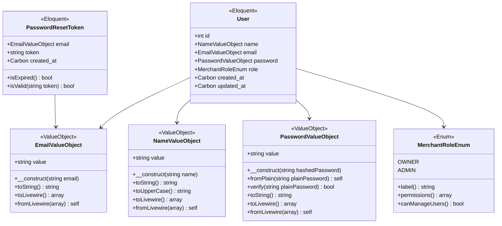
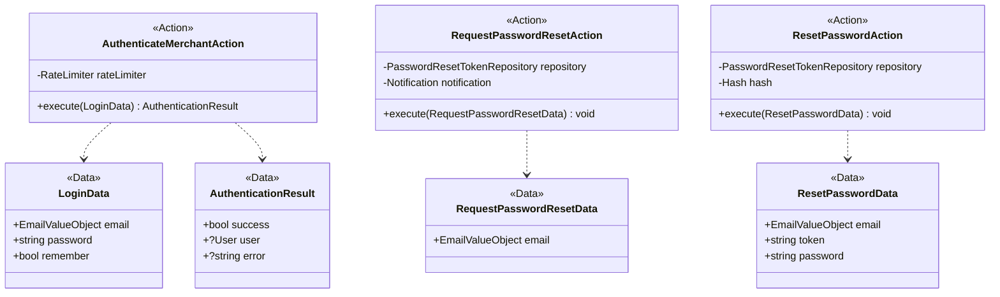
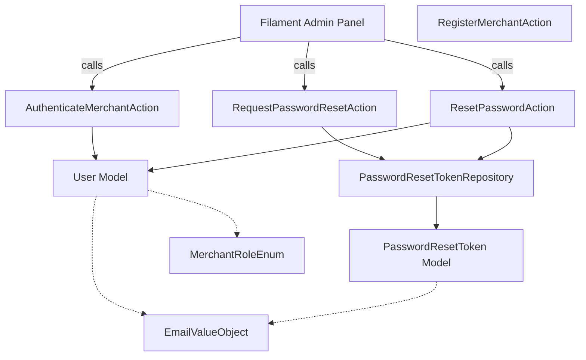
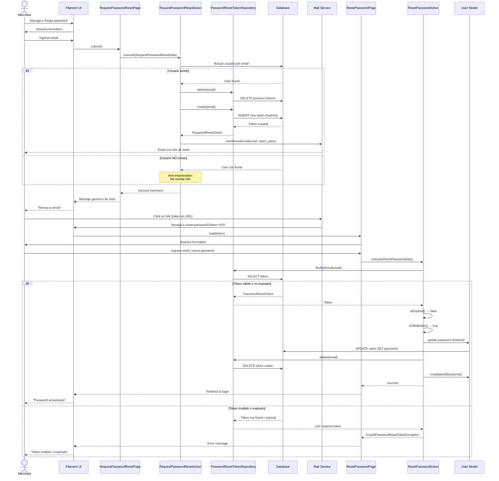

# Diagrama de Clases - Módulo Auth

**Versión:** 1.4  
**Última actualización:** 2025-12-17  
**Autor:** Alejandro Leone

---

## Resumen

Diagrama de clases del módulo **Auth** (Autenticación) que gestiona la autenticación de merchants, control de acceso al
backoffice (Filament), recuperación de contraseña y roles básicos.

**Decisiones clave:**

- ✅ **Integración máxima con Filament:** Login nativo de Filament (`->login()`) para el backoffice
- ✅ **Módulo nwidart/laravel-modules:** Ubicado en `Modules/Auth/`
- ✅ **Nomenclatura Actions:** Todos los servicios se llaman `*Action` (no `*Service`)
- ✅ **Sin componentes Livewire custom:** Filament provee login, register y password reset
- ✅ **Sin verificación de email en MVP:** Single-merchant, configuración inicial directa
- ✅ **Sin Sanctum en MVP:** Preparado para futuro pero no implementado ahora
- ✅ **Logout simplificado:** Llamada directa a `Auth::logout()` desde Filament (sin Action)
- ✅ Solo sesiones estándar de Laravel (sin Remember Me en MVP)
- ✅ Enum `MerchantRoleEnum` (owner, admin) para escalabilidad
- ✅ Modelo `PasswordResetToken` como Eloquent (mayor testabilidad y OOP)
- ✅ Tabla nativa `password_reset_tokens` de Laravel
- ✅ Tests de integración como Feature Tests

---

## Integración con Filament

**Filament v4 provee autenticación nativa que extendemos con lógica de negocio custom:**

### Estrategia de Integración (Opción B: Custom Pages + Actions Propias)

Filament provee las páginas base de autenticación, pero las **extendemos** con Custom Pages que invocan nuestras Actions
para mantener control sobre la lógica de negocio (rate limiting, validaciones custom, anti-enumeration).

**Componentes nativos de Filament utilizados:**

- **Session Management:** Manejo de sesiones con `AuthenticateSession` middleware
- **Profile:** Página de perfil con `->profile()`
- **Logout:** Manejado directamente por Filament

**Componentes extendidos con Custom Pages:**

- **Login:** Custom Page que extiende `Filament\Pages\Auth\Login` e invoca `AuthenticateMerchantAction`
- **Password Reset:** Custom Pages que extienden páginas de Filament e invocan `RequestPasswordResetAction` y
  `ResetPasswordAction`

**El módulo Auth se enfoca en:**

1. **Modelo User:** Extender modelo base con Value Objects (`EmailValueObject`, `PasswordValueObject`,
   `NameValueObject`) y `MerchantRoleEnum`
2. **Actions de negocio:** Lógica específica con rate limiting y validaciones custom
3. **Custom Pages:** Extensión de páginas de Filament para integrar Actions
4. **Repository:** Abstracción de acceso a tokens de password reset
5. **Commands:** Comando artisan para setup inicial de owner
6. **Jobs:** Limpieza programada de tokens expirados

---

### Puntos de Integración con Filament

#### 1. Custom Login Page

**Ubicación:** `Modules/Auth/Filament/Pages/Auth/Login.php`

```php
<?php

declare(strict_types=1);

namespace Modules\Auth\Filament\Pages\Auth;

use Filament\Pages\Auth\Login as BaseLogin;
use Modules\Auth\Actions\AuthenticateMerchantAction;
use Modules\Auth\Data\LoginData;
use Filament\Forms\Components\TextInput;
use Filament\Forms\Components\Checkbox;
use Filament\Forms\Form;

final class Login extends BaseLogin
{
    public function __construct(
        private readonly AuthenticateMerchantAction $authenticateAction
    ) {
        parent::__construct();
    }

    public function form(Form $form): Form
    {
        return $form->schema([
            TextInput::make('email')
                ->label('Email')
                ->email()
                ->required()
                ->autofocus(),
            TextInput::make('password')
                ->label('Contraseña')
                ->password()
                ->required(),
            Checkbox::make('remember')
                ->label('Recordarme'),
        ]);
    }

    protected function getCredentials(): array
    {
        $data = $this->form->getState();
        
        $loginData = LoginData::from([
            'email' => $data['email'],
            'password' => $data['password'],
            'remember' => $data['remember'] ?? false,
        ]);

        $result = $this->authenticateAction->execute($loginData);

        if (!$result->success) {
            $this->throwFailureValidationException();
        }

        return [
            'email' => $loginData->email->toString(),
            'password' => $loginData->password,
        ];
    }
}
```

#### 2. Custom Request Password Reset Page

**Ubicación:** `Modules/Auth/Filament/Pages/Auth/RequestPasswordReset.php`

```php
<?php

declare(strict_types=1);

namespace Modules\Auth\Filament\Pages\Auth;

use Filament\Pages\Auth\PasswordReset\RequestPasswordReset as BaseRequestPasswordReset;
use Modules\Auth\Actions\RequestPasswordResetAction;
use Modules\Auth\Data\RequestPasswordResetData;

final class RequestPasswordReset extends BaseRequestPasswordReset
{
    public function __construct(
        private readonly RequestPasswordResetAction $requestResetAction
    ) {
        parent::__construct();
    }

    protected function sendPasswordResetNotification(string $email): void
    {
        $data = RequestPasswordResetData::from(['email' => $email]);
        $this->requestResetAction->execute($data);
    }
}
```

#### 3. Custom Reset Password Page

**Ubicación:** `Modules/Auth/Filament/Pages/Auth/ResetPassword.php`

```php
<?php

declare(strict_types=1);

namespace Modules\Auth\Filament\Pages\Auth;

use Filament\Pages\Auth\PasswordReset\ResetPassword as BaseResetPassword;
use Modules\Auth\Actions\ResetPasswordAction;
use Modules\Auth\Data\ResetPasswordData;

final class ResetPassword extends BaseResetPassword
{
    public function __construct(
        private readonly ResetPasswordAction $resetAction
    ) {
        parent::__construct();
    }

    protected function resetPassword(): void
    {
        $data = ResetPasswordData::from([
            'email' => $this->email,
            'token' => $this->token,
            'password' => $this->password,
        ]);

        $this->resetAction->execute($data);
    }
}
```

#### 4. Configuración en `AdminPanelServiceProvider`

```php
use Modules\Auth\Filament\Pages\Auth\Login;
use Modules\Auth\Filament\Pages\Auth\RequestPasswordReset;
use Modules\Auth\Filament\Pages\Auth\ResetPassword;

public function panel(Panel $panel): Panel
{
    return $panel
        ->default()
        ->id('admin')
        ->path('admin')
        ->login(Login::class) // ← Custom Login Page
        ->passwordReset(RequestPasswordReset::class, ResetPassword::class) // ← Custom Password Reset
        ->profile() // ← Página de perfil nativa
        ->authMiddleware([
            Authenticate::class,
        ]);
}
```

**Notas:**

- Las Custom Pages extienden las páginas base de Filament para mantener UI consistency
- Las Actions contienen toda la lógica de negocio (rate limiting, anti-enumeration, etc.)
- Filament maneja la UI, sesiones y redirects
- El módulo Auth maneja la lógica de dominio

---

## Diagramas de Clases

> **Nota:** El módulo Auth se divide en 3 diagramas por capa para mejor legibilidad:
> 1. **Modelos y Value Objects** (dominio)
> 2. **Actions y Data Objects** (aplicación)
> 3. **Visión General** (flujo completo simplificado)

---

### Diagrama 1: Modelos y Value Objects (Capa de Dominio)



---

### Diagrama 2: Actions y Data Objects (Capa de Aplicación)



---

### Diagrama 3: Visión General (Flujo Completo Simplificado)



---

### Diagrama 4: Secuencia de Password Reset (Flujo Temporal)



**Notas del diagrama de secuencia:**

- **Anti-enumeration:** Siempre retorna éxito en request, incluso si el email no existe
- **Token hasheado:** Solo se envía el token sin hashear por email, en DB se guarda hasheado
- **Expiración:** 60 minutos desde `created_at`
- **Invalidación de sesiones:** Todas las sesiones activas se invalidan después de cambiar password
- **Token único:** Solo un token activo por email (el anterior se elimina)

---

## Notas de Implementación

### 1. Modelo `User`

**Ubicación:** `app/Models/User.php` (modelo core de Laravel, NO en módulo Auth)

**Tabla:** `users`

**Campos:**

- `id`: int, autoincremental, PK
- `name`: string(255), not null (mapeado a `NameValueObject` via Cast)
- `email`: string(255), unique, not null (mapeado a `EmailValueObject` via Cast)
- `password`: string(255), not null (hashed con bcrypt, mapeado a `PasswordValueObject` via Cast)
- `role`: string (enum), not null, default 'owner' (mapeado a `MerchantRoleEnum` via Cast)
- `created_at`, `updated_at`: timestamps

**Relaciones:**

- Ninguna en MVP (en futuro: `hasMany(Order)` para auditoría)

**Cast:**

```php
protected $casts = [
    'name' => NameCast::class,
    'email' => EmailCast::class,
    'password' => PasswordCast::class,
    'role' => MerchantRoleEnum::class,
];
```

**Factory:** `UserFactory` con estados: `owner`, `admin`

**Índices:**

- `UNIQUE(email)`
- `INDEX(role)` (para futuras queries de búsqueda por rol)

**Nota:**

- Extiende de `Illuminate\Foundation\Auth\User` (trait `Authenticatable`, `Notifiable`)
- **Sin verificación de email en MVP** (single-merchant, configuración directa)
- **Value Objects:** `name`, `email` y `password` se mapean automáticamente a Value Objects via Casts
- **PasswordValueObject:** Almacena el hash de la contraseña, usar `PasswordValueObject::fromPlain()` al
  crear/actualizar

---

### 2. Modelo `PasswordResetToken`

**Ubicación:** `Modules/Auth/Models/PasswordResetToken.php`

**Tabla:** `password_reset_tokens` (nativa de Laravel)

**Campos:**

- `email`: string(255), PK (mapeado a `EmailValueObject` via Cast)
- `token`: string(255), not null (hashed)
- `created_at`: timestamp, not null

**Métodos:**

- `isExpired(): bool` — valida si el token expiró (60 minutos por defecto)
- `isValid(string $token): bool` — compara token sin hashear con el almacenado

**Cast:**

```php
protected $casts = [
    'email' => EmailCast::class,
];
```

**Factory:** `PasswordResetTokenFactory` con estado: `expired`

**Índices:**

- `PRIMARY KEY(email)`
- `INDEX(created_at)` (para limpieza automática de tokens expirados)

**Nota:** No usa Eloquent timestamps estándar, solo `created_at` manual.

---

### 3. Value Object `EmailValueObject`

**Ubicación:** `app/ValueObjects/EmailValueObject.php` (compartido entre módulos)

**Responsabilidad:** Encapsular y validar formato de email.

**Propiedades:**

- `string $value` (readonly)

**Métodos:**

- `__construct(string $email)` — valida formato con `filter_var`, throw `InvalidArgumentException` si inválido
- `toString(): string` — retorna el email como string
- `toLivewire(): array` — implementación de `Wireable`
- `fromLivewire(array): self` — implementación de `Wireable`

**Implementa:** `Livewire\Wireable`

**Cast asociado:** `EmailCast` (`app/Casts/EmailCast.php`)

**Validaciones:**

- Formato email válido (`filter_var` con `FILTER_VALIDATE_EMAIL`)
- Longitud máxima 255 caracteres
- No puede ser string vacío

**Tests:**

- Unit tests para validaciones en `tests/Unit/ValueObjects/EmailValueObjectTest.php`
- Feature test con Cast en `tests/Feature/Models/UserTest.php`

**⚠️ Nota importante:** Este Value Object **solo valida el formato del email**. **NO valida que el email exista en la
base de datos**. Esa validación se hace en las Actions de negocio (`AuthenticateMerchantAction`,
`RequestPasswordResetAction`, etc.).

---

### 3.1. Value Object `PasswordValueObject`

**Ubicación:** `app/ValueObjects/PasswordValueObject.php` (compartido entre módulos)

**Responsabilidad:** Encapsular contraseñas hasheadas y proveer métodos de verificación.

**Propiedades:**

- `string $value` (readonly) - password hasheado con bcrypt

**Métodos:**

- `__construct(string $hashedPassword)` — recibe hash desde DB, NO valida política de contraseña
- `static fromPlain(string $plainPassword): self` — crea desde password plano, hashea con `Hash::make()`
- `verify(string $plainPassword): bool` — verifica password plano contra hasheado con `Hash::check()`
- `toString(): string` — retorna el hash
- `toLivewire(): array` — implementación de `Wireable`
- `fromLivewire(array): self` — implementación de `Wireable`

**Implementa:** `Livewire\Wireable`

**Cast asociado:** `PasswordCast` (`app/Casts/PasswordCast.php`)

**Tests:**

- Unit tests en `tests/Unit/ValueObjects/PasswordValueObjectTest.php`

**⚠️ Notas importantes:**

1. **Constructor `__construct(string $hashedPassword)`:** Recibe un hash (cuando se lee de DB). NO hashea ni valida la
   contraseña.
2. **Método `fromPlain(string $plainPassword)`:** Crea PasswordValueObject desde password plano hasheándolo. Usar al
   crear/actualizar usuarios.
3. **Validación de política:** Este VO NO valida la política de contraseña (longitud, complejidad, etc.). Eso se hace en
   Data Objects con reglas de Laravel.
4. **Uso en Data Objects:** `LoginData` y `ResetPasswordData` usan `string $password` (plano) porque se usan con
   `Auth::attempt()` y para hashear después. Solo el modelo User usa PasswordValueObject.

**Escenario de uso (Escenario A - Recomendado):**

```php
// En User Model - Cast automático
protected $casts = [
    'password' => PasswordCast::class, // string (hash) ↔ PasswordValueObject
];

// En LoginData - password plano
public function __construct(
    public EmailValueObject $email,
    public string $password, // ← Password plano para Auth::attempt()
) {}

// En AuthenticateMerchantAction
Auth::attempt([
    'email' => $data->email->toString(),
    'password' => $data->password, // ← String plano
]);

// Al crear/actualizar User
$user->password = PasswordValueObject::fromPlain($plainPassword);
// PasswordCast convierte automáticamente PasswordValueObject → string (hash) en DB

// Al leer User de DB
$hash = $user->password->toString(); // PasswordCast convierte string (hash) → PasswordValueObject
$isValid = $user->password->verify($plainPassword); // Verificación
```

---

### 3.2. Value Object `NameValueObject`

**Ubicación:** `app/ValueObjects/NameValueObject.php` (compartido entre módulos)

**Responsabilidad:** Encapsular nombre con validación básica y normalización.

**Propiedades:**

- `string $value` (readonly)

**Métodos:**

- `__construct(string $name)` — valida y normaliza (trim, capitaliza)
- `toString(): string` — retorna el nombre normalizado
- `toUpperCase(): string` — retorna nombre en mayúsculas
- `toLivewire(): array` — implementación de `Wireable`
- `fromLivewire(array): self` — implementación de `Wireable`

**Implementa:** `Livewire\Wireable`

**Cast asociado:** `NameCast` (`app/Casts/NameCast.php`)

**Validaciones:**

- No puede ser string vacío
- Longitud máxima 255 caracteres
- Mínimo 2 caracteres
- Normaliza espacios múltiples a uno solo
- Capitaliza primera letra de cada palabra

**Tests:**

- Unit tests en `tests/Unit/ValueObjects/NameValueObjectTest.php`

---

### 4. Enum `MerchantRoleEnum`

**Ubicación:** `app/Enums/MerchantRoleEnum.php`

**Casos:**

- `OWNER` — dueño del comercio, permisos completos
- `ADMIN` — administrador, permisos de gestión pero no configuración crítica

**Métodos:**

- `label(): string` — devuelve label en español (ej: "Propietario", "Administrador")
- `permissions(): array` — devuelve array de permisos asociados (preparado para futuro)
- `canManageUsers(): bool` — solo `OWNER` puede gestionar usuarios (preparado para futuro)

**Nota:** Se almacena como string en base de datos mediante Cast nativo de Laravel.

**Tests:** Unit tests en `tests/Unit/Enums/MerchantRoleEnumTest.php`

---

### 5. Actions (Servicios de Aplicación)

Todas las Actions son clases `final` con un solo método público `execute()`.

#### `AuthenticateMerchantAction`

**Ubicación:** `Modules/Auth/Actions/AuthenticateMerchantAction.php`

**Responsabilidad:** Autenticar merchant con email y password, aplicar rate limiting.

**Dependencias:**

- `RateLimiter` (Laravel)

**Input:** `LoginData`

**Output:** `AuthenticationResult`

**Lógica:**

1. Validar rate limiting por email (5 intentos por minuto)
2. Intentar autenticación con `Auth::attempt()`
3. Si falla, incrementar contador de rate limiting
4. Si tiene éxito, limpiar rate limiting y regenerar sesión
5. Retornar `AuthenticationResult` con éxito/error

**Nota de seguridad:** Siempre devolver mensaje genérico "Credenciales inválidas" (evitar enumeration attack).

---

#### `RequestPasswordResetAction`

**Ubicación:** `Modules/Auth/Actions/RequestPasswordResetAction.php`

**Responsabilidad:** Generar token de recuperación y enviar email.

**Dependencias:**

- `PasswordResetTokenRepository`
- `Notification` (Laravel)

**Input:** `RequestPasswordResetData`

**Output:** `void`

**Lógica:**

1. Buscar User por email
2. Si no existe, NO revelar información (retornar éxito igualmente — anti-enumeration)
3. Eliminar tokens previos del mismo email
4. Generar token aleatorio (60 caracteres)
5. Crear registro en `PasswordResetToken` con token hasheado
6. Enviar email con link de reset (contiene token sin hashear)

**Nota de seguridad:** No revelar si el email existe o no (siempre retornar mensaje de éxito).

---

#### `ResetPasswordAction`

**Ubicación:** `Modules/Auth/Actions/ResetPasswordAction.php`

**Responsabilidad:** Validar token y actualizar contraseña.

**Dependencias:**

- `PasswordResetTokenRepository`
- `Hash`

**Input:** `ResetPasswordData`

**Output:** `void`

**Lógica:**

1. Buscar token por email
2. Validar que token no esté expirado (60 minutos)
3. Validar que token coincida con el hasheado
4. Actualizar password del User con `Hash::make()`
5. Eliminar token usado
6. Invalidar todas las sesiones activas del usuario
7. Retornar éxito

**Excepciones:**

- `InvalidPasswordResetTokenException` si token inválido o expirado

---

### 6. Commands (Artisan)

Comandos para gestión de usuarios y setup inicial.

#### `CreateOwnerCommand`

**Ubicación:** `Modules/Auth/Console/CreateOwnerCommand.php`

**Comando:** `php artisan auth:create-owner`

**Responsabilidad:** Crear usuario owner para setup inicial del sistema.

**Argumentos/Opciones:**

- `--name`: Nombre del owner (opcional, si no se provee pregunta interactivamente)
- `--email`: Email del owner (opcional, si no se provee pregunta interactivamente)
- `--password`: Password del owner (opcional, si no se provee pregunta interactivamente)

**Lógica:**

1. Validar que no exista email duplicado
2. Solicitar datos interactivamente si no se proveen opciones
3. Validar formato de email
4. Validar política de contraseña (mínimo 8 caracteres)
5. Confirmar password
6. Crear User con rol `OWNER`
7. Mostrar mensaje de éxito con credenciales

**Ejemplo de uso:**

```bash
# Modo interactivo
./vendor/bin/sail artisan auth:create-owner

# Con opciones
./vendor/bin/sail artisan auth:create-owner \
    --name="Juan Pérez" \
    --email="admin@example.com" \
    --password="SecurePassword123"
```

**Notas:**

- Solo se puede ejecutar si no existe ningún owner en el sistema (protección)
- Opción `--force` para crear owner adicional (solo en desarrollo)
- Registra evento `MerchantRegisteredEvent` para auditoría

---

### 7. Jobs (Tareas Programadas)

Jobs para tareas asíncronas y programadas.

#### `CleanExpiredPasswordResetTokensJob`

**Ubicación:** `Modules/Auth/Jobs/CleanExpiredPasswordResetTokensJob.php`

**Responsabilidad:** Eliminar tokens de password reset expirados.

**Frecuencia:** Diaria (configurado en `Kernel.php` o `routes/console.php`)

**Lógica:**

1. Llamar a `PasswordResetTokenRepository::deleteExpired()`
2. Eliminar tokens con `created_at` mayor a 60 minutos
3. Registrar cantidad de tokens eliminados en logs

**Configuración en `routes/console.php`:**

```php
use Modules\Auth\Jobs\CleanExpiredPasswordResetTokensJob;

Schedule::job(CleanExpiredPasswordResetTokensJob::class)->daily();
```

**Nota:** También se puede ejecutar manualmente con `php artisan queue:work` o directamente con
`dispatch(new CleanExpiredPasswordResetTokensJob())`

---

### 8. Data Objects (Spatie Laravel Data)

**Ubicación:** `Modules/Auth/Data/`

Todos implementan validación mediante reglas de Laravel y retornan objetos fuertemente tipados.

#### `LoginData`

```php
final readonly class LoginData extends Data
{
    public function __construct(
        public EmailValueObject $email,
        public string $password, // ← Password plano (NO PasswordValueObject)
        public bool $remember = false,
    ) {}

    public static function rules(): array
    {
        return [
            'email' => ['required', 'email', 'max:255'],
            'password' => ['required', 'string', 'min:8'],
            'remember' => ['boolean'],
        ];
    }
}
```

**⚠️ Nota:** `password` es `string` (password plano) y NO `PasswordValueObject` porque se usa con `Auth::attempt()` que
requiere el password sin hashear. El PasswordValueObject solo se usa en el modelo User para almacenar el hash.

#### `RequestPasswordResetData`

```php
final readonly class RequestPasswordResetData extends Data
{
    public function __construct(
        public EmailValueObject $email,
    ) {}

    public static function rules(): array
    {
        return [
            'email' => ['required', 'email', 'max:255'],
        ];
    }
}
```

#### `ResetPasswordData`

```php
final readonly class ResetPasswordData extends Data
{
    public function __construct(
        public EmailValueObject $email,
        public string $token,
        public string $password, // ← Password plano (NO PasswordValueObject)
    ) {}

    public static function rules(): array
    {
        return [
            'email' => ['required', 'email', 'max:255'],
            'token' => ['required', 'string', 'size:60'],
            'password' => ['required', 'string', 'min:8', 'confirmed'],
        ];
    }
}
```

**⚠️ Nota:** `password` es `string` (password plano) y NO `PasswordValueObject` porque se recibirá del formulario y se
hasheará en la Action usando `PasswordValueObject::fromPlain()`.

#### `AuthenticationResult`

```php
final readonly class AuthenticationResult extends Data
{
    public function __construct(
        public bool $success,
        public ?User $user = null,
        public ?string $error = null,
    ) {}
}
```

---

### 7. Repository `PasswordResetTokenRepository`

**Ubicación:** `Modules/Auth/Repositories/PasswordResetTokenRepository.php`

**Responsabilidad:** Abstracción de acceso a `PasswordResetToken` (preparado para cache futuro).

**Métodos:**

```php
final class PasswordResetTokenRepository
{
    public function create(Email $email): PasswordResetToken;
    public function findByEmail(Email $email): ?PasswordResetToken;
    public function delete(Email $email): void;
    public function deleteExpired(): void; // Job programado diariamente
}
```

**Nota:** En futuro se puede agregar cache de tokens con TTL para reducir queries a DB.

---

## Estructura de Archivos del Módulo

### Módulo Auth (Laravel Modules)

```
Modules/Auth/
├── config/
│   └── config.php
├── console/
│   └── CreateOwnerCommand.php
├── database/
│   ├── migrations/
│   │   └── 2025_12_17_000002_create_password_reset_tokens_table.php
│   ├── seeders/
│   │   └── AuthSeeder.php
│   └── factories/
│       └── PasswordResetTokenFactory.php
├── app/
│   ├── Actions/
│   │   ├── AuthenticateMerchantAction.php
│   │   ├── RequestPasswordResetAction.php
│   │   └── ResetPasswordAction.php
│   ├── Data/
│   │   ├── AuthenticationResult.php
│   │   ├── LoginData.php
│   │   ├── RequestPasswordResetData.php
│   │   └── ResetPasswordData.php
│   ├── Exceptions/
│   │   └── InvalidPasswordResetTokenException.php
│   ├── Filament/
│   │   └── Pages/
│   │       └── Auth/
│   │           ├── Login.php
│   │           ├── RequestPasswordReset.php
│   │           └── ResetPassword.php
│   ├── Jobs/
│   │   └── CleanExpiredPasswordResetTokensJob.php
│   ├── Models/
│   │   └── PasswordResetToken.php
│   └── Repositories/
│       └── PasswordResetTokenRepository.php
├── tests/
│   ├── Feature/
│   │   ├── AuthenticateMerchantTest.php
│   │   ├── CreateOwnerCommandTest.php
│   │   ├── FilamentLoginIntegrationTest.php
│   │   └── PasswordResetFlowTest.php
│   └── Unit/
│       ├── Actions/
│       │   ├── AuthenticateMerchantActionTest.php
│       │   ├── RequestPasswordResetActionTest.php
│       │   └── ResetPasswordActionTest.php
│       ├── Jobs/
│       │   └── CleanExpiredPasswordResetTokensJobTest.php
│       └── Models/
│           └── PasswordResetTokenTest.php
├── routes/
│   ├── api.php
│   └── web.php
├── composer.json
└── module.json
```

**Notas:**

- **Estructura Laravel Modules:** Sigue convención de `nwidart/laravel-modules` con carpeta `app/` dentro del módulo
- **User model** vive en `app/Models/User.php` (core de Laravel, NO en módulo)
- **UserFactory** vive en `database/factories/UserFactory.php` (core de Laravel)
- **Migración de users** vive en `database/migrations/` (core de Laravel)
- **Value Objects** y **Enums** compartidos van en `app/` (raíz del proyecto) porque se usan en múltiples módulos
- **Carpetas en minúsculas:** `factories`, `tests` (convención Laravel Modules)
- **Carpetas con mayúscula:** `Config`, `Console`, `Database` (convención Laravel Modules)
- **Custom Filament Pages** extienden páginas base de Filament e invocan Actions

---

## Value Objects y Enums Compartidos (app/ - raíz del proyecto)

```
app/
├── Models/
│   └── User.php
├── ValueObjects/
│   ├── EmailValueObject.php
│   ├── NameValueObject.php
│   └── PasswordValueObject.php
├── Casts/
│   ├── EmailCast.php
│   ├── NameCast.php
│   └── PasswordCast.php
└── Enums/
    └── MerchantRoleEnum.php
```

**Migración y Factory de User (core de Laravel):**

```
database/
├── migrations/
│   └── 2025_12_17_000001_create_users_table.php
├── seeders/
│   ├── DatabaseSeeder.php
│   └── UserSeeder.php
└── factories/
    └── UserFactory.php
```

Estos son compartidos porque se usan en múltiples módulos (Auth, Orders, Catalog, etc.).

---

## Notas de Seguridad

### Rate Limiting

- **Login:** 5 intentos por minuto por email
- **Password Reset:** 3 intentos por hora por IP
- Implementado con `RateLimiter` de Laravel

### Protección contra Enumeración

- Mensajes genéricos en login ("Credenciales inválidas")
- Mismo mensaje de éxito en password reset, exista o no el email
- Tiempos de respuesta consistentes (evitar timing attacks)

### Tokens de Password Reset

- Longitud: 60 caracteres aleatorios
- Hasheados en base de datos (bcrypt)
- Expiración: 60 minutos
- Un solo token activo por email (se elimina el anterior)
- Limpieza automática de tokens expirados (Job diario)

### Sesiones

- `httponly=true` (evita XSS)
- `secure=true` en producción (solo HTTPS)
- `SameSite=Lax` (protección CSRF)
- Regeneración de session ID después de login
- Invalidación de todas las sesiones después de password reset

### Passwords

- Mínimo 8 caracteres
- Hasheados con bcrypt (default de Laravel)
- Confirmación obligatoria en registro y reset

---

## Testing

### Unit Tests

**Ubicación:** `tests/Unit/` y `Modules/Auth/Tests/Unit/`

- `EmailValueObjectTest.php`: validaciones de formato, constructor, métodos
- `PasswordValueObjectTest.php`: hasheo, verificación, métodos fromPlain
- `NameValueObjectTest.php`: normalización, validaciones, capitalización
- `MerchantRoleEnumTest.php`: labels, permissions, métodos de negocio
- `UserTest.php`: casts, factory states
- `PasswordResetTokenTest.php`: validación de expiración, validación de token
- `AuthenticateMerchantActionTest.php`: lógica de autenticación con mocks
- `RequestPasswordResetActionTest.php`: generación de tokens con mocks
- `ResetPasswordActionTest.php`: validación y reset con mocks
- `CleanExpiredPasswordResetTokensJobTest.php`: lógica de limpieza de tokens

### Feature Tests (incluye tests de integración)

**Ubicación:** `Modules/Auth/Tests/Feature/`

- `AuthenticateMerchantTest.php`: flujo completo de login, credenciales inválidas, rate limiting
- `CreateOwnerCommandTest.php`: creación de owner via comando, validaciones, modo interactivo
- `PasswordResetFlowTest.php`: flujo completo de reset (request + reset), token inválido, token expirado
- `FilamentLoginIntegrationTest.php`: integración con Filament Admin Panel, rutas protegidas, redirects

**Notas:**

- Los tests de integración se implementan como Feature Tests para simplificar
- NO hay tests de componentes Livewire (Filament provee la UI)
- Se testea la integración con Filament mediante requests HTTP a rutas del panel

**Comando:**

```bash
./vendor/bin/sail test --filter=Auth
```

**Comando para tests específicos:**

```bash
# Solo unit tests
./vendor/bin/sail test Modules/Auth/Tests/Unit

# Solo feature tests
./vendor/bin/sail test Modules/Auth/Tests/Feature

# Test específico
./vendor/bin/sail test --filter=AuthenticateMerchantActionTest
```

---

## Preparación para Futuro

### Roles Avanzados

Enum `MerchantRoleEnum` preparado para:

- Agregar más roles (ej: `STAFF`, `VIEWER`)
- Implementar método `permissions()` con lógica real
- Integrar con Filament Shield o Spatie Permission (si se requiere granularidad)

### Auditoría y Eventos de Dominio

Preparar para agregar eventos de dominio:

- `MerchantAuthenticatedEvent`: emitido después de login exitoso
- `MerchantPasswordChangedEvent`: emitido después de cambio de password
- `MerchantRegisteredEvent`: emitido después de registro

Preparar tabla `user_activity_logs`:

- Login exitoso / fallido
- Cambios de contraseña
- Acciones críticas en backoffice
- Implementar con Observer de Eloquent

### API con Sanctum (fuera de MVP)

Cuando se requiera API REST, agregar Laravel Sanctum:

- Tabla: `personal_access_tokens`
- Relación: `User hasMany PersonalAccessToken`
- Scopes: definir permisos para API REST (read, write, admin)
- Guards: configurar guard `sanctum` en `config/auth.php`

---

## Comandos Útiles

### Migrar y Seedear

```bash
./vendor/bin/sail artisan migrate:fresh --seed
```

### Crear Usuario Owner Manualmente

```bash
./vendor/bin/sail artisan tinker
>>> App\Models\User::factory()->owner()->create(['email' => 'admin@example.com']);
```

### Limpiar Tokens Expirados

```bash
./vendor/bin/sail artisan auth:clear-resets
```

### Tests del Módulo

```bash
./vendor/bin/sail test Modules/Auth/Tests
```

---

## Dependencias del Módulo

### Laravel Core

- `Illuminate\Foundation\Auth\User` (base de User model)
- `Illuminate\Support\Facades\Auth`
- `Illuminate\Support\Facades\Hash`
- `Illuminate\Support\Facades\RateLimiter`
- `Illuminate\Contracts\Auth\Authenticatable`

### Livewire

- `Livewire\Component` (base de controllers)
- `Livewire\Wireable` (Value Objects)

### Spatie Laravel Data

- `Spatie\LaravelData\Data` (base de Data objects)

### Testing

- Pest v4
- Factories de Laravel

---

## Changelog

### v1.4 (2025-12-17)

**Corrección de estructura de archivos:**

- ✅ **Estructura corregida según Laravel Modules:** Ahora respeta convención de `nwidart/laravel-modules`
- ✅ **Carpeta `app/` dentro del módulo:** Todas las clases PHP van en `Modules/Auth/app/`
- ✅ **Carpetas en minúsculas:** `factories`, `tests`, `routes` (convención Laravel)
- ✅ **Carpetas con mayúscula inicial:** `Config`, `Console`, `Database` (convención Laravel Modules)
- ✅ **Agregada carpeta `routes/`:** Para rutas del módulo (`web.php`, `api.php`)
- ✅ **Agregada carpeta `Seeders/`:** Para seeders específicos del módulo
- ✅ **Agregados archivos de configuración:** `composer.json`, `module.json`

**Estructura final del módulo:**

```
Modules/Auth/
├── config/       
├── console/      
├── database/     
│   ├── Migrations/
│   ├── Seeders/
│   └── factories/   
├── app/            
│   ├── Actions/
│   ├── Data/
│   ├── Exceptions/
│   ├── Filament/
│   ├── Jobs/
│   ├── Models/
│   └── Repositories/
├── tests/     
│   ├── Feature/
│   └── Unit/
└── routes/          
    ├── api.php
    └── web.php
```

**Nota:** Esta estructura es compatible con autoloading de Composer y convenciones de Laravel Modules.

---

**Nota final:** Este diagrama está optimizado para ser leído por IA y humanos. Incluye suficiente contexto para
implementar el módulo completo siguiendo las convenciones del proyecto.
