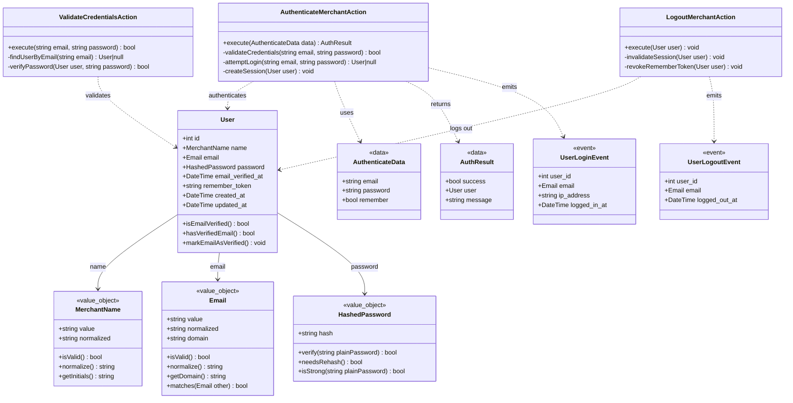

# Auth Module - Domain Model

## Module Overview

**Name:** Auth (Autenticación)  
**Type:** TRANSVERSAL Module  
**Purpose:** Autenticación y control de acceso exclusivamente para el backoffice de Filament

**Responsibilities:**
- Autenticación de merchants (usuarios administradores)
- Gestión de sesiones seguras para backoffice
- Middleware de autenticación para protección de rutas de Filament
- Login y logout de merchants
- Verificación de credenciales
- Gestión de tokens de sesión

**Dependencies:**
- **Ninguna:** módulo base sin dependencias externas

---

## Domain Model Class Diagram

---

## Entities

### User

**Description:** Merchant (usuario administrador) con acceso al backoffice de Filament

**Key Attributes:**
- `name`: MerchantName - Nombre completo del merchant (normalizado)
- `email`: Email - Email único del merchant (normalizado)
- `password`: HashedPassword - Contraseña hasheada con bcrypt
- `email_verified_at`: Timestamp de verificación de email (nullable)
- `remember_token`: Token para funcionalidad "Recordarme"

**Business Rules:**
- Solo merchants autenticados pueden acceder al backoffice de Filament
- El email debe ser único en el sistema
- La contraseña debe cumplir requisitos mínimos de seguridad (8 caracteres mínimo)
- Las sesiones expiran después de inactividad configurable
- El remember token permite sesiones persistentes opcionales
- Solo un merchant por instancia (single-tenant)

**Invariants:**
- `email` debe ser válido y único
- `password` nunca se expone en texto plano
- `email_verified_at` es null hasta verificación

---

## Value Objects

### MerchantName

**Description:** Nombre del merchant con normalización y validación

**Attributes:**
- `value`: Nombre original ingresado
- `normalized`: Nombre normalizado (trim, capitalizado)

**Validation Rules:**
- Longitud mínima: 2 caracteres
- Longitud máxima: 255 caracteres
- Debe contener al menos una letra
- No puede contener solo números o caracteres especiales

**Methods:**
- `isValid()`: Verifica que el nombre cumple formato válido
- `normalize()`: Capitaliza correctamente y elimina espacios extra
- `getInitials()`: Retorna las iniciales del nombre (ej: "John Doe" → "JD")

**Justification for VO:**
✅ **Aporta semántica clara**: distingue entre un string genérico y el nombre de un merchant
✅ **Tiene reglas de negocio propias**: validación de longitud, capitalización, extracción de iniciales
✅ **Se reutiliza**: puede aparecer en múltiples contextos (User, logs, notificaciones)

---

### Email

**Description:** Email normalizado con validación de formato RFC 5322

**Attributes:**
- `value`: Email original ingresado
- `normalized`: Email normalizado (lowercase, trim)
- `domain`: Dominio del email extraído

**Validation Rules:**
- Debe cumplir formato estándar de email (RFC 5322)
- No puede ser vacío
- Longitud máxima de 255 caracteres
- Dominio debe existir (validación opcional)

**Methods:**
- `isValid()`: Verifica que el email cumple formato válido
- `normalize()`: Convierte a lowercase y elimina espacios
- `getDomain()`: Extrae el dominio del email
- `matches(Email other)`: Compara dos emails de forma normalizada

**Justification for VO:**
✅ **No debe existir inválido**: constructor garantiza email válido siempre
✅ **Se reutiliza en múltiples contextos**: User, notificaciones, auditoría
✅ **Tiene reglas de negocio propias**: validación RFC, normalización, comparación

---

### HashedPassword

**Description:** Contraseña hasheada con bcrypt y validación de fortaleza

**Attributes:**
- `hash`: Hash bcrypt de la contraseña

**Validation Rules:**
- La contraseña en texto plano debe tener mínimo 8 caracteres antes de hashear
- Debe contener al menos una letra y un número (validación de fortaleza)
- Hash debe usar bcrypt con cost factor 10

**Methods:**
- `verify(string plainPassword)`: Verifica una contraseña en texto plano contra el hash
- `needsRehash()`: Indica si el hash necesita ser regenerado (cambio de cost factor)
- `isStrong(string plainPassword)`: Valida fortaleza de contraseña antes de hashear

**Static Methods:**
- `fromPlainText(string password)`: Crea HashedPassword desde texto plano
- `fromHash(string hash)`: Crea HashedPassword desde hash existente

**Justification for VO:**
✅ **No debe existir inválido**: garantiza que siempre es un hash bcrypt válido
✅ **Tiene reglas de negocio propias**: validación de fortaleza, verificación, rehashing
✅ **Aporta semántica clara**: distingue entre string plano y hash, evita errores de seguridad

---

## Enumerations

N/A - Not applicable in MVP

---

## Actions

### AuthenticateMerchantAction

**Purpose:** Autenticar un merchant usando email y contraseña

**Input:** `AuthenticateData`

**Output:** `AuthResult`

**Steps:**
1. Crear Email VO desde string de entrada (valida formato)
2. Buscar usuario por email normalizado
3. Si usuario no existe, retornar error genérico (prevenir enumeración)
4. Verificar contraseña usando HashedPassword::verify()
5. Si las credenciales son válidas, crear sesión
6. Si remember=true, generar y guardar remember_token
7. Disparar evento UserLoginEvent
8. Retornar AuthResult con éxito o fallo

**Validations:**
- Email VO valida formato automáticamente en constructor
- Contraseña no puede estar vacía
- Usuario debe existir en la base de datos
- HashedPassword::verify() valida contra el hash almacenado
- Email debe estar verificado (si la verificación está habilitada)

**Exceptions:**
- `ValidationException`: Credenciales inválidas o faltantes
- `AuthenticationException`: Usuario no encontrado o contraseña incorrecta
- `EmailNotVerifiedException`: Email no verificado (si aplica)

**Side Effects:**
- Creación de sesión en base de datos
- Generación de remember_token si remember=true
- Evento UserLoginEvent para auditoría

---

### LogoutMerchantAction

**Purpose:** Cerrar sesión de un merchant autenticado

**Input:** `User`

**Output:** `void`

**Steps:**
1. Invalidar sesión actual del usuario
2. Revocar remember_token en base de datos
3. Limpiar cookies de sesión
4. Disparar evento UserLogoutEvent
5. Redirigir a página de login

**Validations:**
- Usuario debe estar autenticado
- Sesión debe existir

**Exceptions:**
- `AuthenticationException`: Usuario no autenticado

**Side Effects:**
- Sesión eliminada de base de datos
- Remember token eliminado
- Cookies de sesión limpiadas
- Evento UserLogoutEvent para auditoría

---

### ValidateCredentialsAction

**Purpose:** Validar credenciales sin crear sesión (útil para verificaciones previas)

**Input:** `string email`, `string password`

**Output:** `bool`

**Steps:**
1. Crear Email VO desde string (valida formato)
2. Buscar usuario por email normalizado
3. Si existe, verificar contraseña con HashedPassword::verify()
4. Retornar true si coincide, false en caso contrario

**Validations:**
- Email VO valida formato automáticamente
- Contraseña no puede estar vacía

**Exceptions:**
- `InvalidArgumentException`: Email inválido (desde Email VO constructor)

**Side Effects:**
- Ninguno (solo validación, no modifica estado)

---

## Data Transfer Objects

### AuthenticateData

**Purpose:** Datos de entrada para autenticación de merchants

**Attributes:**
- `email`: string (required) - Email del merchant
- `password`: string (required) - Contraseña en texto plano
- `remember`: bool (optional, default: false) - Mantener sesión persistente

**Validations:**
- email: formato válido, max 255 caracteres
- password: requerido, min 8 caracteres
- remember: booleano

---

### AuthResult

**Purpose:** Resultado de intento de autenticación

**Attributes:**
- `success`: bool (required) - Indica si la autenticación fue exitosa
- `user`: User|null (optional) - Usuario autenticado (null si falla)
- `message`: string (required) - Mensaje de éxito o error

---

## Events

### UserLoginEvent

**Purpose:** Notificar que un merchant ha iniciado sesión exitosamente

**Payload:**
- `user_id`: int - ID del usuario autenticado
- `email`: Email - Email del usuario
- `ip_address`: string - IP desde donde se autenticó
- `logged_in_at`: DateTime - Timestamp del login

**Listeners:**
- Ninguno en MVP (preparado para auditoría futura)

**Timing:** Se dispara inmediatamente después de crear la sesión exitosamente

---

### UserLogoutEvent

**Purpose:** Notificar que un merchant ha cerrado sesión

**Payload:**
- `user_id`: int - ID del usuario
- `email`: Email - Email del usuario
- `logged_out_at`: DateTime - Timestamp del logout

**Listeners:**
- Ninguno en MVP (preparado para auditoría futura)

**Timing:** Se dispara inmediatamente después de invalidar la sesión

---

## Business Rules Summary

### Authentication
1. Solo merchants con credenciales válidas pueden acceder al backoffice
2. El email debe ser único en el sistema
3. Las contraseñas se almacenan hasheadas con bcrypt (nunca en texto plano)
4. Las sesiones expiran después de inactividad configurable (default: 120 minutos)
5. El sistema es single-tenant: un merchant por instancia

### Session Management
1. Las sesiones se almacenan en base de datos para persistencia
2. El remember_token permite sesiones persistentes opcionales
3. Al cerrar sesión, el remember_token se revoca
4. Múltiples sesiones simultáneas del mismo usuario están permitidas

### Security
1. Rate limiting en intentos de login (máximo 5 intentos por minuto)
2. Protección CSRF en todos los formularios de autenticación
3. Sesiones con httpOnly y secure cookies en producción
4. SameSite=Lax para cookies de sesión
5. Passwords deben tener mínimo 8 caracteres

### Frontend Público
1. El frontend público (Livewire/Volt) NO requiere autenticación
2. El módulo Auth NO gestiona usuarios finales ni clientes
3. Solo protege rutas del backoffice de Filament

---

## Database Schema Considerations

### Tables
- `users`: Merchants con acceso al backoffice
  - `name`: string (255) - Valor del MerchantName VO
  - `email`: string (255) - Valor normalizado del Email VO
  - `password`: string (255) - Hash bcrypt del HashedPassword VO
  - `email_verified_at`: timestamp nullable
  - `remember_token`: string (100) nullable
- `sessions`: Sesiones activas (driver: database)

### Indexes
- `users.email`: Unique index para búsqueda rápida y unicidad
- `sessions.user_id`: Index para limpieza de sesiones por usuario
- `sessions.last_activity`: Index para limpieza de sesiones expiradas

### Foreign Keys
- Ninguna (módulo base)

### Soft Deletes
- `users`: NO usa soft deletes en MVP (un merchant por instancia)

### Value Objects Storage
- **MerchantName**: Se almacena el valor normalizado en `users.name`
- **Email**: Se almacena el valor normalizado en `users.email`
- **HashedPassword**: Se almacena el hash bcrypt en `users.password`
- **Nota**: Los VOs se reconstruyen desde la base de datos usando Eloquent Casts

---

## Integration Points

### With All Modules (Backoffice)
- Proporciona middleware de autenticación para proteger recursos de Filament
- Todas las rutas de backoffice requieren autenticación

### With Security Module
- Security puede aplicar rate limiting a intentos de login
- Security puede detectar actividad sospechosa en sesiones

---

## Testing Strategy

### Unit Tests
- MerchantName Value Object: validación de longitud, normalización, iniciales
- Email Value Object: validación de formato RFC 5322, normalización, comparación, dominio
- HashedPassword Value Object: creación desde texto plano, verificación, rehashing, fortaleza
- AuthenticateData: validaciones de input
- AuthResult: construcción y estado

### Feature Tests
- Login exitoso con credenciales válidas
- Login fallido con credenciales inválidas
- Login con remember_token
- Logout y limpieza de sesión
- Rate limiting en intentos de login
- Protección CSRF en formularios
- Sesiones expiradas correctamente
- Middleware protege rutas de Filament

### Integration Tests
- Filament login page funciona correctamente
- Dashboard solo accesible con autenticación
- Logout redirige a login
- Sesiones persisten en base de datos

### Edge Cases
- Múltiples intentos de login con credenciales incorrectas
- Sesiones concurrentes del mismo usuario
- Token remember expirado o inválido
- Usuario intenta acceder sin sesión válida
- CSRF token inválido en formulario

---

## Performance Considerations

### Optimizations
- Index único en users.email para búsquedas rápidas
- Cache de configuración de sesión
- Limpieza automática de sesiones expiradas (scheduled task)
- Hash de contraseñas con bcrypt (costo balanceado: 10)

### Scalability
- Sesiones en base de datos (escalable con read replicas)
- Rate limiting con Redis para alta concurrencia
- Remember tokens únicos y hasheados

---

## AI-Friendly Annotations

**Key Concepts:**
- aggregate_root: User
- value_objects: MerchantName, Email, HashedPassword
- enums: N/A
- actions: AuthenticateMerchantAction, LogoutMerchantAction, ValidateCredentialsAction
- domain_events: UserLoginEvent, UserLogoutEvent

**Invariants to Maintain:**
- users.email must be unique and valid (enforced by Email VO)
- users.password must be hashed with bcrypt (enforced by HashedPassword VO)
- users.name must be valid and normalized (enforced by MerchantName VO)
- sessions must expire after inactivity
- remember_token must be nullable and unique

**Critical Paths:**
- Merchant login with credential validation
- Session creation and management
- Logout with session invalidation

**Data Consistency:**
- MerchantName must be normalized before storage (enforced by VO)
- Email must be normalized before storage and comparison (enforced by VO)
- Passwords never exposed in plain text (enforced by HashedPassword VO)
- Sessions must be cleaned up on logout
- Remember tokens must be revoked on logout
- All Value Objects guarantee valid state at construction time

---

## Security Considerations

### Password Security
- Minimum length: 8 characters
- Stored with bcrypt hashing (cost factor: 10)
- Never exposed in responses or logs
- Password reset functionality out of MVP scope

### Session Security
- HttpOnly cookies to prevent XSS attacks
- Secure flag enabled in production (HTTPS only)
- SameSite=Lax to prevent CSRF
- Session timeout after 120 minutes of inactivity
- Session regeneration after login (prevent session fixation)

### Rate Limiting
- Maximum 5 login attempts per minute per IP
- Configurable via env: `AUTH_RATE_LIMIT=5`
- Uses Redis for distributed rate limiting

### CSRF Protection
- All authentication forms protected with CSRF token
- Token validation mandatory for POST requests
- Laravel's CSRF middleware enabled globally

### Remember Token
- Generated with cryptographically secure random string
- Stored hashed in database
- Single use: regenerated on each use
- Expires after configurable time (default: 2 weeks)

---

## Notes

### MVP Scope
- ✅ Basic login/logout functionality
- ✅ Session management with database driver
- ✅ Remember me functionality
- ✅ Rate limiting on login attempts
- ❌ Password reset (out of MVP)
- ❌ Two-factor authentication (out of MVP)
- ❌ Social login (out of MVP)
- ❌ Email verification (optional, not enforced)
- ❌ User roles/permissions (single-tenant, one merchant)

### Filament Integration
- Filament provides built-in authentication UI
- Custom middleware not required (uses Filament's auth)
- User model must implement `FilamentUser` contract
- Login page: `/admin/login` (Filament default)
- Dashboard: `/admin` (protected by Filament auth middleware)

### Future Enhancements
- Password reset via email
- Two-factor authentication
- Login history and audit trail
- Suspicious activity detection
- IP-based access restrictions
- Multi-merchant support (out of single-tenant scope)

---

## Alignment Analysis with Shared Documentation

### ✅ Compliance with `conventions.md`

**Value Objects Criteria:**
1. **MerchantName VO:**
   - ✅ Aporta semántica clara al dominio (distingue nombre de merchant vs string genérico)
   - ✅ Tiene reglas de negocio propias (capitalización, validación de longitud, iniciales)
   - ✅ Se reutiliza en múltiples contextos (User, logs, auditoría)
   - **Verdict:** JUSTIFICADO según criterio 1, 2 y 4

2. **Email VO:**
   - ✅ No debe existir inválido (constructor garantiza RFC 5322)
   - ✅ Se reutiliza en múltiples contextos (User, notificaciones, auditoría)
   - ✅ Tiene reglas de negocio propias (validación RFC, normalización, comparación)
   - **Verdict:** JUSTIFICADO según criterio 1, 2 y 3

3. **HashedPassword VO:**
   - ✅ No debe existir inválido (garantiza hash bcrypt válido)
   - ✅ Tiene reglas de negocio propias (fortaleza, verificación, rehashing)
   - ✅ Aporta semántica clara (distingue hash vs texto plano, previene errores de seguridad)
   - **Verdict:** JUSTIFICADO según criterio 1, 3 y 4

**Architecture:**
- ✅ Clases finales sin métodos protected
- ✅ Actions con un solo método público
- ✅ Value Objects implementan `Wireable` para Livewire
- ✅ Eloquent Casts para mapeo de VOs
- ✅ Validación con excepciones (no null/defaults)
- ✅ Organización: `app/ValueObjects/` (compartidos) y `app/Casts/`

**Testing:**
- ✅ Unit tests obligatorios para cada Value Object
- ✅ Feature tests para flujos completos de autenticación
- ✅ Edge cases documentados (rate limiting, sesiones concurrentes)

### ✅ Compliance with `modular-architecture.md`

**Module Type:**
- ✅ Correctamente identificado como TRANSVERSAL
- ✅ Sin dependencias externas (módulo base)
- ✅ Consumido por todos los módulos de backoffice

**Communication:**
- ✅ No expone interfaces públicas (solo middleware interno)
- ✅ Emite eventos de dominio (UserLoginEvent, UserLogoutEvent)
- ✅ Eventos son `readonly` e inmutables

**Restrictions:**
- ✅ Solo protege backoffice de Filament
- ✅ NO gestiona usuarios finales (frontend público sin auth)
- ✅ NO implementa roles complejos (single-tenant)
- ✅ Correctamente documentado en matriz de dependencias

### ✅ Compliance with `project_definition.md`

**Scope:**
- ✅ Autenticación exclusiva para merchants (backoffice)
- ✅ Frontend público sin registro ni autenticación
- ✅ Single-tenant: un merchant por instancia
- ✅ MVP con funcionalidad esencial

**Security:**
- ✅ Contraseñas hasheadas con bcrypt
- ✅ Rate limiting en login (5 intentos/minuto)
- ✅ Sesiones seguras (httpOnly, secure, SameSite=Lax)
- ✅ CSRF protection en formularios
- ✅ Remember token con seguridad criptográfica

**Quality:**
- ✅ Tipado fuerte (PHPStan level 6+)
- ✅ Tests con Pest v4
- ✅ Cobertura completa (Unit + Feature + Integration)

### ✅ Compliance with `value-objects.md`

**Implementation Pattern:**
- ✅ `final readonly` para inmutabilidad
- ✅ Constructor valida invariantes
- ✅ `Wireable` interface implementada
- ✅ Eloquent Cast requerido
- ✅ Sin dependencias externas en VOs
- ✅ Métodos de dominio en lugar de getters simples

**Testing Pattern:**
- ✅ Unit tests para validaciones
- ✅ Feature tests con Eloquent
- ✅ Tests de edge cases

**Anti-Patterns Avoided:**
- ✅ No over-engineering (cada VO justificado)
- ✅ Sin dependencias externas en VOs
- ✅ Inmutabilidad garantizada
- ✅ Validación fuerte en constructor

### 📊 Alignment Summary

| Documento                   | Compliance | Notas                                             |
|-----------------------------|------------|---------------------------------------------------|
| `conventions.md`            | ✅ 100%     | Todos los criterios cumplidos                     |
| `modular-architecture.md`   | ✅ 100%     | Módulo TRANSVERSAL correctamente diseñado         |
| `project_definition.md`     | ✅ 100%     | Scope, security y quality alineados               |
| `value-objects.md`          | ✅ 100%     | Patrones y anti-patrones respetados               |
| `orders/domain_model.md`    | ✅ 100%     | Estructura y formato consistentes (ejemplo usado) |

### 🎯 Value Objects Justification Table

| Value Object    | Criterio Principal                  | Criterios Adicionales                | Conclusión   |
|-----------------|-------------------------------------|--------------------------------------|--------------|
| MerchantName    | Semántica clara al dominio          | Reglas de negocio, Reutilización     | ✅ Justificado |
| Email           | No debe existir inválido            | Reglas de negocio, Reutilización     | ✅ Justificado |
| HashedPassword  | No debe existir inválido            | Reglas de negocio, Semántica clara   | ✅ Justificado |

**Validation Against Anti-Patterns:**
- ❌ **NOT** over-engineered: Cada VO tiene lógica de negocio clara
- ❌ **NOT** mutable: Todos son `final readonly`
- ❌ **NOT** weak validation: Constructor garantiza estado válido
- ❌ **NOT** external dependencies: Sin inyección de servicios

---

**Last Updated:** 2025-12-19  
**Version:** 1.1  
**Status:** Ready for Implementation - Fase 1 (Fundamentos) - VOs Added
