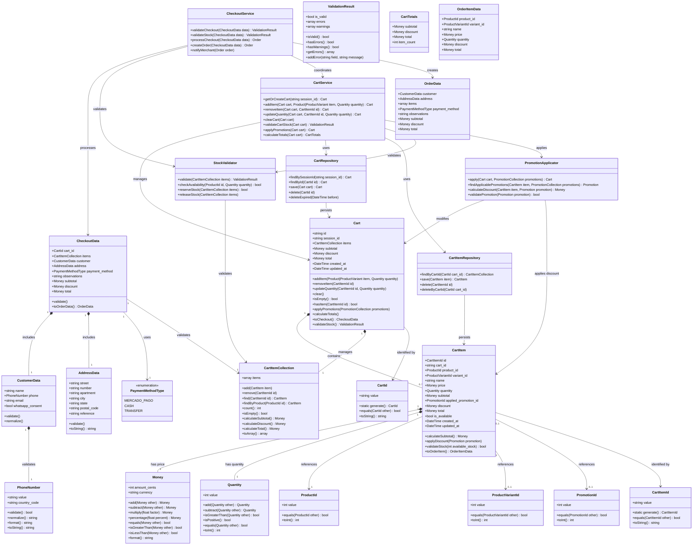

# Cart Module - Domain Model

## Module Overview

**Responsibility:** Cart management without authentication for anonymous users.

**Core Capabilities:**
- Session-based cart management (add, remove, update quantities)
- Product and variant validation
- Stock availability checking
- Promotion application
- Checkout form processing
- Order creation orchestration

**Dependencies:**
- Catalog module (product data, stock, promotions)
- Orders module (order creation)
- Security module (rate limiting, captcha)

---

## Domain Model - Class Diagram



---

## Value Objects

### CartId
**Purpose:** Unique identifier for cart instances (UUID-based).

**Properties:**
- `value: string` - UUID string

**Behaviors:**
- `generate(): CartId` - Generate new UUID
- `equals(CartId): bool` - Equality comparison
- `toString(): string` - String representation

**Validation:**
- Must be valid UUID v4 format
- Cannot be empty

**Wireable:** Yes (Livewire compatibility)

---

### CartItemId
**Purpose:** Unique identifier for cart items (UUID-based).

**Properties:**
- `value: string` - UUID string

**Behaviors:**
- `generate(): CartItemId` - Generate new UUID
- `equals(CartItemId): bool` - Equality comparison
- `toString(): string` - String representation

**Validation:**
- Must be valid UUID v4 format
- Cannot be empty

**Wireable:** Yes

---

### Money
**Purpose:** Monetary values with currency (cents-based for precision).

**Properties:**
- `amount_cents: int` - Amount in cents (to avoid float precision issues)
- `currency: string` - ISO currency code (default: "ARS")

**Behaviors:**
- `add(Money): Money` - Addition
- `subtract(Money): Money` - Subtraction
- `multiply(float): Money` - Multiplication
- `percentage(float): Money` - Calculate percentage
- `equals(Money): bool` - Equality comparison
- `isGreaterThan(Money): bool` - Comparison
- `isLessThan(Money): bool` - Comparison
- `format(): string` - Human-readable format (e.g., "$1.234,56")

**Validation:**
- `amount_cents` must be >= 0
- `currency` must be valid ISO code
- Cannot mix different currencies in operations

**Wireable:** Yes

**Shared:** Yes (in `app/ValueObjects/Money.php`)

---

### Quantity
**Purpose:** Product quantities with validation.

**Properties:**
- `value: int` - Quantity value

**Behaviors:**
- `add(Quantity): Quantity` - Addition
- `subtract(Quantity): Quantity` - Subtraction
- `isGreaterThan(Quantity): bool` - Comparison
- `isPositive(): bool` - Positive check
- `equals(Quantity): bool` - Equality
- `toInt(): int` - Convert to integer

**Validation:**
- Must be > 0
- Must be <= 9999 (business rule: max quantity per item)

**Wireable:** Yes

**Shared:** Yes (in `app/ValueObjects/Quantity.php`)

---

### PhoneNumber
**Purpose:** Phone number with country code and validation.

**Properties:**
- `value: string` - Normalized phone number
- `country_code: string` - Country code (e.g., "+54")

**Behaviors:**
- `validate(): bool` - Format validation
- `normalize(): string` - Normalize format (remove spaces, dashes)
- `format(): string` - Human-readable format
- `toString(): string` - Full phone with country code

**Validation:**
- Must match valid phone pattern
- Country code must be valid
- Length between 8 and 15 digits

**Wireable:** Yes

**Shared:** Yes (in `app/ValueObjects/PhoneNumber.php`)

---

### CustomerData
**Purpose:** Customer information for checkout.

**Properties:**
- `name: string` - Full name (required)
- `phone: PhoneNumber` - Phone number (required)
- `email: string|null` - Email (optional)
- `whatsapp_consent: bool` - Explicit WhatsApp consent (required)

**Behaviors:**
- `validate()` - Validate all fields
- `normalize()` - Normalize data (trim, lowercase email)

**Validation:**
- `name` required, min 3 chars, max 100
- `phone` must be valid PhoneNumber
- `email` optional, valid email format
- `whatsapp_consent` must be true

**Wireable:** Yes

---

### AddressData
**Purpose:** Delivery address information.

**Properties:**
- `street: string` - Street name (required)
- `number: string` - Street number (required)
- `apartment: string|null` - Apartment/floor (optional)
- `city: string` - City (required)
- `state: string` - State/province (required)
- `postal_code: string|null` - Postal code (optional)
- `reference: string|null` - Reference/landmark (optional)

**Behaviors:**
- `validate()` - Validate all fields
- `toString(): string` - Full address string

**Validation:**
- `street` required, max 255
- `number` required, max 50
- `city` required, max 100
- `state` required, max 100
- `postal_code` optional, max 20

**Wireable:** Yes

---

### PaymentMethodType
**Purpose:** Enum for payment methods.

**Values:**
- `MERCADO_PAGO` - Mercado Pago external link
- `CASH` - Cash on delivery
- `TRANSFER` - Bank transfer

**Wireable:** Yes (backed enum)

---

### ValidationResult
**Purpose:** Validation result with errors and warnings.

**Properties:**
- `is_valid: bool` - Overall validation status
- `errors: array` - Field errors (key => message[])
- `warnings: array` - Field warnings (key => message[])

**Behaviors:**
- `isValid(): bool` - Check if valid
- `hasErrors(): bool` - Check for errors
- `hasWarnings(): bool` - Check for warnings
- `getErrors(): array` - Get all errors
- `addError(string, string)` - Add error

**Wireable:** Yes

---

## Entities

### Cart
**Purpose:** Shopping cart for anonymous users (session-based).

**Properties:**
- `id: CartId` - Unique identifier
- `session_id: string` - Laravel session ID
- `items: CartItemCollection` - Cart items
- `subtotal: Money` - Sum of items subtotal
- `discount: Money` - Total discount applied
- `total: Money` - Final total (subtotal - discount)
- `created_at: DateTime` - Creation timestamp
- `updated_at: DateTime` - Last update timestamp

**Behaviors:**
- `addItem(Product|ProductVariant, Quantity)` - Add item to cart
- `removeItem(CartItemId)` - Remove item
- `updateQuantity(CartItemId, Quantity)` - Update quantity
- `clear()` - Remove all items
- `isEmpty(): bool` - Check if empty
- `hasItem(CartItemId): bool` - Check if item exists
- `applyPromotions(PromotionCollection)` - Apply available promotions
- `calculateTotals()` - Recalculate all totals
- `toCheckout(): CheckoutData` - Prepare for checkout
- `validateStock(): ValidationResult` - Validate stock availability

**Business Rules:**
- One cart per session
- Cart expires after 7 days of inactivity
- Max 50 items per cart (configurable)
- Totals recalculated on every change
- Stock validated before checkout

**Database:**
- Table: `carts`
- Indexes: `session_id` (unique), `created_at`, `updated_at`
- Soft deletes: No (hard delete after expiration)

---

### CartItem
**Purpose:** Individual item in cart with pricing and quantity.

**Properties:**
- `id: CartItemId` - Unique identifier
- `cart_id: string` - Parent cart ID
- `product_id: ProductId` - Referenced product
- `variant_id: ProductVariantId|null` - Referenced variant (optional)
- `name: string` - Product name snapshot
- `price: Money` - Current price
- `quantity: Quantity` - Item quantity
- `subtotal: Money` - price × quantity
- `applied_promotion_id: PromotionId|null` - Applied promotion (optional)
- `discount: Money` - Discount amount
- `total: Money` - subtotal - discount
- `is_available: bool` - Stock availability flag
- `created_at: DateTime` - Creation timestamp
- `updated_at: DateTime` - Last update timestamp

**Behaviors:**
- `calculateSubtotal(): Money` - Calculate item subtotal
- `applyDiscount(Promotion)` - Apply promotion discount
- `validateStock(int): bool` - Validate against available stock
- `toOrderItem(): OrderItemData` - Convert to order item

**Business Rules:**
- Either `product_id` or `variant_id` must be set
- If variant exists, use variant price/stock, otherwise product price/stock
- Quantity must be > 0 and <= available stock
- Price snapshot taken at add time (not updated on product price changes)
- Only one promotion per item

**Database:**
- Table: `cart_items`
- Indexes: `cart_id`, `product_id`, `variant_id`, `created_at`
- Foreign keys: `cart_id` (cascade delete), `product_id`, `variant_id`
- Soft deletes: No

---

## Collections

### CartItemCollection
**Purpose:** Type-safe collection of CartItem objects.

**Extends:** Laravel Collection

**Methods:**
- `add(CartItem)` - Add item to collection
- `remove(CartItemId)` - Remove item by ID
- `find(CartItemId): CartItem` - Find item by ID
- `findByProduct(ProductId): CartItem` - Find item by product
- `count(): int` - Count items
- `isEmpty(): bool` - Check if empty
- `calculateSubtotal(): Money` - Sum all item subtotals
- `calculateDiscount(): Money` - Sum all item discounts
- `calculateTotal(): Money` - Sum all item totals
- `toArray(): array` - Convert to array

**Behaviors:**
- Ensures type safety (only CartItem objects)
- Maintains insertion order
- Provides aggregate calculations

---

## Services

### CartService
**Purpose:** Core cart operations and business logic.

**Responsibilities:**
- Cart lifecycle management (create, retrieve, clear)
- Item management (add, remove, update)
- Stock validation coordination
- Promotion application coordination
- Total calculations

**Methods:**
- `getOrCreateCart(string session_id): Cart` - Get existing or create new cart
- `addItem(Cart, Product|ProductVariant, Quantity): Cart` - Add item with validation
- `removeItem(Cart, CartItemId): Cart` - Remove item
- `updateQuantity(Cart, CartItemId, Quantity): Cart` - Update quantity with validation
- `clearCart(Cart)` - Remove all items
- `validateCartStock(Cart): ValidationResult` - Validate all items stock
- `applyPromotions(Cart): Cart` - Apply promotions to cart
- `calculateTotals(Cart): CartTotals` - Calculate all totals

**Dependencies:**
- CartRepository
- CartItemRepository
- StockValidator
- PromotionApplicator

**Transactions:**
- All write operations wrapped in database transactions
- Optimistic locking for concurrent updates

---

### CheckoutService
**Purpose:** Checkout process orchestration.

**Responsibilities:**
- Checkout validation
- Stock reservation
- Order creation coordination
- WhatsApp notification

**Methods:**
- `validateCheckout(CheckoutData): ValidationResult` - Validate checkout data
- `validateStock(CheckoutData): ValidationResult` - Validate stock availability
- `processCheckout(CheckoutData): Order` - Process complete checkout
- `createOrder(CheckoutData): Order` - Create order from checkout
- `notifyMerchant(Order)` - Send WhatsApp notification

**Dependencies:**
- CartService
- StockValidator
- OrderService (from Orders module)
- WhatsAppService (from WhatsApp module)

**Transactions:**
- Checkout process is atomic (stock + order creation)
- Uses pessimistic locking for stock reservation
- Rollback on any failure

**Business Rules:**
- Stock validated twice: at checkout start and before order creation
- Order creation and stock decrement must be atomic
- WhatsApp notification is async (queued)
- Cart cleared after successful order creation

---

### StockValidator
**Purpose:** Stock validation and reservation.

**Responsibilities:**
- Stock availability checking
- Stock reservation (pessimistic locking)
- Stock release on failure

**Methods:**
- `validate(CartItemCollection): ValidationResult` - Validate all items
- `checkAvailability(ProductId, Quantity): bool` - Check single item
- `reserveStock(CartItemCollection): bool` - Reserve stock for checkout
- `releaseStock(CartItemCollection)` - Release reserved stock

**Dependencies:**
- ProductRepository (from Catalog module)
- ProductVariantRepository (from Catalog module)

**Locking Strategy:**
- Uses `SELECT FOR UPDATE` (pessimistic locking)
- Lock released after order creation or on timeout
- Timeout: 30 seconds (configurable)

---

### PromotionApplicator
**Purpose:** Promotion logic and application.

**Responsibilities:**
- Find applicable promotions
- Calculate discounts
- Apply promotions to cart items

**Methods:**
- `apply(Cart, PromotionCollection): Cart` - Apply promotions to cart
- `findApplicablePromotions(CartItem, PromotionCollection): Promotion` - Find best promotion
- `calculateDiscount(CartItem, Promotion): Money` - Calculate discount amount
- `validatePromotion(Promotion): bool` - Check if promotion is valid

**Dependencies:**
- PromotionRepository (from Catalog module)

**Business Rules:**
- Only one promotion per item (best discount wins)
- Promotion must be active and within validity dates
- Promotion types:
  - Percentage discount: apply % to item price
  - Fixed price: replace item price with fixed amount
- Stock not affected by promotions

---

## Repositories

### CartRepository
**Purpose:** Cart persistence and retrieval.

**Methods:**
- `findBySessionId(string): Cart` - Find cart by session ID
- `findById(CartId): Cart` - Find cart by ID
- `save(Cart): Cart` - Save or update cart
- `delete(CartId)` - Delete cart
- `deleteExpired(DateTime)` - Delete carts older than date

**Implementation:**
- Uses Eloquent ORM
- Casts to Value Objects via custom Casts
- Eager loads items by default

---

### CartItemRepository
**Purpose:** Cart item persistence and retrieval.

**Methods:**
- `findByCartId(CartId): CartItemCollection` - Get all items for cart
- `save(CartItem): CartItem` - Save or update item
- `delete(CartItemId)` - Delete item
- `deleteByCartId(CartId)` - Delete all items for cart

**Implementation:**
- Uses Eloquent ORM
- Casts to Value Objects via custom Casts
- Belongs to Cart (cascade delete)

---

## Events

### CartCreated
**Payload:** Cart
**Triggers:** When new cart is created
**Listeners:** None (future: analytics)

### ItemAddedToCart
**Payload:** Cart, CartItem
**Triggers:** When item added to cart
**Listeners:** None (future: analytics, recommendations)

### ItemRemovedFromCart
**Payload:** Cart, CartItemId
**Triggers:** When item removed from cart
**Listeners:** None (future: analytics)

### ItemQuantityUpdated
**Payload:** Cart, CartItem, Quantity (old), Quantity (new)
**Triggers:** When item quantity updated
**Listeners:** None (future: analytics)

### CheckoutStarted
**Payload:** Cart, CheckoutData
**Triggers:** When user starts checkout process
**Listeners:** None (future: analytics, abandoned cart tracking)

### CheckoutCompleted
**Payload:** Order, Cart
**Triggers:** When checkout successfully completed
**Listeners:**
- ClearCart
- SendWhatsAppNotification
- Analytics tracking

### CheckoutFailed
**Payload:** Cart, CheckoutData, ValidationResult
**Triggers:** When checkout fails
**Listeners:**
- ReleaseStock
- Log error for debugging

---

## Exceptions

### CartNotFoundException
**Extends:** DomainException
**When:** Cart not found by ID or session
**HTTP:** 404

### CartItemNotFoundException
**Extends:** DomainException
**When:** Cart item not found by ID
**HTTP:** 404

### InsufficientStockException
**Extends:** DomainException
**When:** Requested quantity exceeds available stock
**HTTP:** 422
**Payload:** ProductId, requested Quantity, available Quantity

### MaxCartItemsExceededException
**Extends:** DomainException
**When:** Cart item limit reached
**HTTP:** 422
**Payload:** max_items limit

### InvalidQuantityException
**Extends:** DomainException
**When:** Invalid quantity (zero, negative, or > max)
**HTTP:** 422

### InvalidCheckoutDataException
**Extends:** DomainException
**When:** Checkout data validation fails
**HTTP:** 422
**Payload:** ValidationResult

### StockReservationFailedException
**Extends:** DomainException
**When:** Stock reservation fails (concurrent purchase)
**HTTP:** 409

### CartExpiredException
**Extends:** DomainException
**When:** Attempting to use expired cart
**HTTP:** 410

---

## API Contracts (Livewire Components)

### CartComponent
**Purpose:** Main cart display and management

**Public properties:**
- `Cart $cart` - Current cart

**Actions:**
- `addToCart(int $productId, ?int $variantId, int $quantity)` - Add item
- `removeFromCart(string $itemId)` - Remove item
- `updateQuantity(string $itemId, int $quantity)` - Update quantity
- `clearCart()` - Clear all items

**Events emitted:**
- `cart-updated` - When cart changes
- `item-added` - When item added
- `item-removed` - When item removed

---

### CheckoutComponent
**Purpose:** Checkout form and submission

**Public properties:**
- `CheckoutData $checkout` - Checkout data

**Actions:**
- `submitCheckout()` - Process checkout

**Validation:**
- Real-time validation on all fields
- Stock validation on submit
- Rate limiting applied

**Events emitted:**
- `checkout-started` - When form displayed
- `checkout-completed` - When order created
- `checkout-failed` - When validation fails

---

## Configuration

### Environment Variables

```env
# Cart Configuration
CART_EXPIRATION_DAYS=7
CART_MAX_ITEMS=50
CART_MAX_QUANTITY_PER_ITEM=9999

# Stock Locking
STOCK_LOCK_TIMEOUT=30

# Rate Limiting (from Security module)
ORDER_RATE_LIMIT_IP=5
ORDER_RATE_LIMIT_PHONE=3
MAX_ACTIVE_ORDERS_PER_PHONE=2
```

### Config File: `config/cart.php`

```php
return [
    'expiration_days' => env('CART_EXPIRATION_DAYS', 7),
    'max_items' => env('CART_MAX_ITEMS', 50),
    'max_quantity_per_item' => env('CART_MAX_QUANTITY_PER_ITEM', 9999),
    'stock_lock_timeout' => env('STOCK_LOCK_TIMEOUT', 30),
];
```

---

## Database Schema

### Table: `carts`

```sql
CREATE TABLE carts (
    id UUID PRIMARY KEY,
    session_id VARCHAR(255) UNIQUE NOT NULL,
    subtotal_cents INTEGER NOT NULL DEFAULT 0,
    discount_cents INTEGER NOT NULL DEFAULT 0,
    total_cents INTEGER NOT NULL DEFAULT 0,
    created_at TIMESTAMP NOT NULL,
    updated_at TIMESTAMP NOT NULL,
    INDEX idx_session_id (session_id),
    INDEX idx_created_at (created_at),
    INDEX idx_updated_at (updated_at)
);
```

### Table: `cart_items`

```sql
CREATE TABLE cart_items (
    id UUID PRIMARY KEY,
    cart_id UUID NOT NULL,
    product_id BIGINT UNSIGNED NOT NULL,
    variant_id BIGINT UNSIGNED NULL,
    name VARCHAR(255) NOT NULL,
    price_cents INTEGER NOT NULL,
    quantity INTEGER NOT NULL,
    subtotal_cents INTEGER NOT NULL,
    applied_promotion_id BIGINT UNSIGNED NULL,
    discount_cents INTEGER NOT NULL DEFAULT 0,
    total_cents INTEGER NOT NULL,
    is_available BOOLEAN NOT NULL DEFAULT TRUE,
    created_at TIMESTAMP NOT NULL,
    updated_at TIMESTAMP NOT NULL,
    FOREIGN KEY (cart_id) REFERENCES carts(id) ON DELETE CASCADE,
    FOREIGN KEY (product_id) REFERENCES products(id),
    FOREIGN KEY (variant_id) REFERENCES product_variants(id),
    FOREIGN KEY (applied_promotion_id) REFERENCES promotions(id),
    INDEX idx_cart_id (cart_id),
    INDEX idx_product_id (product_id),
    INDEX idx_variant_id (variant_id),
    INDEX idx_created_at (created_at)
);
```

---

## Business Rules Summary

### Cart Management
1. One cart per session (identified by Laravel session ID)
2. Cart expires after 7 days of inactivity
3. Max 50 items per cart (configurable)
4. Max 9999 quantity per item (configurable)
5. Totals recalculated automatically on every change
6. Cart cleared after successful order creation

### Item Management
7. Product or variant must exist and be active
8. Stock validated before adding/updating quantity
9. Price snapshot taken at add time (not updated later)
10. If variant specified, use variant price/stock; otherwise use product price/stock
11. Only one promotion per item (best discount applied)
12. Cannot add same product/variant twice (update quantity instead)

### Stock Validation
13. Stock checked at: add to cart, update quantity, checkout start, order creation
14. Pessimistic locking during checkout (SELECT FOR UPDATE)
15. Stock lock timeout: 30 seconds
16. Stock released on checkout failure
17. Stock decremented atomically with order creation

### Promotion Application
18. Only one promotion per item
19. Promotion must be active and within validity dates
20. Promotion types: percentage discount or fixed price
21. Best discount wins if multiple promotions available
22. Promotions applied automatically on cart total calculation

### Checkout Process
23. Customer data required: name, phone, WhatsApp consent
24. Address required: street, number, city, state
25. Payment method required: Mercado Pago, Cash, or Transfer
26. Rate limiting: 5 attempts per hour per IP, 3 orders per hour per phone
27. Max 2 active orders per phone (configurable 2-5)
28. Captcha validation required
29. Stock revalidated before order creation
30. Checkout is atomic: stock + order creation in transaction

### Data Integrity
31. All money values stored in cents (integer)
32. Phone numbers normalized before storage
33. Value Objects used for type safety
34. Database transactions for all write operations
35. Optimistic locking for cart updates
36. Pessimistic locking for stock operations

---

## Integration Points

### With Catalog Module
- **Read:** Product data (name, price, stock, active status)
- **Read:** ProductVariant data (name, price, stock, active status)
- **Read:** Promotion data (type, amount, validity, applicable products)
- **Write:** None

### With Orders Module
- **Write:** Create Order from CheckoutData
- **Write:** Create OrderItems from CartItems
- **Read:** None

### With Security Module
- **Validation:** Rate limiting on checkout
- **Validation:** Captcha on checkout
- **Validation:** Max active orders per phone
- **Validation:** Phone number format

### With WhatsApp Module
- **Trigger:** Send notification on order creation
- **Payload:** Order data for message template

---

## Testing Strategy

### Unit Tests
- Value Objects: Money, Quantity, PhoneNumber, CartId, CartItemId
- CustomerData and AddressData validation
- CartItem calculations (subtotal, discount, total)
- PromotionApplicator discount calculations
- ValidationResult logic

### Feature Tests
- Cart lifecycle: create, add items, update, clear
- Stock validation: insufficient stock, concurrent updates
- Promotion application: percentage, fixed price, best discount
- Checkout process: validation, stock reservation, order creation
- Rate limiting: IP and phone limits
- Cart expiration

### Integration Tests
- Cart + Catalog: product/variant data sync
- Cart + Orders: order creation flow
- Cart + Security: rate limiting and captcha
- Cart + WhatsApp: notification triggering

### Browser Tests (Pest + Livewire)
- Add to cart from product listing
- Add to cart from product detail
- Update cart quantities
- Remove items from cart
- Complete checkout flow
- Validation errors display
- Stock unavailable handling

---

## Performance Considerations

### Caching
- Session-based carts (no cache needed, Laravel session handles it)
- Product data cached in Catalog module (read from cache)
- Promotion rules cached with TTL

### Database Optimization
- Indexes on: `session_id`, `cart_id`, `product_id`, `variant_id`, `created_at`
- Eager loading of cart items to avoid N+1
- Pessimistic locking only during checkout (minimal lock time)
- Batch operations for stock validation

### Scalability
- Stateless design (session-based, no server affinity)
- Async WhatsApp notifications (queued)
- Read-heavy operations (products, promotions) cached
- Write operations (cart updates) limited by rate limiting

---

## AI Optimization Notes

This domain model is optimized for AI comprehension and code generation:

1. **Explicit Relationships:** All entity relationships clearly defined with cardinality
2. **Type Safety:** Strong typing throughout (Value Objects, typed properties)
3. **Single Responsibility:** Each class has one clear purpose
4. **Immutability Preferred:** Value Objects are immutable
5. **No Ambiguity:** Clear naming conventions, no abbreviations
6. **Complete Contracts:** All public methods documented with parameters and return types
7. **Business Rules Explicit:** Rules numbered and clearly stated
8. **Exception Hierarchy:** Clear exception types with HTTP status codes
9. **Validation Explicit:** Validation rules at Value Object and Service levels
10. **Integration Clear:** Dependencies and integration points explicitly documented

This model supports:
- Automated code generation from specification
- Static analysis (PHPStan level 6+)
- Comprehensive test generation
- API documentation generation
- Database schema migration generation
