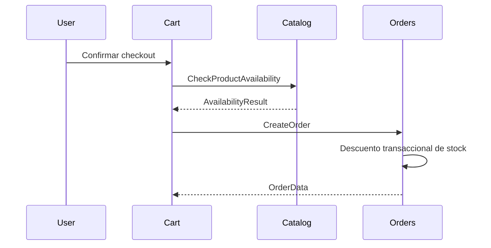

# Prompt Profesional: Generación de Modelo de Dominio para Módulo

## Objetivo

Generar el modelo de dominio completo de un módulo del sistema e-commerce, siguiendo estrictamente la arquitectura modular definida, las convenciones técnicas de Laravel y garantizando 100% de consistencia con los archivos del proyecto compartidos.

---

## Contexto del Proyecto

**Sistema**: E-Commerce WhatsApp + Mercado Libre  
**Arquitectura**: Monolito Single-Tenant con Laravel Modules  
**Stack**: Laravel 12, Filament v4, Livewire v3, Pest v4, PHP 8.5+  
**Filosofía**: MVP - priorizar simplicidad, velocidad y mantenibilidad

**Principios clave**:
- Una instancia por merchant (single-tenant)
- Tipado fuerte obligatorio (PHPStan level 6+)
- Todas las clases `final` sin métodos `protected`
- Value Objects con `Wireable` para propiedades complejas
- Comunicación entre módulos mediante Interfaces (síncrona) y Eventos (asíncrona)
- Cobertura de tests prácticamente 100%

---

## Instrucciones para el Modelo de Dominio

Debes generar un documento técnico completo que defina el modelo de dominio de un módulo específico, incluyendo:

### 1. Información de Cabecera

```yaml
---
module: "{NombreDelModulo}"
phase: "{Fase de Desarrollo: 1-4}"
module_type: "{CORE | TRANSVERSAL | SUPPORT}"
dependencies: [lista de módulos de los que depende]
version: "1.0"
author: "Alejandro Leone"
last_updated: "{fecha actual}"
---
```

### 2. Responsabilidad del Módulo

**Descripción concisa** (2-3 párrafas) explicando:
- ¿Qué problema de negocio resuelve este módulo?
- ¿Cuál es su alcance y límites?
- ¿Qué capas de presentación incluye? (Livewire, Filament, Backend)

### 3. Entidades y Agregados

Para cada entidad del módulo, especificar:

#### `{NombreEntidad}` (Modelo Eloquent)

**Propiedades**:
```php
// Tipado completo con Value Objects y Casts
private ProductId $id;             // Cast: ProductIdCast
private string $name;              // Máximo 255 caracteres
private Money $price;              // Cast: MoneyCast → Value Object
private Stock $stock;              // Cast: StockCast → Value Object
private bool $is_active;
private CategoryId $category_id;
private Carbon $created_at;
private Carbon $updated_at;
```

**Relaciones**:
```php
public function category(): BelongsTo { ... }
public function variants(): HasMany { ... }
```

**Factory**:
- Indicar estados necesarios: `active()`, `inactive()`, `outOfStock()`, etc.

**Reglas de Negocio**:
- Invariantes que deben cumplirse siempre
- Validaciones críticas
- Restricciones de integridad

---

### 4. Value Objects

Para cada Value Object, especificar:

#### `{NombreValueObject}`

**Ubicación**: `app/ValueObjects/{ModelName}/{NombreValueObject}.php` o `app/ValueObjects/{NombreValueObject}.php` (si es compartido)

**Criterio de decisión**: ¿Cumple AL MENOS 1 de estos?
- ✅ Tiene reglas de negocio propias
- ✅ Se reutiliza en múltiples contextos
- ✅ No debe existir inválido (constructor garantiza estado válido)
- ✅ Aporta semántica clara al dominio

**Implementación mínima**:
```php
final readonly class Money implements Wireable
{
    public function __construct(
        public int $cents,
        public string $currency = 'ARS'
    ) {
        if ($this->cents < 0) {
            throw new InvalidArgumentException('El monto no puede ser negativo');
        }
    }

    public function toLivewire(): array { ... }
    public static function fromLivewire($value): self { ... }
    
    // Métodos de dominio relevantes
    public function add(Money $other): Money { ... }
    public function format(): string { ... }
}
```

**Cast asociado**:
```php
// app/Casts/{ModelName}/MoneyCast.php
final class MoneyCast implements CastsAttributes
{
    public function get($model, string $key, $value, array $attributes): Money { ... }
    public function set($model, string $key, $value, array $attributes): array { ... }
}
```

---

### 5. Enums

Para cada Enum PHP 8.5+, especificar:

#### `{NombreEnum}` (Backed Enum)

**Ubicación**: `Modules/{ModuleName}/Enums/{NombreEnum}.php`

```php
enum OrderStatus: string
{
    case NEW = 'new';
    case CONFIRMED = 'confirmed';
    case IN_DELIVERY = 'in_delivery';
    case DELIVERED = 'delivered';
    case REJECTED = 'rejected';
    case CANCELLED = 'cancelled';

    public function label(): string { ... }
    public function canTransitionTo(OrderStatus $newStatus): bool { ... }
}
```

**Reglas de transición**: diagrama o matriz de estados permitidos

---

### 6. Comunicación con Otros Módulos

#### 6.1. Interfaces que Expone (Comunicación Síncrona)

**Cuándo usar**: cuando se necesita una respuesta inmediata y determinista.

**Ubicación**: `Modules/{ModuleName}/Contracts/`

**Patrón de nombres**:
- Commands: `{Verb}{Entity}Interface` (ej: `CreateOrderInterface`)
- Queries: `Get{Entity}Interface` (ej: `GetProductDetailsInterface`)

**Especificación**:
```php
interface CheckProductAvailabilityInterface
{
    /**
     * Verifica si un producto tiene stock suficiente.
     * 
     * @throws ProductNotFoundException Si el producto no existe
     * @throws InvalidQuantityException Si quantity <= 0
     */
    public function check(ProductId $productId, Quantity $quantity): AvailabilityResult;
}
```

#### 6.2. Interfaces que Consume

Listar interfaces de otros módulos que este módulo necesita:
- `CheckProductAvailabilityInterface` (de Catalog)
- `ApplyPromotionInterface` (de Catalog)

#### 6.3. Eventos que Emite (Comunicación Asíncrona)

**Cuándo usar**: para notificar que un hecho relevante del negocio **ya ocurrió**.

**Ubicación**: `Modules/{ModuleName}/Events/`

**Patrón de nombres**: `{Entity}{PastTenseVerb}Event`

**Especificación**:
```php
final readonly class OrderCreatedEvent
{
    public function __construct(
        public OrderId $orderId,
        public Money $total,
        public PhoneNumber $customerPhone,
        public Carbon $createdAt
    ) {}
}
```

**Reglas**:
- Eventos son inmutables (`readonly`)
- No incluyen datos sensibles
- No esperan valor de retorno
- Los consumidores deben ser idempotentes

#### 6.4. Eventos que Consume

Listar eventos de otros módulos que este módulo escucha:
- `PaymentConfirmedEvent` (de Payments)
- `ProductStockLowEvent` (de Catalog)

---

### 7. Actions (Lógica de Negocio)

Para cada Action, especificar:

#### `{NombreAction}`

**Ubicación**: `Modules/{ModuleName}/Actions/{NombreAction}.php`

**Responsabilidad**: Descripción concisa (1 línea)

**Método público único**:
```php
final readonly class CreateOrderAction
{
    public function __construct(
        private CheckProductAvailabilityInterface $checkAvailability,
        private ApplyPromotionInterface $applyPromotion,
    ) {}

    /**
     * Crea un pedido validando stock y aplicando promociones.
     * 
     * @throws InsufficientStockException
     * @throws InvalidOrderDataException
     */
    public function execute(CreateOrderData $data): OrderData
    {
        // Implementación...
    }
}
```

**Dependencias**: interfaces inyectadas vía constructor

---

### 8. Data Transfer Objects (Spatie Laravel Data)

Para inputs/outputs de métodos públicos:

```php
final class CreateOrderData extends Data
{
    public function __construct(
        public string $customerName,
        public PhoneNumber $customerPhone,
        public AddressData $deliveryAddress,
        public PaymentMethod $paymentMethod,
        /** @var array<OrderItemData> */
        public array $items,
    ) {}
}
```

---

### 9. Componentes de Presentación

#### 9.1. Livewire/Volt (Frontend Público)

Listar componentes Volt necesarios:

**`Modules/{ModuleName}/Livewire/ProductList.php`**
- **Responsabilidad**: Listado público de productos con filtros
- **Props**: `?CategoryId $categoryId`
- **Reglas**: Máximo 150 líneas, extraer Actions si necesario

#### 9.2. Filament Resources (Backoffice)

Listar Resources de Filament:

**`Modules/{ModuleName}/Filament/Resources/ProductResource.php`**
- **Responsabilidad**: CRUD completo de productos
- **Secciones**: form, table, filters, actions
- **Relaciones**: gestión inline de variantes

---

### 10. Migraciones

Para cada tabla, especificar:

#### `create_{tabla}_table`

```php
Schema::create('products', function (Blueprint $table) {
    $table->id();
    $table->string('name');
    $table->integer('price_cents'); // Money Value Object
    $table->integer('stock');       // Stock Value Object
    $table->boolean('is_active')->default(true);
    $table->foreignId('category_id')->constrained()->cascadeOnDelete();
    $table->timestamps();

    // Índices
    $table->index('category_id');
    $table->index('is_active');
    $table->index(['name', 'is_active']); // Búsqueda de productos activos
});
```

**Etiquetas**: `migration-affects-production` si impacta datos existentes.

---

### 11. Seeders

Especificar datos de prueba necesarios:

```php
final class ProductSeeder extends Seeder
{
    public function run(): void
    {
        $category = Category::factory()->create(['name' => 'Electrónica']);
        
        Product::factory()
            ->count(10)
            ->active()
            ->for($category)
            ->create();
    }
}
```

---

### 12. Tests

#### 12.1. Feature Tests (Obligatorios)

**Estructura espejo**: `tests/Feature/Modules/{ModuleName}/`

**Casos críticos**:
```php
test('can create order with valid data', function () {
    // Arrange: preparar datos válidos
    // Act: ejecutar CreateOrderAction
    // Assert: verificar Order creado, stock descontado, evento emitido
});

test('fails when product is out of stock', function () {
    // Assert: expect InsufficientStockException
});
```

#### 12.2. Unit Tests (Value Objects)

**Ubicación**: `tests/Unit/ValueObjects/`

```php
test('Money cannot be negative', function () {
    expect(fn() => new Money(-100))->toThrow(InvalidArgumentException::class);
});

test('Money formats correctly', function () {
    $money = new Money(150000, 'ARS');
    expect($money->format())->toBe('$1.500,00');
});
```

#### 12.3. Smoke Tests

Agregar en `tests/Browser/SmokeTest.php`:
```php
test('catalog page loads', function () {
    $this->get('/products')->assertOk();
});
```

---

### 13. Restricciones y Límites

Listar explícitamente qué **NO hace** este módulo:

- ❌ **NO modifica stock directamente** (solo Orders puede descontar stock)
- ❌ **NO gestiona carritos** (responsabilidad de Cart)
- ❌ **NO calcula totales de pedidos** (responsabilidad de Orders)
- ✅ **Solo expone disponibilidad de stock mediante interfaz**

---

### 14. Diagrama de Secuencia (Opcional)

Si el flujo crítico es complejo, incluir diagrama Mermaid:



---

### 15. Configuración (.env)

Variables de entorno necesarias para este módulo:

```bash
# Catalog Module
CATALOG_DEFAULT_CURRENCY=ARS
CATALOG_LOW_STOCK_THRESHOLD=5
```

---

## Validación de Consistencia (100/100)

El modelo de dominio generado DEBE ser consistente con:

### ✅ Arquitectura Modular (`modular-architecture.md`)
- Respetar límites de responsabilidad del módulo
- Usar Interfaces para comunicación síncrona
- Usar Eventos para comunicación asíncrona
- No exponer modelos Eloquent fuera del módulo

### ✅ Convenciones Laravel (`conventions.md`)
- Todas las clases `final` sin `protected`
- Value Objects con `Wireable` y Casts
- PHPStan level 6+ sin errores
- Cobertura de tests prácticamente 100%
- Factories para todos los modelos
- Enums PHP 8.5+ preferidos sobre enums de base de datos

### ✅ Definición del Proyecto (`project_definition.md`)
- Alineado con modelo de negocio (single-tenant)
- Respeta reglas de negocio del dominio
- Considera estados de Order y Payment
- Implementa límites de anti-abuso si aplica

---

## Formato de Salida

Generar el documento en Markdown siguiendo esta estructura:

```markdown
---
module: "{NombreDelModulo}"
phase: "{Fase 1-4}"
module_type: "{CORE | TRANSVERSAL | SUPPORT}"
dependencies: [...]
version: "1.0"
author: "Alejandro Leone"
last_updated: "YYYY-MM-DD"
---

# {NombreDelModulo} - Domain Model

## 1. Responsabilidad
...

## 2. Entidades y Agregados
...

## 3. Value Objects
...

## 4. Enums
...

## 5. Comunicación con Otros Módulos
...

## 6. Actions
...

## 7. Data Transfer Objects
...

## 8. Componentes de Presentación
...

## 9. Migraciones
...

## 10. Seeders
...

## 11. Tests
...

## 12. Restricciones y Límites
...

## 13. Configuración
...
```

---

## Criterios de Éxito

Un modelo de dominio completo y consistente debe:

1. ✅ Definir **todas las entidades** con propiedades, relaciones y Factory
2. ✅ Identificar **Value Objects** necesarios con criterios de decisión claros
3. ✅ Especificar **Enums** con reglas de transición si aplica
4. ✅ Declarar **Interfaces expuestas** con firmas completas y excepciones
5. ✅ Listar **Eventos emitidos** con estructura inmutable
6. ✅ Definir **Actions** con responsabilidad única y dependencias explícitas
7. ✅ Incluir **DTOs** (Spatie Laravel Data) para inputs/outputs
8. ✅ Especificar **componentes Livewire y Filament** necesarios
9. ✅ Definir **migraciones** con índices optimizados
10. ✅ Listar **casos de test críticos** (Feature, Unit, Smoke)
11. ✅ Documentar **restricciones claras** (qué NO hace el módulo)
12. ✅ Validar consistencia 100% con arquitectura modular y convenciones

---

## Ejemplo de Uso

**Input**:
```
Generar modelo de dominio para el módulo "Catalog" basado en:
- @e-commerce-wa-ml/project_definition.md
- @e-commerce-wa-ml/modular-architecture.md
- @laravel/conventions/conventions.md
```

**Output esperado**:
Documento completo `Modules/Catalog/docs/domain_model.md` siguiendo la estructura y criterios definidos en este prompt.

---

## Notas Finales

- **No inventar**: Basarse estrictamente en los documentos de referencia
- **No omitir**: Incluir todas las secciones, aunque sean breves
- **No abstraer en exceso**: Preferir código concreto y ejemplos prácticos
- **Validar siempre**: Cada decisión debe ser consistente con la arquitectura y convenciones
