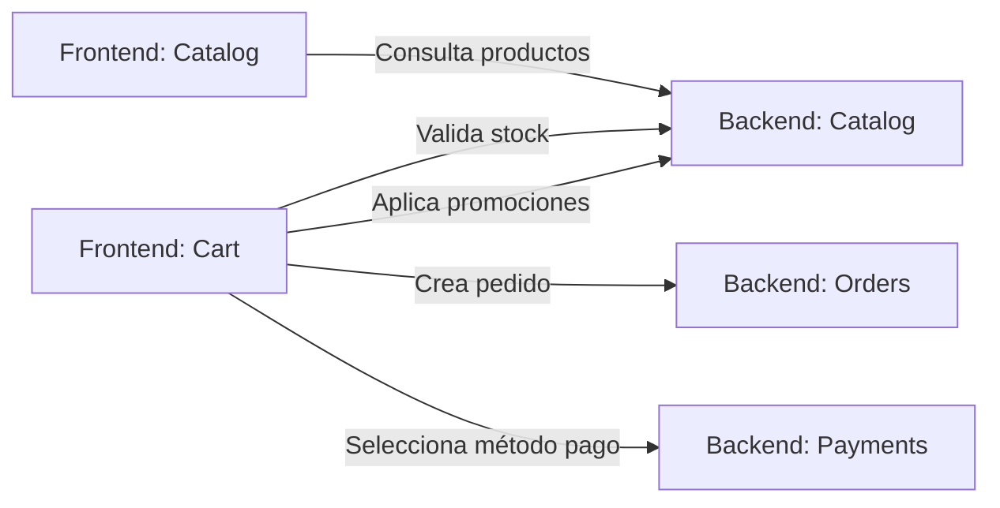
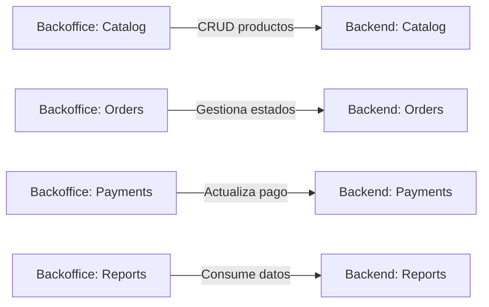
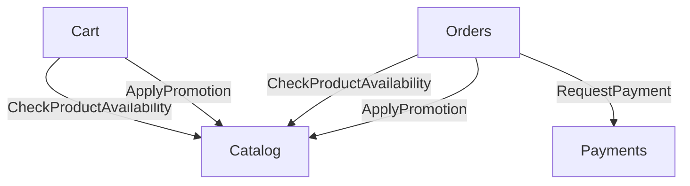
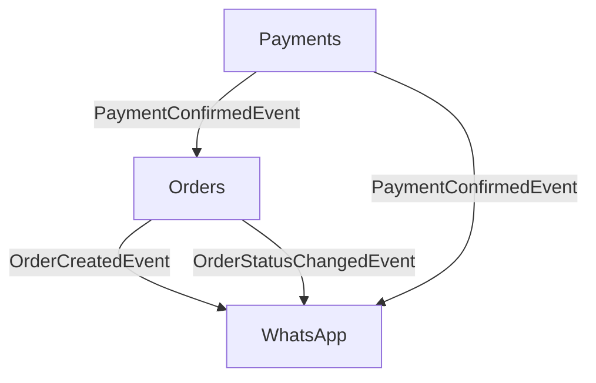
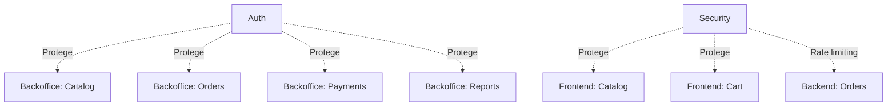
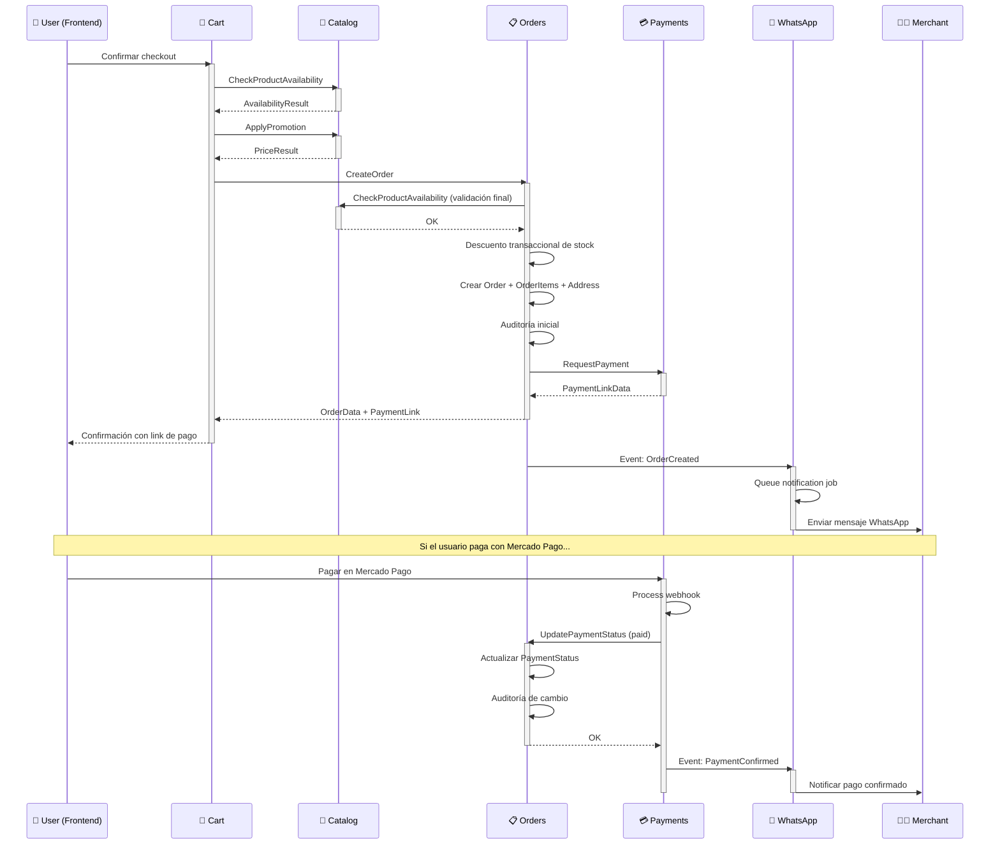
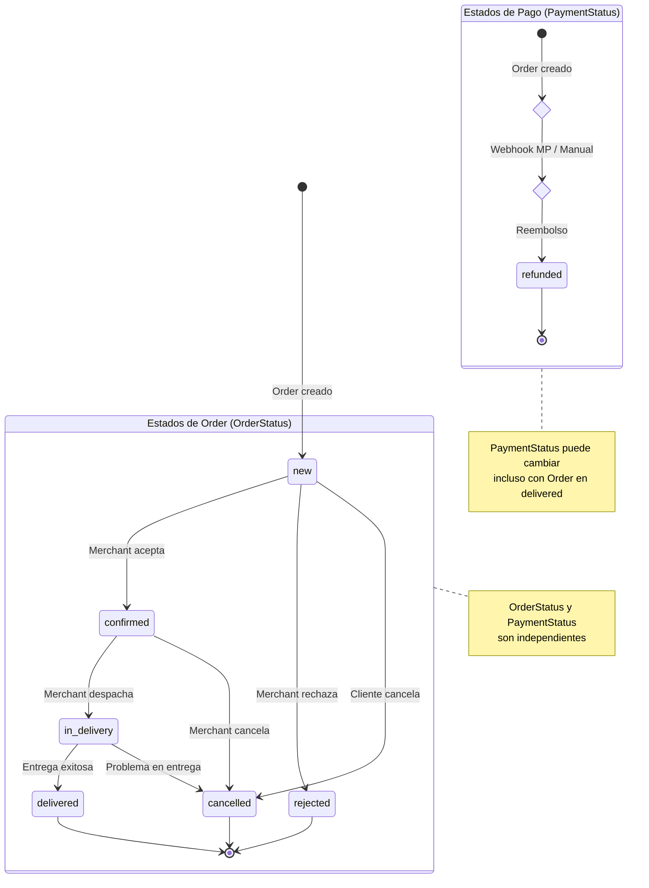

# Modular Architecture Overview

## 1. Visión General de la arquitectura de modulos

Este documento describe la organización del sistema e-commerce desde una perspectiva modular, definiendo:

- **Alcance y responsabilidades** de cada módulo
- **Comunicaciones** entre módulos (interfaces y eventos)
- **Restricciones** y límites claros
- **Organización de capas** (Frontend, Backoffice, Backend)

Fuera del alcance:

- Internal entities
- Value Objects
- Enums
- Casts
- Factories
- Test structure
- Code quality tooling

### Arquitectura de Presentación

El sistema se organiza en **tres capas de presentación**:

- **Frontend público (Livewire/Volt)**: experiencia del cliente sin autenticación
- **Backoffice (Filament)**: gestión administrativa para merchants autenticados
- **Backend (Laravel)**: lógica de negocio, APIs, procesos en background

### Decisión de Diseño: Módulos Organizados por Dominio

Los módulos se organizan por **dominio de negocio**, no por capa de presentación. Cada módulo puede contener:

- `Livewire`: Public frontend components
- `Filament`: Backoffice resources and widgets
- `Actions`: Business logic
- `Models`: Eloquent models
- `Database/Factories`: Model factories (obligatorio para cada modelo)
- `Enums`: PHP 8.5+ enums for states and types
- `Events`: Domain events
- `Contracts`: Exposed contracts / interfaces
- `ValueObjects`: Immutable value objects with `Wireable`
- `Casts`: Eloquent casts for Value Objects
- `Tests/Unit`: Value Object validation tests
- `Tests/Feature`: Integration tests
- `routes/web.php`: Public routes

**Ejemplo**: El módulo `Catalog` contiene:

- **Livewire**: listado público de productos, filtros, detalle de producto
- **Filament**: gestión de productos, categorías, variantes
- **Backend**: Actions para validación de stock, aplicación de promociones

Esta organización mantiene **cohesión de dominio** y evita duplicación de lógica entre capas.

---

## 2. Comunicación entre Módulos

### 2.1. Comunicación Frontend Público → Backend



### 2.2. Comunicación Backoffice → Backend



### 2.3. Comunicación entre Módulos Backend (Interfaces)



### 2.4. Comunicación entre Módulos Backend (Eventos)



### 2.5. Módulos Transversales



### Leyenda de Comunicación

- **Líneas sólidas (→)**: Llamadas síncronas mediante interfaces
- **Líneas punteadas (-.->)**: Protección/consumo transversal
- **Eventos**: Comunicación asíncrona mediante eventos de dominio

---

## 3. Módulos del Sistema

Organizados según el **orden de desarrollo** (Fase 1 → Fase 4).

---

### 🔐 Auth (Autenticación) - TRANSVERSAL

**Fase**: 1 - Fundamentos

#### Responsabilidad

Autenticación y control de acceso exclusivamente para el **backoffice de Filament**. El frontend público no requiere
autenticación.

#### Alcance

**Expone**:

- Login de merchants
- Middleware de autenticación para Filament
- Gestión de sesiones seguras

**NO expone**:

- Registro de usuarios finales
- Autenticación en frontend público
- Sistema de roles/permisos complejos (single-tenant, un solo merchant)

#### Comunicaciones

##### Interfaces que expone

```php
// No expone interfaces públicas - solo middleware interno
```

##### Eventos que emite

- Ninguno (fuera del alcance del MVP)

##### Dependencias

- **Ninguna**: módulo base sin dependencias externas

#### Restricciones

- ❌ **NO gestiona cuentas de clientes finales** (sin registro público)
- ❌ **NO implementa roles complejos** (single-tenant: un merchant por instancia)
- ✅ **Solo protege el backoffice de Filament**
- ✅ **Las rutas públicas de Livewire/Volt NO pasan por Auth**

---

### 🏪 Catalog (Catálogo) - CORE

**Fase**: 1 - Fundamentos

#### Responsabilidad

Gestión completa del catálogo de productos: productos, categorías, variantes y promociones. Incluye tanto la
visualización pública como la administración en backoffice.

#### Alcance

**Expone**:

- Consulta de productos con filtros (público)
- Validación de disponibilidad de stock
- Aplicación de promociones vigentes
- CRUD completo de productos, categorías, variantes (backoffice)
- Gestión de promociones (backoffice)

**NO expone**:

- Reserva de stock (responsabilidad de Orders)
- Gestión de pedidos
- Cálculo de envíos

#### Comunicaciones

##### Interfaces que expone

```php
interface CheckProductAvailabilityInterface
{
    public function check(ProductId $productId, Quantity $quantity): AvailabilityResult;
}

interface ApplyPromotionInterface
{
    public function apply(ProductId $productId, Money $basePrice): PriceResult;
}

interface GetProductDetailsInterface
{
    public function get(ProductId $productId): ProductData;
}
```

##### Eventos que emite

```php
readonly class ProductStockLowEvent
{
    public function __construct(
        public ProductId $productId,
        public int $currentStock,
        public int $threshold
    ) {}
}

readonly class ProductOutOfStockEvent
{
    public function __construct(
        public ProductId $productId
    ) {}
}
```

##### Dependencias

- **Ninguna**: módulo base sin dependencias externas

#### Restricciones

- ❌ **NO modifica stock directamente** (solo Orders puede descontar stock mediante transacciones)
- ❌ **NO gestiona carritos** (responsabilidad de Cart)
- ❌ **NO calcula totales de pedidos** (responsabilidad de Orders)
- ✅ **Una categoría por producto** (relación uno a uno)
- ✅ **Stock puede estar a nivel de producto o variante**
- ✅ **Promociones no acumulables** entre sí

---

### 🛒 Cart (Carrito)

**Fase**: 2 - MVP Funcional

#### Responsabilidad

Gestión del carrito de compras sin autenticación y proceso de checkout. Mantiene estado temporal hasta la creación del
pedido.

#### Alcance

**Expone**:

- Agregar/quitar/modificar items del carrito
- Validación de cantidades contra stock disponible
- Formulario de checkout
- Cálculo de totales con promociones aplicadas

**NO expone**:

- Creación definitiva de pedidos (delegado a Orders)
- Procesamiento de pagos (delegado a Payments)
- Gestión de stock (delegado a Catalog)

#### Comunicaciones

##### Interfaces que expone

```php
interface GetCartTotalInterface
{
    public function calculate(CartData $cart): CartTotalData;
}
```

##### Interfaces que consume

```php
CheckProductAvailabilityInterface  // De Catalog
ApplyPromotionInterface            // De Catalog
```

##### Eventos que emite

- Ninguno (estado temporal, no genera eventos de dominio)

##### Dependencias

- **Catalog**: validación de stock y promociones

#### Restricciones

- ❌ **NO persiste en base de datos** (estado en sesión únicamente)
- ❌ **NO reserva stock** (validación just-in-time al crear pedido)
- ❌ **NO requiere autenticación** (carrito anónimo)
- ✅ **Validación de stock al agregar items**
- ✅ **Limpieza de carrito después de crear pedido exitoso**

**Nota**: Cart no tiene componentes Filament (no hay gestión administrativa de carritos).

---

### 📋 Orders (Pedidos) - CORE

**Fase**: 2 - MVP Funcional

#### Responsabilidad

Módulo central del sistema. Gestiona el ciclo de vida completo de los pedidos: creación, validación, estados, edición
limitada y auditoría.

#### Alcance

**Expone**:

- Creación de pedidos desde el carrito
- Descuento transaccional de stock
- Gestión de estados (OrderStatus y PaymentStatus)
- Edición limitada de pedidos (según reglas de negocio)
- Auditoría de cambios de estado
- CRUD completo de pedidos (backoffice)

**NO expone**:

- Procesamiento de pagos (delegado a Payments)
- Envío de notificaciones (delegado a WhatsApp)
- Validación de productos/stock (delegado a Catalog)

#### Comunicaciones

##### Interfaces que expone

```php
interface CreateOrderInterface
{
    public function create(CreateOrderData $data): OrderData;
}

interface UpdateOrderStatusInterface
{
    public function updateStatus(OrderId $orderId, OrderStatus $newStatus, UserId $merchantId): void;
}

interface UpdatePaymentStatusInterface
{
    public function updatePaymentStatus(OrderId $orderId, PaymentStatus $newStatus): void;
}
```

##### Interfaces que consume

```php
CheckProductAvailabilityInterface  // De Catalog
ApplyPromotionInterface            // De Catalog
RequestPaymentInterface            // De Payments
```

##### Eventos que emite

```php
readonly class OrderCreatedEvent
{
    public function __construct(
        public OrderId $orderId,
        public Money $total,
        public PhoneNumber $customerPhone,
        public Carbon $createdAt
    ) {}
}

readonly class OrderStatusChangedEvent
{
    public function __construct(
        public OrderId $orderId,
        public OrderStatus $oldStatus,
        public OrderStatus $newStatus,
        public UserId $changedBy,
        public Carbon $changedAt
    ) {}
}

readonly class PaymentStatusChangedEvent
{
    public function __construct(
        public OrderId $orderId,
        public PaymentStatus $oldStatus,
        public PaymentStatus $newStatus,
        public Carbon $changedAt
    ) {}
}
```

##### Dependencias

- **Catalog**: validación de stock y aplicación de promociones
- **Payments**: solicitud de métodos de pago

#### Restricciones

- ❌ **NO permite agregar/quitar productos** después de creado
- ❌ **NO permite editar precios históricos** (respeta precio al momento de compra)
- ❌ **NO permite editar pedidos en estado `delivered` o `refunded`**
- ✅ **Permite editar**: dirección, teléfono, observaciones, cantidades (respetando stock)
- ✅ **Permite cambiar método de pago** (Mercado Pago ↔ Efectivo/Transferencia)
- ✅ **Auditoría obligatoria** para cambios de estado
- ✅ **Control transaccional de stock** con locks pessimistas

---

### 🔒 Security (Anti-abuso) - TRANSVERSAL

**Fase**: 2 - MVP Funcional

#### Responsabilidad

Protección transversal del sistema contra abusos y ataques. Actúa sobre endpoints públicos y privados mediante
middleware y validaciones.

#### Alcance

**Expone**:

- Rate limiting configurable (por IP y por teléfono)
- Validación de captcha invisible
- Límite de pedidos activos por teléfono
- Validaciones estrictas de inputs

**NO expone**:

- Autenticación de usuarios (responsabilidad de Auth)
- Autorización de recursos (responsabilidad de Auth)
- Detección de fraude avanzada (fuera del MVP)

#### Comunicaciones

##### Interfaces que expone

```php
interface ValidatePhoneNumberInterface
{
    public function validate(string $phoneNumber): PhoneNumber;
}

interface CheckActiveOrdersLimitInterface
{
    public function check(PhoneNumber $phone): bool;
}
```

##### Eventos que emite

```php
readonly class RateLimitExceededEvent
{
    public function __construct(
        public string $ipAddress,
        public string $endpoint,
        public Carbon $timestamp
    ) {}
}

readonly class SuspiciousActivityDetectedEvent
{
    public function __construct(
        public string $ipAddress,
        public string $reason,
        public Carbon $timestamp
    ) {}
}
```

##### Dependencias

- **Ninguna**: módulo transversal sin dependencias de dominio

#### Restricciones

- ❌ **NO bloquea usuarios permanentemente** (solo rate limiting temporal)
- ❌ **NO gestiona listas negras** (fuera del MVP)
- ✅ **Configurable vía .env**: límites de rate limiting, pedidos activos por teléfono
- ✅ **Middleware aplicable a cualquier ruta**
- ✅ **Honeypot en formularios públicos**

**Nota**: Security no tiene componentes de UI (solo middleware y lógica).

---

### 💬 WhatsApp (Notificaciones)

**Fase**: 3 - Integraciones

#### Responsabilidad

Envío de notificaciones por WhatsApp al merchant y gestión de cola de mensajes. MVP implementado con `wa.me`, preparado
para migración a WhatsApp Business API.

#### Alcance

**Expone**:

- Envío de notificación de nuevo pedido
- Envío de notificación de cambio de estado
- Envío de confirmación de pago
- Cola asíncrona para control de saturación

**NO expone**:

- Recepción de mensajes (fuera del alcance)
- Conversaciones bidireccionales (fuera del alcance)
- Seguimiento de entregas (fuera del alcance)

#### Comunicaciones

##### Interfaces que expone

```php
interface SendWhatsAppNotificationInterface
{
    public function send(PhoneNumber $to, WhatsAppMessage $message): SendResult;
}
```

##### Eventos que consume

```php
OrderCreatedEvent           // De Orders
OrderStatusChangedEvent     // De Orders
PaymentConfirmedEvent       // De Payments
```

##### Eventos que emite

```php
readonly class WhatsAppNotificationSentEvent
{
    public function __construct(
        public PhoneNumber $recipient,
        public string $messageType,
        public Carbon $sentAt
    ) {}
}

readonly class WhatsAppNotificationFailedEvent
{
    public function __construct(
        public PhoneNumber $recipient,
        public string $reason,
        public Carbon $failedAt
    ) {}
}
```

##### Dependencias

- **Orders**: consume eventos de pedidos
- **Payments**: consume eventos de pagos

#### Restricciones

- ❌ **NO bloquea la creación de pedidos** si falla el envío
- ❌ **NO procesa respuestas** del merchant por WhatsApp
- ✅ **Cola asíncrona obligatoria** (Redis + Jobs)
- ✅ **Reintentos automáticos** con backoff exponencial
- ✅ **Mensajes prearmados con formato estandarizado**

**Nota**: WhatsApp no tiene componentes de UI (solo lógica en background).

---

### 💳 Payments (Pagos)

**Fase**: 3 - Integraciones

#### Responsabilidad

Integración con Mercado Pago, gestión de métodos de pago y estados de pago. Procesa webhooks y permite actualización
manual de estados.

#### Alcance

**Expone**:

- Generación de link de pago de Mercado Pago
- Recepción de webhooks de Mercado Pago
- Actualización manual de estado de pago
- Gestión de reembolsos (manual)
- CRUD de estados de pago (backoffice)

**NO expone**:

- Procesamiento directo de tarjetas (delegado a Mercado Pago)
- Gestión de saldos o billeteras (fuera del alcance)
- Split de pagos (fuera del alcance)

#### Comunicaciones

##### Interfaces que expone

```php
interface RequestPaymentInterface
{
    public function requestMercadoPago(OrderId $orderId, Money $amount): PaymentLinkData;
}

interface ProcessWebhookInterface
{
    public function process(array $webhookPayload): WebhookResult;
}

interface UpdatePaymentStatusManuallyInterface
{
    public function update(OrderId $orderId, PaymentStatus $newStatus, UserId $merchantId): void;
}
```

##### Eventos que emite

```php
readonly class PaymentConfirmedEvent
{
    public function __construct(
        public OrderId $orderId,
        public PaymentMethod $method,
        public Money $amount,
        public Carbon $confirmedAt
    ) {}
}

readonly class PaymentRefundedEvent
{
    public function __construct(
        public OrderId $orderId,
        public Money $amount,
        public Carbon $refundedAt
    ) {}
}
```

##### Dependencias

- **Orders**: actualiza estado de pago del pedido

#### Restricciones

- ❌ **NO almacena datos de tarjetas** (PCI compliance)
- ❌ **NO procesa pagos internamente** (solo coordina con Mercado Pago)
- ✅ **Webhook debe ser idempotente** (puede recibir duplicados)
- ✅ **Merchant puede cambiar método de pago** en cualquier momento
- ✅ **Dos métodos soportados**: Mercado Pago y Efectivo/Transferencia

---

### 📊 Reports (Reportes)

**Fase**: 4 - Post-MVP

#### Responsabilidad

Generación de métricas y reportes de negocio. Consumo de datos en modo **solo lectura** desde otros módulos.

#### Alcance

**Expone**:

- Dashboard con métricas clave (backoffice)
- Reporte de ventas por período
- Reporte de productos más pedidos
- Reporte de pedidos por estado
- Widgets de Filament con gráficos

**NO expone**:

- Modificación de datos (solo lectura)
- Reportes financieros complejos (fuera del MVP)
- Exportación masiva de datos (fuera del MVP)

#### Comunicaciones

##### Interfaces que expone

```php
interface GetSalesReportInterface
{
    public function generate(DatePeriod $period): SalesReportData;
}

interface GetTopProductsInterface
{
    public function generate(DatePeriod $period, int $limit): TopProductsData;
}
```

##### Interfaces que consume

- **Lectura directa de modelos**: Order, OrderItem, Product, Payment (sin interfaces, solo consultas)

##### Eventos que emite

- Ninguno (módulo de solo lectura)

##### Dependencias

- **Orders**: datos de pedidos
- **Payments**: datos de pagos
- **Catalog**: datos de productos

#### Restricciones

- ❌ **NO modifica ningún dato** (solo lectura)
- ❌ **NO expone datos personales sensibles** en reportes agregados
- ✅ **Consultas optimizadas con índices**
- ✅ **Cache de reportes pesados** (Redis)
- ✅ **Solo accesible para merchants autenticados**

**Nota**: Reports no tiene componentes Livewire (solo backoffice).

---

## 4. Diagrama de Flujo: Creación de Pedido

Este diagrama muestra la secuencia completa desde que el usuario confirma el pedido hasta la notificación al merchant.



---

## 5. Diagrama de Estados: Order & Payment



**Reglas de transición**:

- `OrderStatus` y `PaymentStatus` son **independientes**
- Un pedido puede estar `delivered` con pago `pending` (efectivo no confirmado)
- Un pedido puede estar `cancelled` con pago `paid` (requiere refund)
- No se puede editar pedidos en estado `delivered` o `refunded`

---

## 6. Matriz de Dependencias entre Módulos

| Módulo   | Depende de                | Consumido por               | Eventos que emite             | Eventos que consume                      |
|----------|---------------------------|-----------------------------|-------------------------------|------------------------------------------|
| Auth     | -                         | Todos (backoffice)          | -                             | -                                        |
| Security | -                         | Todos (transversal)         | RateLimitExceededEvent        | -                                        |
| Catalog  | -                         | Cart, Orders, Reports       | ProductStockLowEvent          | -                                        |
| Cart     | Catalog                   | Orders                      | -                             | -                                        |
| Orders   | Catalog, Payments         | Reports, WhatsApp, Payments | OrderCreatedEvent             | PaymentConfirmedEvent                    |
| Payments | Orders                    | Orders, WhatsApp, Reports   | PaymentConfirmedEvent         | -                                        |
| WhatsApp | -                         | -                           | WhatsAppNotificationSentEvent | OrderCreatedEvent, PaymentConfirmedEvent |
| Reports  | Orders, Payments, Catalog | -                           | -                             | -                                        |

---

## 7. Resumen de Restricciones por Módulo

### Auth

- ✅ Solo protege backoffice
- ❌ No gestiona usuarios finales
- ❌ No implementa roles complejos

### Catalog

- ✅ Una categoría por producto
- ✅ Promociones no acumulables
- ❌ No modifica stock directamente
- ❌ No gestiona carritos

### Cart

- ✅ Estado en sesión únicamente
- ✅ Validación de stock just-in-time
- ❌ No persiste en base de datos
- ❌ No reserva stock

### Orders (CORE)

- ✅ Control transaccional de stock
- ✅ Auditoría obligatoria de estados
- ✅ Edición limitada según estado
- ❌ No permite agregar/quitar productos post-creación
- ❌ No edita precios históricos
- ❌ No edita pedidos delivered/refunded

### Security

- ✅ Configurable vía .env
- ✅ Rate limiting temporal
- ❌ No bloquea permanentemente
- ❌ No gestiona listas negras

### WhatsApp

- ✅ Cola asíncrona obligatoria
- ✅ Reintentos automáticos
- ❌ No bloquea creación de pedidos
- ❌ No procesa respuestas

### Payments

- ✅ Webhook idempotente
- ✅ Merchant puede cambiar método
- ❌ No almacena datos de tarjetas
- ❌ No procesa pagos internamente

### Reports

- ✅ Consultas optimizadas con cache
- ✅ Solo lectura
- ❌ No modifica datos
- ❌ No expone datos sensibles

---

## 8. Convenciones de Comunicación

### Interfaces (Comunicación Síncrona)

**Cuándo usar**: cuando se necesita una respuesta inmediata y determinista.

**Ubicación**: `Modules/{ModuleName}/Interfaces/`

**Patrón de nombres**:

- Commands: `{Verb}{Entity}Interface` (ej: `CreateOrderInterface`)
- Queries: `Get{Entity}Interface` (ej: `GetProductDetailsInterface`)

**Ejemplo**:

```php
interface CheckProductAvailabilityInterface
{
    public function check(ProductId $productId, Quantity $quantity): AvailabilityResult;
}
```

### Eventos de Dominio (Comunicación Asíncrona)

**Cuándo usar**: para notificar que un hecho relevante del negocio ya ocurrió.

**Ubicación**: `Modules/{ModuleName}/Events/`

**Patrón de nombres**: `{Entity}{PastTenseVerb}Event` (ej: `OrderCreatedEvent`)

**Ejemplo**:

```php
final readonly class OrderCreatedEvent
{
    public function __construct(
        public OrderId $orderId,
        public Money $total,
        public Carbon $createdAt
    ) {}
}
```

**Reglas**:

- Los eventos son **inmutables** (`readonly`)
- No incluyen datos sensibles
- No esperan valor de retorno
- Los consumidores deben ser idempotentes

---

## 9. Glosario de Términos

| Término           | Definición                                                            |
|-------------------|-----------------------------------------------------------------------|
| **Merchant**      | Usuario autenticado que gestiona el e-commerce                        |
| **User**          | Cliente final que navega y compra sin autenticación                   |
| **Single-tenant** | Una instancia del sistema por merchant (no compartida)                |
| **Value Object**  | Objeto inmutable que representa un concepto del dominio               |
| **Domain Event**  | Notificación inmutable de un hecho del negocio que ya ocurrió         |
| **Interface**     | Contrato que expone capacidades de un módulo                          |
| **Action**        | Clase que encapsula lógica de negocio con un solo método público      |
| **MVP**           | Minimum Viable Product - funcionalidad mínima para validar el negocio |
| **Backoffice**    | Panel administrativo construido con Filament                          |
| **Frontend**      | Experiencia pública construida con Livewire/Volt                      |

---

## 10. Próximos Pasos

### Fase Actual: Desarrollo

El proyecto debe implementarse siguiendo el **orden de desarrollo** definido:

1. **Fase 1 - Fundamentos**: Auth → Catalog
2. **Fase 2 - MVP Funcional**: Cart → Orders → Security
3. **Fase 3 - Integraciones**: WhatsApp → Payments
4. **Fase 4 - Promociones y Reportes**: Promotions → Reports

### Validación por Fase

- **Fin Fase 1**: Merchant autenticado puede gestionar productos en Filament
- **Fin Fase 2**: User puede crear pedido completo, merchant lo ve y gestiona (MVP MÍNIMO)
- **Fin Fase 3**: Sistema notifica por WhatsApp y acepta pagos externos
- **Fin Fase 4**: Sistema completo con promociones y métricas de negocio

---

## Documento Vivo

Este documento debe actualizarse cuando:

- Se agreguen nuevos módulos
- Cambien las interfaces expuestas
- Se modifiquen restricciones de negocio
- Se agreguen nuevos diagramas

**Última actualización**: 2025-12-19
