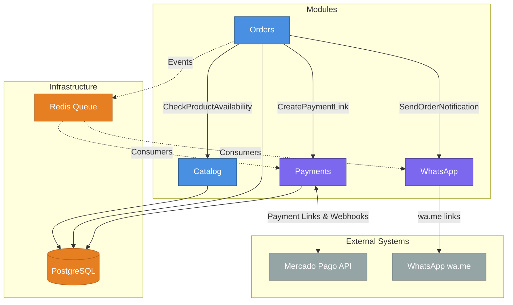
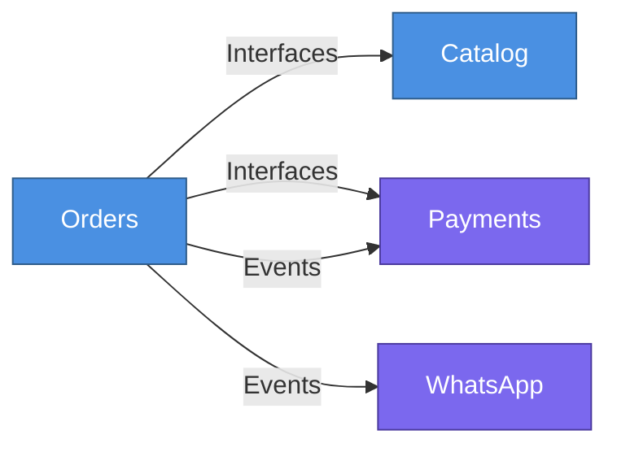
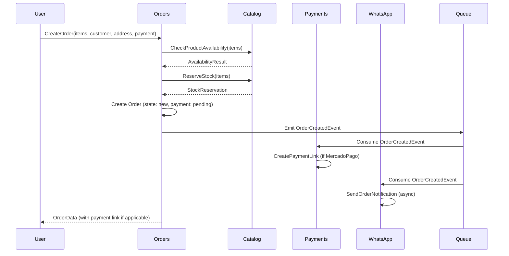
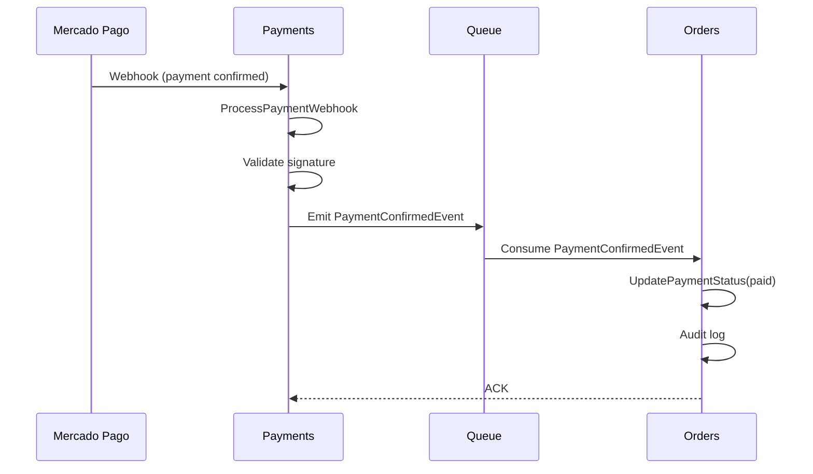
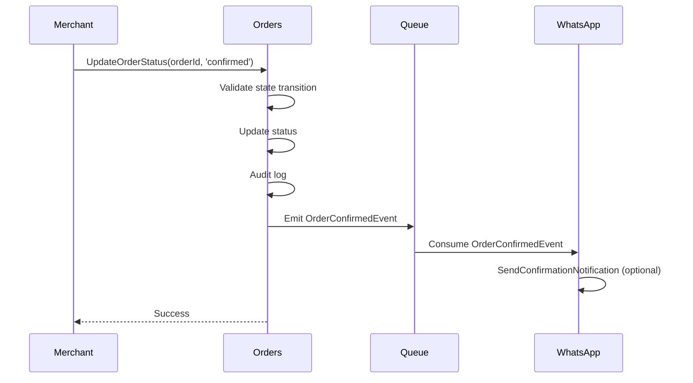

# Modular Architecture

## Scope of this Document

This document intentionally focuses on:
- Module responsibilities
- Exposed interfaces
- Domain events
- Dependencies and restrictions

Out of scope:
- Internal entities
- Value Objects
- Enums
- Casts
- Factories
- Test structure
- Code quality tooling

---

## Architecture Overview



### Module Classification

- **Core Modules** (Catalog, Orders): contain essential business logic
- **Support Modules** (Payments, WhatsApp): handle integrations and side effects

---

## Communication Patterns

### 1. Synchronous Communication (Interfaces)

Used when a module needs **immediate and deterministic response**.

**Characteristics:**
- Strongly typed, explicit contracts
- Never expose Eloquent models (use Data objects or Value Objects)
- Fail immediately and propagate errors
- Represent capabilities, validations, or business decisions

**Example:**
```php
interface CheckProductAvailabilityInterface
{
    public function check(ProductId $productId, Quantity $quantity): AvailabilityResult;
}
```

### 2. Asynchronous Communication (Domain Events)

Used to **notify that a relevant business fact already occurred**.

**Characteristics:**
- Immutable, unidirectional signals
- No return value
- Do not influence business decisions or control flow
- Enable side effects: notifications, integrations, reports, audit
- Consumers must be idempotent and tolerate duplicates

**Example:**
```php
final readonly class OrderConfirmedEvent
{
    public function __construct(
        public OrderId $orderId,
        public Carbon $confirmedAt,
    ) {}
}
```

### Mandatory Rules

1. ✅ **Business state is decided via interfaces, never via events**
2. ✅ **Events communicate past facts; interfaces govern the present**
3. ✅ **Core modules emit events; peripheral modules consume them**
4. ✅ **Events must not include sensitive data**
5. ✅ **Interfaces never return Eloquent models** (use Data objects or Value Objects)

---

## Module Dependency Graph



**Legend:**
- Solid arrows: synchronous dependencies (interfaces)
- Dashed arrows: asynchronous dependencies (events)

---

## Module Definitions

### 1. Catalog Module

**Responsibility:** Manage product catalog and cart selection logic.

#### Core Responsibilities
- Product and variant management (CRUD)
- Category management
- Stock control and reservation
- Promotion application
- Public catalog listing and search
- Shopping cart logic

#### Exposed Interfaces

```php
namespace Modules\Catalog\Contracts;

// Check product/variant availability
interface CheckProductAvailabilityInterface
{
    public function check(ProductId $productId, Quantity $quantity): AvailabilityResult;
    public function checkVariant(VariantId $variantId, Quantity $quantity): AvailabilityResult;
}

// Reserve stock for order creation
interface ReserveStockInterface
{
    /**
     * @param array<CartItemData> $items
     * @throws InsufficientStockException
     */
    public function reserve(array $items): StockReservation;
    public function release(StockReservation $reservation): void;
}

// Apply promotions to cart
interface ApplyPromotionsInterface
{
    /**
     * @param array<CartItemData> $items
     */
    public function apply(array $items, Carbon $at): PricingResult;
}

// Get product pricing for order items
interface GetProductPricingInterface
{
    public function getPrice(ProductId $productId): Money;
    public function getVariantPrice(VariantId $variantId): Money;
}
```

#### Domain Events Emitted

```php
// When stock is critically low
final readonly class StockLowEvent
{
    public function __construct(
        public ProductId $productId,
        public ?VariantId $variantId,
        public Quantity $currentStock,
        public Quantity $threshold,
        public Carbon $detectedAt,
    ) {}
}

// When product becomes unavailable
final readonly class ProductUnavailableEvent
{
    public function __construct(
        public ProductId $productId,
        public ?VariantId $variantId,
        public Carbon $unavailableAt,
    ) {}
}
```

#### Domain Events Consumed

None. Catalog is an independent module.

#### Dependencies

- **None** (core module with no external dependencies)

#### Restrictions

- ❌ Cannot directly access Orders, Payments, or WhatsApp modules
- ❌ Cannot send notifications
- ❌ Cannot process payments
- ✅ Can emit domain events for other modules to consume

---

### 2. Orders Module

**Responsibility:** Core system heart - manage order lifecycle and coordination.

#### Core Responsibilities
- Order creation and validation
- Order state machine (OrderStatus, PaymentStatus)
- Order editing within allowed limits
- Coordinate stock reservation with Catalog
- Coordinate payment link creation with Payments
- Trigger order notifications via events
- Order auditing (status changes)
- Customer data management (phone, address, notes)

#### Exposed Interfaces

```php
namespace Modules\Orders\Contracts;

// Create order from cart
interface CreateOrderInterface
{
    /**
     * @param array<CartItemData> $items
     * @throws ValidationException
     * @throws InsufficientStockException
     */
    public function create(
        array $items,
        CustomerData $customer,
        AddressData $address,
        PaymentMethodEnum $paymentMethod,
        ?string $notes = null,
    ): OrderData;
}

// Update order status
interface UpdateOrderStatusInterface
{
    /**
     * @throws InvalidStateTransitionException
     */
    public function updateOrderStatus(OrderId $orderId, OrderStatus $newStatus, UserId $changedBy): void;
    public function updatePaymentStatus(OrderId $orderId, PaymentStatus $newStatus, UserId $changedBy): void;
}

// Edit order within allowed limits
interface EditOrderInterface
{
    /**
     * @throws OrderNotEditableException
     */
    public function updateAddress(OrderId $orderId, AddressData $address): void;
    public function updatePhone(OrderId $orderId, PhoneNumber $phone): void;
    public function updateNotes(OrderId $orderId, string $notes): void;
    public function updateItemQuantity(OrderId $orderId, OrderItemId $itemId, Quantity $quantity): void;
}
```

#### Domain Events Emitted

```php
// Order lifecycle events
final readonly class OrderCreatedEvent
{
    public function __construct(
        public OrderId $orderId,
        public CustomerData $customer,
        public AddressData $address,
        public PaymentMethodEnum $paymentMethod,
        public Money $total,
        public Carbon $createdAt,
    ) {}
}

final readonly class OrderConfirmedEvent
{
    public function __construct(
        public OrderId $orderId,
        public Carbon $confirmedAt,
    ) {}
}

final readonly class OrderInDeliveryEvent
{
    public function __construct(
        public OrderId $orderId,
        public Carbon $inDeliveryAt,
    ) {}
}

final readonly class OrderDeliveredEvent
{
    public function __construct(
        public OrderId $orderId,
        public Carbon $deliveredAt,
    ) {}
}

final readonly class OrderCancelledEvent
{
    public function __construct(
        public OrderId $orderId,
        public string $reason,
        public Carbon $cancelledAt,
    ) {}
}

final readonly class OrderRejectedEvent
{
    public function __construct(
        public OrderId $orderId,
        public string $reason,
        public Carbon $rejectedAt,
    ) {}
}

// Payment status events
final readonly class PaymentStatusChangedEvent
{
    public function __construct(
        public OrderId $orderId,
        public PaymentStatus $oldStatus,
        public PaymentStatus $newStatus,
        public Carbon $changedAt,
    ) {}
}
```

#### Domain Events Consumed

```php
// From Payments module
PaymentConfirmedEvent // Auto-update payment status to 'paid'
PaymentFailedEvent    // Notify merchant of payment failure
PaymentRefundedEvent  // Update payment status to 'refunded'
```

#### Dependencies

- **Catalog** (via interfaces): stock checking, reservation, pricing
- **Payments** (via interfaces): payment link creation
- **WhatsApp** (via events): order notifications
- **Payments** (via events consumption): payment status updates

#### Restrictions

- ❌ Cannot directly modify Catalog stock (must use interfaces)
- ❌ Cannot directly send WhatsApp messages (must emit events)
- ❌ Cannot directly process payments (must use Payments interfaces)
- ✅ Orchestrates the entire order flow
- ✅ Emits rich domain events for other modules

---

### 3. Payments Module

**Responsibility:** Handle Mercado Pago integration and payment state.

#### Core Responsibilities
- Generate Mercado Pago payment links
- Process Mercado Pago webhooks
- Track payment status (pending, paid, refunded)
- Map external payment data to internal PaymentStatus
- Handle manual payment confirmation (cash/transfer)

#### Exposed Interfaces

```php
namespace Modules\Payments\Contracts;

// Create payment link
interface CreatePaymentLinkInterface
{
    /**
     * @throws PaymentGatewayException
     */
    public function createLink(
        OrderId $orderId,
        Money $amount,
        CustomerData $customer,
        string $description,
    ): PaymentLinkData;
}

// Process webhook from Mercado Pago
interface ProcessPaymentWebhookInterface
{
    /**
     * @throws InvalidWebhookException
     */
    public function process(WebhookPayload $payload): PaymentWebhookResult;
}

// Manually confirm payment (cash/transfer)
interface ConfirmManualPaymentInterface
{
    public function confirm(OrderId $orderId, UserId $confirmedBy, ?string $notes = null): void;
}
```

#### Domain Events Emitted

```php
final readonly class PaymentConfirmedEvent
{
    public function __construct(
        public OrderId $orderId,
        public Money $amount,
        public string $paymentMethod, // 'mercadopago', 'cash', 'transfer'
        public ?string $externalId,
        public Carbon $confirmedAt,
    ) {}
}

final readonly class PaymentFailedEvent
{
    public function __construct(
        public OrderId $orderId,
        public string $reason,
        public Carbon $failedAt,
    ) {}
}

final readonly class PaymentRefundedEvent
{
    public function __construct(
        public OrderId $orderId,
        public Money $amount,
        public string $reason,
        public Carbon $refundedAt,
    ) {}
}
```

#### Domain Events Consumed

```php
// From Orders module
OrderCreatedEvent // Auto-create payment link if method is MercadoPago
OrderCancelledEvent // Cancel pending payment if exists
```

#### Dependencies

- **External**: Mercado Pago API
- **Orders** (via events consumption): react to order lifecycle

#### Restrictions

- ❌ Cannot modify order status directly (must emit events)
- ❌ Cannot access customer data directly (receives via interfaces)
- ✅ Can query Orders for validation purposes
- ✅ Handles all payment gateway communication

---

### 4. WhatsApp Module

**Responsibility:** Asynchronous order notifications via WhatsApp.

#### Core Responsibilities
- Send order creation notifications to merchant
- Generate `wa.me` links with pre-filled messages
- Queue notification jobs
- Handle notification failures gracefully
- (Future) Migrate to WhatsApp Business API

#### Exposed Interfaces

```php
namespace Modules\WhatsApp\Contracts;

// Send order notification
interface SendOrderNotificationInterface
{
    /**
     * @throws NotificationException
     */
    public function send(OrderId $orderId, NotificationTemplate $template): NotificationResult;
}

// Generate wa.me link
interface GenerateWhatsAppLinkInterface
{
    public function generate(PhoneNumber $phone, string $message): string;
}
```

#### Domain Events Emitted

```php
final readonly class NotificationSentEvent
{
    public function __construct(
        public OrderId $orderId,
        public NotificationTemplate $template,
        public Carbon $sentAt,
    ) {}
}

final readonly class NotificationFailedEvent
{
    public function __construct(
        public OrderId $orderId,
        public NotificationTemplate $template,
        public string $reason,
        public Carbon $failedAt,
    ) {}
}
```

#### Domain Events Consumed

```php
// From Orders module
OrderCreatedEvent      // Send notification to merchant
OrderConfirmedEvent    // Send confirmation to customer (optional)
OrderInDeliveryEvent   // Send delivery notification (optional)
OrderDeliveredEvent    // Send delivery confirmation (optional)
OrderCancelledEvent    // Send cancellation notification (optional)
```

#### Dependencies

- **External**: WhatsApp `wa.me` API (no authentication required for MVP)
- **Orders** (via events consumption): react to order lifecycle
- **Infrastructure**: Redis Queue for async processing

#### Restrictions

- ❌ Cannot modify order state
- ❌ Cannot access payment information
- ✅ Can fail without blocking order creation
- ✅ Retries on transient failures (via queue)

---

## Event Flow Diagrams

### Order Creation Flow



### Payment Confirmation Flow (Webhook)



### Order Status Update Flow



---

## Module Organization Structure

Each module follows Laravel Modules structure:

```
Modules/
├── Catalog/
│   ├── Contracts/          # Interfaces exposed to other modules
│   ├── Events/             # Domain events emitted
│   ├── Listeners/          # Event consumers
│   ├── Models/             # Eloquent models (internal)
│   ├── Services/           # Business logic (internal)
│   ├── Http/
│   │   └── Livewire/       # Volt components
│   ├── Database/
│   │   ├── Migrations/
│   │   └── Factories/
│   └── Tests/
│       ├── Feature/
│       └── Unit/
│
├── Orders/
│   ├── Contracts/
│   ├── Events/
│   ├── Listeners/
│   ├── Models/
│   ├── Services/
│   ├── Http/
│   │   └── Livewire/
│   ├── Database/
│   │   ├── Migrations/
│   │   └── Factories/
│   └── Tests/
│       ├── Feature/
│       └── Unit/
│
├── Payments/
│   ├── Contracts/
│   ├── Events/
│   ├── Listeners/
│   ├── Models/
│   ├── Services/
│   ├── Http/
│   │   └── Controllers/    # Webhook endpoints
│   ├── Database/
│   │   ├── Migrations/
│   │   └── Factories/
│   └── Tests/
│       ├── Feature/
│       └── Unit/
│
└── WhatsApp/
    ├── Contracts/
    ├── Events/
    ├── Listeners/
    ├── Jobs/               # Queue jobs
    ├── Services/
    ├── Tests/
    │   ├── Feature/
    │   └── Unit/
    └── Config/
```

---

## Interface Implementation Pattern

### Service Provider Registration

Each module must register its interface implementations in its service provider:

```php
namespace Modules\Catalog\Providers;

use Illuminate\Support\ServiceProvider;
use Modules\Catalog\Contracts\CheckProductAvailabilityInterface;
use Modules\Catalog\Services\ProductAvailabilityService;

final class CatalogServiceProvider extends ServiceProvider
{
    public function register(): void
    {
        $this->app->bind(
            CheckProductAvailabilityInterface::class,
            ProductAvailabilityService::class
        );
    }
}
```

### Interface Usage in Other Modules

```php
namespace Modules\Orders\Services;

use Modules\Catalog\Contracts\CheckProductAvailabilityInterface;

final class CreateOrderService
{
    public function __construct(
        private readonly CheckProductAvailabilityInterface $availabilityChecker,
    ) {}

    public function execute(/*...*/): OrderData
    {
        // Use interface without knowing implementation details
        $result = $this->availabilityChecker->check($productId, $quantity);
        
        // ...
    }
}
```

---

## Event System Configuration

### Event Registration

Each module registers its events and listeners in `EventServiceProvider`:

```php
namespace Modules\Orders\Providers;

use Illuminate\Foundation\Support\Providers\EventServiceProvider as ServiceProvider;
use Modules\Orders\Events\OrderCreatedEvent;
use Modules\WhatsApp\Listeners\SendOrderNotificationListener;
use Modules\Payments\Listeners\CreatePaymentLinkListener;

final class EventServiceProvider extends ServiceProvider
{
    protected $listen = [
        OrderCreatedEvent::class => [
            SendOrderNotificationListener::class,
            CreatePaymentLinkListener::class,
        ],
    ];
}
```

### Event Emission

```php
namespace Modules\Orders\Services;

use Modules\Orders\Events\OrderCreatedEvent;

final class CreateOrderService
{
    public function execute(/*...*/): OrderData
    {
        // Create order...
        
        // Emit event (asynchronous, fire-and-forget)
        event(new OrderCreatedEvent(
            orderId: $order->id,
            customer: $customerData,
            address: $addressData,
            paymentMethod: $paymentMethod,
            total: $order->total,
            createdAt: $order->created_at,
        ));
        
        return $orderData;
    }
}
```

### Event Consumption

```php
namespace Modules\WhatsApp\Listeners;

use Illuminate\Contracts\Queue\ShouldQueue;
use Modules\Orders\Events\OrderCreatedEvent;
use Modules\WhatsApp\Contracts\SendOrderNotificationInterface;

final class SendOrderNotificationListener implements ShouldQueue
{
    public function __construct(
        private readonly SendOrderNotificationInterface $notificationService,
    ) {}

    public function handle(OrderCreatedEvent $event): void
    {
        // Handle event asynchronously via queue
        $this->notificationService->send(
            orderId: $event->orderId,
            template: NotificationTemplate::ORDER_CREATED,
        );
    }
}
```

---

## Anti-Patterns to Avoid

### ❌ Don't: Access other module's models directly

```php
// ❌ BAD - Orders accessing Catalog's Product model
use Modules\Catalog\Models\Product;

$product = Product::find($productId);
$price = $product->price;
```

### ✅ Do: Use interfaces instead

```php
// ✅ GOOD - Orders using Catalog's interface
use Modules\Catalog\Contracts\GetProductPricingInterface;

$price = $this->pricingService->getPrice($productId);
```

### ❌ Don't: Return Eloquent models from interfaces

```php
// ❌ BAD
interface GetProductInterface
{
    public function get(ProductId $id): Product; // Eloquent model
}
```

### ✅ Do: Return Data objects or Value Objects

```php
// ✅ GOOD
interface GetProductInterface
{
    public function get(ProductId $id): ProductData; // Spatie Laravel Data
}
```

### ❌ Don't: Use events for business decisions

```php
// ❌ BAD - Using event to check stock
event(new CheckStockEvent($productId));
// How do I get the result? Events are fire-and-forget!
```

### ✅ Do: Use interfaces for business decisions

```php
// ✅ GOOD - Using interface for immediate response
$result = $this->stockChecker->check($productId, $quantity);
if (!$result->isAvailable()) {
    throw new InsufficientStockException();
}
```

### ❌ Don't: Include sensitive data in events

```php
// ❌ BAD
final readonly class OrderCreatedEvent
{
    public function __construct(
        public string $customerCreditCard, // Sensitive!
        public string $customerPassword,   // Sensitive!
    ) {}
}
```

### ✅ Do: Include only necessary identifiers and non-sensitive data

```php
// ✅ GOOD
final readonly class OrderCreatedEvent
{
    public function __construct(
        public OrderId $orderId,
        public CustomerData $customer, // Only name, phone, address
        public Money $total,
        public Carbon $createdAt,
    ) {}
}
```

---

## Testing Strategy by Module

### Catalog Module Tests

- **Unit Tests**: Value Objects, Stock calculation logic
- **Feature Tests**: Product CRUD, Stock reservation/release, Promotion application
- **Integration Tests**: Interface implementations

### Orders Module Tests

- **Unit Tests**: State machine transitions, Validation logic
- **Feature Tests**: Order creation flow, Order editing, Status updates with audit
- **Integration Tests**: Cross-module coordination (Catalog + Payments + WhatsApp)

### Payments Module Tests

- **Unit Tests**: Webhook signature validation, Payment status mapping
- **Feature Tests**: Payment link generation, Webhook processing
- **Integration Tests**: Mercado Pago sandbox

### WhatsApp Module Tests

- **Unit Tests**: Message template generation, Link formatting
- **Feature Tests**: Notification sending (mocked), Queue job execution
- **Integration Tests**: Event consumption and notification dispatch

### Cross-Module Integration Tests

Located in `tests/Integration/`:

```php
// tests/Integration/OrderCreationFlowTest.php
test('complete order creation flow triggers all modules', function () {
    // Given: Products with stock
    // When: User creates order
    // Then: 
    //   - Stock is reserved (Catalog)
    //   - Order is created (Orders)
    //   - Payment link is generated (Payments)
    //   - WhatsApp notification is queued (WhatsApp)
});
```

---

## Migration Path

### Phase 1: MVP (Current)
- Basic interfaces between modules
- Core events (OrderCreated, PaymentConfirmed)
- Simple `wa.me` links
- Manual payment confirmation

### Phase 2: Enhancement
- More granular events (OrderStatusChanged per status)
- WhatsApp Business API integration
- Automatic retry logic for failed notifications
- Advanced payment tracking

### Phase 3: Scale
- Event sourcing for Orders
- CQRS for reporting
- Separate read models for analytics
- Advanced promotion engine

---

## Validation Checklist

Before implementing a new feature that crosses modules:

- [ ] Identify which module owns the business logic
- [ ] Define interfaces for synchronous communication
- [ ] Define events for asynchronous side effects
- [ ] Ensure events are immutable and contain no sensitive data
- [ ] Ensure interfaces return Data objects, not Eloquent models
- [ ] Write integration tests for cross-module flows
- [ ] Document new interfaces and events in this file
- [ ] Update dependency graph if needed

---

## Summary

| Module   | Type    | Primary Responsibility              | Exposes Interfaces | Emits Events | Consumes Events |
|----------|---------|-------------------------------------|--------------------|--------------|-----------------| 
| Catalog  | Core    | Products, stock, promotions, cart   | 4                  | 2            | 0               |
| Orders   | Core    | Order lifecycle, coordination       | 3                  | 8            | 3               |
| Payments | Support | Payment processing, Mercado Pago    | 3                  | 3            | 2               |
| WhatsApp | Support | Asynchronous notifications          | 2                  | 2            | 5               |

**Key Principles:**
1. Core modules (Catalog, Orders) drive the business; support modules react
2. Synchronous for decisions, asynchronous for side effects
3. Interfaces for strong contracts, events for loose coupling
4. Never expose internal models across module boundaries
5. Test module boundaries rigorously

---

## References

- [`conventions.md`](../laravel/conventions/conventions.md) - Laravel technical conventions
- [`modules.md`](../laravel/conventions/modules.md) - Detailed module communication spec
- [`project_definition.md`](./project_definition.md) - Full project requirements
- [`value-objects.md`](../laravel/conventions/value-objects.md) - Value Object patterns

