# Orders Module - Domain Model

## Module Overview

**Name:** Orders (Pedidos)  
**Type:** CORE Module  
**Purpose:** Creación, gestión y auditoría de pedidos con control transaccional de stock y estados

**Responsibilities:**
- Creación de pedidos desde el carrito de compras
- Validación de stock y aplicación de promociones
- Gestión de estados de pedido (OrderStatus) y pago (PaymentStatus)
- Edición controlada de pedidos con restricciones según estado
- Auditoría de cambios de estado
- Gestión de direcciones de entrega
- Control transaccional de stock con locks pessimistas

**Dependencies:**
- **Catalog:** Validación de productos, stock, precios y aplicación de promociones
- **Payments:** Estado de pago y método de pago seleccionado
- **WhatsApp:** Notificaciones de creación y cambios de estado
- **Security:** Rate limiting, validación de teléfono, límite de pedidos activos

## Domain Model Class Diagram

```mermaid
classDiagram
    class Order {
        +int id
        +string order_number
        +string customer_name
        +PhoneNumber customer_phone
        +string notes
        +OrderStatus status
        +PaymentStatus payment_status
        +PaymentMethod payment_method
        +Money subtotal
        +Money discount
        +Money total
        +DateTime created_at
        +DateTime updated_at
        +DateTime confirmed_at
        +DateTime delivered_at
        +DateTime cancelled_at
        +int confirmed_by_user_id
        +canBeEdited() bool
        +canChangeStatus(OrderStatus newStatus) bool
        +canChangePaymentStatus(PaymentStatus newStatus) bool
        +isActive() bool
        +isPaid() bool
        +isCompleted() bool
        +applyPromotions(Collection promotions) void
        +calculateTotals() void
        +confirmOrder(int userId) void
        +cancelOrder(int userId, string reason) void
        +markAsDelivered(int userId) void
    }

    class OrderItem {
        +int id
        +int order_id
        +int product_id
        +int product_variant_id
        +string product_name
        +string variant_name
        +Quantity quantity
        +Money unit_price
        +Money discount
        +Money subtotal
        +Money total
        +int promotion_id
        +DateTime created_at
        +calculateTotal() void
        +applyDiscount(Money discount) void
        +canUpdateQuantity(int newQuantity) bool
    }

    class Address {
        +int id
        +int order_id
        +string street
        +string number
        +string floor
        +string apartment
        +string city
        +string state
        +string postal_code
        +string reference
        +Coordinates coordinates
        +DateTime created_at
        +DateTime updated_at
        +getFullAddress() string
        +isComplete() bool
    }

    class OrderStatusLog {
        +int id
        +int order_id
        +int user_id
        +StatusField field
        +string old_value
        +string new_value
        +string reason
        +DateTime created_at
    }

    class OrderStatus {
        <<enumeration>>
        NEW
        CONFIRMED
        IN_DELIVERY
        DELIVERED
        REJECTED
        CANCELLED
        +canTransitionTo(OrderStatus target) bool
        +isTerminal() bool
        +label() string
        +color() string
    }

    class PaymentStatus {
        <<enumeration>>
        PENDING
        PAID
        REFUNDED
        +canTransitionTo(PaymentStatus target) bool
        +isTerminal() bool
        +label() string
        +color() string
    }

    class PaymentMethod {
        <<enumeration>>
        MERCADO_PAGO
        CASH
        TRANSFER
        +requiresExternalLink() bool
        +label() string
    }

    class StatusField {
        <<enumeration>>
        ORDER_STATUS
        PAYMENT_STATUS
    }

    class PhoneNumber {
        <<value_object>>
        +string value
        +string normalized
        +string country_code
        +string area_code
        +string number
        +isValid() bool
        +format() string
        +normalize() string
        +toWhatsAppFormat() string
    }

    class Money {
        <<value_object>>
        +int amount
        +string currency
        +add(Money other) Money
        +subtract(Money other) Money
        +multiply(float factor) Money
        +divide(float divisor) Money
        +isZero() bool
        +isPositive() bool
        +format() string
        +toDecimal() float
    }

    class Quantity {
        <<value_object>>
        +int value
        +add(Quantity other) Quantity
        +subtract(Quantity other) Quantity
        +isPositive() bool
        +isZero() bool
        +isGreaterThan(Quantity other) bool
    }

    class Coordinates {
        <<value_object>>
        +float latitude
        +float longitude
        +isValid() bool
        +distanceTo(Coordinates other) float
    }

    class CreateOrderAction {
        +execute(CreateOrderData data) Order
        -validateStock(array items) void
        -applyPromotions(array items) array
        -reserveStock(array items) void
        -calculateTotals(array items) array
        -createOrderItems(Order order, array items) void
    }

    class UpdateOrderAction {
        +execute(Order order, UpdateOrderData data) Order
        -validateEditable(Order order) void
        -validateStockForUpdates(Order order, array items) void
        -updateOrderItems(Order order, array items) void
        -recalculateTotals(Order order) void
    }

    class ChangeOrderStatusAction {
        +execute(Order order, OrderStatus newStatus, int userId, string reason) void
        -validateTransition(Order order, OrderStatus newStatus) void
        -logStatusChange(Order order, OrderStatus oldStatus, OrderStatus newStatus, int userId, string reason) void
        -notifyStatusChange(Order order) void
    }

    class ChangePaymentStatusAction {
        +execute(Order order, PaymentStatus newStatus, int userId, string reason) void
        -validateTransition(Order order, PaymentStatus newStatus) void
        -logStatusChange(Order order, PaymentStatus oldStatus, PaymentStatus newStatus, int userId, string reason) void
        -notifyPaymentStatusChange(Order order) void
    }

    class ValidateActiveOrdersLimit {
        +execute(PhoneNumber phone) void
        -countActiveOrders(PhoneNumber phone) int
        -getMaxActiveOrdersLimit() int
    }

    class ReleaseStockOnCancellation {
        +execute(Order order) void
        -releaseOrderItemsStock(Collection items) void
    }

    class CreateOrderData {
        <<data>>
        +string customer_name
        +string customer_phone
        +string notes
        +PaymentMethod payment_method
        +AddressData address
        +array items
    }

    class UpdateOrderData {
        <<data>>
        +string customer_phone
        +string notes
        +PaymentMethod payment_method
        +AddressData address
        +array items
    }

    class AddressData {
        <<data>>
        +string street
        +string number
        +string floor
        +string apartment
        +string city
        +string state
        +string postal_code
        +string reference
        +float latitude
        +float longitude
    }

    class OrderItemData {
        <<data>>
        +int product_id
        +int product_variant_id
        +int quantity
    }

    Order "1" --> "1..*" OrderItem : has
    Order "1" --> "1" Address : has
    Order "1" --> "0..*" OrderStatusLog : tracks changes
    Order --> OrderStatus : current status
    Order --> PaymentStatus : payment status
    Order --> PaymentMethod : payment method
    Order --> PhoneNumber : customer phone
    Order --> Money : subtotal/discount/total
    
    OrderItem --> Quantity : quantity
    OrderItem --> Money : prices
    
    Address --> Coordinates : location
    
    OrderStatusLog --> StatusField : field type
    
    CreateOrderAction ..> Order : creates
    CreateOrderAction ..> CreateOrderData : uses
    CreateOrderAction ..> ValidateActiveOrdersLimit : validates
    
    UpdateOrderAction ..> Order : updates
    UpdateOrderAction ..> UpdateOrderData : uses
    
    ChangeOrderStatusAction ..> Order : changes
    ChangeOrderStatusAction ..> OrderStatus : transitions
    ChangeOrderStatusAction ..> OrderStatusLog : logs
    
    ChangePaymentStatusAction ..> Order : changes
    ChangePaymentStatusAction ..> PaymentStatus : transitions
    ChangePaymentStatusAction ..> OrderStatusLog : logs
    
    ReleaseStockOnCancellation ..> Order : processes
```



## Entities

### Order

**Description:** Pedido realizado por un cliente (usuario no autenticado)

**Key Attributes:**
- `order_number`: Número único de pedido (formato: ORD-YYYYMMDD-XXXXX)
- `customer_name`: Nombre del cliente (no editable post-entrega)
- `customer_phone`: Teléfono normalizado del cliente
- `status`: Estado actual del pedido (OrderStatus enum)
- `payment_status`: Estado del pago (PaymentStatus enum)
- `payment_method`: Método de pago seleccionado
- `subtotal`: Suma de items sin descuento
- `discount`: Descuento total aplicado
- `total`: Total final a pagar
- `confirmed_by_user_id`: ID del merchant que confirmó el pedido

**Business Rules:**
- Un pedido solo puede editarse si no está en estado `DELIVERED` o `REFUNDED`
- El nombre del cliente no puede editarse una vez confirmado el pedido
- Los precios de los items son históricos y no cambian si cambia el precio del producto
- El stock se descuenta transaccionalmente al crear el pedido
- El stock se libera si el pedido se cancela o rechaza
- Un mismo teléfono puede tener máximo N pedidos activos (configurable 2-5)
- Las transiciones de estado deben ser válidas según el flujo de negocio
- Cada cambio de estado debe ser auditado

**Invariants:**
- `total = subtotal - discount`
- `subtotal = sum(order_items.total)`
- `confirmed_at != null` si `status != NEW`
- `delivered_at != null` si `status == DELIVERED`

### OrderItem

**Description:** Línea de pedido que representa un producto o variante con cantidad y precio

**Key Attributes:**
- `product_name`: Nombre histórico del producto al momento de compra
- `variant_name`: Nombre histórico de la variante (nullable)
- `quantity`: Cantidad solicitada
- `unit_price`: Precio unitario histórico
- `discount`: Descuento aplicado por promociones
- `subtotal`: Precio unitario × cantidad
- `total`: Subtotal - descuento
- `promotion_id`: ID de promoción aplicada (nullable)

**Business Rules:**
- Los precios son históricos y no se modifican si cambia el precio del producto
- La cantidad puede modificarse solo si hay stock disponible y el pedido es editable
- El descuento se aplica según promociones vigentes al momento de creación
- No se pueden agregar o quitar productos, solo modificar cantidades
- El cálculo de totales debe ser atómico y consistente

**Invariants:**
- `subtotal = unit_price * quantity`
- `total = subtotal - discount`
- `quantity > 0`
- `unit_price >= 0`

### Address

**Description:** Dirección de entrega asociada a un pedido (relación 1:1)

**Key Attributes:**
- `street`: Calle
- `number`: Número
- `floor`: Piso (opcional)
- `apartment`: Departamento (opcional)
- `city`: Ciudad
- `state`: Provincia/Estado
- `postal_code`: Código postal
- `reference`: Referencia adicional para delivery
- `coordinates`: Coordenadas GPS (opcional)

**Business Rules:**
- Cada pedido tiene exactamente una dirección
- La dirección puede editarse mientras el pedido no esté en estado `DELIVERED`
- Los campos mínimos requeridos son: street, number, city
- Las coordenadas son opcionales pero recomendadas para optimización de entregas

### OrderStatusLog

**Description:** Registro de auditoría para cambios de estado en pedidos

**Key Attributes:**
- `order_id`: Pedido modificado
- `user_id`: Merchant que realizó el cambio
- `field`: Campo modificado (ORDER_STATUS o PAYMENT_STATUS)
- `old_value`: Valor anterior
- `new_value`: Valor nuevo
- `reason`: Motivo del cambio (opcional)

**Business Rules:**
- Cada cambio de estado debe generar un log
- Los logs son inmutables (solo creación, no edición/eliminación)
- Solo se auditan cambios de OrderStatus y PaymentStatus en MVP
- Los logs deben incluir timestamp preciso

## Value Objects

### PhoneNumber

**Description:** Número de teléfono normalizado y validado

**Attributes:**
- `value`: Valor original ingresado
- `normalized`: Versión normalizada (solo dígitos)
- `country_code`: Código de país
- `area_code`: Código de área
- `number`: Número sin códigos

**Validation Rules:**
- Formato válido según país (MVP: Argentina)
- Longitud mínima/máxima
- Solo dígitos numéricos después de normalización
- Código de país requerido para WhatsApp

**Methods:**
- `toWhatsAppFormat()`: Formato para links de WhatsApp
- `normalize()`: Elimina caracteres especiales y espacios
- `format()`: Formato legible (ej: +54 11 1234-5678)

### Money

**Description:** Valor monetario con operaciones aritméticas seguras

**Attributes:**
- `amount`: Cantidad en centavos (int)
- `currency`: Moneda (MVP: ARS)

**Validation Rules:**
- Amount debe ser >= 0 en la mayoría de contextos
- Currency debe ser código ISO válido

**Methods:**
- `add()`, `subtract()`, `multiply()`, `divide()`: Operaciones aritméticas
- `format()`: Formato legible (ej: $1.234,56)
- `toDecimal()`: Conversión a float para APIs

### Quantity

**Description:** Cantidad de productos con validación

**Attributes:**
- `value`: Cantidad entera

**Validation Rules:**
- Debe ser > 0 para items de pedido
- Debe ser >= 0 para stock

**Methods:**
- `add()`, `subtract()`: Operaciones aritméticas
- `isGreaterThan()`: Comparaciones

### Coordinates

**Description:** Coordenadas geográficas GPS

**Attributes:**
- `latitude`: Latitud (-90 a 90)
- `longitude`: Longitud (-180 a 180)

**Validation Rules:**
- Rangos válidos de latitud y longitud
- Ambos valores requeridos si se proveen coordenadas

**Methods:**
- `distanceTo()`: Cálculo de distancia entre puntos

## Enumerations

### OrderStatus

**Values:**
- `NEW`: Pedido creado, esperando confirmación del merchant
- `CONFIRMED`: Merchant confirmó el pedido
- `IN_DELIVERY`: Pedido en camino
- `DELIVERED`: Entregado al cliente
- `REJECTED`: Merchant rechazó el pedido
- `CANCELLED`: Cliente o merchant canceló

**Valid Transitions:**
```
NEW → CONFIRMED | REJECTED | CANCELLED
CONFIRMED → IN_DELIVERY | CANCELLED
IN_DELIVERY → DELIVERED | CANCELLED
DELIVERED → (terminal)
REJECTED → (terminal)
CANCELLED → (terminal)
```

**Terminal States:** DELIVERED, REJECTED, CANCELLED

### PaymentStatus

**Values:**
- `PENDING`: Pago pendiente
- `PAID`: Pago confirmado (manual o vía webhook)
- `REFUNDED`: Reembolsado

**Valid Transitions:**
```
PENDING → PAID | REFUNDED
PAID → REFUNDED
REFUNDED → (terminal)
```

**Terminal States:** REFUNDED

**Note:** Los estados de pago son independientes de los estados de pedido

### PaymentMethod

**Values:**
- `MERCADO_PAGO`: Pago con link de Mercado Pago
- `CASH`: Pago en efectivo
- `TRANSFER`: Transferencia bancaria

**Behavior:**
- `MERCADO_PAGO` requiere generación de link externo
- `CASH` y `TRANSFER` requieren confirmación manual del merchant

### StatusField

**Values:**
- `ORDER_STATUS`: Campo order_status del pedido
- `PAYMENT_STATUS`: Campo payment_status del pedido

**Purpose:** Discriminador para logs de auditoría

## Actions

### CreateOrderAction

**Purpose:** Crear un pedido validando stock, aplicando promociones y reservando productos

**Input:** `CreateOrderData`

**Output:** `Order`

**Steps:**
1. Validar límite de pedidos activos por teléfono
2. Validar stock disponible para todos los items
3. Aplicar promociones vigentes
4. Calcular totales (subtotal, descuentos, total)
5. Crear pedido con estado `NEW` y pago `PENDING`
6. Crear items del pedido con precios históricos
7. Crear dirección de entrega
8. Reservar stock de forma transaccional (lock pessimista)
9. Disparar evento OrderCreated para notificación WhatsApp

**Validations:**
- Stock suficiente para cada item
- Teléfono no excede límite de pedidos activos
- Rate limiting por IP y teléfono
- Datos de dirección completos
- Promociones válidas y vigentes

**Exceptions:**
- `InsufficientStockException`
- `ActiveOrdersLimitExceededException`
- `RateLimitExceededException`
- `ValidationException`

### UpdateOrderAction

**Purpose:** Actualizar datos editables de un pedido con validaciones

**Input:** `Order`, `UpdateOrderData`

**Output:** `Order`

**Steps:**
1. Validar que el pedido sea editable
2. Validar stock para cambios de cantidad
3. Actualizar campos permitidos
4. Recalcular totales si cambió cantidad
5. Actualizar dirección si cambió
6. Ajustar stock si cambió cantidad de items

**Allowed Updates:**
- customer_phone
- notes
- payment_method
- address
- item quantities (con validación de stock)

**Not Allowed:**
- customer_name (excepto si status = NEW)
- Agregar/quitar productos
- Modificar precios
- Editar pedidos DELIVERED o REFUNDED

**Exceptions:**
- `OrderNotEditableException`
- `InsufficientStockException`
- `ValidationException`

### ChangeOrderStatusAction

**Purpose:** Cambiar estado del pedido con validación de transiciones

**Input:** `Order`, `OrderStatus`, `userId`, `reason`

**Output:** `void`

**Steps:**
1. Validar transición válida
2. Actualizar estado del pedido
3. Actualizar timestamps relacionados (confirmed_at, delivered_at, etc.)
4. Crear log de auditoría
5. Liberar stock si el nuevo estado es CANCELLED o REJECTED
6. Disparar evento para notificación WhatsApp

**Validations:**
- Transición válida según flujo de negocio
- Usuario autenticado (merchant)

**Side Effects:**
- Liberación de stock para cancelaciones/rechazos
- Notificación WhatsApp al cliente

**Exceptions:**
- `InvalidStatusTransitionException`
- `UnauthorizedException`

### ChangePaymentStatusAction

**Purpose:** Cambiar estado de pago manualmente o vía webhook

**Input:** `Order`, `PaymentStatus`, `userId`, `reason`

**Output:** `void`

**Steps:**
1. Validar transición válida
2. Actualizar estado de pago
3. Crear log de auditoría
4. Disparar evento para notificación WhatsApp si corresponde

**Validations:**
- Transición válida
- Usuario autenticado (para cambios manuales)

**Exceptions:**
- `InvalidPaymentStatusTransitionException`
- `UnauthorizedException`

### ValidateActiveOrdersLimit

**Purpose:** Validar que un teléfono no exceda el límite de pedidos activos

**Input:** `PhoneNumber`

**Output:** `void`

**Steps:**
1. Normalizar teléfono
2. Contar pedidos activos (NEW, CONFIRMED, IN_DELIVERY)
3. Comparar con límite configurado
4. Lanzar excepción si excede

**Configuration:**
- `MAX_ACTIVE_ORDERS_PER_PHONE`: 2-5 (default: 2)

**Exceptions:**
- `ActiveOrdersLimitExceededException`

### ReleaseStockOnCancellation

**Purpose:** Liberar stock de items cuando un pedido se cancela o rechaza

**Input:** `Order`

**Output:** `void`

**Steps:**
1. Obtener items del pedido
2. Por cada item, incrementar stock del producto/variante
3. Registrar operación de liberación

**Triggers:**
- Estado cambia a CANCELLED
- Estado cambia a REJECTED

## Data Transfer Objects

### CreateOrderData

**Purpose:** Datos para crear un nuevo pedido

**Attributes:**
- `customer_name`: string (required)
- `customer_phone`: string (required)
- `notes`: string (optional)
- `payment_method`: PaymentMethod (required)
- `address`: AddressData (required)
- `items`: OrderItemData[] (required, min: 1)

### UpdateOrderData

**Purpose:** Datos para actualizar un pedido existente

**Attributes:**
- `customer_phone`: string (optional)
- `notes`: string (optional)
- `payment_method`: PaymentMethod (optional)
- `address`: AddressData (optional)
- `items`: OrderItemData[] (optional)

### AddressData

**Purpose:** Datos de dirección de entrega

**Attributes:**
- `street`: string (required)
- `number`: string (required)
- `floor`: string (optional)
- `apartment`: string (optional)
- `city`: string (required)
- `state`: string (required)
- `postal_code`: string (optional)
- `reference`: string (optional)
- `latitude`: float (optional)
- `longitude`: float (optional)

### OrderItemData

**Purpose:** Datos de un item de pedido

**Attributes:**
- `product_id`: int (required)
- `product_variant_id`: int (optional)
- `quantity`: int (required, min: 1)

## Events

### OrderCreated

**Payload:**
- `order_id`: int
- `order_number`: string
- `customer_phone`: string
- `total`: Money

**Listeners:**
- SendOrderWhatsAppNotification

### OrderStatusChanged

**Payload:**
- `order_id`: int
- `old_status`: OrderStatus
- `new_status`: OrderStatus
- `changed_by`: int

**Listeners:**
- SendStatusChangeWhatsAppNotification
- ReleaseStockOnCancellation (if applicable)

### PaymentStatusChanged

**Payload:**
- `order_id`: int
- `old_status`: PaymentStatus
- `new_status`: PaymentStatus
- `changed_by`: int

**Listeners:**
- SendPaymentConfirmationWhatsAppNotification (if paid)

## Business Rules Summary

### Order Creation
1. Stock must be available for all items
2. Phone must not exceed active orders limit (configurable 2-5)
3. Rate limiting: 5 attempts/hour per IP, 3 orders/hour per phone
4. Stock is reserved transactionally with pessimistic locking
5. Historical prices are saved and never change
6. Promotions are applied at creation time based on validity dates

### Order Editing
1. Orders in DELIVERED or REFUNDED status cannot be edited
2. Customer name cannot be changed after confirmation
3. Products cannot be added or removed, only quantities modified
4. Quantity changes require stock validation
5. Payment method can be changed at any time
6. Address can be edited until delivery

### Status Transitions
1. Only valid transitions are allowed (see OrderStatus enum)
2. All transitions are audited with user_id and timestamp
3. Terminal states cannot transition to other states
4. Cancellations and rejections trigger stock release

### Stock Management
1. Stock is decremented transactionally on order creation
2. Stock is released on cancellation or rejection
3. Stock validation is required for quantity updates
4. Pessimistic locking prevents race conditions

### Payment Flow
1. Payment status is independent of order status
2. Mercado Pago payments update automatically via webhook
3. Cash/Transfer payments require manual confirmation
4. Payment method can be changed by merchant at any time

### Anti-Abuse
1. Maximum N active orders per phone (configurable)
2. Rate limiting per IP and phone
3. Phone number validation and normalization
4. Captcha protection on checkout

## Database Schema Considerations

### Tables
- `orders`: Main order entity
- `order_items`: Order line items
- `addresses`: Delivery addresses (1:1 with orders)
- `order_status_logs`: Audit trail for status changes

### Indexes
- `orders.customer_phone`: For active orders lookup
- `orders.order_number`: Unique index
- `orders.status`: For filtering by status
- `orders.payment_status`: For filtering by payment status
- `orders.created_at`: For date range queries
- `order_status_logs.order_id`: For audit trail retrieval
- `order_status_logs.created_at`: For chronological ordering

### Foreign Keys
- `order_items.order_id` → `orders.id`
- `order_items.product_id` → `products.id`
- `order_items.product_variant_id` → `product_variants.id` (nullable)
- `addresses.order_id` → `orders.id`
- `order_status_logs.order_id` → `orders.id`
- `order_status_logs.user_id` → `users.id`

### Soft Deletes
- `orders`: Use soft deletes for data retention and audit
- `order_items`: Cascade soft delete with order
- `addresses`: Cascade soft delete with order
- `order_status_logs`: Never delete (audit requirement)

## Integration Points

### With Catalog Module
- Validate product and variant existence
- Check stock availability
- Get current prices for historical recording
- Apply promotions to order items

### With Payments Module
- Receive payment method selection
- Generate Mercado Pago links
- Receive webhook notifications for payment status
- Query payment confirmation status

### With WhatsApp Module
- Send order creation notification
- Send status change notifications
- Send payment confirmation notifications

### With Security Module
- Validate active orders limit per phone
- Apply rate limiting rules
- Validate phone number format

### With Reports Module
- Provide order data for sales reports
- Provide order status distribution
- Provide payment status analytics

## Testing Strategy

### Unit Tests
- Value Objects validation and behavior
- Enum transitions validation
- Money arithmetic operations
- PhoneNumber normalization

### Feature Tests
- Order creation with stock validation
- Order editing with restrictions
- Status transitions and validation
- Active orders limit validation
- Stock release on cancellation
- Audit log creation

### Integration Tests
- Order creation flow with Catalog integration
- Payment webhook processing
- WhatsApp notification triggers
- Stock locking under concurrency

### Edge Cases
- Concurrent order creation with limited stock
- Status transition attempts from terminal states
- Editing orders in non-editable states
- Exceeding active orders limit
- Rate limit boundary conditions

## Performance Considerations

### Optimizations
- Pessimistic locking only during stock reservation
- Eager loading of order_items and address in queries
- Indexed phone lookups for active orders validation
- Cached configuration values (rate limits, active orders limit)

### Scalability
- Queue-based stock operations for high concurrency
- Read replicas for order listing and reports
- Caching of order counts per phone
- Batch processing for bulk status updates

## AI-Friendly Annotations

**Key Concepts:**
- aggregate_root: Order
- value_objects: PhoneNumber, Money, Quantity, Coordinates
- enums: OrderStatus, PaymentStatus, PaymentMethod, StatusField
- actions: CreateOrderAction, UpdateOrderAction, ChangeOrderStatusAction, ChangePaymentStatusAction
- audit: OrderStatusLog
- anti_corruption_layer: DTOs for external data input
- domain_events: OrderCreated, OrderStatusChanged, PaymentStatusChanged

**Invariants to Maintain:**
- order.total = order.subtotal - order.discount
- order_item.total = order_item.subtotal - order_item.discount
- order.subtotal = SUM(order_items.total)
- quantity > 0 for all order items
- stock reservation must be transactional and atomic

**Critical Paths:**
- Order creation with stock validation and reservation
- Status transitions with audit logging
- Stock release on cancellation

**Data Consistency:**
- Historical prices never change after order creation
- Audit logs are immutable
- Stock operations must be atomic
- Phone normalization must be consistent
