# Payments Module - Domain Model

## Overview

The Payments module manages payment methods, payment processing, status tracking, and external payment provider integrations (specifically Mercado Pago). It handles both automated payment confirmations via webhooks and manual payment status updates by merchants.

## Responsibilities

- Generate external payment links (Mercado Pago)
- Track payment status lifecycle (pending → paid → refunded)
- Process payment webhooks from external providers
- Allow manual payment status updates by merchants
- Support multiple payment methods (Mercado Pago, Cash, Transfer)
- Maintain payment transaction history and audit trail
- Validate payment state transitions

## Payment Methods

### Mercado Pago
- External payment link generation
- Automatic status updates via webhooks
- Transaction ID tracking
- Payment intent management

### Cash / Transfer
- Manual payment confirmation by merchant
- Offline payment tracking
- Manual status updates in backoffice

## Payment Status Lifecycle

```
pending → paid → refunded
   ↓       ↓
cancelled  cancelled
```

- **pending**: Initial state when order is created
- **paid**: Payment confirmed (webhook or manual)
- **refunded**: Payment returned to customer
- **cancelled**: Payment cancelled before completion

## Business Rules

1. Payment status is independent from order status
2. Only merchants can manually update payment status
3. Webhook updates override manual updates
4. Payment method can be changed by merchant at any time
5. Only `pending` or `paid` payments can transition to `refunded`
6. Payment amount must match order total at creation time
7. Historical payment amounts are immutable once created
8. Webhooks must be idempotent (handle duplicates)
9. Payment links expire after configured time (default 24h)
10. Each order has exactly one active payment record
11. Refunds must be processed manually (no automated refunds)
12. Payment status changes are audited with timestamp and user

## Integration Points

### Dependencies (Incoming)
- **Orders Module**: Receives order data for payment creation
- **Auth Module**: Validates merchant permissions for manual updates
- **Security Module**: Rate limiting on webhook endpoints

### Consumers (Outgoing)
- **WhatsApp Module**: Sends payment confirmation notifications
- **Reports Module**: Provides payment data for financial reports
- **Orders Module**: Updates order payment status

## Value Objects

All Value Objects implement `Wireable` interface for Livewire compatibility.

### PaymentAmount
- Currency (always ARS for MVP)
- Amount (decimal with 2 precision)
- Formatted display
- Validation rules

### PaymentMethod
- Type (mercado_pago, cash, transfer)
- Display name
- External provider configuration
- Validation rules

### PaymentStatus
- Status enum (pending, paid, refunded, cancelled)
- Transition validation
- Display labels

### MercadoPagoMetadata
- Transaction ID
- Payment link URL
- Link expiration timestamp
- Preference ID
- External reference

### PaymentReference
- Internal reference (UUID)
- External reference (provider transaction ID)
- Order reference

## Domain Class Diagram

```mermaid
classDiagram
    class Payment {
        +UUID id
        +UUID order_id
        +PaymentReference reference
        +PaymentAmount amount
        +PaymentMethod method
        +PaymentStatus status
        +MercadoPagoMetadata mercado_pago_metadata
        +DateTime created_at
        +DateTime updated_at
        +DateTime paid_at
        +DateTime refunded_at
        +UUID merchant_id
        +bool is_manual_confirmation
        +create(CreatePaymentData) Payment
        +updateStatus(PaymentStatus status, User merchant) void
        +processWebhook(WebhookData data) void
        +markAsPaid(User merchant) void
        +markAsRefunded(User merchant) void
        +cancel() void
        +canTransitionTo(PaymentStatus status) bool
        +generateMercadoPagoLink() string
        +isExpired() bool
        +isPending() bool
        +isPaid() bool
        +isRefunded() bool
        +isCancelled() bool
    }

    class PaymentStatusLog {
        +int id
        +UUID payment_id
        +UUID merchant_id
        +PaymentStatus old_status
        +PaymentStatus new_status
        +string change_reason
        +bool is_webhook_update
        +DateTime created_at
        +log(Payment payment, User merchant, string reason) void
        +getHistory(Payment payment) Collection
    }

    class MercadoPagoWebhook {
        +UUID id
        +string external_id
        +string topic
        +string action
        +JSON payload
        +PaymentStatus status
        +bool processed
        +DateTime received_at
        +DateTime processed_at
        +string error_message
        +process() void
        +markAsProcessed() void
        +markAsFailed(string error) void
        +isDuplicate() bool
    }

    class PaymentLink {
        +UUID id
        +UUID payment_id
        +string url
        +string preference_id
        +DateTime expires_at
        +DateTime created_at
        +bool used
        +generate(Payment payment) PaymentLink
        +isExpired() bool
        +markAsUsed() void
    }

    class PaymentTransaction {
        +UUID id
        +UUID payment_id
        +string transaction_type
        +PaymentAmount amount
        +JSON metadata
        +DateTime created_at
        +record(Payment payment, string type, PaymentAmount amount) void
    }

    class PaymentAmount {
        <<ValueObject>>
        +string currency
        +float amount
        +__construct(float amount, string currency)
        +format() string
        +toArray() array
        +equals(PaymentAmount other) bool
        +add(PaymentAmount other) PaymentAmount
        +subtract(PaymentAmount other) PaymentAmount
    }

    class PaymentMethod {
        <<ValueObject>>
        +string type
        +__construct(string type)
        +isMercadoPago() bool
        +isCash() bool
        +isTransfer() bool
        +requiresExternalLink() bool
        +getDisplayName() string
        +toArray() array
    }

    class PaymentStatus {
        <<ValueObject>>
        +string value
        +__construct(string value)
        +isPending() bool
        +isPaid() bool
        +isRefunded() bool
        +isCancelled() bool
        +canTransitionTo(PaymentStatus status) bool
        +getLabel() string
        +toArray() array
    }

    class MercadoPagoMetadata {
        <<ValueObject>>
        +string transaction_id
        +string payment_link_url
        +DateTime link_expires_at
        +string preference_id
        +string external_reference
        +__construct(array data)
        +toArray() array
        +isExpired() bool
    }

    class PaymentReference {
        <<ValueObject>>
        +string internal_reference
        +string external_reference
        +string order_reference
        +__construct(string internal, string external, string order)
        +toArray() array
        +getInternal() string
        +getExternal() string
        +getOrder() string
    }

    class CreatePaymentData {
        <<DataObject>>
        +UUID order_id
        +PaymentAmount amount
        +PaymentMethod method
        +PaymentReference reference
        +validate() void
    }

    class WebhookData {
        <<DataObject>>
        +string external_id
        +string topic
        +string action
        +PaymentStatus status
        +JSON payload
        +validate() void
        +extractTransactionId() string
    }

    class PaymentService {
        <<Service>>
        +createPayment(CreatePaymentData data) Payment
        +updatePaymentStatus(Payment payment, PaymentStatus status, User merchant) void
        +processWebhook(WebhookData data) void
        +generateMercadoPagoLink(Payment payment) PaymentLink
        +confirmPayment(Payment payment, User merchant) void
        +refundPayment(Payment payment, User merchant) void
        +cancelPayment(Payment payment) void
    }

    class MercadoPagoService {
        <<Service>>
        +generatePaymentLink(Payment payment) PaymentLink
        +processWebhook(WebhookData data) void
        +verifyWebhookSignature(string signature, string payload) bool
        +getTransactionStatus(string transaction_id) PaymentStatus
    }

    class PaymentValidator {
        <<Service>>
        +validateStatusTransition(PaymentStatus from, PaymentStatus to) void
        +validatePaymentMethod(PaymentMethod method) void
        +validateAmount(PaymentAmount amount) void
        +validateWebhookPayload(array payload) void
    }

    Payment "1" --> "1" PaymentAmount : has
    Payment "1" --> "1" PaymentMethod : has
    Payment "1" --> "1" PaymentStatus : has
    Payment "1" --> "0..1" MercadoPagoMetadata : has
    Payment "1" --> "1" PaymentReference : has
    Payment "1" --> "0..*" PaymentStatusLog : has
    Payment "1" --> "0..*" PaymentTransaction : has
    Payment "1" --> "0..1" PaymentLink : has
    
    PaymentStatusLog --> PaymentStatus : tracks
    MercadoPagoWebhook --> PaymentStatus : contains
    MercadoPagoWebhook --> WebhookData : processes
    
    PaymentService --> Payment : manages
    PaymentService --> PaymentValidator : uses
    PaymentService --> MercadoPagoService : uses
    MercadoPagoService --> PaymentLink : generates
    MercadoPagoService --> MercadoPagoMetadata : creates
```



## Entities Description

### Payment (Aggregate Root)
Main entity representing a payment transaction for an order. Contains all payment-related data including method, status, amount, and external provider metadata.

**Key Methods:**
- `create()`: Factory method with validation
- `updateStatus()`: Transition to new status with audit
- `processWebhook()`: Handle external provider webhook
- `markAsPaid()`: Manual confirmation by merchant
- `markAsRefunded()`: Manual refund processing
- `generateMercadoPagoLink()`: Create external payment link
- `canTransitionTo()`: Validate status transition

### PaymentStatusLog
Audit trail for payment status changes. Records who changed the status, when, and why. Tracks both manual merchant updates and automated webhook updates.

**Key Methods:**
- `log()`: Create audit entry
- `getHistory()`: Retrieve chronological changes

### MercadoPagoWebhook
Represents incoming webhook notifications from Mercado Pago. Stores raw payload for debugging and ensures idempotent processing.

**Key Methods:**
- `process()`: Parse and apply webhook data
- `isDuplicate()`: Check if already processed
- `markAsProcessed()`: Update processed status
- `markAsFailed()`: Log processing errors

### PaymentLink
Stores generated external payment links for Mercado Pago. Tracks expiration and usage status.

**Key Methods:**
- `generate()`: Create new payment link
- `isExpired()`: Check validity
- `markAsUsed()`: Track payment completion

### PaymentTransaction
Records individual payment-related transactions (payment, refund, cancellation) for detailed financial tracking.

**Key Methods:**
- `record()`: Log transaction event

## Services

### PaymentService
Main service orchestrating payment operations. Coordinates between domain entities, validators, and external services.

**Responsibilities:**
- Payment lifecycle management
- Status transition orchestration
- Webhook processing coordination
- Manual payment confirmation
- Refund processing

### MercadoPagoService
Encapsulates all Mercado Pago integration logic. Handles API communication, webhook verification, and external transaction tracking.

**Responsibilities:**
- Payment link generation
- Webhook signature verification
- Transaction status polling
- External reference management

### PaymentValidator
Validates payment operations against business rules. Throws domain exceptions on validation failures.

**Responsibilities:**
- Status transition validation
- Payment method validation
- Amount validation
- Webhook payload validation

## Security Considerations

1. **Webhook Verification**: All webhooks must verify signature
2. **Rate Limiting**: Webhook endpoints protected against flooding
3. **Idempotency**: Duplicate webhook handling
4. **Merchant Authorization**: Only authenticated merchants can update status
5. **Amount Validation**: Prevent payment amount tampering
6. **CSRF Protection**: All manual update endpoints
7. **Audit Trail**: Complete history of status changes
8. **Sensitive Data**: API keys never exposed to frontend

## Configuration

### Environment Variables
```env
MERCADOPAGO_PUBLIC_KEY=your_public_key
MERCADOPAGO_ACCESS_TOKEN=your_access_token
MERCADOPAGO_WEBHOOK_SECRET=your_webhook_secret
PAYMENT_LINK_EXPIRATION_HOURS=24
PAYMENT_WEBHOOK_RATE_LIMIT=100
```

### Configurable Parameters
- Payment link expiration (default: 24 hours)
- Webhook retry attempts (default: 3)
- Webhook timeout (default: 30 seconds)
- Payment methods available (per merchant)

## Error Handling

### Domain Exceptions
- `InvalidPaymentStatusTransitionException`
- `InvalidPaymentMethodException`
- `InvalidPaymentAmountException`
- `PaymentNotFoundException`
- `PaymentAlreadyProcessedException`
- `WebhookVerificationFailedException`
- `PaymentLinkExpiredException`

### Webhook Error Handling
1. Log webhook payload
2. Verify signature
3. Check for duplicates
4. Process idempotently
5. Log errors without failing order
6. Queue retry if transient failure

## Database Schema Notes

### Indexes Required
- `payment.order_id` (foreign key)
- `payment.status` (filtering)
- `payment.created_at` (reporting)
- `payment_status_log.payment_id` (audit trail)
- `mercado_pago_webhook.external_id` (duplicate detection)
- `mercado_pago_webhook.processed` (queue processing)
- `payment_link.payment_id` (lookup)
- `payment_link.expires_at` (cleanup)

### Enums
Use PHP 8.5 enums, not database enums:
- `PaymentStatusEnum`: pending, paid, refunded, cancelled
- `PaymentMethodEnum`: mercado_pago, cash, transfer
- `WebhookTopicEnum`: payment, merchant_order

## Testing Strategy

### Unit Tests
- Value Object behavior
- Status transition logic
- Amount calculations
- Payment method validation

### Feature Tests
- Payment creation flow
- Status update authorization
- Webhook processing (happy path)
- Webhook duplicate handling
- Manual confirmation flow
- Refund processing
- Payment link generation

### Integration Tests
- Mercado Pago API mocking
- Webhook signature verification
- End-to-end payment flow

## API Endpoints

### Public Endpoints
- `POST /api/v1/payments/webhooks/mercadopago` - Webhook receiver

### Protected Endpoints (Merchant)
- `PATCH /api/v1/payments/{id}/status` - Manual status update
- `POST /api/v1/payments/{id}/confirm` - Confirm payment
- `POST /api/v1/payments/{id}/refund` - Process refund
- `GET /api/v1/payments/{id}/history` - Status history

## Future Enhancements (Out of Scope for MVP)

- Multiple payment providers (Stripe, PayPal)
- Partial refunds
- Payment installments
- Automatic refunds
- Payment reminders
- Subscription/recurring payments
- Multi-currency support
- Payment disputes handling
- Chargeback management
