# Reports Module - Domain Model

## Module Overview

**Module Name:** Reports (Reportes)  
**Type:** Standard Module (Read-only Analytics)  
**Responsibility:** Generate metrics and analytics from Orders, Payments, and Catalog data  
**Access Control:** Merchant authenticated only (via Auth module)  
**Dependencies:** Orders, Payments, Catalog modules

## Purpose

The Reports module provides analytical capabilities for merchants to understand business performance through:
- Sales metrics over time periods
- Product performance tracking
- Order status distribution analysis
- Payment status monitoring
- Revenue calculations

This module is **read-only** and consumes data from other modules without modifying them.

## Functional Scope

### In Scope
- Sales reports by date range (daily, weekly, monthly, custom)
- Top selling products by quantity and revenue
- Order status distribution (new, confirmed, in_delivery, delivered, rejected, cancelled)
- Payment status distribution (pending, paid, refunded)
- Revenue calculations with payment status filtering
- Average order value (AOV)
- Conversion metrics from catalog views
- Product performance ranking

### Out of Scope (MVP)
- Predictive analytics or forecasting
- Customer segmentation analysis
- Profit margin calculations (cost data not tracked)
- Inventory turnover rates
- Geographic sales distribution
- Marketing attribution
- Custom report builder
- Export to PDF/Excel (future iteration)

## Domain Concepts

### Report Types

1. **SalesReport**: Aggregated sales data over time periods
2. **ProductPerformanceReport**: Product-level metrics
3. **OrderStatusReport**: Distribution of orders by status
4. **PaymentStatusReport**: Distribution and totals by payment status
5. **RevenueReport**: Financial metrics with payment filtering

### Aggregation Periods

- **Daily**: Sales per day
- **Weekly**: Sales per week (Monday to Sunday)
- **Monthly**: Sales per calendar month
- **Custom**: User-defined date range

### Key Metrics

- **Total Orders**: Count of orders in period
- **Total Revenue**: Sum of order totals (items + optional shipping)
- **Paid Revenue**: Revenue from orders with payment_status = 'paid'
- **Pending Revenue**: Revenue from orders with payment_status = 'pending'
- **Average Order Value (AOV)**: Total revenue / total orders
- **Products Sold**: Sum of quantities across all order items
- **Unique Products**: Count of distinct products ordered

## Domain Model - Class Diagram

```mermaid
classDiagram
    class ReportRequest {
        <<ValueObject>>
        +DateTime startDate
        +DateTime endDate
        +AggregationPeriod period
        +int limit
        +OrderStatusFilter statusFilter
        +PaymentStatusFilter paymentFilter
        +fromArray(array data) ReportRequest
        +validate() void
        +toArray() array
    }

    class AggregationPeriod {
        <<Enum>>
        DAILY
        WEEKLY
        MONTHLY
        CUSTOM
    }

    class OrderStatusFilter {
        <<Enum>>
        ALL
        NEW
        CONFIRMED
        IN_DELIVERY
        DELIVERED
        REJECTED
        CANCELLED
    }

    class PaymentStatusFilter {
        <<Enum>>
        ALL
        PENDING
        PAID
        REFUNDED
    }

    class SalesReportData {
        <<Data>>
        +DateTime periodStart
        +DateTime periodEnd
        +int totalOrders
        +Money totalRevenue
        +Money paidRevenue
        +Money pendingRevenue
        +Money averageOrderValue
        +int totalProductsSold
        +int uniqueProducts
        +array periodBreakdown
    }

    class PeriodSalesData {
        <<Data>>
        +string periodLabel
        +DateTime periodStart
        +DateTime periodEnd
        +int orderCount
        +Money revenue
        +Money paidRevenue
        +int productCount
    }

    class ProductPerformanceData {
        <<Data>>
        +int productId
        +string productName
        +int totalQuantitySold
        +Money totalRevenue
        +int orderCount
        +Money averagePrice
        +DateTime firstOrderDate
        +DateTime lastOrderDate
    }

    class OrderStatusDistributionData {
        <<Data>>
        +DateTime periodStart
        +DateTime periodEnd
        +int totalOrders
        +array statusCounts
        +array statusPercentages
    }

    class StatusCountData {
        <<Data>>
        +string status
        +int count
        +float percentage
        +Money totalValue
    }

    class PaymentStatusDistributionData {
        <<Data>>
        +DateTime periodStart
        +DateTime periodEnd
        +Money totalAmount
        +array paymentCounts
        +array paymentPercentages
    }

    class PaymentCountData {
        <<Data>>
        +string status
        +int count
        +float percentage
        +Money totalValue
    }

    class RevenueReportData {
        <<Data>>
        +DateTime periodStart
        +DateTime periodEnd
        +Money totalRevenue
        +Money paidRevenue
        +Money pendingRevenue
        +Money refundedRevenue
        +int totalOrders
        +int paidOrders
        +int pendingOrders
        +Money averageOrderValue
        +array dailyRevenue
    }

    class DailyRevenueData {
        <<Data>>
        +Date date
        +Money revenue
        +Money paidRevenue
        +int orderCount
    }

    class Money {
        <<ValueObject>>
        +int amount
        +string currency
        +fromCents(int cents, string currency) Money
        +toCents() int
        +toFloat() float
        +add(Money other) Money
        +subtract(Money other) Money
        +multiply(int factor) Money
        +divide(int divisor) Money
        +equals(Money other) bool
        +format() string
    }

    class SalesReportService {
        <<Service>>
        -OrderRepository orderRepository
        -OrderItemRepository orderItemRepository
        +generate(ReportRequest request) SalesReportData
        -aggregateByPeriod(Collection orders, AggregationPeriod period) array
        -calculateTotals(Collection orders) array
        -calculateAOV(Money total, int count) Money
    }

    class ProductPerformanceService {
        <<Service>>
        -OrderItemRepository orderItemRepository
        -ProductRepository productRepository
        +generate(ReportRequest request) array~ProductPerformanceData~
        -groupByProduct(Collection orderItems) Collection
        -calculateProductMetrics(Collection items, int productId) ProductPerformanceData
        -sortByRevenue(array data) array
        -sortByQuantity(array data) array
    }

    class OrderStatusReportService {
        <<Service>>
        -OrderRepository orderRepository
        +generate(ReportRequest request) OrderStatusDistributionData
        -countByStatus(Collection orders) array
        -calculatePercentages(array counts, int total) array
        -calculateValueByStatus(Collection orders, string status) Money
    }

    class PaymentStatusReportService {
        <<Service>>
        -OrderRepository orderRepository
        +generate(ReportRequest request) PaymentStatusDistributionData
        -countByPaymentStatus(Collection orders) array
        -calculatePercentages(array counts, int total) array
        -calculateValueByPaymentStatus(Collection orders, string status) Money
    }

    class RevenueReportService {
        <<Service>>
        -OrderRepository orderRepository
        +generate(ReportRequest request) RevenueReportData
        -calculateTotalRevenue(Collection orders) Money
        -filterByPaymentStatus(Collection orders, string status) Collection
        -aggregateByDay(Collection orders) array~DailyRevenueData~
    }

    class OrderRepository {
        <<Repository>>
        +findByDateRange(DateTime start, DateTime end) Collection
        +findByDateRangeAndStatus(DateTime start, DateTime end, string status) Collection
        +findByDateRangeAndPaymentStatus(DateTime start, DateTime end, string status) Collection
        +countByStatus(DateTime start, DateTime end) array
        +countByPaymentStatus(DateTime start, DateTime end) array
    }

    class OrderItemRepository {
        <<Repository>>
        +findByDateRange(DateTime start, DateTime end) Collection
        +groupByProduct(DateTime start, DateTime end) Collection
        +sumQuantitiesByProduct(DateTime start, DateTime end) array
        +sumRevenueByProduct(DateTime start, DateTime end) array
    }

    class ProductRepository {
        <<Repository>>
        +findById(int id) Product
        +findByIds(array ids) Collection
    }

    class ReportController {
        <<Controller>>
        -SalesReportService salesService
        -ProductPerformanceService productService
        -OrderStatusReportService orderStatusService
        -PaymentStatusReportService paymentStatusService
        -RevenueReportService revenueService
        +sales(Request request) Response
        +productPerformance(Request request) Response
        +orderStatus(Request request) Response
        +paymentStatus(Request request) Response
        +revenue(Request request) Response
    }

    class DashboardMetricsService {
        <<Service>>
        -OrderRepository orderRepository
        -ProductPerformanceService productService
        +getMetrics() DashboardMetrics
        -getTodayOrders() int
        -getWeekOrders() int
        -getMonthRevenue() Money
        -getTopProducts(int limit) array
    }

    class DashboardMetrics {
        <<Data>>
        +int todayOrders
        +int weekOrders
        +Money monthRevenue
        +Money monthPaidRevenue
        +array~ProductPerformanceData~ topProducts
        +array recentOrderStatuses
    }

    ReportRequest --> AggregationPeriod
    ReportRequest --> OrderStatusFilter
    ReportRequest --> PaymentStatusFilter
    
    SalesReportData --> Money
    SalesReportData --> PeriodSalesData
    PeriodSalesData --> Money
    
    ProductPerformanceData --> Money
    
    OrderStatusDistributionData --> StatusCountData
    StatusCountData --> Money
    
    PaymentStatusDistributionData --> PaymentCountData
    PaymentCountData --> Money
    
    RevenueReportData --> Money
    RevenueReportData --> DailyRevenueData
    DailyRevenueData --> Money
    
    SalesReportService --> ReportRequest
    SalesReportService --> SalesReportData
    SalesReportService --> OrderRepository
    SalesReportService --> OrderItemRepository
    SalesReportService --> Money
    
    ProductPerformanceService --> ReportRequest
    ProductPerformanceService --> ProductPerformanceData
    ProductPerformanceService --> OrderItemRepository
    ProductPerformanceService --> ProductRepository
    
    OrderStatusReportService --> ReportRequest
    OrderStatusReportService --> OrderStatusDistributionData
    OrderStatusReportService --> OrderRepository
    
    PaymentStatusReportService --> ReportRequest
    PaymentStatusReportService --> PaymentStatusDistributionData
    PaymentStatusReportService --> OrderRepository
    
    RevenueReportService --> ReportRequest
    RevenueReportService --> RevenueReportData
    RevenueReportService --> OrderRepository
    
    ReportController --> SalesReportService
    ReportController --> ProductPerformanceService
    ReportController --> OrderStatusReportService
    ReportController --> PaymentStatusReportService
    ReportController --> RevenueReportService
    
    DashboardMetricsService --> OrderRepository
    DashboardMetricsService --> ProductPerformanceService
    DashboardMetricsService --> DashboardMetrics
    DashboardMetrics --> Money
    DashboardMetrics --> ProductPerformanceData
```



## Component Details

### Value Objects

#### ReportRequest
**Purpose:** Encapsulates all parameters for generating a report

**Properties:**
- `startDate: DateTime` - Beginning of report period
- `endDate: DateTime` - End of report period
- `period: AggregationPeriod` - Granularity of aggregation
- `limit: int` - Max results for top/ranking reports (default: 10)
- `statusFilter: OrderStatusFilter` - Filter by order status
- `paymentFilter: PaymentStatusFilter` - Filter by payment status

**Methods:**
- `fromArray(array $data): ReportRequest` - Factory from request data
- `validate(): void` - Throws InvalidReportRequestException if invalid
- `toArray(): array` - Serialize for caching

**Validation Rules:**
- startDate must be before or equal to endDate
- Date range cannot exceed 2 years
- limit must be between 1 and 100

#### Money
**Purpose:** Represents monetary values with currency (shared ValueObject)

**Properties:**
- `amount: int` - Amount in cents
- `currency: string` - Currency code (ISO 4217, default: ARS)

**Methods:**
- `fromCents(int $cents, string $currency): Money`
- `toCents(): int`
- `toFloat(): float`
- `add(Money $other): Money`
- `subtract(Money $other): Money`
- `multiply(int $factor): Money`
- `divide(int $divisor): Money`
- `equals(Money $other): bool`
- `format(): string` - Human-readable format with currency symbol

**Immutable:** All operations return new instances

### Data Transfer Objects (Spatie Laravel Data)

#### SalesReportData
**Purpose:** Aggregated sales data for a period

**Properties:**
- `periodStart: DateTime`
- `periodEnd: DateTime`
- `totalOrders: int`
- `totalRevenue: Money`
- `paidRevenue: Money`
- `pendingRevenue: Money`
- `averageOrderValue: Money`
- `totalProductsSold: int`
- `uniqueProducts: int`
- `periodBreakdown: array<PeriodSalesData>` - Time series data

#### ProductPerformanceData
**Purpose:** Performance metrics for a single product

**Properties:**
- `productId: int`
- `productName: string`
- `totalQuantitySold: int`
- `totalRevenue: Money`
- `orderCount: int` - Number of orders containing this product
- `averagePrice: Money` - totalRevenue / totalQuantitySold
- `firstOrderDate: DateTime`
- `lastOrderDate: DateTime`

#### OrderStatusDistributionData
**Purpose:** Distribution of orders across statuses

**Properties:**
- `periodStart: DateTime`
- `periodEnd: DateTime`
- `totalOrders: int`
- `statusCounts: array<StatusCountData>`
- `statusPercentages: array<string, float>` - Denormalized for quick access

#### PaymentStatusDistributionData
**Purpose:** Distribution of payments across statuses

**Properties:**
- `periodStart: DateTime`
- `periodEnd: DateTime`
- `totalAmount: Money`
- `paymentCounts: array<PaymentCountData>`
- `paymentPercentages: array<string, float>`

#### RevenueReportData
**Purpose:** Comprehensive revenue metrics

**Properties:**
- `periodStart: DateTime`
- `periodEnd: DateTime`
- `totalRevenue: Money` - All orders regardless of payment status
- `paidRevenue: Money` - Only paid orders
- `pendingRevenue: Money` - Orders awaiting payment
- `refundedRevenue: Money` - Refunded amount
- `totalOrders: int`
- `paidOrders: int`
- `pendingOrders: int`
- `averageOrderValue: Money`
- `dailyRevenue: array<DailyRevenueData>` - Time series

### Services

#### SalesReportService
**Responsibility:** Generate comprehensive sales reports with time aggregation

**Dependencies:**
- `OrderRepository` - Query orders by date range
- `OrderItemRepository` - Query order items for product counts

**Key Methods:**
- `generate(ReportRequest $request): SalesReportData`
  - Validates request
  - Fetches orders in date range
  - Applies status/payment filters
  - Aggregates by period
  - Calculates totals and metrics
  - Returns SalesReportData

**Private Methods:**
- `aggregateByPeriod(Collection $orders, AggregationPeriod $period): array<PeriodSalesData>`
- `calculateTotals(Collection $orders): array`
- `calculateAOV(Money $total, int $count): Money`

#### ProductPerformanceService
**Responsibility:** Analyze product-level performance

**Dependencies:**
- `OrderItemRepository` - Query items with product data
- `ProductRepository` - Enrich with product details

**Key Methods:**
- `generate(ReportRequest $request): array<ProductPerformanceData>`
  - Fetches order items in date range
  - Groups by product_id
  - Calculates metrics per product
  - Sorts by revenue or quantity
  - Applies limit

**Private Methods:**
- `groupByProduct(Collection $orderItems): Collection`
- `calculateProductMetrics(Collection $items, int $productId): ProductPerformanceData`
- `sortByRevenue(array $data): array`
- `sortByQuantity(array $data): array`

#### OrderStatusReportService
**Responsibility:** Generate order status distribution reports

**Dependencies:**
- `OrderRepository`

**Key Methods:**
- `generate(ReportRequest $request): OrderStatusDistributionData`
  - Queries orders with COUNT() GROUP BY status
  - Calculates percentages
  - Sums order values by status
  - Returns distribution data

#### PaymentStatusReportService
**Responsibility:** Generate payment status distribution reports

**Dependencies:**
- `OrderRepository`

**Key Methods:**
- `generate(ReportRequest $request): PaymentStatusDistributionData`
  - Queries orders with COUNT() GROUP BY payment_status
  - Calculates percentages
  - Sums order values by payment status
  - Returns distribution data

#### RevenueReportService
**Responsibility:** Generate detailed revenue reports

**Dependencies:**
- `OrderRepository`

**Key Methods:**
- `generate(ReportRequest $request): RevenueReportData`
  - Queries all orders in range
  - Separates by payment status
  - Aggregates daily revenue
  - Calculates metrics
  - Returns revenue data

#### DashboardMetricsService
**Responsibility:** Generate quick metrics for dashboard overview

**Dependencies:**
- `OrderRepository`
- `ProductPerformanceService`

**Key Methods:**
- `getMetrics(): DashboardMetrics`
  - Queries today's orders count
  - Queries this week's orders count
  - Calculates current month revenue
  - Gets top 5 products this month
  - Returns dashboard data

### Repositories

#### OrderRepository
**Responsibility:** Query orders from database with filters

**Key Methods:**
- `findByDateRange(DateTime $start, DateTime $end): Collection`
- `findByDateRangeAndStatus(DateTime $start, DateTime $end, string $status): Collection`
- `findByDateRangeAndPaymentStatus(DateTime $start, DateTime $end, string $status): Collection`
- `countByStatus(DateTime $start, DateTime $end): array`
- `countByPaymentStatus(DateTime $start, DateTime $end): array`

**Notes:**
- Uses query builder for aggregations
- Eager loads orderItems for revenue calculations
- Implements caching for common queries (TTL: 5 minutes)

#### OrderItemRepository
**Responsibility:** Query order items with product relationships

**Key Methods:**
- `findByDateRange(DateTime $start, DateTime $end): Collection`
- `groupByProduct(DateTime $start, DateTime $end): Collection`
- `sumQuantitiesByProduct(DateTime $start, DateTime $end): array`
- `sumRevenueByProduct(DateTime $start, DateTime $end): array`

**Notes:**
- Joins with orders table for date filtering
- Uses DB aggregations for performance
- Returns raw data for service-level processing

### Controllers

#### ReportController
**Responsibility:** HTTP endpoints for report generation

**Routes:**
- `GET /backoffice/reports/sales` - Sales report
- `GET /backoffice/reports/products` - Product performance
- `GET /backoffice/reports/orders/status` - Order status distribution
- `GET /backoffice/reports/payments/status` - Payment status distribution
- `GET /backoffice/reports/revenue` - Revenue report

**Authentication:** Requires merchant authentication via Auth module

**Response Format:** JSON with Data Transfer Objects

**Caching:** Responses cached for 5 minutes based on request parameters

## Business Rules

### Date Ranges
1. Default date range: Last 30 days
2. Maximum date range: 2 years
3. Future dates not allowed
4. startDate must be <= endDate

### Aggregation
1. DAILY: One data point per calendar day
2. WEEKLY: Monday to Sunday grouping
3. MONTHLY: Calendar month grouping
4. CUSTOM: No sub-aggregation, single total

### Revenue Calculation
1. Order total = SUM(orderItems.quantity * orderItems.unit_price)
2. Paid revenue = orders where payment_status = 'paid'
3. Pending revenue = orders where payment_status = 'pending'
4. Refunded orders excluded from revenue metrics

### Product Performance
1. Only products with at least 1 sale in period
2. Sorted by totalRevenue DESC by default
3. Variant-level products aggregated to parent product
4. Archived products included if sold during period

### Order Status Filtering
1. Filter applies BEFORE aggregation
2. Multiple statuses not supported (use ALL or specific)
3. Cancelled and rejected orders included in counts but flagged

### Caching Strategy
1. Reports cached for 5 minutes
2. Cache key includes all request parameters
3. Cache invalidated on new order creation
4. Dashboard metrics cached for 1 minute

## Performance Considerations

### Database Optimization
- Indexes on orders.created_at for date range queries
- Composite index on (created_at, order_status)
- Composite index on (created_at, payment_status)
- Index on order_items.product_id for grouping

### Query Optimization
- Use database aggregations (COUNT, SUM, AVG) instead of collection operations
- Eager load relationships to avoid N+1 queries
- Limit result sets with TOP/LIMIT clauses
- Use pagination for large data sets

### Caching
- Cache repository query results
- Cache service-generated reports
- Use Redis for distributed caching
- Implement cache warming for dashboard

### Scalability
- Queue heavy reports for background processing
- Implement streaming for large exports (future)
- Consider materialized views for frequently accessed aggregations
- Monitor query performance with EXPLAIN

## Security Considerations

### Access Control
- All endpoints protected by Auth middleware
- Only authenticated merchants can access reports
- No public endpoints in this module

### Data Privacy
- Reports contain aggregate data only
- No customer PII exposed in reports
- Order IDs included for drill-down but not customer names/phones

### Rate Limiting
- 60 requests per minute per merchant
- Heavy queries (custom date ranges > 1 year) limited to 10/hour

## Testing Strategy

### Unit Tests
- Value Object validation (ReportRequest, Money)
- Service calculation logic (AOV, percentages, aggregations)
- Repository query builders

### Feature Tests
- Controller endpoints with various date ranges
- Report generation with different filters
- Caching behavior
- Error handling for invalid requests

### Integration Tests
- End-to-end report generation with seed data
- Cross-module dependencies (Orders, Payments, Catalog)
- Performance tests for large datasets

### Test Data
- Factories for Orders with various statuses
- Factories for OrderItems with different products
- Date ranges spanning multiple periods
- Edge cases (no orders, single order, max range)

## Integration with Other Modules

### Dependencies (Read-only)

**Orders Module:**
- Reads Order model: id, created_at, order_status, payment_status, total
- Reads OrderItem model: product_id, quantity, unit_price
- Reads Address model: for geographic reports (future)

**Payments Module:**
- Reads PaymentStatus enum values
- Consumes payment confirmation events for cache invalidation

**Catalog Module:**
- Reads Product model: id, name
- Reads ProductVariant model: for aggregation
- Reads Category model: for category-based reports (future)

**Auth Module:**
- Uses authentication middleware
- Accesses merchant_id for audit logs

### Events Consumed
- `OrderCreated` - Invalidate sales caches
- `OrderStatusChanged` - Invalidate order status caches
- `PaymentStatusChanged` - Invalidate payment and revenue caches

### Events Emitted
- None (read-only module)

## API Specifications

### Sales Report Endpoint

**Route:** `GET /backoffice/reports/sales`

**Query Parameters:**
- `start_date` (required): YYYY-MM-DD format
- `end_date` (required): YYYY-MM-DD format
- `period` (optional): daily|weekly|monthly|custom (default: daily)
- `order_status` (optional): new|confirmed|in_delivery|delivered|rejected|cancelled|all (default: all)
- `payment_status` (optional): pending|paid|refunded|all (default: all)

**Response:** 200 OK
```json
{
  "data": {
    "period_start": "2024-01-01T00:00:00Z",
    "period_end": "2024-01-31T23:59:59Z",
    "total_orders": 150,
    "total_revenue": {
      "amount": 45000000,
      "currency": "ARS",
      "formatted": "$450.000,00"
    },
    "paid_revenue": {
      "amount": 38000000,
      "currency": "ARS",
      "formatted": "$380.000,00"
    },
    "pending_revenue": {
      "amount": 7000000,
      "currency": "ARS",
      "formatted": "$70.000,00"
    },
    "average_order_value": {
      "amount": 300000,
      "currency": "ARS",
      "formatted": "$3.000,00"
    },
    "total_products_sold": 450,
    "unique_products": 32,
    "period_breakdown": [
      {
        "period_label": "2024-01-01",
        "period_start": "2024-01-01T00:00:00Z",
        "period_end": "2024-01-01T23:59:59Z",
        "order_count": 5,
        "revenue": {
          "amount": 1500000,
          "currency": "ARS",
          "formatted": "$15.000,00"
        },
        "paid_revenue": {
          "amount": 1200000,
          "currency": "ARS",
          "formatted": "$12.000,00"
        },
        "product_count": 15
      }
    ]
  }
}
```

### Product Performance Endpoint

**Route:** `GET /backoffice/reports/products`

**Query Parameters:**
- `start_date` (required): YYYY-MM-DD
- `end_date` (required): YYYY-MM-DD
- `limit` (optional): 1-100 (default: 10)
- `sort` (optional): revenue|quantity (default: revenue)

**Response:** 200 OK
```json
{
  "data": [
    {
      "product_id": 42,
      "product_name": "Remera Oversize",
      "total_quantity_sold": 85,
      "total_revenue": {
        "amount": 5100000,
        "currency": "ARS",
        "formatted": "$51.000,00"
      },
      "order_count": 45,
      "average_price": {
        "amount": 60000,
        "currency": "ARS",
        "formatted": "$600,00"
      },
      "first_order_date": "2024-01-05T10:30:00Z",
      "last_order_date": "2024-01-28T18:45:00Z"
    }
  ]
}
```

## Error Handling

### Validation Errors
- `422 Unprocessable Entity` - Invalid date range, parameters
- Response includes field-level error messages

### Business Rule Violations
- `400 Bad Request` - Date range exceeds 2 years
- `400 Bad Request` - Invalid aggregation period for date range

### Authentication Errors
- `401 Unauthorized` - Not authenticated
- `403 Forbidden` - Not authorized (non-merchant user)

### Server Errors
- `500 Internal Server Error` - Database errors, exceptions
- `503 Service Unavailable` - Cache or queue unavailable

## Future Enhancements (Post-MVP)

### Export Capabilities
- PDF generation for reports
- Excel export with charts
- CSV export for external analysis
- Scheduled email reports

### Advanced Analytics
- Cohort analysis (customer retention)
- Product affinity (frequently bought together)
- Geographic sales distribution
- Sales forecasting with trends

### Custom Reports
- Report builder interface
- Saved report templates
- Custom date comparisons (YoY, MoM)
- Custom metric definitions

### Visualization
- Interactive charts with Chart.js or similar
- Real-time dashboard updates
- Comparative period analysis
- Drill-down capabilities

### Performance
- Materialized views for common aggregations
- Background report generation
- Report scheduling and caching
- Query result pagination

## AI Optimization Notes

This document is optimized for AI processing with:
- Clear section hierarchy
- Explicit relationships in class diagram
- Detailed property and method signatures
- Business rules enumerated explicitly
- API specifications with examples
- Error scenarios documented
- Integration points clearly defined
- Type information for all data structures
- Validation rules specified
- Performance considerations outlined
