# Security Module - Domain Model

## Module Information

**Module:** Security (Anti-abuso) - TRANSVERSAL
**Version:** 1.0
**Last Updated:** 2025-12-18
**Project:** E-Commerce WhatsApp + Mercado Libre

## Responsibility

The Security module is a transversal layer that protects all system endpoints and operations from abuse and malicious activities. It implements rate limiting, captcha validation, form validation, CSRF protection, and active order limits per phone number.

## Key Objectives

1. Prevent order spam and abuse
2. Protect public endpoints from automated attacks
3. Validate all user inputs strictly
4. Control active orders per customer
5. Implement configurable rate limiting
6. Ensure CSRF and XSS protection
7. Provide honeypot and captcha mechanisms

## Domain Model - Class Diagram

```mermaid
classDiagram
    %% Core Entities
    class RateLimitRule {
        +Ulid id
        +string key
        +RateLimitType type
        +int maxAttempts
        +int decayMinutes
        +boolean isActive
        +DateTime createdAt
        +DateTime updatedAt
        +isExceeded(string identifier) boolean
        +getRemainingAttempts(string identifier) int
        +reset(string identifier) void
    }

    class RateLimitAttempt {
        +Ulid id
        +Ulid rateLimitRuleId
        +string identifier
        +string endpoint
        +string ipAddress
        +string userAgent
        +array metadata
        +DateTime attemptedAt
        +DateTime expiresAt
        +isExpired() boolean
    }

    class CaptchaValidation {
        +Ulid id
        +CaptchaProvider provider
        +string token
        +string ipAddress
        +float score
        +boolean isValid
        +string action
        +array errorCodes
        +array metadata
        +DateTime validatedAt
        +DateTime createdAt
        +isSuccessful() boolean
        +meetsThreshold(float minScore) boolean
    }

    class PhoneNumberLimit {
        +Ulid id
        +PhoneNumber phoneNumber
        +int activeOrdersCount
        +int maxAllowedOrders
        +DateTime lastOrderAt
        +DateTime createdAt
        +DateTime updatedAt
        +hasReachedLimit() boolean
        +canCreateOrder() boolean
        +incrementCount() void
        +decrementCount() void
        +updateLastOrder() void
    }

    class SecurityEvent {
        +Ulid id
        +SecurityEventType type
        +string ipAddress
        +string identifier
        +string endpoint
        +string userAgent
        +SecuritySeverity severity
        +string description
        +array context
        +boolean wasBlocked
        +DateTime occurredAt
        +DateTime createdAt
        +isHighSeverity() boolean
        +shouldNotify() boolean
    }

    class HoneypotField {
        +Ulid id
        +string formName
        +string fieldName
        +string fieldType
        +string expectedValue
        +boolean isActive
        +int triggerCount
        +DateTime createdAt
        +DateTime updatedAt
        +validate(string value) boolean
        +incrementTrigger() void
    }

    class BlockedEntity {
        +Ulid id
        +BlockedEntityType entityType
        +string entityValue
        +string reason
        +DateTime blockedAt
        +DateTime expiresAt
        +Ulid blockedByUserId
        +boolean isPermanent
        +boolean isActive
        +DateTime createdAt
        +DateTime updatedAt
        +isBlocked() boolean
        +isExpired() boolean
        +extendBlock(DateTime newExpiry) void
        +unblock() void
    }

    class ValidationRule {
        +Ulid id
        +string field
        +string validatorClass
        +array rules
        +array messages
        +int priority
        +boolean isActive
        +DateTime createdAt
        +DateTime updatedAt
        +validate(mixed value) ValidationResult
        +getPriority() int
    }

    %% Value Objects
    class PhoneNumber {
        +string countryCode
        +string number
        +string normalizedNumber
        +toString() string
        +format() string
        +normalize() string
        +equals(PhoneNumber other) boolean
        +isValid() boolean
    }

    class IpAddress {
        +string value
        +string version
        +boolean isPrivate
        +boolean isReserved
        +toString() string
        +normalize() string
        +isValid() boolean
        +getVersion() string
    }

    class RateLimitIdentifier {
        +string value
        +RateLimitType type
        +array metadata
        +toString() string
        +hash() string
        +equals(RateLimitIdentifier other) boolean
    }

    class SecurityContext {
        +IpAddress ipAddress
        +string userAgent
        +string endpoint
        +string method
        +array headers
        +DateTime timestamp
        +toArray() array
        +getFingerprint() string
    }

    class ValidationResult {
        +boolean isValid
        +array errors
        +array validatedData
        +hasErrors() boolean
        +getErrors() array
        +getData() array
        +merge(ValidationResult other) ValidationResult
    }

    class CaptchaScore {
        +float value
        +CaptchaProvider provider
        +string action
        +toFloat() float
        +meetsThreshold(float threshold) boolean
        +isHuman() boolean
        +isBot() boolean
    }

    %% Enums
    class RateLimitType {
        <<enumeration>>
        IP_BASED
        PHONE_BASED
        USER_BASED
        ENDPOINT_BASED
        COMBINED
    }

    class CaptchaProvider {
        <<enumeration>>
        HCAPTCHA
        RECAPTCHA_V3
        TURNSTILE
        NONE
    }

    class SecurityEventType {
        <<enumeration>>
        RATE_LIMIT_EXCEEDED
        INVALID_CAPTCHA
        HONEYPOT_TRIGGERED
        BLOCKED_ENTITY_ATTEMPT
        SUSPICIOUS_ACTIVITY
        VALIDATION_FAILED
        CSRF_MISMATCH
        XSS_ATTEMPT
        SQL_INJECTION_ATTEMPT
    }

    class SecuritySeverity {
        <<enumeration>>
        LOW
        MEDIUM
        HIGH
        CRITICAL
    }

    class BlockedEntityType {
        <<enumeration>>
        IP_ADDRESS
        PHONE_NUMBER
        EMAIL
        USER_AGENT
        FINGERPRINT
    }

    %% Services
    class RateLimitService {
        +checkLimit(RateLimitIdentifier identifier, RateLimitType type) boolean
        +recordAttempt(RateLimitIdentifier identifier, SecurityContext context) RateLimitAttempt
        +getRemainingAttempts(RateLimitIdentifier identifier) int
        +resetLimit(RateLimitIdentifier identifier) void
        +isExceeded(RateLimitIdentifier identifier) boolean
        +getRule(RateLimitType type) RateLimitRule
    }

    class CaptchaService {
        +validate(string token, IpAddress ipAddress, string action) CaptchaValidation
        +verifyScore(float score, float threshold) boolean
        +getProvider() CaptchaProvider
        +isEnabled() boolean
    }

    class PhoneLimitService {
        +checkLimit(PhoneNumber phoneNumber) boolean
        +canCreateOrder(PhoneNumber phoneNumber) boolean
        +incrementActiveOrders(PhoneNumber phoneNumber) void
        +decrementActiveOrders(PhoneNumber phoneNumber) void
        +getActiveOrdersCount(PhoneNumber phoneNumber) int
        +getMaxAllowed() int
    }

    class BlockingService {
        +isBlocked(string value, BlockedEntityType type) boolean
        +blockEntity(string value, BlockedEntityType type, string reason, DateTime expiresAt) BlockedEntity
        +unblockEntity(Ulid blockedEntityId) void
        +getBlockedEntity(string value, BlockedEntityType type) BlockedEntity|null
        +cleanExpiredBlocks() int
    }

    class SecurityEventLogger {
        +log(SecurityEventType type, SecurityContext context, array metadata) SecurityEvent
        +logRateLimitExceeded(RateLimitIdentifier identifier, SecurityContext context) SecurityEvent
        +logCaptchaFailed(CaptchaValidation validation, SecurityContext context) SecurityEvent
        +logHoneypotTriggered(HoneypotField field, SecurityContext context) SecurityEvent
        +getRecentEvents(DateTime since, SecuritySeverity minSeverity) Collection~SecurityEvent~
    }

    class HoneypotService {
        +generateField(string formName) HoneypotField
        +validate(string formName, array data) boolean
        +isTriggered(array data) boolean
        +getActiveFields(string formName) Collection~HoneypotField~
    }

    class ValidationService {
        +validate(array data, array rules) ValidationResult
        +validateField(string field, mixed value) ValidationResult
        +getActiveRules(string field) Collection~ValidationRule~
        +addRule(string field, array rules) ValidationRule
    }

    class SecurityMiddleware {
        +handle(Request request, Closure next) Response
        +checkRateLimit(Request request) void
        +validateCaptcha(Request request) void
        +checkHoneypot(Request request) void
        +checkBlockedEntity(Request request) void
        +logSecurityEvent(Request request, SecurityEventType type) void
    }

    %% Relationships - Entities
    RateLimitRule "1" --> "0..*" RateLimitAttempt : tracks
    RateLimitAttempt --> RateLimitIdentifier : identifies by
    RateLimitAttempt --> IpAddress : from
    RateLimitAttempt --> SecurityContext : contains
    
    PhoneNumberLimit --> PhoneNumber : limits
    
    SecurityEvent --> SecurityEventType : categorizes by
    SecurityEvent --> SecuritySeverity : prioritizes by
    SecurityEvent --> IpAddress : originates from
    SecurityEvent --> SecurityContext : captures
    
    CaptchaValidation --> CaptchaProvider : uses
    CaptchaValidation --> IpAddress : from
    CaptchaValidation --> CaptchaScore : contains
    
    BlockedEntity --> BlockedEntityType : categorizes
    BlockedEntity --> IpAddress : may block
    BlockedEntity --> PhoneNumber : may block
    
    ValidationRule --> ValidationResult : produces
    
    %% Relationships - Services
    RateLimitService --> RateLimitRule : manages
    RateLimitService --> RateLimitAttempt : records
    RateLimitService --> RateLimitIdentifier : uses
    
    CaptchaService --> CaptchaValidation : creates
    CaptchaService --> CaptchaProvider : configured with
    CaptchaService --> CaptchaScore : evaluates
    
    PhoneLimitService --> PhoneNumberLimit : manages
    PhoneLimitService --> PhoneNumber : validates
    
    BlockingService --> BlockedEntity : manages
    
    SecurityEventLogger --> SecurityEvent : creates
    SecurityEventLogger --> SecurityContext : captures
    
    HoneypotService --> HoneypotField : manages
    
    ValidationService --> ValidationRule : applies
    ValidationService --> ValidationResult : returns
    
    SecurityMiddleware --> RateLimitService : uses
    SecurityMiddleware --> CaptchaService : uses
    SecurityMiddleware --> HoneypotService : uses
    SecurityMiddleware --> BlockingService : uses
    SecurityMiddleware --> SecurityEventLogger : uses
    SecurityMiddleware --> SecurityContext : creates
```



## Entity Descriptions

### Core Entities

#### RateLimitRule
Defines rate limiting rules for different protection scenarios (IP-based, phone-based, endpoint-based).

**Key Attributes:**
- `key`: Unique identifier for the rule (e.g., "order_creation_ip", "order_creation_phone")
- `type`: Type of rate limiting (IP, phone, endpoint, combined)
- `maxAttempts`: Maximum allowed attempts within decay period
- `decayMinutes`: Time window in minutes before reset
- `isActive`: Whether the rule is currently enforced

**Business Rules:**
- Each rule type has configurable max attempts and decay period
- Rules can be activated/deactivated without deletion
- Default values from environment variables (ORDER_RATE_LIMIT_IP, ORDER_RATE_LIMIT_PHONE)
- Exceeded limits trigger security events

#### RateLimitAttempt
Records each attempt against a rate limit rule for tracking and analysis.

**Key Attributes:**
- `rateLimitRuleId`: Reference to the applied rule
- `identifier`: Unique identifier (IP address, phone number, user ID)
- `endpoint`: API endpoint or route attempted
- `ipAddress`: IP address of the requester
- `metadata`: Additional context (user agent, headers, payload size)
- `expiresAt`: When this attempt no longer counts toward the limit

**Business Rules:**
- Attempts expire after the rule's decay period
- Expired attempts are automatically excluded from limit calculations
- All attempts are logged for audit and analysis
- Cleanup job removes expired attempts periodically

#### CaptchaValidation
Records captcha validation results for order creation and sensitive operations.

**Key Attributes:**
- `provider`: Captcha provider (hCaptcha, reCAPTCHA v3, Turnstile)
- `token`: Captcha response token from client
- `score`: Score from captcha provider (0.0 to 1.0)
- `isValid`: Whether validation passed
- `action`: Action being protected (e.g., "order_creation")
- `errorCodes`: Error codes if validation failed

**Business Rules:**
- Invisible captcha (v3) for minimal UX friction
- Score threshold configurable per action (default 0.5)
- Failed validations logged as security events
- Tokens are single-use only
- Provider can be disabled for testing (NONE)

#### PhoneNumberLimit
Tracks active orders per phone number to prevent abuse.

**Key Attributes:**
- `phoneNumber`: Normalized phone number with country code
- `activeOrdersCount`: Current count of active orders
- `maxAllowedOrders`: Maximum allowed active orders (configurable 2-5)
- `lastOrderAt`: Timestamp of most recent order creation

**Business Rules:**
- Default limit: 2 active orders (configurable via MAX_ACTIVE_ORDERS_PER_PHONE)
- "Active" means orders in states: new, confirmed, in_delivery
- Counter increments on order creation
- Counter decrements when order reaches: delivered, rejected, cancelled, refunded
- Phone numbers are normalized before comparison
- Limit check happens before order creation

#### SecurityEvent
Audit log for all security-related events and threats.

**Key Attributes:**
- `type`: Type of security event (rate limit, captcha, honeypot, etc.)
- `severity`: Severity level (low, medium, high, critical)
- `ipAddress`: Origin IP address
- `identifier`: Related identifier (phone, email, user ID)
- `wasBlocked`: Whether the action was blocked
- `context`: Full security context snapshot

**Business Rules:**
- All security events are logged regardless of outcome
- High and critical severity events may trigger notifications
- Retention period: 90 days (configurable)
- Used for pattern detection and threat analysis
- Indexed by type, severity, and timestamp

#### HoneypotField
Hidden form fields to detect bots and automated submissions.

**Key Attributes:**
- `formName`: Form identifier (e.g., "checkout_form")
- `fieldName`: Name of the honeypot field
- `fieldType`: Expected HTML input type
- `expectedValue`: Value that should remain empty
- `triggerCount`: Number of times field was triggered

**Business Rules:**
- Fields are hidden via CSS, not HTML hidden type
- Should remain empty in legitimate submissions
- Any value in honeypot triggers security event
- Multiple triggers from same IP may result in blocking
- Field names randomized periodically

#### BlockedEntity
Manually or automatically blocked entities (IP, phone, email, fingerprint).

**Key Attributes:**
- `entityType`: Type of entity blocked (IP, phone, email, user agent, fingerprint)
- `entityValue`: Value of the blocked entity (normalized)
- `reason`: Human-readable reason for blocking
- `blockedAt`: When entity was blocked
- `expiresAt`: When block expires (null for permanent)
- `blockedByUserId`: Merchant user who initiated block (null for automatic)
- `isPermanent`: Whether block never expires

**Business Rules:**
- Blocks can be temporary or permanent
- Automatic blocks expire after configured period
- Manual blocks by merchants are permanent by default
- Expired blocks are cleaned up by scheduled job
- Blocked attempts are logged but not counted toward rate limits
- Merchants can manually unblock entities

#### ValidationRule
Dynamic validation rules for form fields and endpoints.

**Key Attributes:**
- `field`: Field name or path (supports dot notation)
- `validatorClass`: PHP class responsible for validation
- `rules`: Laravel validation rules array
- `messages`: Custom error messages
- `priority`: Execution order (lower runs first)

**Business Rules:**
- Rules are applied in priority order
- Multiple rules can apply to same field
- Failed validation stops execution of lower priority rules
- Validation errors trigger security events if threshold exceeded
- Rules can be activated/deactivated dynamically

### Value Objects

#### PhoneNumber
Immutable phone number with country code and normalization.

**Key Methods:**
- `normalize()`: Returns E.164 format (+5491234567890)
- `format()`: Returns display format (+54 9 11 2345-6789)
- `isValid()`: Validates format and length
- `equals()`: Compares normalized values

**Business Rules:**
- Always stored in normalized E.164 format
- Country code required
- Validation via libphonenumber or similar
- Implements Wireable for Livewire compatibility

#### IpAddress
Immutable IP address with version detection and validation.

**Key Methods:**
- `normalize()`: Returns standardized format
- `getVersion()`: Returns 'ipv4' or 'ipv6'
- `isValid()`: Validates format
- `isPrivate()`: Checks if in private range
- `isReserved()`: Checks if in reserved range

**Business Rules:**
- Supports both IPv4 and IPv6
- Stored in normalized format
- Private/reserved IPs may have different rate limits
- Used for rate limiting and blocking

#### RateLimitIdentifier
Composite identifier for rate limit tracking.

**Key Methods:**
- `hash()`: Generates unique hash for cache key
- `toString()`: Human-readable representation
- `equals()`: Compares identifiers

**Business Rules:**
- Combines type, value, and context
- Hash used as Redis cache key
- Supports multiple identifier types (IP, phone, user, combined)

#### SecurityContext
Captures full security context of a request.

**Key Methods:**
- `getFingerprint()`: Generates unique request fingerprint
- `toArray()`: Returns all context data

**Business Rules:**
- Immutable after creation
- Contains IP, user agent, endpoint, method, headers, timestamp
- Used for event logging and pattern detection
- Fingerprint includes IP + user agent hash

#### ValidationResult
Result of validation operation with errors and validated data.

**Key Methods:**
- `hasErrors()`: Checks if validation failed
- `getErrors()`: Returns error messages array
- `getData()`: Returns validated/sanitized data
- `merge()`: Combines multiple validation results

**Business Rules:**
- Immutable result object
- Contains both errors and validated data
- Can be merged for multi-step validation
- Implements Wireable for Livewire

#### CaptchaScore
Score from captcha validation with threshold checking.

**Key Methods:**
- `toFloat()`: Returns numeric score (0.0 to 1.0)
- `meetsThreshold()`: Checks if score exceeds threshold
- `isHuman()`: Returns true if score > 0.5
- `isBot()`: Returns true if score < 0.3

**Business Rules:**
- Immutable value object
- Score interpretation depends on provider
- Thresholds configurable per action
- Lower scores indicate more bot-like behavior

### Services

#### RateLimitService
Manages rate limiting rules and attempt tracking.

**Responsibilities:**
- Check if identifier has exceeded rate limit
- Record attempts against limits
- Calculate remaining attempts
- Reset limits manually if needed
- Manage rate limit rules

**Dependencies:**
- Redis for distributed rate limiting
- RateLimitRule repository
- RateLimitAttempt repository
- SecurityEventLogger

#### CaptchaService
Integrates with captcha providers for bot detection.

**Responsibilities:**
- Validate captcha tokens with provider
- Evaluate scores against thresholds
- Support multiple providers (hCaptcha, reCAPTCHA v3)
- Handle provider failures gracefully

**Dependencies:**
- HTTP client for provider API
- CaptchaValidation repository
- Configuration for provider credentials
- SecurityEventLogger

#### PhoneLimitService
Manages active order limits per phone number.

**Responsibilities:**
- Check if phone has reached active order limit
- Increment counter on order creation
- Decrement counter on order completion
- Get current active order count
- Enforce configurable maximum

**Dependencies:**
- PhoneNumberLimit repository
- Configuration for max allowed orders
- SecurityEventLogger

#### BlockingService
Manages entity blocking and unblocking.

**Responsibilities:**
- Check if entity is blocked
- Block entities (manual or automatic)
- Unblock entities
- Clean expired blocks
- Track blocking history

**Dependencies:**
- BlockedEntity repository
- SecurityEventLogger
- Configuration for default expiry periods

#### SecurityEventLogger
Centralized logging for all security events.

**Responsibilities:**
- Log security events with full context
- Categorize events by type and severity
- Query recent events for analysis
- Trigger alerts for high-severity events

**Dependencies:**
- SecurityEvent repository
- Notification system for alerts
- Queue for async logging

#### HoneypotService
Manages honeypot fields for bot detection.

**Responsibilities:**
- Generate honeypot fields for forms
- Validate form submissions
- Track honeypot triggers
- Manage field rotation

**Dependencies:**
- HoneypotField repository
- SecurityEventLogger
- Configuration for field names

#### ValidationService
Centralized validation with custom rules.

**Responsibilities:**
- Validate data against dynamic rules
- Apply validation rules by priority
- Return structured validation results
- Manage validation rule configuration

**Dependencies:**
- ValidationRule repository
- Laravel validator
- SecurityEventLogger

#### SecurityMiddleware
HTTP middleware that enforces security policies.

**Responsibilities:**
- Check rate limits
- Validate captcha when required
- Check honeypot fields
- Verify entity not blocked
- Log all security events
- Build security context

**Dependencies:**
- All security services
- Request/Response handling
- Configuration for protected routes

## Configuration

### Environment Variables

```env
# Rate Limiting
ORDER_RATE_LIMIT_IP=5                    # Max orders per IP per hour
ORDER_RATE_LIMIT_PHONE=3                 # Max orders per phone per hour
RATE_LIMIT_DECAY_MINUTES=60              # Time window in minutes

# Phone Number Limits
MAX_ACTIVE_ORDERS_PER_PHONE=2            # Max active orders per phone (2-5)

# Captcha
CAPTCHA_ENABLED=true                      # Enable/disable captcha
CAPTCHA_PROVIDER=recaptcha_v3             # hcaptcha|recaptcha_v3|turnstile|none
CAPTCHA_SITE_KEY=your_site_key           # Provider site key
CAPTCHA_SECRET_KEY=your_secret_key       # Provider secret key
CAPTCHA_SCORE_THRESHOLD=0.5              # Minimum score to pass (0.0-1.0)

# Honeypot
HONEYPOT_ENABLED=true                     # Enable/disable honeypot
HONEYPOT_FIELD_ROTATION_HOURS=24         # How often to rotate field names

# Security Events
SECURITY_EVENT_RETENTION_DAYS=90         # How long to keep events
SECURITY_HIGH_SEVERITY_NOTIFY=true       # Notify on high severity events
SECURITY_CRITICAL_SEVERITY_NOTIFY=true   # Notify on critical severity events

# Blocking
AUTO_BLOCK_THRESHOLD=5                   # Failed attempts before auto-block
AUTO_BLOCK_DURATION_HOURS=24             # Duration of automatic blocks
CLEANUP_EXPIRED_BLOCKS_ENABLED=true      # Auto-cleanup expired blocks
```

## Business Rules Summary

### Rate Limiting Rules
1. IP-based rate limit: 5 orders per hour (default, configurable)
2. Phone-based rate limit: 3 orders per hour (default, configurable)
3. Rate limits are independent (both must pass)
4. Exceeded limits return HTTP 429 with retry-after header
5. Rate limit counters reset after decay period
6. Merchants are exempt from rate limits

### Active Order Limits
1. Default: 2 active orders per phone number (configurable 2-5)
2. Active states: new, confirmed, in_delivery
3. Counter decrements on: delivered, rejected, cancelled, refunded
4. Check happens before order creation
5. Phone numbers normalized before comparison
6. Limit can be adjusted per merchant in future versions

### Captcha Validation
1. Required for all order creation (public checkout)
2. Invisible captcha (minimal UX friction)
3. Score threshold: 0.5 (default, configurable)
4. Failed validation blocks order creation
5. Can be disabled for testing (CAPTCHA_PROVIDER=none)
6. Merchants exempt from captcha

### Honeypot Protection
1. All public forms include honeypot field(s)
2. Field names rotated every 24 hours (configurable)
3. Hidden via CSS (not HTML hidden attribute)
4. Any value in field triggers security event
5. Multiple triggers may result in IP blocking

### Entity Blocking
1. Automatic blocking after 5 failed attempts (configurable)
2. Manual blocking by merchants (permanent by default)
3. Blocked attempts return HTTP 403
4. Temporary blocks expire after configured duration
5. Permanent blocks require manual unblock
6. Cleanup job removes expired blocks daily

### Security Event Logging
1. All security events logged regardless of outcome
2. Retention: 90 days (configurable)
3. High/critical severity may trigger alerts
4. Events indexed for pattern detection
5. Logged asynchronously via queue

## Integration Points

### With Orders Module
- Validates rate limits before order creation
- Checks active order count for phone
- Increments phone limit counter on order created
- Decrements phone limit counter on order completed/cancelled

### With Cart Module
- Validates captcha on checkout submission
- Checks honeypot fields in checkout form
- Applies rate limiting to checkout endpoint

### With Auth Module
- Exempts authenticated merchants from rate limits
- Allows merchants to manage blocked entities
- Logs security events with user context when authenticated

### External Services
- Captcha provider APIs (hCaptcha, reCAPTCHA, Turnstile)
- Redis for distributed rate limiting
- Queue system for async event logging

## API Endpoints (Internal)

### Rate Limiting
- `POST /api/v1/security/rate-limit/check` - Check if identifier is within limits
- `POST /api/v1/security/rate-limit/reset` - Reset limit for identifier (admin only)

### Phone Limits
- `GET /api/v1/security/phone-limit/{phone}` - Get active order count
- `POST /api/v1/security/phone-limit/check` - Verify phone can create order

### Captcha
- `POST /api/v1/security/captcha/validate` - Validate captcha token

### Blocking (Admin)
- `GET /api/v1/security/blocked` - List blocked entities
- `POST /api/v1/security/blocked` - Block entity
- `DELETE /api/v1/security/blocked/{id}` - Unblock entity

### Events (Admin)
- `GET /api/v1/security/events` - List security events with filters
- `GET /api/v1/security/events/stats` - Get event statistics

## Testing Strategy

### Unit Tests
- Value objects: PhoneNumber, IpAddress, RateLimitIdentifier
- Enums: All enum classes
- Services: Each service method with mocked dependencies

### Feature Tests
- Rate limiting: IP-based, phone-based, combined
- Phone limits: Active order counting, increment/decrement
- Captcha validation: Mock provider responses
- Honeypot: Trigger detection
- Blocking: Entity blocking and expiry
- Security events: Logging and querying

### Integration Tests
- Full checkout flow with all security checks
- Rate limit exceeded scenarios
- Concurrent order creation with same phone
- Captcha validation with real provider (sandbox)

### Performance Tests
- Rate limit checking under load
- Redis connection pooling
- Event logging throughput
- Cleanup job efficiency

## Database Schema

### Tables

#### rate_limit_rules
- id (ulid, PK)
- key (string, unique)
- type (enum)
- max_attempts (int)
- decay_minutes (int)
- is_active (boolean)
- created_at (timestamp)
- updated_at (timestamp)
- INDEX: (key, is_active)

#### rate_limit_attempts
- id (ulid, PK)
- rate_limit_rule_id (ulid, FK)
- identifier (string)
- endpoint (string)
- ip_address (inet)
- user_agent (text)
- metadata (jsonb)
- attempted_at (timestamp)
- expires_at (timestamp)
- INDEX: (identifier, expires_at)
- INDEX: (rate_limit_rule_id, expires_at)

#### captcha_validations
- id (ulid, PK)
- provider (enum)
- token (string)
- ip_address (inet)
- score (decimal 3,2)
- is_valid (boolean)
- action (string)
- error_codes (jsonb)
- metadata (jsonb)
- validated_at (timestamp)
- created_at (timestamp)
- INDEX: (ip_address, validated_at)

#### phone_number_limits
- id (ulid, PK)
- phone_number (string, unique)
- active_orders_count (int)
- max_allowed_orders (int)
- last_order_at (timestamp)
- created_at (timestamp)
- updated_at (timestamp)
- INDEX: (phone_number)

#### security_events
- id (ulid, PK)
- type (enum)
- ip_address (inet)
- identifier (string, nullable)
- endpoint (string)
- user_agent (text)
- severity (enum)
- description (text)
- context (jsonb)
- was_blocked (boolean)
- occurred_at (timestamp)
- created_at (timestamp)
- INDEX: (type, occurred_at)
- INDEX: (severity, occurred_at)
- INDEX: (ip_address, occurred_at)

#### honeypot_fields
- id (ulid, PK)
- form_name (string)
- field_name (string)
- field_type (string)
- expected_value (string)
- is_active (boolean)
- trigger_count (int)
- created_at (timestamp)
- updated_at (timestamp)
- INDEX: (form_name, is_active)
- INDEX: (field_name)

#### blocked_entities
- id (ulid, PK)
- entity_type (enum)
- entity_value (string)
- reason (text)
- blocked_at (timestamp)
- expires_at (timestamp, nullable)
- blocked_by_user_id (ulid, FK, nullable)
- is_permanent (boolean)
- is_active (boolean)
- created_at (timestamp)
- updated_at (timestamp)
- UNIQUE: (entity_type, entity_value)
- INDEX: (entity_type, entity_value, is_active)
- INDEX: (expires_at)

#### validation_rules
- id (ulid, PK)
- field (string)
- validator_class (string)
- rules (jsonb)
- messages (jsonb)
- priority (int)
- is_active (boolean)
- created_at (timestamp)
- updated_at (timestamp)
- INDEX: (field, is_active)
- INDEX: (priority)

## Events (Domain Events)

### RateLimitExceeded
Fired when: A request exceeds rate limit
Payload: identifier, rule, attempts, context

### CaptchaValidationFailed
Fired when: Captcha validation fails
Payload: token, score, provider, ipAddress

### HoneypotTriggered
Fired when: Bot fills honeypot field
Payload: formName, fieldName, value, context

### EntityBlocked
Fired when: Entity is blocked (auto or manual)
Payload: entityType, entityValue, reason, expiresAt

### EntityUnblocked
Fired when: Entity is unblocked
Payload: entityType, entityValue

### PhoneLimitReached
Fired when: Phone reaches active order limit
Payload: phoneNumber, activeCount, maxAllowed

### SecurityEventCreated
Fired when: Any security event is logged
Payload: type, severity, context

## Jobs (Scheduled)

### CleanupExpiredRateLimitAttempts
Schedule: Every hour
Purpose: Remove expired rate limit attempts from database

### CleanupExpiredBlocks
Schedule: Daily at 3:00 AM
Purpose: Remove expired blocked entities

### RotateHoneypotFields
Schedule: Every 24 hours (configurable)
Purpose: Generate new honeypot field names

### CleanupOldSecurityEvents
Schedule: Weekly
Purpose: Remove security events older than retention period

### AnalyzeSecurityPatterns
Schedule: Daily at 4:00 AM
Purpose: Detect patterns and anomalies in security events

## Notifications

### HighSeveritySecurityEvent
Triggered by: Security events with HIGH or CRITICAL severity
Recipients: Merchant users with security permissions
Channels: Email, database
Content: Event type, description, IP, timestamp, recommended actions

### EntityAutoBlocked
Triggered by: Automatic entity blocking
Recipients: Merchant users with security permissions
Channels: Email, database
Content: Entity type/value, reason, expiry, block history

## AI Optimization Notes

This domain model document is optimized for AI consumption with:

1. **Explicit Relationships**: All entity relationships clearly defined with cardinality
2. **Complete Attribute Lists**: Every entity includes all attributes with types
3. **Business Rules**: Documented inline with each entity
4. **Method Signatures**: Value objects and services include key method signatures
5. **Configuration**: All configurable values documented with defaults
6. **Integration Points**: Clear integration with other modules
7. **No Styles**: Mermaid diagram without styling for maximum compatibility
8. **Enums**: All enum values explicitly listed
9. **Value Objects**: Immutable patterns clearly indicated
10. **Separation of Concerns**: Services, entities, and value objects clearly separated

This structure allows AI assistants to:
- Generate complete implementations
- Understand relationships and dependencies
- Apply business rules correctly
- Generate tests with proper coverage
- Maintain consistency across modules
