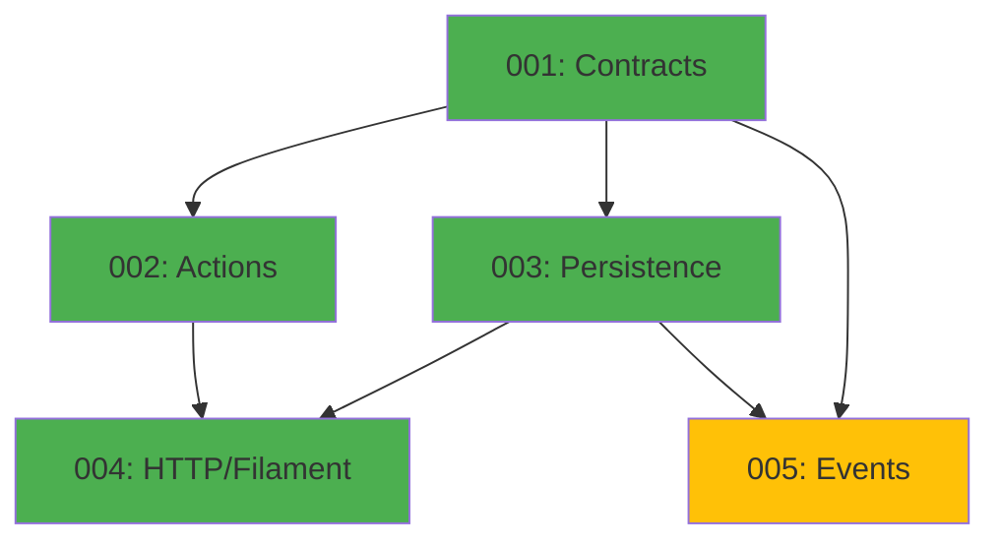

# Auth Module - Implementation Tasks

## Overview

This directory contains the implementation tasks for the **Auth Module** (Authentication), organized following the agent-based architecture.

**Module Type:** TRANSVERSAL  
**Phase:** Fase 1 - Fundamentos  
**Priority:** HIGH (blocking for all backoffice functionality)

## Task List

### Task 001: Contracts, Data, VOs and Enums
**File:** `001-contracts.md`  
**Agent:** Agente A - Contratos, Data, VOs y Enums  
**Priority:** HIGH  
**Estimated Time:** 4 hours  
**Dependencies:** None  
**Status:** Pending

**Deliverables:**
- Value Object: `Email` (with Wireable)
- Data Object: `AuthenticateData`
- Data Object: `AuthResult`
- Unit tests for all VOs and DTOs

---

### Task 002: Actions and Business Logic
**File:** `002-actions.md`  
**Agent:** Agente B - Actions y Tests Unitarios  
**Priority:** HIGH  
**Estimated Time:** 6 hours  
**Dependencies:** 001-contracts  
**Status:** Pending

**Deliverables:**
- Action Command: `AuthenticateMerchantAction`
- Action Command: `LogoutMerchantAction`
- Action Query: `ValidateCredentialsAction`
- Domain exceptions: `InvalidCredentialsException`
- Feature tests for all Actions

---

### Task 003: Model, Migrations and Persistence
**File:** `003-persistence.md`  
**Agent:** Agente C - Repositorios, Modelos y Persistencia  
**Priority:** HIGH  
**Estimated Time:** 5 hours  
**Dependencies:** 001-contracts  
**Status:** Pending

**Deliverables:**
- Eloquent Model: `User` (implements FilamentUser)
- Eloquent Cast: `EmailCast`
- Migration: `create_users_table`
- Migration: `create_sessions_table`
- Factory: `UserFactory` (with states)
- Database integration tests

---

### Task 004: Filament Integration and Feature Tests
**File:** `004-http-filament.md`  
**Agent:** Agente D - HTTP, Livewire/Volt, Filament y Tests Feature  
**Priority:** HIGH  
**Estimated Time:** 6 hours  
**Dependencies:** 001-contracts, 002-actions, 003-persistence  
**Status:** Pending

**Deliverables:**
- Filament auth configuration
- Custom Login page (optional)
- Rate limiting configuration
- Session security setup
- Complete feature tests (login, logout, rate limiting)
- Smoke tests for Filament pages

---

### Task 005: Domain Events and Auditing
**File:** `005-events.md`  
**Agent:** Agente E - Events, Listeners y Jobs  
**Priority:** MEDIUM  
**Estimated Time:** 3 hours  
**Dependencies:** 001-contracts, 003-persistence  
**Status:** Pending

**Deliverables:**
- Event: `UserLoginEvent`
- Event: `UserLogoutEvent`
- Event dispatch tests
- **Note:** Listeners not implemented in MVP (prepared for future)

---

## Dependency Graph



## Execution Order

### Recommended Sequence:
1. **Task 001** (Contracts) - Foundation layer
2. **Task 002** (Actions) and **Task 003** (Persistence) - Can run in parallel
3. **Task 004** (HTTP/Filament) - Requires 001, 002, 003
4. **Task 005** (Events) - Optional in MVP, can run in parallel with others

### Parallel Execution:
- Tasks 002 and 003 can be executed simultaneously
- Task 005 can start once 001 and 003 are complete

## Quality Gates

Each task must pass:
- [ ] PHPStan level 6+ without errors
- [ ] Pint (PSR-12) formatting applied
- [ ] Test coverage: 100% for critical paths
- [ ] All tests passing (Pest 4)
- [ ] Documentation complete (docblocks)

## Validation Commands

```bash
# Run all Auth module tests
./vendor/bin/sail test tests/Unit/Auth tests/Feature/Auth

# Static analysis
./vendor/bin/sail composer run phpstan -- --paths=Modules/Auth,app/Models/User.php,app/Casts

# Code formatting
./vendor/bin/sail bin pint Modules/Auth app/Models/User.php app/Casts

# Rector refactoring
./vendor/bin/sail composer run rector -- --paths=Modules/Auth

# Run migrations
./vendor/bin/sail artisan migrate:fresh --seed
```

## Environment Setup

Required `.env` configuration:

```env
# Session Configuration
SESSION_DRIVER=database
SESSION_LIFETIME=120
SESSION_ENCRYPT=false
SESSION_SECURE_COOKIE=false  # true in production
SESSION_SAME_SITE=lax

# Auth Rate Limiting
AUTH_RATE_LIMIT=5
AUTH_RATE_DECAY=1
```

## Module Structure

```
Modules/Auth/
├── App/
│   ├── Actions/
│   │   ├── AuthenticateMerchantAction.php
│   │   ├── LogoutMerchantAction.php
│   │   └── ValidateCredentialsAction.php
│   ├── Data/
│   │   ├── AuthenticateData.php
│   │   └── AuthResult.php
│   ├── Events/
│   │   ├── UserLoginEvent.php
│   │   └── UserLogoutEvent.php
│   └── Exceptions/
│       └── InvalidCredentialsException.php
├── ValueObjects/
│   └── Email.php
└── Tests/
    ├── Unit/
    │   ├── ValueObjects/
    │   │   └── EmailTest.php
    │   └── Data/
    │       ├── AuthenticateDataTest.php
    │       └── AuthResultTest.php
    └── Feature/
        ├── Actions/
        │   ├── AuthenticateMerchantActionTest.php
        │   ├── LogoutMerchantActionTest.php
        │   └── ValidateCredentialsActionTest.php
        └── Events/
            └── AuthEventsTest.php

app/
├── Models/
│   └── User.php
├── Casts/
│   └── EmailCast.php
└── Filament/
    └── Pages/
        └── Auth/
            └── Login.php

database/
├── factories/
│   └── UserFactory.php
└── migrations/
    ├── 2024_01_01_000000_create_users_table.php
    └── 2024_01_01_000001_create_sessions_table.php

tests/
├── Unit/
│   ├── Models/
│   │   └── UserTest.php
│   ├── Casts/
│   │   └── EmailCastTest.php
│   └── Factories/
│       └── UserFactoryTest.php
└── Feature/
    ├── Auth/
    │   ├── LoginTest.php
    │   ├── LogoutTest.php
    │   └── RateLimitingTest.php
    └── Database/
        └── UserMigrationTest.php
```

## References

- **Domain Model:** `@e-commerce-wa-ml/auth/domain_model.md`
- **Agents Prompt:** `@e-commerce-wa-ml/auth/agents_prompt.md`
- **Project Definition:** `@e-commerce-wa-ml/project_definition.md`
- **Modular Architecture:** `@e-commerce-wa-ml/modular-architecture.md`
- **Conventions:** `@laravel/conventions/conventions.md`
- **Value Objects Guide:** `@laravel/conventions/value-objects.md`

## Key Business Rules

### Authentication
1. Only merchants with valid credentials can access the backoffice
2. Email must be unique in the system
3. Passwords stored hashed with bcrypt (never plain text)
4. Sessions expire after 120 minutes of inactivity
5. System is single-tenant: one merchant per instance

### Session Management
1. Sessions stored in database for persistence
2. Remember token allows optional persistent sessions
3. On logout, remember token is revoked
4. Multiple simultaneous sessions allowed for same user

### Security
1. Rate limiting on login attempts (5 attempts per minute)
2. CSRF protection on all authentication forms
3. Sessions use httpOnly and secure cookies in production
4. SameSite=Lax for session cookies
5. Passwords must be minimum 8 characters

### Frontend
1. Public frontend (Livewire/Volt) does NOT require authentication
2. Auth module does NOT manage end users or customers
3. Only protects Filament backoffice routes

## Testing Strategy

### Unit Tests
- Email Value Object: validation, normalization, comparison
- DTOs: validation and construction
- EmailCast: bidirectional conversion
- Factory states: verified, unverified, tokens

### Feature Tests
- Successful login with valid credentials
- Failed login with invalid credentials
- Login with remember token
- Logout and session cleanup
- Rate limiting enforcement
- CSRF protection
- Session expiration
- Filament middleware protection

### Integration Tests
- Filament login page works correctly
- Dashboard only accessible with authentication
- Logout redirects to login
- Sessions persist in database

### Edge Cases
- Multiple login attempts with wrong credentials
- Concurrent sessions from same user
- Expired or invalid remember token
- User attempts access without valid session
- Invalid CSRF token in form

## Success Criteria

The Auth module implementation is complete when:

- [x] All 5 tasks are implemented and tested
- [x] PHPStan level 6+ passes without errors
- [x] Test coverage is 100% for critical paths
- [x] Pint formatting is applied consistently
- [x] Merchants can login and logout securely
- [x] Rate limiting blocks after 5 attempts
- [x] Sessions are secure and properly configured
- [x] Dashboard is protected and accessible only with auth
- [x] Documentation is complete and accurate

---

**Module Status:** Ready for Implementation  
**Last Updated:** 2025-12-19  
**Version:** 1.0
