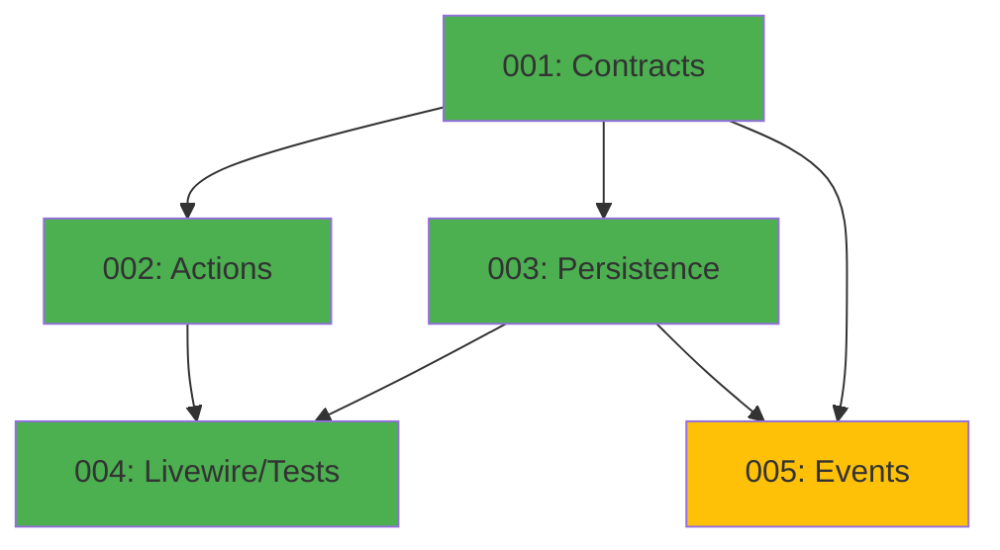

# Cart Module - Implementation Tasks

## Overview

This directory contains the implementation tasks for the **Cart Module** (Shopping Cart), organized following the agent-based architecture.

**Module Type:** CORE  
**Phase:** Fase 2 - MVP Funcional  
**Priority:** HIGH (critical for MVP)

## Task List

### Task 001: Contracts, Data, VOs and Enums
**File:** `001-contracts.md`  
**Agent:** Agente A - Contratos, Data, VOs y Enums  
**Priority:** HIGH  
**Estimated Time:** 8 hours  
**Dependencies:** None  
**Status:** Pending

**Deliverables:**
- Value Objects: `CartId`, `CartItemId`, `CustomerData`, `AddressData`, `ValidationResult`
- Enum: `PaymentMethodType`
- Eloquent Casts: `CartIdCast`, `CartItemIdCast`, `MoneyCast`, `QuantityCast`, `PhoneNumberCast`
- Data Objects: `CartData`, `CartItemData`, `CheckoutData`, `CartTotalsData`
- Unit tests for all VOs and DTOs

---

### Task 002: Actions and Business Logic
**File:** `002-actions.md`  
**Agent:** Agente B - Actions y Tests Unitarios  
**Priority:** HIGH  
**Estimated Time:** 10 hours  
**Dependencies:** 001-contracts  
**Status:** Pending

**Deliverables:**
- Action Commands: `AddItemToCartAction`, `RemoveItemFromCartAction`, `UpdateCartItemQuantityAction`, `ClearCartAction`, `ProcessCheckoutAction`
- Action Queries: `GetCartAction`, `CalculateCartTotalsAction`, `ValidateCartStockAction`
- Action Internal: `ApplyPromotionsAction`, `ReserveStockAction`, `ReleaseStockAction`
- Domain exceptions (8 custom exceptions)
- Unit tests with mocks for all Actions

---

### Task 003: Models, Repositories and Persistence
**File:** `003-persistence.md`  
**Agent:** Agente C - Repositorios, Modelos y Persistencia  
**Priority:** HIGH  
**Estimated Time:** 8 hours  
**Dependencies:** 001-contracts  
**Status:** Pending

**Deliverables:**
- Eloquent Models: `Cart`, `CartItem`
- Repositories: `CartRepository`, `CartItemRepository`
- Migrations: `create_carts_table`, `create_cart_items_table`
- Factories: `CartFactory`, `CartItemFactory`
- Database integration tests

---

### Task 004: Livewire Components and Feature Tests
**File:** `004-livewire-tests.md`  
**Agent:** Agente D - HTTP, Livewire/Volt, Filament y Tests Feature  
**Priority:** HIGH  
**Estimated Time:** 12 hours  
**Dependencies:** 001-contracts, 002-actions, 003-persistence  
**Status:** Pending

**Deliverables:**
- Livewire Components: `CartComponent`, `CheckoutComponent`, `AddToCartButton`
- Volt Pages: `cart.blade.php`, `checkout.blade.php`
- Routes: `/cart`, `/checkout`
- Feature Tests: Cart management, Checkout flow, Stock validation, Promotions
- Smoke tests for all pages

---

### Task 005: Domain Events and Listeners
**File:** `005-events.md`  
**Agent:** Agente E - Events, Listeners y Jobs  
**Priority:** MEDIUM  
**Estimated Time:** 6 hours  
**Dependencies:** 001-contracts, 003-persistence  
**Status:** Pending

**Deliverables:**
- Events: `CartCreated`, `ItemAddedToCart`, `ItemRemovedFromCart`, `ItemQuantityUpdated`, `CheckoutStarted`, `CheckoutCompleted`, `CheckoutFailed`
- Listeners: `ClearCartAfterCheckout`, `ReleaseStockOnFailure`
- Event dispatch tests

---

## Dependency Graph



## Execution Order

### Recommended Sequence:
1. **Task 001** (Contracts) - Foundation layer
2. **Task 002** (Actions) and **Task 003** (Persistence) - Can run in parallel
3. **Task 004** (Livewire/Tests) - Requires 001, 002, 003
4. **Task 005** (Events) - Can run in parallel with others after 001, 003

### Parallel Execution:
- Tasks 002 and 003 can be executed simultaneously
- Task 005 can start once 001 and 003 are complete

## Quality Gates

Each task must pass:
- [ ] PHPStan level 6+ without errors
- [ ] Pint (PSR-12) formatting applied
- [ ] Test coverage: 100% for critical paths
- [ ] All tests passing (Pest 4)
- [ ] Documentation complete (docblocks)

## Validation Commands

```bash
# Run all Cart module tests
./vendor/bin/sail test Modules/Cart

# Static analysis
./vendor/bin/sail composer run phpstan -- --paths=Modules/Cart

# Code formatting
./vendor/bin/sail bin pint Modules/Cart

# Rector refactoring
./vendor/bin/sail composer run rector -- --paths=Modules/Cart

# Run migrations
./vendor/bin/sail artisan migrate
```

## Module Structure

```
Modules/Cart/
├── Contracts/                 # Agent A
│   ├── Commands/
│   ├── Queries/
│   └── Data/
├── ValueObjects/              # Agent A
│   ├── CartId.php
│   ├── CartItemId.php
│   ├── CustomerData.php
│   ├── AddressData.php
│   └── ValidationResult.php
├── Enums/                     # Agent A
│   └── PaymentMethodType.php
├── Casts/                     # Agent A
│   ├── CartIdCast.php
│   ├── CartItemIdCast.php
│   ├── MoneyCast.php
│   ├── QuantityCast.php
│   └── PhoneNumberCast.php
├── Data/                      # Agent A
│   ├── CartData.php
│   ├── CartItemData.php
│   ├── CheckoutData.php
│   └── CartTotalsData.php
├── Actions/                   # Agent B
│   ├── Commands/
│   │   ├── AddItemToCartAction.php
│   │   ├── RemoveItemFromCartAction.php
│   │   ├── UpdateCartItemQuantityAction.php
│   │   ├── ClearCartAction.php
│   │   └── ProcessCheckoutAction.php
│   ├── Queries/
│   │   ├── GetCartAction.php
│   │   ├── CalculateCartTotalsAction.php
│   │   └── ValidateCartStockAction.php
│   └── Internal/
│       ├── ApplyPromotionsAction.php
│       ├── ReserveStockAction.php
│       └── ReleaseStockAction.php
├── Exceptions/                # Agent B
│   ├── CartNotFoundException.php
│   ├── CartItemNotFoundException.php
│   ├── InsufficientStockException.php
│   ├── MaxCartItemsExceededException.php
│   ├── InvalidQuantityException.php
│   ├── InvalidCheckoutDataException.php
│   ├── StockReservationFailedException.php
│   └── CartExpiredException.php
├── Models/                    # Agent C
│   ├── Cart.php
│   └── CartItem.php
├── Repositories/              # Agent C
│   ├── CartRepository.php
│   └── CartItemRepository.php
├── Database/                  # Agent C
│   ├── Factories/
│   │   ├── CartFactory.php
│   │   └── CartItemFactory.php
│   └── Migrations/
│       ├── xxxx_create_carts_table.php
│       └── xxxx_create_cart_items_table.php
├── Livewire/                  # Agent D
│   ├── CartComponent.php
│   ├── CheckoutComponent.php
│   └── AddToCartButton.php
├── routes/                    # Agent D
│   └── web.php
├── Events/                    # Agent E
│   ├── CartCreated.php
│   ├── ItemAddedToCart.php
│   ├── ItemRemovedFromCart.php
│   ├── ItemQuantityUpdated.php
│   ├── CheckoutStarted.php
│   ├── CheckoutCompleted.php
│   └── CheckoutFailed.php
├── Listeners/                 # Agent E
│   ├── ClearCartAfterCheckout.php
│   └── ReleaseStockOnFailure.php
└── Tests/
    ├── Unit/                  # Agent A + Agent B
    │   ├── ValueObjects/
    │   ├── Enums/
    │   ├── Casts/
    │   └── Actions/
    └── Feature/               # Agent D
        ├── CartManagementTest.php
        ├── CheckoutFlowTest.php
        ├── StockValidationTest.php
        └── PromotionApplicationTest.php
```

## References

- **Domain Model:** `@e-commerce-wa-ml/cart/domain_model.md`
- **Agents Prompt:** `@e-commerce-wa-ml/cart/agents_prompt.md`
- **Project Definition:** `@e-commerce-wa-ml/project_definition.md`
- **Modular Architecture:** `@e-commerce-wa-ml/modular-architecture.md`
- **Conventions:** `@laravel/conventions/conventions.md`
- **Value Objects Guide:** `@laravel/conventions/value-objects.md`

## Key Business Rules

### Cart Management
1. One cart per session (Laravel session ID)
2. Cart expires after 7 days of inactivity
3. Max 50 items per cart (configurable via env)
4. Max 9999 quantity per item (configurable via env)
5. Totals recalculated automatically on every change
6. Cart cleared after successful order creation

### Item Management
7. Product or variant must exist and be active
8. Stock validated before adding/updating quantity
9. Price snapshot taken at add time (not updated later)
10. If variant specified, use variant price/stock; otherwise use product
11. Only one promotion per item (best discount applied)
12. Cannot add same product/variant twice (update quantity instead)

### Stock Validation
13. Stock checked at: add to cart, update quantity, checkout start, order creation
14. Pessimistic locking during checkout (`SELECT FOR UPDATE`)
15. Stock lock timeout: 30 seconds
16. Stock released on checkout failure
17. Stock decremented atomically with order creation

### Promotion Application
18. Only one promotion per item
19. Promotion must be active and within validity dates
20. Promotion types: percentage discount or fixed price
21. Best discount wins if multiple promotions available
22. Promotions applied automatically on cart total calculation

### Checkout Process
23. Customer data required: name, phone, WhatsApp consent
24. Address required: street, number, city, state
25. Payment method required: Mercado Pago, Cash, or Transfer
26. Rate limiting: 5 attempts/hour per IP, 3 orders/hour per phone
27. Max 2 active orders per phone (configurable 2-5)
28. Captcha validation required
29. Stock revalidated before order creation
30. Checkout is atomic: stock + order creation in transaction

## Testing Strategy

### Unit Tests
- Value Objects: validation, normalization, behavior
- Enums: cases, labels, methods
- Casts: bidirectional conversion
- Actions: business logic with mocked dependencies

### Feature Tests
- Cart Management: add, remove, update, clear
- Checkout Flow: complete flow from cart to order
- Stock Validation: insufficient stock scenarios
- Promotions: automatic application
- Rate Limiting: enforcement
- Concurrent Purchases: pessimistic locking

### Integration Tests
- Database operations
- Cascade deletes
- Index performance
- Transaction rollbacks

### Edge Cases
- Max items limit exceeded
- Max quantity per item exceeded
- Cart expired during checkout
- Concurrent stock updates
- Promotion expiration during checkout
- Stock becomes unavailable during checkout

## Environment Configuration

Required `.env` variables:

```env
# Cart Configuration
CART_MAX_ITEMS=50
CART_MAX_ITEM_QUANTITY=9999
CART_EXPIRATION_DAYS=7

# Checkout Rate Limiting
CHECKOUT_RATE_LIMIT_IP=5
CHECKOUT_RATE_LIMIT_PHONE=3
MAX_ACTIVE_ORDERS_PER_PHONE=2

# Security
CAPTCHA_ENABLED=true
CAPTCHA_SITE_KEY=your-site-key
CAPTCHA_SECRET_KEY=your-secret-key
```

## Success Criteria

The Cart module implementation is complete when:

- [x] All 5 tasks are implemented and tested
- [x] PHPStan level 6+ passes without errors
- [x] Test coverage is 100% for critical paths
- [x] Pint formatting is applied consistently
- [x] Users can add products to cart
- [x] Cart persists across page refreshes
- [x] Checkout validates all fields
- [x] Stock validated at every step
- [x] Promotions applied automatically
- [x] Orders created successfully
- [x] Rate limiting blocks spam
- [x] Documentation is complete and accurate

---

**Module Status:** Ready for Implementation  
**Last Updated:** 2025-12-19  
**Version:** 1.0  
**Total Estimated Time:** 44 hours (distributed across 5 agents)
