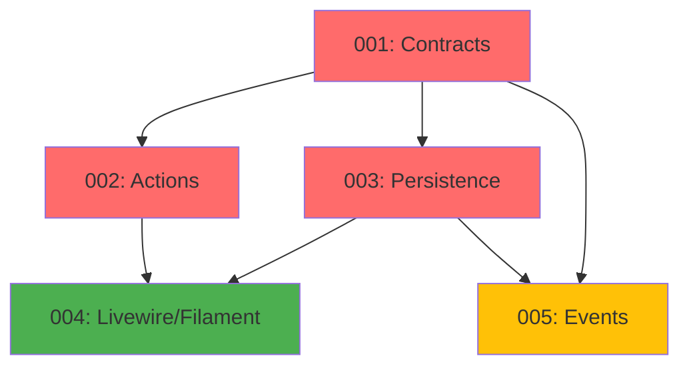

# Catalog Module - Implementation Tasks

## Overview

This directory contains the implementation tasks for the **Catalog Module** (Products, Categories, Variants, Promotions), organized following the agent-based architecture.

**Module Type:** CORE  
**Phase:** Fase 1 - Fundamentos  
**Priority:** CRITICAL (foundational module, no dependencies)

## Task List

### Task 001: Contracts, Data, VOs and Enums
**File:** `001-contracts.md`  
**Agent:** Agente A - Contratos, Data, VOs y Enums  
**Priority:** CRITICAL  
**Estimated Time:** 10 hours  
**Dependencies:** None  
**Status:** Pending

**Deliverables:**
- Value Objects: `ProductId`, `CategoryId`, `VariantId`, `PromotionId`, `Money`, `Stock`, `Price`, `PromotionDiscount`, `DateRange`
- Enums: `PromotionType`, `StockLevel`
- Eloquent Casts: `ProductIdCast`, `CategoryIdCast`, `VariantIdCast`, `PromotionIdCast`, `MoneyCast`, `StockCast`
- Data Objects: `ProductData`, `CategoryData`, `VariantData`, `PromotionData`, `ProductListData`
- Unit tests for all VOs, enums, casts

---

### Task 002: Actions and Business Logic
**File:** `002-actions.md`  
**Agent:** Agente B - Actions y Tests Unitarios  
**Priority:** CRITICAL  
**Estimated Time:** 12 hours  
**Dependencies:** 001-contracts  
**Status:** Pending

**Deliverables:**
- Action Commands (9): CRUD for Product, Category, Variant
- Action Queries (8): Get, List, Search, Calculate price/stock
- Action Internal (3): Apply promotions, Validate stock, Emit events
- Domain exceptions (10): Not found, validation, business rule violations
- Unit tests with mocks for all Actions

---

### Task 003: Models, Repositories and Persistence
**File:** `003-persistence.md`  
**Agent:** Agente C - Repositorios, Modelos y Persistencia  
**Priority:** CRITICAL  
**Estimated Time:** 10 hours  
**Dependencies:** 001-contracts  
**Status:** Pending

**Deliverables:**
- Eloquent Models: `Product`, `Category`, `ProductVariant`, `Promotion`
- Repositories: `ProductRepository`, `CategoryRepository`, `VariantRepository`, `PromotionRepository`
- Migrations: 4 tables with indexes, FKs, constraints
- Factories: 4 factories with states (active, inactive, with_variants, etc.)
- Database integration tests

---

### Task 004: Livewire, Filament and Feature Tests
**File:** `004-livewire-filament.md`  
**Agent:** Agente D - HTTP, Livewire/Volt, Filament y Tests Feature  
**Priority:** HIGH  
**Estimated Time:** 14 hours  
**Dependencies:** 001-contracts, 002-actions, 003-persistence  
**Status:** Pending

**Deliverables:**
- Livewire Components: `ProductListComponent`, `ProductDetailComponent`, `CategoryFilterComponent`
- Volt Pages: `products/index.blade.php`, `products/show.blade.php`
- Routes: `/products`, `/products/{id}`, `/categories/{id}/products`
- Filament Resources: `ProductResource`, `CategoryResource`, `PromotionResource`
- Filament Widgets: `ProductStatsWidget`, `CategoryStatsWidget`
- Feature Tests: Public catalog, Backoffice CRUD, Promotions, Stock, Search/Filter, Smoke tests

---

### Task 005: Domain Events and Listeners
**File:** `005-events.md`  
**Agent:** Agente E - Events, Listeners y Jobs  
**Priority:** MEDIUM  
**Estimated Time:** 6 hours  
**Dependencies:** 001-contracts, 003-persistence  
**Status:** Pending

**Deliverables:**
- Events: `ProductCreated`, `ProductUpdated`, `ProductDeleted`, `ProductStockLowEvent`, `ProductOutOfStockEvent`
- Listeners: `NotifyLowStockListener` (queued)
- Event dispatch tests

---

## Dependency Graph



**Legend:**
- 🔴 Red (CRITICAL): Blocking for other modules
- 🟢 Green (HIGH): Required for MVP
- 🟡 Yellow (MEDIUM): Nice to have, future enhancements

## Execution Order

### Recommended Sequence:
1. **Task 001** (Contracts) - Foundation layer [10h]
2. **Task 002** (Actions) and **Task 003** (Persistence) - Can run in parallel [12h + 10h = 22h combined, ~12h with parallelization]
3. **Task 004** (Livewire/Filament) - Requires 001, 002, 003 [14h]
4. **Task 005** (Events) - Can run in parallel with Task 004 after 001, 003 [6h]

### Total Time:
- **Sequential:** 52 hours
- **With parallelization:** ~42 hours

## Quality Gates

Each task must pass:
- [ ] PHPStan level 6+ without errors
- [ ] Pint (PSR-12) formatting applied
- [ ] Test coverage: 100% for critical paths
- [ ] All tests passing (Pest 4)
- [ ] Documentation complete (docblocks)

## Validation Commands

```bash
# Run all Catalog module tests
./vendor/bin/sail test Modules/Catalog

# Static analysis
./vendor/bin/sail composer run phpstan -- --paths=Modules/Catalog

# Code formatting
./vendor/bin/sail bin pint Modules/Catalog

# Rector refactoring
./vendor/bin/sail composer run rector -- --paths=Modules/Catalog

# Run migrations
./vendor/bin/sail artisan migrate
```

## Module Structure

```
Modules/Catalog/
├── Contracts/                 # Agent A
│   ├── Commands/
│   ├── Queries/
│   └── Data/
├── ValueObjects/              # Agent A
│   ├── ProductId.php
│   ├── CategoryId.php
│   ├── VariantId.php
│   ├── PromotionId.php
│   ├── Money.php (shared)
│   ├── Stock.php
│   ├── Price.php
│   ├── PromotionDiscount.php
│   └── DateRange.php
├── Enums/                     # Agent A
│   ├── PromotionType.php
│   └── StockLevel.php
├── Casts/                     # Agent A
│   ├── ProductIdCast.php
│   ├── CategoryIdCast.php
│   ├── VariantIdCast.php
│   ├── PromotionIdCast.php
│   ├── MoneyCast.php (shared)
│   └── StockCast.php
├── Data/                      # Agent A
│   ├── ProductData.php
│   ├── CategoryData.php
│   ├── VariantData.php
│   ├── PromotionData.php
│   └── ProductListData.php
├── Actions/                   # Agent B
│   ├── Commands/
│   │   ├── CreateProductAction.php
│   │   ├── UpdateProductAction.php
│   │   ├── DeleteProductAction.php
│   │   ├── CreateCategoryAction.php
│   │   ├── UpdateCategoryAction.php
│   │   ├── DeleteCategoryAction.php
│   │   ├── CreateVariantAction.php
│   │   ├── UpdateVariantAction.php
│   │   └── DeleteVariantAction.php
│   ├── Queries/
│   │   ├── GetProductAction.php
│   │   ├── ListProductsAction.php
│   │   ├── GetCategoryAction.php
│   │   ├── ListCategoriesAction.php
│   │   ├── SearchProductsAction.php
│   │   ├── GetProductVariantsAction.php
│   │   ├── CheckStockAvailabilityAction.php
│   │   └── CalculateEffectivePriceAction.php
│   └── Internal/
│       ├── ApplyBestPromotionAction.php
│       ├── ValidateStockLevelAction.php
│       └── EmitStockEventsAction.php
├── Exceptions/                # Agent B
│   ├── ProductNotFoundException.php
│   ├── CategoryNotFoundException.php
│   ├── VariantNotFoundException.php
│   ├── PromotionNotFoundException.php
│   ├── DuplicateProductNameException.php
│   ├── CategoryHasProductsException.php
│   ├── InvalidPriceException.php
│   ├── InvalidStockException.php
│   ├── InactiveProductException.php
│   └── PromotionExpiredException.php
├── Models/                    # Agent C
│   ├── Product.php
│   ├── Category.php
│   ├── ProductVariant.php
│   └── Promotion.php
├── Repositories/              # Agent C
│   ├── ProductRepository.php
│   ├── CategoryRepository.php
│   ├── VariantRepository.php
│   └── PromotionRepository.php
├── Database/                  # Agent C
│   ├── Factories/
│   │   ├── ProductFactory.php
│   │   ├── CategoryFactory.php
│   │   ├── ProductVariantFactory.php
│   │   └── PromotionFactory.php
│   └── Migrations/
│       ├── xxxx_create_categories_table.php
│       ├── xxxx_create_products_table.php
│       ├── xxxx_create_product_variants_table.php
│       └── xxxx_create_promotions_table.php
├── Livewire/                  # Agent D
│   ├── ProductListComponent.php
│   ├── ProductDetailComponent.php
│   └── CategoryFilterComponent.php
├── Filament/                  # Agent D
│   ├── Resources/
│   │   ├── ProductResource.php
│   │   ├── CategoryResource.php
│   │   └── PromotionResource.php
│   └── Widgets/
│       ├── ProductStatsWidget.php
│       └── CategoryStatsWidget.php
├── routes/                    # Agent D
│   └── web.php
├── Events/                    # Agent E
│   ├── ProductCreated.php
│   ├── ProductUpdated.php
│   ├── ProductDeleted.php
│   ├── ProductStockLowEvent.php
│   └── ProductOutOfStockEvent.php
├── Listeners/                 # Agent E
│   └── NotifyLowStockListener.php
└── Tests/
    ├── Unit/                  # Agent A + Agent B
    │   ├── ValueObjects/
    │   ├── Enums/
    │   ├── Casts/
    │   └── Actions/
    └── Feature/               # Agent D
        ├── PublicCatalogTest.php
        ├── BackofficeCRUDTest.php
        ├── PromotionApplicationTest.php
        ├── StockDisplayTest.php
        ├── SearchAndFilterTest.php
        └── SmokeTest.php
```

## References

- **Agents Prompt:** `@e-commerce-wa-ml/catalog/agents_prompt.md`
- **Project Definition:** `@e-commerce-wa-ml/project_definition.md`
- **Modular Architecture:** `@e-commerce-wa-ml/modular-architecture.md`
- **Conventions:** `@laravel/conventions/conventions.md`
- **Value Objects Guide:** `@laravel/conventions/value-objects.md`

## Key Business Rules

### Product Management (Rules 1-8)
1. Product must have unique name per merchant
2. Product must belong to exactly one category
3. Product price must be > 0
4. Product stock must be >= 0
5. Inactive products hidden from public catalog
6. Inactive products cannot be added to cart
7. Product without variants uses its own price and stock
8. Product with variants uses variant price and stock

### Variant Management (Rules 9-14)
9. Variant must belong to a product
10. Variant must have unique name within product
11. Variant price overrides product price
12. Variant stock is independent from product stock
13. Variant can be inactive (hidden)
14. Deleting product cascades to variants

### Category Management (Rules 15-18)
15. Category must have unique name
16. Category can be inactive (hidden)
17. Cannot delete category with products
18. One product belongs to one category only

### Promotion Management (Rules 19-26)
19. Promotion has two types: percentage discount or fixed price
20. Promotion must have validity dates (start/end)
21. Promotion applies to one product
22. Only one promotion per product
23. Best discount wins if multiple promotions valid
24. Expired promotions not applied
25. Inactive promotions not applied
26. Promotions calculated automatically on price display

### Stock Management (Rules 27-31)
27. Stock levels: OUT_OF_STOCK (0), LOW_STOCK (< threshold), IN_STOCK
28. Low stock threshold configurable (default: 10)
29. Negative stock not allowed
30. Stock events emitted when threshold crossed
31. Variant stock independent from product stock

## Testing Strategy

### Unit Tests
- Value Objects: validation, normalization, behavior
- Enums: cases, labels, methods
- Casts: bidirectional conversion
- Actions: business logic with mocked dependencies
- Promotion calculation algorithms
- Stock level determination

### Feature Tests
- Public Catalog: display, filtering, search
- Backoffice CRUD: all entities, validations
- Promotion Application: percentage, fixed price, expiration
- Stock Display: labels, thresholds
- Search and Filter: combinations
- Smoke Tests: all pages load

### Integration Tests
- Database operations
- Cascade deletes
- Unique constraints
- Foreign key constraints
- Index performance

### Edge Cases
- Duplicate product names
- Category delete with products
- Variant without product
- Multiple promotions (best wins)
- Expired promotions
- Stock at threshold boundaries
- Inactive products in cart attempt

## Environment Configuration

Required `.env` variables:

```env
# Stock Configuration
STOCK_LOW_THRESHOLD=10

# Pagination
PRODUCTS_PER_PAGE=20
CATEGORIES_PER_PAGE=50
```

## Success Criteria

The Catalog module implementation is complete when:

- [x] All 5 tasks are implemented and tested
- [x] PHPStan level 6+ passes without errors
- [x] Test coverage is 100% for critical paths
- [x] Pint formatting is applied consistently
- [x] Merchants can manage categories in Filament
- [x] Merchants can manage products with variants
- [x] Merchants can create promotions
- [x] Users can browse active products
- [x] Users can filter by category
- [x] Users can search products
- [x] Promotions displayed correctly
- [x] Stock availability labeled correctly
- [x] Low stock events emitted
- [x] Documentation is complete and accurate

---

**Module Status:** Ready for Implementation  
**Last Updated:** 2025-12-19  
**Version:** 1.0  
**Total Estimated Time:** 52 hours (42 hours with parallelization)

## Impact on Other Modules

**Blocks:**
- Cart module (needs products, stock validation)
- Orders module (needs products, pricing)
- Reports module (needs products, categories data)

**Critical Path:**
This is the first module to implement. No other module can progress without Catalog foundation.
