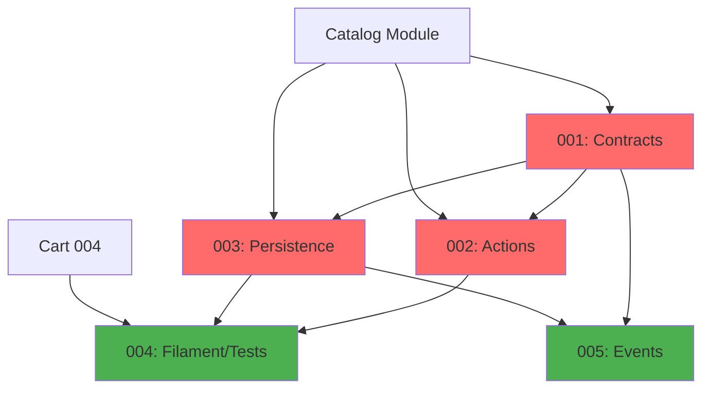

# Orders Module - Implementation Tasks

## Overview

This directory contains the implementation tasks for the **Orders Module** (Order Management), organized following the agent-based architecture.

**Module Type:** CORE  
**Phase:** Fase 2 - MVP Funcional  
**Priority:** CRITICAL (most complex module, orchestrates entire purchase flow)

## Task List

### Task 001: Contracts, Data, VOs and Enums
**File:** `001-contracts.md`  
**Agent:** Agente A - Contratos, Data, VOs y Enums  
**Priority:** CRITICAL  
**Estimated Time:** 12 hours  
**Dependencies:** catalog-001-contracts  
**Status:** Pending

**Deliverables:**
- Value Objects: `OrderId`, `OrderNumber`, `OrderItemId`, `CustomerData`, `AddressData`, `PhoneNumber`, `Money`, `Quantity`, `OrderTotals`, `ValidationResult`
- Enums: `OrderStatus` (6 states with state machine), `PaymentStatus` (3 states)
- Eloquent Casts: 7 casts for all VOs
- Data Objects: `OrderData`, `OrderItemData`, `CreateOrderData`, `UpdateOrderData`, `OrderSummaryData`, `OrderStatusChangeData`
- Unit tests for all VOs, enums (state machine), casts

---

### Task 002: Actions and Business Logic
**File:** `002-actions.md`  
**Agent:** Agente B - Actions y Tests Unitarios  
**Priority:** CRITICAL  
**Estimated Time:** 16 hours  
**Dependencies:** 001-contracts, catalog-002-actions, catalog-003-persistence  
**Status:** Pending

**Deliverables:**
- Action Commands (8): Create, Update, Change statuses, Cancel, Update quantities, Add notes, Release stock
- Action Queries (6): Get, List, Count active, Validate editable, Calculate totals
- Action Internal (5): Stock validation/reservation, Status validation, Active limit, Audit log
- Domain exceptions (12): Not found, validation, business rule violations
- Unit tests with mocks for all Actions
- **Critical:** Pessimistic locking, transaction handling, concurrent access tests

---

### Task 003: Models, Repositories and Persistence
**File:** `003-persistence.md`  
**Agent:** Agente C - Repositorios, Modelos y Persistencia  
**Priority:** CRITICAL  
**Estimated Time:** 12 hours  
**Dependencies:** 001-contracts, catalog-003-persistence  
**Status:** Pending

**Deliverables:**
- Eloquent Models: `Order`, `OrderItem`, `Address`, `OrderStatusLog`
- Repositories: 4 repositories with transaction support and pessimistic locking
- Migrations: 4 tables with indexes, FKs, constraints, audit trail
- Factories: 4 factories with states (new, confirmed, delivered, cancelled, with_items)
- Database integration tests with locking and concurrent access scenarios

---

### Task 004: Filament Resources and Feature Tests
**File:** `004-filament-tests.md`  
**Agent:** Agente D - HTTP, Livewire/Volt, Filament y Tests Feature  
**Priority:** HIGH  
**Estimated Time:** 14 hours  
**Dependencies:** 001-contracts, 002-actions, 003-persistence, cart-004-livewire-tests  
**Status:** Pending

**Deliverables:**
- Filament Resource: `OrderResource` (view, edit with validation, table with filters, custom actions)
- Filament Widgets: `OrderStatsWidget`, `RecentOrdersWidget`, `PendingOrdersWidget`
- **Note:** NO public UI (orders created from Cart checkout)
- Feature Tests (8): Order creation, Editing, Status transitions, Stock management, Anti-abuse, Audit trail, Backoffice
- Complete test coverage of critical flows

---

### Task 005: Domain Events and Listeners
**File:** `005-events.md`  
**Agent:** Agente E - Events, Listeners y Jobs  
**Priority:** HIGH  
**Estimated Time:** 8 hours  
**Dependencies:** 001-contracts, 003-persistence  
**Status:** Pending

**Deliverables:**
- Events (10): Order lifecycle, Status changes, Stock operations, Notes
- Listeners (5): WhatsApp notifications, Stock release, Audit logs, Totals recalculation
- Critical listeners: synchronous, transactional
- Notification listeners: queued, retryable, idempotent
- Event dispatch and listener execution tests

---

## Dependency Graph



**Legend:**
- 🔴 Red (CRITICAL): Blocking for checkout flow
- 🟢 Green (HIGH): Required for MVP completion

## Execution Order

### Recommended Sequence:
1. **Task 001** (Contracts) - After Catalog 001 complete [12h]
2. **Task 002** (Actions) and **Task 003** (Persistence) - After Catalog 002-003, can run in parallel [~16h combined]
3. **Task 004** (Filament/Tests) - After Cart 004 complete, requires 001, 002, 003 [14h]
4. **Task 005** (Events) - Can run in parallel with Task 004 after 001, 003 [8h]

### Total Time:
- **Sequential:** 62 hours
- **With parallelization:** ~50 hours

## Quality Gates

Each task must pass:
- [ ] PHPStan level 6+ without errors
- [ ] Pint (PSR-12) formatting applied
- [ ] Test coverage: 100% for critical paths (stock, transitions, concurrency)
- [ ] All tests passing (Pest 4)
- [ ] Transaction handling verified
- [ ] Pessimistic locking tested
- [ ] Concurrent access tested
- [ ] Documentation complete (docblocks)

## Validation Commands

```bash
# Run all Orders module tests
./vendor/bin/sail test Modules/Orders

# Static analysis
./vendor/bin/sail composer run phpstan -- --paths=Modules/Orders

# Code formatting
./vendor/bin/sail bin pint Modules/Orders

# Rector refactoring
./vendor/bin/sail composer run rector -- --paths=Modules/Orders

# Run migrations
./vendor/bin/sail artisan migrate
```

## Module Structure

```
Modules/Orders/
├── Contracts/                 # Agent A
├── ValueObjects/              # Agent A
│   ├── OrderId.php
│   ├── OrderNumber.php
│   ├── OrderItemId.php
│   ├── CustomerData.php
│   ├── AddressData.php
│   ├── PhoneNumber.php (shared)
│   ├── Money.php (shared)
│   ├── Quantity.php (shared)
│   ├── OrderTotals.php
│   └── ValidationResult.php (shared)
├── Enums/                     # Agent A
│   ├── OrderStatus.php
│   └── PaymentStatus.php
├── Casts/                     # Agent A
│   ├── OrderIdCast.php
│   ├── OrderNumberCast.php
│   ├── OrderItemIdCast.php
│   ├── CustomerDataCast.php
│   ├── AddressDataCast.php
│   ├── PhoneNumberCast.php (shared)
│   └── MoneyCast.php (shared)
├── Data/                      # Agent A
│   ├── OrderData.php
│   ├── OrderItemData.php
│   ├── CreateOrderData.php
│   ├── UpdateOrderData.php
│   ├── OrderSummaryData.php
│   └── OrderStatusChangeData.php
├── Actions/                   # Agent B
│   ├── Commands/
│   │   ├── CreateOrderAction.php
│   │   ├── UpdateOrderAction.php
│   │   ├── ChangeOrderStatusAction.php
│   │   ├── ChangePaymentStatusAction.php
│   │   ├── CancelOrderAction.php
│   │   ├── UpdateOrderItemQuantityAction.php
│   │   ├── AddNoteToOrderAction.php
│   │   └── ReleaseOrderStockAction.php
│   ├── Queries/
│   │   ├── GetOrderAction.php
│   │   ├── ListOrdersAction.php
│   │   ├── GetOrdersByPhoneAction.php
│   │   ├── CountActiveOrdersByPhoneAction.php
│   │   ├── ValidateOrderEditableAction.php
│   │   └── CalculateOrderTotalsAction.php
│   └── Internal/
│       ├── ValidateStockForOrderAction.php
│       ├── ReserveStockForOrderAction.php
│       ├── ValidateOrderStatusTransitionAction.php
│       ├── ValidateActiveOrdersLimitAction.php
│       └── CreateOrderAuditLogAction.php
├── Exceptions/                # Agent B
│   ├── OrderNotFoundException.php
│   ├── OrderItemNotFoundException.php
│   ├── OrderNotEditableException.php
│   ├── InvalidOrderStatusTransitionException.php
│   ├── InvalidPaymentStatusTransitionException.php
│   ├── InsufficientStockException.php
│   ├── StockReservationFailedException.php
│   ├── ActiveOrdersLimitExceededException.php
│   ├── CannotModifyHistoricalPriceException.php
│   ├── CannotAddRemoveProductsException.php
│   ├── OrderAlreadyCancelledException.php
│   └── InvalidOrderDataException.php
├── Models/                    # Agent C
│   ├── Order.php
│   ├── OrderItem.php
│   ├── Address.php
│   └── OrderStatusLog.php
├── Repositories/              # Agent C
│   ├── OrderRepository.php
│   ├── OrderItemRepository.php
│   ├── AddressRepository.php
│   └── OrderStatusLogRepository.php
├── Database/                  # Agent C
│   ├── Factories/
│   │   ├── OrderFactory.php
│   │   ├── OrderItemFactory.php
│   │   ├── AddressFactory.php
│   │   └── OrderStatusLogFactory.php
│   └── Migrations/
│       ├── xxxx_create_orders_table.php
│       ├── xxxx_create_order_items_table.php
│       ├── xxxx_create_addresses_table.php
│       └── xxxx_create_order_status_logs_table.php
├── Filament/                  # Agent D
│   ├── Resources/
│   │   └── OrderResource.php
│   └── Widgets/
│       ├── OrderStatsWidget.php
│       ├── RecentOrdersWidget.php
│       └── PendingOrdersWidget.php
├── Events/                    # Agent E
│   ├── OrderCreated.php
│   ├── OrderUpdated.php
│   ├── OrderStatusChanged.php
│   ├── PaymentStatusChanged.php
│   ├── OrderCancelled.php
│   ├── OrderDelivered.php
│   ├── OrderItemQuantityUpdated.php
│   ├── StockReservedForOrder.php
│   ├── StockReleasedForOrder.php
│   └── OrderNoteAdded.php
├── Listeners/                 # Agent E
│   ├── SendOrderWhatsAppNotificationListener.php
│   ├── SendStatusChangeWhatsAppNotificationListener.php
│   ├── ReleaseStockOnCancellationListener.php
│   ├── CreateOrderAuditLogListener.php
│   └── RecalculateOrderTotalsListener.php
└── Tests/
    ├── Unit/                  # Agent A + Agent B
    │   ├── ValueObjects/
    │   ├── Enums/
    │   ├── Casts/
    │   └── Actions/
    └── Feature/               # Agent D
        ├── OrderCreationTest.php
        ├── OrderEditingTest.php
        ├── OrderStatusTransitionTest.php
        ├── PaymentStatusTest.php
        ├── StockManagementTest.php
        ├── AntiAbuseTest.php
        ├── AuditTrailTest.php
        └── BackofficeTest.php
```

## References

- **Agents Prompt:** `@e-commerce-wa-ml/orders/agents_prompt.md` (1,121 lines)
- **Domain Model:** `@e-commerce-wa-ml/orders/domain_model.md` (953 lines)
- **Project Definition:** `@e-commerce-wa-ml/project_definition.md`
- **Modular Architecture:** `@e-commerce-wa-ml/modular-architecture.md`
- **Conventions:** `@laravel/conventions/conventions.md`

## Key Business Rules (31 Total)

### Order Creation (Rules 1-10)
1. Stock validated transactionally (pessimistic lock)
2. Stock reserved atomically with order creation
3. Historical prices saved (never change)
4. Order number format: ORD-YYYYMMDD-{seq}
5. Max N active orders per phone (default: 2, configurable)
6. Rate limiting: 3 orders/hour per phone
7. All operations in database transaction
8. Stock lock timeout: 30 seconds
9. Stock released on any failure
10. Order created in NEW status, payment PENDING

### Order Editing (Rules 11-18)
11. Cannot edit if status DELIVERED or REFUNDED
12. Can edit: address, phone, observations, item quantities, payment method
13. Cannot edit: customer name, add/remove products, prices
14. Quantity changes require stock validation
15. Totals recalculated automatically
16. Audit log created for every edit
17. Status changes require valid transitions
18. Stock released if order CANCELLED or REJECTED

### Status Transitions (Rules 19-26)
19. OrderStatus state machine enforced
20. PaymentStatus independent from OrderStatus
21. Valid transitions defined in state machine
22. Cannot transition from terminal states
23. Audit log for every status change
24. Stock released on CANCELLED/REJECTED
25. Events emitted on every transition
26. Terminal states: DELIVERED, REJECTED, CANCELLED, REFUNDED

### Anti-Abuse (Rules 27-31)
27. Active orders = NEW | CONFIRMED | IN_DELIVERY
28. Max active orders per phone configurable
29. Phone normalized before validation
30. Rate limiting by phone number
31. Captcha validation on order creation

## Testing Strategy

### Unit Tests
- Value Objects: validation, normalization
- Enums: state machine transitions
- Casts: bidirectional conversion
- Actions: business logic with mocked dependencies
- State machine: all valid and invalid transitions

### Feature Tests
- Order Creation: full flow with stock reservation
- Order Editing: allowed/blocked scenarios
- Status Transitions: valid/invalid, audit trails
- Stock Management: reservation, release, concurrent access
- Anti-Abuse: limits, rate limiting
- Audit Trail: completeness, immutability
- Backoffice: full CRUD workflow

### Integration Tests
- Database transactions
- Pessimistic locking
- Concurrent access (multiple users)
- Deadlock handling
- Stock consistency

### Edge Cases
- Concurrent order creation (same product)
- Stock becomes unavailable during checkout
- Order cancellation during status change
- Multiple simultaneous status changes
- Quantity update exceeds stock
- Active orders limit reached

## Environment Configuration

Required `.env` variables:

```env
# Order Configuration
MAX_ACTIVE_ORDERS_PER_PHONE=2
ORDER_STOCK_LOCK_TIMEOUT=30

# Rate Limiting
ORDER_RATE_LIMIT_PER_PHONE=3
ORDER_RATE_LIMIT_WINDOW=60

# Stock
STOCK_PESSIMISTIC_LOCK_TIMEOUT=30
STOCK_DEADLOCK_MAX_RETRIES=3
```

## Success Criteria

The Orders module implementation is complete when:

- [x] All 5 tasks are implemented and tested
- [x] PHPStan level 6+ passes without errors
- [x] Test coverage is 100% for critical paths
- [x] Pint formatting is applied consistently
- [x] Orders can be created from Cart checkout
- [x] Stock is reserved transactionally
- [x] Status transitions follow state machine
- [x] Editing rules enforced correctly
- [x] Audit trail complete and immutable
- [x] Anti-abuse controls working
- [x] WhatsApp notifications sent
- [x] Concurrent access handled correctly
- [x] Merchants can manage orders in Filament
- [x] Documentation is complete and accurate

---

**Module Status:** Ready for Implementation  
**Last Updated:** 2025-12-19  
**Version:** 1.0  
**Total Estimated Time:** 62 hours (50 hours with parallelization)

## Impact on Other Modules

**Depends on:**
- Catalog module (products, variants, stock)
- Payments module (payment methods)
- Security module (rate limiting, active orders limit)

**Enables:**
- WhatsApp module (order notifications)
- Reports module (sales data)
- Complete purchase flow

**Critical Path:**
This is the CORE module that makes the e-commerce functional. Without Orders, there's no commerce.
