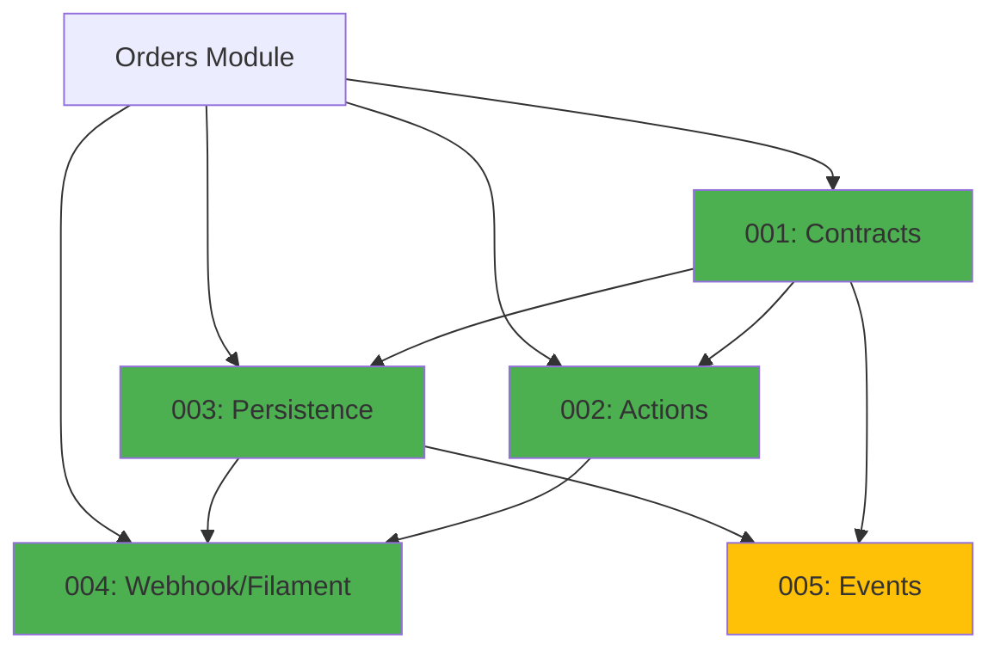

# Payments Module - Implementation Tasks

## Overview

This directory contains the implementation tasks for the **Payments Module** (Payment Processing & External Integrations), organized following the agent-based architecture.

**Module Type:** CORE  
**Phase:** Fase 3 - Integraciones  
**Priority:** HIGH (required for Mercado Pago integration and payment tracking)

## Task List

### Task 001: Contracts, Data, VOs and Enums
**File:** `001-contracts.md`  
**Agent:** Agente A - Contratos, Data, VOs y Enums  
**Priority:** HIGH  
**Estimated Time:** 8 hours  
**Dependencies:** orders-001-contracts  
**Status:** Pending

**Deliverables:**
- Value Objects: `PaymentId`, `TransactionId`, `PaymentLinkId`, `Money`, `PaymentLink`, `WebhookSignature`, `ExternalPaymentData`, `PaymentMetadata`
- Enums: `PaymentMethodType`, `PaymentStatus`, `PaymentProvider`
- Eloquent Casts: 6 casts for all VOs
- Data Objects: `PaymentData`, `CreatePaymentData`, `UpdatePaymentStatusData`, `WebhookPayloadData`, `PaymentLinkData`
- Unit tests for all VOs, enums, casts

---

### Task 002: Actions and Business Logic
**File:** `002-actions.md`  
**Agent:** Agente B - Actions y Tests Unitarios  
**Priority:** HIGH  
**Estimated Time:** 12 hours  
**Dependencies:** 001-contracts, orders-002-actions  
**Status:** Pending

**Deliverables:**
- Action Commands (7): Create, Generate link, Update status, Process webhook, Refund, Expire link, Retry
- Action Queries (5): Get, List, Get by order, Validate signature, Check expiration
- Action Internal (4): API wrapper, Status validation, Audit log, Sync with order
- Domain exceptions (9): Not found, validation, webhook errors
- Unit tests with mocks
- **Critical:** Webhook signature verification, Idempotency handling

---

### Task 003: Models, Repositories and Persistence
**File:** `003-persistence.md`  
**Agent:** Agente C - Repositorios, Modelos y Persistencia  
**Priority:** HIGH  
**Estimated Time:** 8 hours  
**Dependencies:** 001-contracts, orders-003-persistence  
**Status:** Pending

**Deliverables:**
- Eloquent Models: `Payment`, `PaymentStatusLog`, `WebhookLog`
- Repositories: 3 repositories with idempotency support
- Migrations: 3 tables with unique constraints for idempotency
- Factories: 3 factories with states
- Database integration tests

---

### Task 004: Webhook Endpoint, Filament and Feature Tests
**File:** `004-filament-webhooks.md`  
**Agent:** Agente D - HTTP, Livewire/Volt, Filament y Tests Feature  
**Priority:** HIGH  
**Estimated Time:** 10 hours  
**Dependencies:** 001-contracts, 002-actions, 003-persistence, orders-004-filament-tests  
**Status:** Pending

**Deliverables:**
- Webhook Controller: `MercadoPagoWebhookController` (signature verification, idempotency)
- Filament Resource: `PaymentResource` (view, update status, refund)
- **Note:** NO public UI (payment links sent via WhatsApp)
- Feature Tests (6): Payment creation, Webhook processing, Status updates, Expiration, Refunds, Backoffice
- Complete webhook security testing

---

### Task 005: Domain Events and Listeners
**File:** `005-events.md`  
**Agent:** Agente E - Events, Listeners y Jobs  
**Priority:** MEDIUM  
**Estimated Time:** 6 hours  
**Dependencies:** 001-contracts, 003-persistence  
**Status:** Pending

**Deliverables:**
- Events (8): Payment lifecycle, Webhook processing, Link expiration
- Listeners (5): Sync with order, WhatsApp notifications, Audit logs
- Jobs (1): Check expired payment links (scheduled hourly)
- Event dispatch and listener execution tests

---

## Dependency Graph



**Legend:**
- 🟢 Green (HIGH): Required for MVP
- 🟡 Yellow (MEDIUM): Nice to have, future enhancements

## Execution Order

### Recommended Sequence:
1. **Task 001** (Contracts) - After Orders 001 complete [8h]
2. **Task 002** (Actions) and **Task 003** (Persistence) - After Orders 002-003, can run in parallel [~12h combined]
3. **Task 004** (Webhook/Filament) - After Orders 004 complete, requires 001, 002, 003 [10h]
4. **Task 005** (Events) - Can run in parallel with Task 004 after 001, 003 [6h]

### Total Time:
- **Sequential:** 44 hours
- **With parallelization:** ~36 hours

## Quality Gates

Each task must pass:
- [ ] PHPStan level 6+ without errors
- [ ] Pint (PSR-12) formatting applied
- [ ] Test coverage: 100% for critical paths (webhook, signature verification, idempotency)
- [ ] All tests passing (Pest 4)
- [ ] Webhook security verified
- [ ] Idempotency tested
- [ ] Documentation complete (docblocks)

## Validation Commands

```bash
# Run all Payments module tests
./vendor/bin/sail test Modules/Payments

# Static analysis
./vendor/bin/sail composer run phpstan -- --paths=Modules/Payments

# Code formatting
./vendor/bin/sail bin pint Modules/Payments

# Rector refactoring
./vendor/bin/sail composer run rector -- --paths=Modules/Payments

# Run migrations
./vendor/bin/sail artisan migrate
```

## Module Structure

```
Modules/Payments/
├── Contracts/                 # Agent A
├── ValueObjects/              # Agent A
│   ├── PaymentId.php
│   ├── TransactionId.php
│   ├── PaymentLinkId.php
│   ├── Money.php (shared)
│   ├── PaymentLink.php
│   ├── WebhookSignature.php
│   ├── ExternalPaymentData.php
│   └── PaymentMetadata.php
├── Enums/                     # Agent A
│   ├── PaymentMethodType.php
│   ├── PaymentStatus.php
│   └── PaymentProvider.php
├── Casts/                     # Agent A
│   ├── PaymentIdCast.php
│   ├── TransactionIdCast.php
│   ├── PaymentLinkIdCast.php
│   ├── MoneyCast.php (shared)
│   ├── ExternalPaymentDataCast.php
│   └── PaymentMetadataCast.php
├── Data/                      # Agent A
│   ├── PaymentData.php
│   ├── CreatePaymentData.php
│   ├── UpdatePaymentStatusData.php
│   ├── WebhookPayloadData.php
│   └── PaymentLinkData.php
├── Actions/                   # Agent B
│   ├── Commands/
│   │   ├── CreatePaymentAction.php
│   │   ├── GeneratePaymentLinkAction.php
│   │   ├── UpdatePaymentStatusAction.php
│   │   ├── ProcessWebhookAction.php
│   │   ├── RefundPaymentAction.php
│   │   ├── ExpirePaymentLinkAction.php
│   │   └── RetryFailedPaymentAction.php
│   ├── Queries/
│   │   ├── GetPaymentAction.php
│   │   ├── ListPaymentsAction.php
│   │   ├── GetPaymentByOrderAction.php
│   │   ├── ValidateWebhookSignatureAction.php
│   │   └── CheckPaymentLinkExpirationAction.php
│   └── Internal/
│       ├── CallMercadoPagoAPIAction.php
│       ├── ValidatePaymentStatusTransitionAction.php
│       ├── CreatePaymentAuditLogAction.php
│       └── SyncPaymentWithOrderAction.php
├── Exceptions/                # Agent B
│   ├── PaymentNotFoundException.php
│   ├── InvalidPaymentMethodException.php
│   ├── InvalidPaymentStatusTransitionException.php
│   ├── PaymentLinkExpiredException.php
│   ├── WebhookSignatureInvalidException.php
│   ├── WebhookAlreadyProcessedException.php
│   ├── MercadoPagoAPIException.php
│   ├── PaymentAlreadyRefundedException.php
│   └── CannotRefundPendingPaymentException.php
├── Models/                    # Agent C
│   ├── Payment.php
│   ├── PaymentStatusLog.php
│   └── WebhookLog.php
├── Repositories/              # Agent C
│   ├── PaymentRepository.php
│   ├── PaymentStatusLogRepository.php
│   └── WebhookLogRepository.php
├── Database/                  # Agent C
│   ├── Factories/
│   │   ├── PaymentFactory.php
│   │   ├── PaymentStatusLogFactory.php
│   │   └── WebhookLogFactory.php
│   └── Migrations/
│       ├── xxxx_create_payments_table.php
│       ├── xxxx_create_payment_status_logs_table.php
│       └── xxxx_create_webhook_logs_table.php
├── Http/                      # Agent D
│   └── Controllers/
│       └── MercadoPagoWebhookController.php
├── Filament/                  # Agent D
│   └── Resources/
│       └── PaymentResource.php
├── Events/                    # Agent E
│   ├── PaymentCreated.php
│   ├── PaymentStatusChanged.php
│   ├── PaymentLinkGenerated.php
│   ├── PaymentLinkExpired.php
│   ├── PaymentPaid.php
│   ├── PaymentRefunded.php
│   ├── WebhookProcessed.php
│   └── WebhookFailed.php
├── Listeners/                 # Agent E
│   ├── SyncPaymentStatusWithOrderListener.php
│   ├── SendPaymentLinkWhatsAppListener.php
│   ├── SendPaymentConfirmationWhatsAppListener.php
│   ├── CreatePaymentAuditLogListener.php
│   └── NotifyMerchantPaymentFailureListener.php
├── Jobs/                      # Agent E
│   └── CheckExpiredPaymentLinksJob.php
└── Tests/
    ├── Unit/                  # Agent A + Agent B
    │   ├── ValueObjects/
    │   ├── Enums/
    │   ├── Casts/
    │   └── Actions/
    └── Feature/               # Agent D
        ├── PaymentCreationTest.php
        ├── WebhookProcessingTest.php
        ├── PaymentStatusUpdateTest.php
        ├── PaymentLinkExpirationTest.php
        ├── RefundTest.php
        └── BackofficeTest.php
```

## References

- **Agents Prompt:** `@e-commerce-wa-ml/payments/agents_prompt.md` (1,094 lines)
- **Domain Model:** `@e-commerce-wa-ml/payments/domain_model.md` (499 lines)
- **Project Definition:** `@e-commerce-wa-ml/project_definition.md`
- **Modular Architecture:** `@e-commerce-wa-ml/modular-architecture.md`
- **Conventions:** `@laravel/conventions/conventions.md`

## Key Business Rules (27 Total)

### Payment Creation (Rules 1-5)
1. One payment per order (1:1 relationship)
2. Payment method from order checkout
3. Mercado Pago → generate external payment link
4. Cash/Transfer → manual management by merchant
5. Initial status: PENDING

### Payment Link (Rules 6-10)
6. Only generated for Mercado Pago payments
7. Link expires after 24 hours (configurable)
8. Contains order data, amount, return URLs
9. Immutable after creation (no modification)
10. One link per payment (can regenerate on retry)

### Status Transitions (Rules 11-16)
11. Valid transitions: PENDING → PAID | FAILED, PAID → REFUNDED
12. Terminal states: PAID, REFUNDED, FAILED
13. Manual update by merchant allowed
14. Webhook update automatic (idempotent)
15. Status changes create audit log
16. Payment status synced with Order.payment_status

### Webhook Processing (Rules 17-23)
17. Signature verification mandatory (HMAC SHA256)
18. Idempotency by webhook_id (ignore duplicates)
19. Payload validation before processing
20. Payment must exist before updating
21. Log all webhook attempts (success/failure)
22. Emit event on successful processing
23. Return 200 OK always (even if duplicate/invalid)

### Refunds (Rules 24-27)
24. Only PAID payments can be refunded
25. Call Mercado Pago API for external refunds
26. Manual refunds for Cash/Transfer
27. Create audit log entry for refund

## Testing Strategy

### Unit Tests
- Value Objects: validation, normalization
- Enums: state machine transitions
- Casts: bidirectional conversion
- Actions: business logic with mocked dependencies
- Webhook signature verification algorithm

### Feature Tests
- Payment Creation: all methods, link generation
- Webhook Processing: valid, invalid, duplicate, signature
- Status Updates: manual, transitions, sync with order
- Link Expiration: scheduled job, status update
- Refunds: PAID → REFUNDED, API calls
- Backoffice: full CRUD workflow

### Integration Tests
- Database constraints
- Webhook idempotency (unique webhook_id)
- One payment per order enforcement
- Mercado Pago API integration (mocked in tests)

### Edge Cases
- Duplicate webhook delivery
- Invalid webhook signature
- Expired payment link during payment
- Concurrent status updates
- Refund of already refunded payment
- Payment link regeneration

## Environment Configuration

Required `.env` variables:

```env
# Mercado Pago Configuration
MERCADO_PAGO_ACCESS_TOKEN=your-access-token
MERCADO_PAGO_PUBLIC_KEY=your-public-key
MERCADO_PAGO_WEBHOOK_SECRET=your-webhook-secret

# Payment Link Configuration
PAYMENT_LINK_EXPIRATION_HOURS=24

# Webhook Configuration
WEBHOOK_SIGNATURE_ALGORITHM=sha256
```

## Success Criteria

The Payments module implementation is complete when:

- [x] All 5 tasks are implemented and tested
- [x] PHPStan level 6+ passes without errors
- [x] Test coverage is 100% for critical paths
- [x] Pint formatting is applied consistently
- [x] Payment links generated for Mercado Pago
- [x] Webhooks processed securely and idempotently
- [x] Payment status synced with orders
- [x] Merchants can manage payments in Filament
- [x] WhatsApp notifications sent with payment links
- [x] Audit trail complete and immutable
- [x] Refunds processed correctly
- [x] Expired links handled automatically
- [x] Documentation is complete and accurate

---

**Module Status:** Ready for Implementation  
**Last Updated:** 2025-12-19  
**Version:** 1.0  
**Total Estimated Time:** 44 hours (36 hours with parallelization)

## Impact on Other Modules

**Depends on:**
- Orders module (payment creation from orders)
- Auth module (merchant authentication)
- Security module (rate limiting, signature verification)

**Enables:**
- Complete checkout flow with external payment
- Payment tracking and reconciliation
- Financial reporting
- Automated payment confirmations

**Critical Path:**
This module enables external payment processing (Mercado Pago), essential for online transactions.
