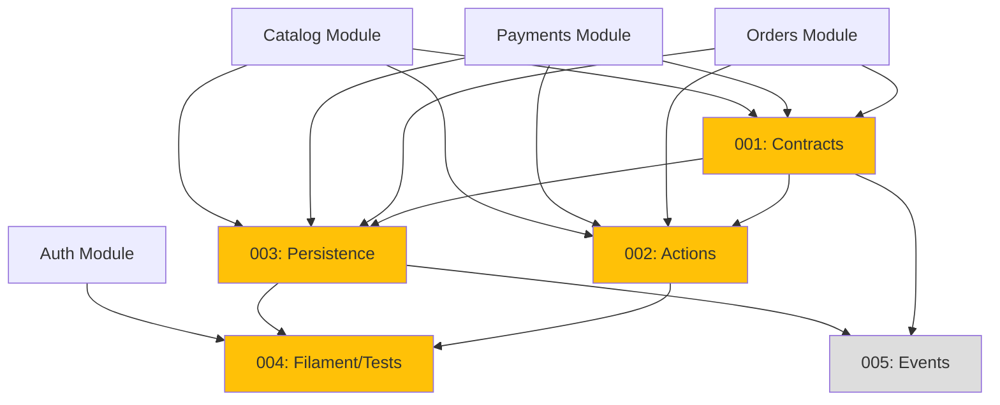

# Reports Module - Implementation Tasks

## Overview

This directory contains the implementation tasks for the **Reports Module** (Analytics & Business Intelligence), organized following the agent-based architecture.

**Module Type:** STANDARD  
**Phase:** Fase 4 - Post-MVP  
**Priority:** MEDIUM (analytics and insights for merchant)

## Task List

### Task 001: Contracts, Data, VOs and Enums
**File:** `001-contracts.md`  
**Agent:** Agente A - Contratos, Data, VOs y Enums  
**Priority:** MEDIUM  
**Estimated Time:** 6 hours  
**Dependencies:** orders-001, payments-001, catalog-001  
**Status:** Pending

**Deliverables:**
- Value Objects: `DateRange`, `TimeAggregation`, `Revenue`, `Money`, `Percentage`, `ReportMetric`
- Enums: `ReportType`, `AggregationPeriod`, `SortOrder`
- Eloquent Casts: 4 casts for all VOs
- Data Objects: 8 DTOs for various report types
- Unit tests for all VOs, enums, casts

---

### Task 002: Actions and Business Logic
**File:** `002-actions.md`  
**Agent:** Agente B - Actions y Tests Unitarios  
**Priority:** MEDIUM  
**Estimated Time:** 10 hours  
**Dependencies:** 001-contracts, orders-002, payments-002, catalog-002  
**Status:** Pending

**Deliverables:**
- Action Queries (12): Sales report, Product performance, Order status, Payment methods, Dashboard metrics, Exports
- Action Internal (4): Date filtering, Aggregation, Percentages, Cache keys
- Domain exceptions (5): Invalid ranges, rate limits, generation failures
- **Note:** NO Commands (read-only module)
- Unit tests with mocks for all Actions

---

### Task 003: Repositories and Read-Only Queries
**File:** `003-persistence.md`  
**Agent:** Agente C - Repositorios, Modelos y Persistencia  
**Priority:** MEDIUM  
**Estimated Time:** 6 hours  
**Dependencies:** 001-contracts, orders-003, payments-003, catalog-003  
**Status:** Pending

**Deliverables:**
- Repositories (5): Sales, Product, Order, Payment, Dashboard repositories (all read-only)
- Query Builders (3): Sales, Product, Cache manager
- **Note:** NO Models or Migrations (reads from existing tables)
- Integration tests with database
- Performance optimization (caching, indexes)

---

### Task 004: Filament Widgets and Feature Tests
**File:** `004-filament-tests.md`  
**Agent:** Agente D - HTTP, Livewire/Volt, Filament y Tests Feature  
**Priority:** MEDIUM  
**Estimated Time:** 8 hours  
**Dependencies:** 001-contracts, 002-actions, 003-persistence, auth-004  
**Status:** Pending

**Deliverables:**
- Filament Pages (2): Reports page, Dashboard page
- Filament Widgets (8): Revenue trend, Order status chart, Top products, Payment methods, Stats cards, Alerts
- **Note:** NO public UI (backoffice only)
- Feature Tests (5): All report types, Dashboard, Performance
- Chart integration (Chart.js/ApexCharts)

---

### Task 005: Events, Cache Invalidation and Scheduled Jobs
**File:** `005-events.md`  
**Agent:** Agente E - Events, Listeners y Jobs  
**Priority:** LOW  
**Estimated Time:** 4 hours  
**Dependencies:** 001-contracts, 003-persistence  
**Status:** Pending

**Deliverables:**
- Events (2): Report generated, Report exported
- Listeners (3): Cache invalidation on data changes (Order, Payment, Product)
- Scheduled Jobs (3): Warm dashboard cache, Warm sales reports, Clean expired cache
- Cache warming and invalidation tests

---

## Dependency Graph



**Legend:**
- 🟡 Yellow (MEDIUM): Post-MVP, analytics and insights
- ⚪ Gray (LOW): Optional optimizations

## Execution Order

### Recommended Sequence:
1. **Task 001** (Contracts) - After Orders/Payments/Catalog 001 complete [6h]
2. **Task 002** (Actions) and **Task 003** (Persistence) - Can run in parallel [~10h combined]
3. **Task 004** (Filament/Tests) - After Auth 004, requires 001, 002, 003 [8h]
4. **Task 005** (Events) - Optional optimization, can run anytime after 001, 003 [4h]

### Total Time:
- **Sequential:** 34 hours
- **With parallelization:** ~28 hours

## Quality Gates

Each task must pass:
- [ ] PHPStan level 6+ without errors
- [ ] Pint (PSR-12) formatting applied
- [ ] Test coverage: 100% for critical paths (calculations, aggregations)
- [ ] All tests passing (Pest 4)
- [ ] Cache performance verified (< 1s for dashboard)
- [ ] Rate limiting tested
- [ ] Documentation complete (docblocks)

## Validation Commands

```bash
# Run all Reports module tests
./vendor/bin/sail test Modules/Reports

# Static analysis
./vendor/bin/sail composer run phpstan -- --paths=Modules/Reports

# Code formatting
./vendor/bin/sail bin pint Modules/Reports

# Rector refactoring
./vendor/bin/sail composer run rector -- --paths=Modules/Reports

# Check cache performance
./vendor/bin/sail artisan reports:benchmark
```

## Module Structure

```
Modules/Reports/
├── Contracts/                 # Agent A
├── ValueObjects/              # Agent A
│   ├── DateRange.php
│   ├── TimeAggregation.php
│   ├── Revenue.php
│   ├── Money.php (shared)
│   ├── Percentage.php
│   └── ReportMetric.php
├── Enums/                     # Agent A
│   ├── ReportType.php
│   ├── AggregationPeriod.php
│   └── SortOrder.php
├── Casts/                     # Agent A
│   ├── DateRangeCast.php
│   ├── TimeAggregationCast.php
│   ├── RevenueCast.php
│   └── MoneyCast.php (shared)
├── Data/                      # Agent A
│   ├── SalesReportData.php
│   ├── ProductPerformanceData.php
│   ├── OrderStatusDistributionData.php
│   ├── PaymentMethodDistributionData.php
│   ├── DashboardMetricsData.php
│   ├── ReportFilterData.php
│   ├── DataPointData.php
│   └── ComparisonMetricData.php
├── Actions/                   # Agent B
│   ├── Queries/
│   │   ├── GenerateSalesReportAction.php
│   │   ├── GenerateProductPerformanceReportAction.php
│   │   ├── GenerateOrderStatusReportAction.php
│   │   ├── GeneratePaymentMethodReportAction.php
│   │   ├── GetDashboardMetricsAction.php
│   │   ├── ComparePeriodsAction.php
│   │   ├── GetRevenueBreakdownAction.php
│   │   ├── GetTopCustomersAction.php
│   │   ├── GetLowStockProductsAction.php
│   │   ├── ExportReportAction.php
│   │   ├── CalculateGrowthRateAction.php
│   │   └── GetReportCacheStatusAction.php
│   └── Internal/
│       ├── ApplyDateRangeFilterAction.php
│       ├── AggregateByPeriodAction.php
│       ├── CalculatePercentagesAction.php
│       └── BuildCacheKeyAction.php
├── Exceptions/                # Agent B
│   ├── InvalidDateRangeException.php
│   ├── DateRangeTooLargeException.php
│   ├── ReportNotFoundException.php
│   ├── RateLimitExceededException.php
│   └── ReportGenerationFailedException.php
├── Repositories/              # Agent C (NO Models)
│   ├── SalesReportRepository.php
│   ├── ProductReportRepository.php
│   ├── OrderReportRepository.php
│   ├── PaymentReportRepository.php
│   └── DashboardRepository.php
├── QueryBuilders/             # Agent C
│   ├── SalesQueryBuilder.php
│   ├── ProductQueryBuilder.php
│   └── ReportCacheManager.php
├── Filament/                  # Agent D
│   ├── Pages/
│   │   ├── ReportsPage.php
│   │   └── DashboardPage.php
│   └── Widgets/
│       ├── RevenueTrendWidget.php
│       ├── OrderStatusChartWidget.php
│       ├── TopProductsTableWidget.php
│       ├── PaymentMethodChartWidget.php
│       ├── RevenueStatsWidget.php
│       ├── OrderStatsWidget.php
│       ├── LowStockAlertsWidget.php
│       └── RecentOrdersWidget.php
├── Events/                    # Agent E
│   ├── ReportGenerated.php
│   └── ReportExported.php
├── Listeners/                 # Agent E
│   ├── InvalidateReportCacheOnOrderCreated.php
│   ├── InvalidateReportCacheOnPaymentStatusChanged.php
│   └── InvalidateReportCacheOnProductUpdated.php
├── Jobs/                      # Agent E
│   ├── WarmDashboardCacheJob.php
│   ├── WarmSalesReportCacheJob.php
│   └── CleanExpiredReportCacheJob.php
└── Tests/
    ├── Unit/                  # Agent A + Agent B
    │   ├── ValueObjects/
    │   ├── Enums/
    │   ├── Casts/
    │   └── Actions/
    └── Feature/               # Agent D
        ├── SalesReportTest.php
        ├── ProductPerformanceTest.php
        ├── OrderStatusReportTest.php
        ├── PaymentMethodReportTest.php
        └── DashboardTest.php
```

## References

- **Agents Prompt:** `@e-commerce-wa-ml/reports/agents_prompt.md` (829 lines)
- **Domain Model:** `@e-commerce-wa-ml/reports/domain_model.md` (941 lines)
- **Project Definition:** `@e-commerce-wa-ml/project_definition.md`
- **Modular Architecture:** `@e-commerce-wa-ml/modular-architecture.md`

## Key Business Rules (18 Total)

### Date Range (Rules 1-4)
1. Max range: 2 years (730 days)
2. Start date must be <= end date
3. Dates in merchant timezone
4. No future dates allowed

### Aggregation Limits (Rules 5-8)
5. DAILY: max 90 days range
6. WEEKLY: max 1 year range
7. MONTHLY: max 2 years range
8. YEARLY: unlimited range

### Revenue Calculation (Rules 9-12)
9. Only PAID payments count toward revenue
10. Refunds subtract from revenue
11. Pending payments excluded from revenue
12. All amounts in merchant currency

### Performance (Rules 13-16)
13. Reports cached for 5 minutes
14. Dashboard cached for 1 minute
15. Max 1000 data points per report
16. Heavy reports queued for background processing

### Privacy (Rules 17-18)
17. No customer PII exposed in reports
18. Phone numbers masked in aggregates

## Key Features

### Report Types
✅ Sales Report - Revenue over time with aggregation
✅ Product Performance - Top products by revenue/quantity
✅ Order Status Distribution - Orders by status
✅ Payment Method Distribution - Payments by method
✅ Dashboard Metrics - Quick KPIs
✅ Period Comparison - Growth rate analysis
✅ Revenue Breakdown - By status and method
✅ Low Stock Alerts - Products needing attention

### Optimizations
✅ Aggressive caching (5 min reports, 1 min dashboard)
✅ Cache warming with scheduled jobs
✅ Selective cache invalidation
✅ Indexed queries
✅ Query result limiting
✅ Export to CSV/PDF

### Security
✅ Merchant authentication required
✅ Rate limiting (60 requests/minute)
✅ No customer PII exposed
✅ Read-only operations only

## Testing Strategy

### Unit Tests
- Value Objects: validation, calculations
- Enums: period mappings
- Casts: bidirectional conversion
- Actions: report generation logic with mocks

### Feature Tests
- Sales Report: aggregation, revenue calculation
- Product Performance: sorting, limiting
- Order Status: distribution, percentages
- Payment Methods: grouping, revenue
- Dashboard: all metrics, performance
- Cache: hit/miss, invalidation, warming
- Export: CSV, PDF generation

### Performance Tests
- Dashboard load time (< 1s)
- Report generation time (< 3s)
- Cache effectiveness (query reduction)
- Query count per report

### Edge Cases
- Date range at boundaries (max 2 years)
- Empty results (no data in range)
- Single data point
- Cache miss scenarios
- Concurrent report generation

## Environment Configuration

Required `.env` variables:

```env
# Reports Configuration
REPORTS_MAX_DATE_RANGE_DAYS=730
REPORTS_CACHE_TTL_SECONDS=300
DASHBOARD_CACHE_TTL_SECONDS=60
REPORTS_RATE_LIMIT_PER_MINUTE=60

# Cache Driver (Redis recommended)
CACHE_DRIVER=redis

# Scheduled Jobs
REPORTS_CACHE_WARMING_ENABLED=true
```

## Success Criteria

The Reports module implementation is complete when:

- [x] All 5 tasks are implemented and tested
- [x] PHPStan level 6+ passes without errors
- [x] Test coverage is 100% for critical paths
- [x] Pint formatting is applied consistently
- [x] Merchants can view sales reports
- [x] Dashboard loads in < 1 second
- [x] Reports cached effectively (5 min)
- [x] Cache invalidated on data changes
- [x] Export to CSV/PDF works
- [x] Charts display correctly
- [x] No customer PII exposed
- [x] Rate limiting enforced
- [x] Documentation is complete and accurate

---

**Module Status:** Ready for Implementation  
**Last Updated:** 2025-12-19  
**Version:** 1.0  
**Total Estimated Time:** 34 hours (28 hours with parallelization)

## Impact on Other Modules

**Depends on:**
- Orders module (order data for reports)
- Payments module (payment data for revenue)
- Catalog module (product data for performance)
- Auth module (merchant authentication)

**Enables:**
- Business insights and analytics
- Data-driven decision making
- Performance monitoring
- Inventory planning

**Note:**
This is a **Post-MVP module**. The e-commerce can function without it, but it provides valuable business intelligence.
