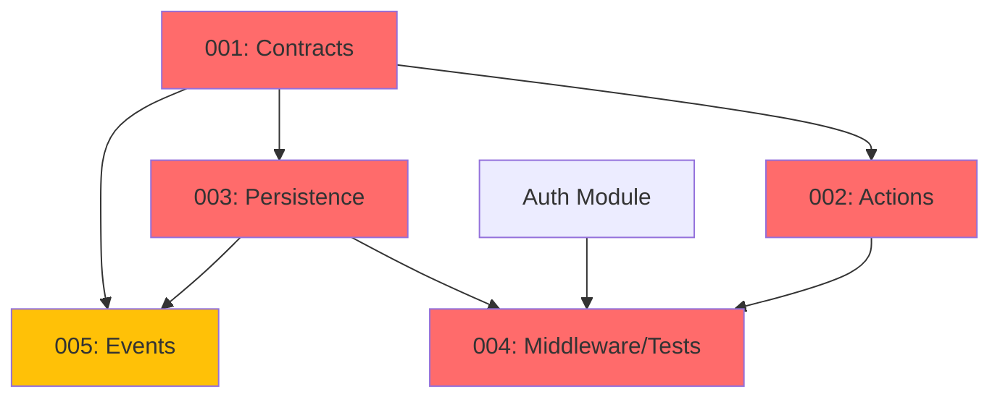

# Security Module - Implementation Tasks

## Overview

This directory contains the implementation tasks for the **Security Module** (Rate Limiting, Captcha, Entity Blocking), organized following the agent-based architecture.

**Module Type:** TRANSVERSAL  
**Phase:** Fase 1 - Fundamentos  
**Priority:** CRITICAL (protects all system endpoints)

## Task List

### Task 001: Contracts, Data, VOs and Enums
**File:** `001-contracts.md`  
**Agent:** Agente A - Contratos, Data, VOs y Enums  
**Priority:** CRITICAL  
**Estimated Time:** 8 hours  
**Dependencies:** None  
**Status:** Pending

**Deliverables:**
- Value Objects: `IpAddress`, `PhoneNumber`, `RateLimitKey`, `RateLimitQuota`, `UserAgent`, `Fingerprint`, `CaptchaToken`, `SecurityEventId`, `BlockDuration`, `SeverityScore`
- Enums: `RateLimitType`, `CaptchaProvider`, `SecurityEventType`, `BlockReason`, `EntityType`
- Eloquent Casts: 7 casts for all VOs
- Data Objects: 7 DTOs for checks, results, events
- Unit tests for all VOs, enums, casts

---

### Task 002: Actions and Business Logic
**File:** `002-actions.md`  
**Agent:** Agente B - Actions y Tests Unitarios  
**Priority:** CRITICAL  
**Estimated Time:** 12 hours  
**Dependencies:** 001-contracts  
**Status:** Pending

**Deliverables:**
- Action Commands (7): Block, Unblock, Record event, Increment counter, Clear limit, Record captcha, Trigger honeypot
- Action Queries (8): Check rate limit, Validate captcha, Check blocked, Check orders limit, Validate honeypot, Get status, Get metrics, List blocked
- Action Internal (5): Normalize, Build cache key, Calculate severity, Check exemption, Parse user agent
- Domain exceptions (8): Rate limit, Captcha, Blocked, Honeypot errors
- Unit tests with mocks for all Actions
- **Critical:** Redis integration, Captcha API integration

---

### Task 003: Models, Repositories and Persistence
**File:** `003-persistence.md`  
**Agent:** Agente C - Repositorios, Modelos y Persistencia  
**Priority:** CRITICAL  
**Estimated Time:** 8 hours  
**Dependencies:** 001-contracts  
**Status:** Pending

**Deliverables:**
- Eloquent Models: `BlockedEntity`, `SecurityEvent`
- Repositories: 2 repositories (blocks CRUD, events append-only)
- Migrations: 2 tables with indexes
- Factories: 2 factories with states
- Database integration tests
- **Note:** Redis used for rate limiting (no models for ephemeral data)

---

### Task 004: Middleware, Filament and Feature Tests
**File:** `004-middleware-tests.md`  
**Agent:** Agente D - HTTP, Livewire/Volt, Filament y Tests Feature  
**Priority:** CRITICAL  
**Estimated Time:** 10 hours  
**Dependencies:** 001-contracts, 002-actions, 003-persistence, auth-004  
**Status:** Pending

**Deliverables:**
- HTTP Middleware (5): Rate limit, Captcha, Blocked entity, Honeypot, Security logging
- Filament Resources (2): Blocked entities (CRUD), Security events (read-only)
- Filament Widgets (2): Security alerts, Security metrics
- **Note:** NO public UI (security is transparent to users)
- Feature Tests (7): All middleware, blocking, captcha, honeypot, backoffice
- Integration tests with Redis

---

### Task 005: Events, Listeners and Scheduled Jobs
**File:** `005-events.md`  
**Agent:** Agente E - Events, Listeners y Jobs  
**Priority:** MEDIUM  
**Estimated Time:** 6 hours  
**Dependencies:** 001-contracts, 003-persistence  
**Status:** Pending

**Deliverables:**
- Events (6): Entity blocked/unblocked, Rate limit exceeded, Captcha failed, Honeypot triggered, Event recorded
- Listeners (4): Record events, Auto-block on violations, Notify merchant, Clear rate limit
- Scheduled Jobs (3): Clean expired blocks, Clean old events, Generate daily report
- Event dispatch and listener execution tests

---

## Dependency Graph



**Legend:**
- 🔴 Red (CRITICAL): Blocking for all modules (transversal)
- 🟡 Yellow (MEDIUM): Optimizations and monitoring

## Execution Order

### Recommended Sequence:
1. **Task 001** (Contracts) - Start immediately (no dependencies) [8h]
2. **Task 002** (Actions) and **Task 003** (Persistence) - Can run in parallel [~12h combined]
3. **Task 004** (Middleware/Tests) - After Auth 004, requires 001, 002, 003 [10h]
4. **Task 005** (Events) - Can run in parallel with Task 004 after 001, 003 [6h]

### Total Time:
- **Sequential:** 44 hours
- **With parallelization:** ~36 hours

## Quality Gates

Each task must pass:
- [ ] PHPStan level 6+ without errors
- [ ] Pint (PSR-12) formatting applied
- [ ] Test coverage: 100% for critical paths (rate limiting, captcha, blocking)
- [ ] All tests passing (Pest 4)
- [ ] Redis operations tested
- [ ] Middleware integration tested
- [ ] Documentation complete (docblocks)

## Validation Commands

```bash
# Run all Security module tests
./vendor/bin/sail test Modules/Security

# Static analysis
./vendor/bin/sail composer run phpstan -- --paths=Modules/Security

# Code formatting
./vendor/bin/sail bin pint Modules/Security

# Rector refactoring
./vendor/bin/sail composer run rector -- --paths=Modules/Security

# Run migrations
./vendor/bin/sail artisan migrate

# Test Redis connection
./vendor/bin/sail artisan redis:ping
```

## Module Structure

```
Modules/Security/
├── Contracts/                 # Agent A
├── ValueObjects/              # Agent A
│   ├── IpAddress.php
│   ├── PhoneNumber.php (shared)
│   ├── RateLimitKey.php
│   ├── RateLimitQuota.php
│   ├── UserAgent.php
│   ├── Fingerprint.php
│   ├── CaptchaToken.php
│   ├── SecurityEventId.php
│   ├── BlockDuration.php
│   └── SeverityScore.php
├── Enums/                     # Agent A
│   ├── RateLimitType.php
│   ├── CaptchaProvider.php
│   ├── SecurityEventType.php
│   ├── BlockReason.php
│   └── EntityType.php
├── Casts/                     # Agent A
│   ├── IpAddressCast.php
│   ├── PhoneNumberCast.php (shared)
│   ├── RateLimitKeyCast.php
│   ├── UserAgentCast.php
│   ├── FingerprintCast.php
│   ├── CaptchaTokenCast.php
│   └── BlockDurationCast.php
├── Data/                      # Agent A
│   ├── RateLimitCheckData.php
│   ├── RateLimitResultData.php
│   ├── CaptchaValidationData.php
│   ├── SecurityEventData.php
│   ├── BlockedEntityData.php
│   ├── HoneypotCheckData.php
│   └── SecurityMetricsData.php
├── Actions/                   # Agent B
│   ├── Commands/
│   │   ├── BlockEntityAction.php
│   │   ├── UnblockEntityAction.php
│   │   ├── RecordSecurityEventAction.php
│   │   ├── IncrementRateLimitCounterAction.php
│   │   ├── ClearRateLimitAction.php
│   │   ├── RecordCaptchaAttemptAction.php
│   │   └── TriggerHoneypotAction.php
│   ├── Queries/
│   │   ├── CheckRateLimitAction.php
│   │   ├── ValidateCaptchaAction.php
│   │   ├── CheckEntityBlockedAction.php
│   │   ├── CheckActiveOrdersLimitAction.php
│   │   ├── ValidateHoneypotFieldsAction.php
│   │   ├── GetRateLimitStatusAction.php
│   │   ├── GetSecurityMetricsAction.php
│   │   └── GetBlockedEntitiesAction.php
│   └── Internal/
│       ├── NormalizeIdentifierAction.php
│       ├── BuildRateLimitCacheKeyAction.php
│       ├── CalculateSeverityScoreAction.php
│       ├── ShouldExemptFromSecurityAction.php
│       └── ParseUserAgentAction.php
├── Exceptions/                # Agent B
│   ├── RateLimitExceededException.php
│   ├── CaptchaValidationFailedException.php
│   ├── EntityBlockedException.php
│   ├── HoneypotTriggeredException.php
│   ├── InvalidCaptchaTokenException.php
│   ├── BlockedEntityNotFoundException.php
│   ├── SecurityEventNotRecordedException.php
│   └── CaptchaProviderUnavailableException.php
├── Models/                    # Agent C
│   ├── BlockedEntity.php
│   └── SecurityEvent.php
├── Repositories/              # Agent C
│   ├── BlockedEntityRepository.php
│   └── SecurityEventRepository.php
├── Database/                  # Agent C
│   ├── Factories/
│   │   ├── BlockedEntityFactory.php
│   │   └── SecurityEventFactory.php
│   └── Migrations/
│       ├── xxxx_create_blocked_entities_table.php
│       └── xxxx_create_security_events_table.php
├── Http/                      # Agent D
│   └── Middleware/
│       ├── RateLimitMiddleware.php
│       ├── CaptchaMiddleware.php
│       ├── BlockedEntityMiddleware.php
│       ├── HoneypotMiddleware.php
│       └── SecurityLoggingMiddleware.php
├── Filament/                  # Agent D
│   ├── Resources/
│   │   ├── BlockedEntityResource.php
│   │   └── SecurityEventResource.php
│   └── Widgets/
│       ├── SecurityAlertsWidget.php
│       └── SecurityMetricsWidget.php
├── Events/                    # Agent E
│   ├── EntityBlocked.php
│   ├── EntityUnblocked.php
│   ├── RateLimitExceeded.php
│   ├── CaptchaFailed.php
│   ├── HoneypotTriggered.php
│   └── SecurityEventRecorded.php
├── Listeners/                 # Agent E
│   ├── RecordSecurityEventListener.php
│   ├── AutoBlockOnViolationsListener.php
│   ├── NotifyMerchantOnCriticalEventListener.php
│   └── ClearRateLimitOnUnblockListener.php
├── Jobs/                      # Agent E
│   ├── CleanExpiredBlocksJob.php
│   ├── CleanOldSecurityEventsJob.php
│   └── GenerateSecurityReportJob.php
└── Tests/
    ├── Unit/                  # Agent A + Agent B
    │   ├── ValueObjects/
    │   ├── Enums/
    │   ├── Casts/
    │   └── Actions/
    └── Feature/               # Agent D
        ├── RateLimitTest.php
        ├── CaptchaValidationTest.php
        ├── EntityBlockingTest.php
        ├── HoneypotDetectionTest.php
        ├── SecurityMiddlewareTest.php
        ├── SecurityEventsTest.php
        └── BackofficeTest.php
```

## References

- **Agents Prompt:** `@e-commerce-wa-ml/security/agents_prompt.md` (1,085 lines)
- **Domain Model:** `@e-commerce-wa-ml/security/domain_model.md` (1,085 lines)
- **Project Definition:** `@e-commerce-wa-ml/project_definition.md`
- **Modular Architecture:** `@e-commerce-wa-ml/modular-architecture.md`

## Key Business Rules (28 Total)

### Rate Limiting (Rules 1-8)
1. IP-based: 60 requests/minute (default)
2. Phone-based: 3 orders/hour
3. Endpoint-specific limits configurable
4. Sliding window implementation
5. Redis storage for distributed systems
6. Merchants exempt from all limits
7. Auto-block after 5 violations
8. Manual reset allowed

### Captcha (Rules 9-14)
9. Required on checkout, order creation
10. Three providers: hCaptcha, reCAPTCHA v3, Turnstile
11. Score threshold >= 0.5 (reCAPTCHA v3)
12. Token single-use (cached 5 minutes)
13. Max 3 failed attempts before block
14. Merchants exempt from captcha

### Blocking (Rules 15-20)
15. Auto-block triggers: 5 rate limits, 3 captchas, 1 honeypot
16. Manual block by merchant allowed
17. Block duration: 15 minutes (configurable) or permanent
18. Block types: IP, phone, email, user agent, fingerprint
19. Unblock: manual or expiration
20. Block cascade: blocked IP blocks associated phones

### Honeypot (Rules 21-24)
21. Hidden fields: email_confirm, phone_confirm
22. Trigger on any value
23. Silent block (no error to user)
24. HIGH severity event logged immediately

### Security Events (Rules 25-28)
25. All security actions logged asynchronously
26. Severity levels: LOW, MEDIUM, HIGH, CRITICAL
27. Queued processing
28. Retention: 90 days

## Testing Strategy

### Unit Tests
- Value Objects: validation, normalization (IP, phone)
- Enums: methods, mappings
- Casts: bidirectional conversion
- Actions: business logic with mocked Redis, APIs

### Feature Tests
- Rate Limiting: enforcement, headers, exemptions, auto-block
- Captcha: validation, providers, token reuse, auto-block
- Entity Blocking: enforcement, expiration, manual operations
- Honeypot: detection, silent blocking, event logging
- Middleware: integration, order, exemptions
- Security Events: async logging, retention
- Backoffice: full CRUD workflow

### Integration Tests
- Redis operations (rate limiting)
- Captcha API calls (mocked)
- Database operations
- Middleware stack
- Event dispatching

### Edge Cases
- IPv6 addresses
- Concurrent rate limit checks
- Expired blocks
- Duplicate event logging
- Captcha provider unavailable
- Redis connection failure
- Multiple violations simultaneously

## Environment Configuration

Required `.env` variables:

```env
# Redis Configuration (required)
REDIS_HOST=redis
REDIS_PORT=6379
REDIS_PASSWORD=
REDIS_DATABASE=0

# Rate Limiting
RATE_LIMIT_IP_MAX=60
RATE_LIMIT_IP_WINDOW=60
RATE_LIMIT_PHONE_MAX=3
RATE_LIMIT_PHONE_WINDOW=3600

# Captcha
CAPTCHA_PROVIDER=hcaptcha
HCAPTCHA_SECRET=your-secret-key
HCAPTCHA_SITEKEY=your-site-key
RECAPTCHA_SECRET=your-secret-key
RECAPTCHA_SITEKEY=your-site-key
RECAPTCHA_SCORE_THRESHOLD=0.5
TURNSTILE_SECRET=your-secret-key
TURNSTILE_SITEKEY=your-site-key

# Blocking
BLOCK_DURATION_MINUTES=15
RATE_LIMIT_VIOLATION_THRESHOLD=5
CAPTCHA_FAILURE_THRESHOLD=3

# Active Orders Limit
MAX_ACTIVE_ORDERS_PER_PHONE=2

# Security Events
SECURITY_EVENTS_RETENTION_DAYS=90
```

## Success Criteria

The Security module implementation is complete when:

- [x] All 5 tasks are implemented and tested
- [x] PHPStan level 6+ passes without errors
- [x] Test coverage is 100% for critical paths
- [x] Pint formatting is applied consistently
- [x] Rate limiting works with Redis
- [x] Captcha validates with all providers
- [x] Entity blocking enforced
- [x] Honeypot detects bots silently
- [x] Merchants exempt from all checks
- [x] Security events logged asynchronously
- [x] Middleware protects all endpoints
- [x] Backoffice allows block management
- [x] Documentation is complete and accurate

---

**Module Status:** Ready for Implementation  
**Last Updated:** 2025-12-19  
**Version:** 1.0  
**Total Estimated Time:** 44 hours (36 hours with parallelization)

## Impact on Other Modules

**Depends on:**
- None (transversal, no dependencies)

**Provides services to:**
- All modules (transversal protection)
- Cart (captcha, rate limiting, honeypot)
- Orders (active orders limit, rate limiting)
- Payments (rate limiting)
- Auth (blocked entity check)

**Critical Path:**
This is a **transversal infrastructure module**. It should be implemented early in Phase 1 to protect the system from the start.
