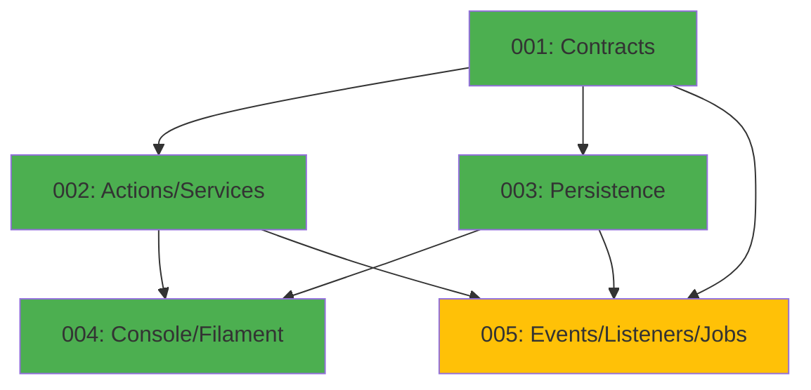

# WhatsApp Module - Implementation Tasks

## Overview

This directory contains the implementation tasks for the **WhatsApp Module** (Notifications), organized following the agent-based architecture.

**Module Type:** TRANSVERSAL  
**Phase:** Fase 3 - Integraciones  
**Priority:** MEDIUM (depends on Orders and Payments modules)

## Task List

### Task 001: Contracts, Data, VOs and Enums
**File:** `001-contracts.md`  
**Agent:** Agente A - Contratos, Data, VOs y Enums  
**Priority:** HIGH  
**Estimated Time:** 6 hours  
**Dependencies:** None  
**Status:** Pending

**Deliverables:**
- Value Objects: `PhoneNumber`, `MessageContext`, `SendResult`, `WhatsAppConfig`
- Enums: `MessageTemplate`, `MessageStatus`
- Casts: `PhoneNumberCast`, `MessageContextCast`, `MessageTemplateCast`, `MessageStatusCast`
- Data Objects: `WhatsAppMessageData`, `MessageContextData`, `SendResultData`, `MessageStatsData`
- Contracts: Command and Query interfaces
- Unit tests for all VOs and Enums

---

### Task 002: Actions, Services and Business Logic
**File:** `002-actions.md`  
**Agent:** Agente B - Actions y Tests Unitarios  
**Priority:** HIGH  
**Estimated Time:** 8 hours  
**Dependencies:** 001-contracts  
**Status:** Pending

**Deliverables:**
- Actions Commands: `CreateMessageAction`, `SendMessageAction`, `SendMessageAsyncAction`, `MarkMessageAsSentAction`, `MarkMessageAsFailedAction`, `RetryFailedMessageAction`
- Actions Queries: `GetMessageAction`, `GetPendingMessagesAction`, `GetFailedMessagesAction`, `GetMessageStatsAction`
- Actions Internal: `RenderTemplateAction`, `ValidateContextAction`, `NormalizePhoneNumberAction`, `SanitizeMessageAction`, `TruncateMessageAction`, `GenerateWaMeLinkAction`
- Services: `WhatsAppMessageService`, `MessageTemplateRenderer`, `WaMeGateway`, `WhatsAppBusinessApiGateway`
- Domain exceptions
- Unit tests for all Actions and Services

---

### Task 003: Models, Repositories and Persistence
**File:** `003-persistence.md`  
**Agent:** Agente C - Repositorios, Modelos y Persistencia  
**Priority:** HIGH  
**Estimated Time:** 5 hours  
**Dependencies:** 001-contracts  
**Status:** Pending

**Deliverables:**
- Eloquent Model: `WhatsAppMessage`
- Repository: `WhatsAppMessageRepository`
- Migration: `create_whatsapp_messages_table`
- Factory: `WhatsAppMessageFactory` (with states)
- Seeder: `WhatsAppSeeder`
- Database integration tests

---

### Task 004: Console Commands, Filament and Feature Tests
**File:** `004-console-filament.md`  
**Agent:** Agente D - HTTP, Livewire/Volt, Filament y Tests Feature  
**Priority:** HIGH  
**Estimated Time:** 7 hours  
**Dependencies:** 001-contracts, 002-actions, 003-persistence  
**Status:** Pending

**Deliverables:**
- Console Commands: `ProcessWhatsAppQueueCommand`, `RetryFailedMessagesCommand`
- Filament Resource: `WhatsAppMessageResource`
- Filament Widgets: `MessageStatsWidget`, `RecentMessagesWidget`
- Scheduled commands configuration
- Complete feature tests
- Smoke tests for Filament resource

---

### Task 005: Events, Listeners and Jobs
**File:** `005-events.md`  
**Agent:** Agente E - Events, Listeners y Jobs  
**Priority:** HIGH  
**Estimated Time:** 6 hours  
**Dependencies:** 001-contracts, 002-actions, 003-persistence  
**Status:** Pending

**Deliverables:**
- Listeners: `OrderCreatedListener`, `OrderStatusChangedListener`, `PaymentConfirmedListener`, `PaymentRefundedListener`
- Jobs: `SendWhatsAppMessageJob`
- Event listener tests
- Job execution tests
- Integration tests with Orders and Payments events

---

## Dependency Graph



## Execution Order

### Recommended Sequence:
1. **Task 001** (Contracts) - Foundation layer
2. **Task 002** (Actions/Services) and **Task 003** (Persistence) - Can run in parallel
3. **Task 004** (Console/Filament) - Requires 001, 002, 003
4. **Task 005** (Events/Listeners) - Requires 001, 002, 003

### Parallel Execution:
- Tasks 002 and 003 can be executed simultaneously
- Task 005 can start once 001, 002, and 003 are complete

## Quality Gates

Each task must pass:
- [ ] PHPStan level 6+ without errors
- [ ] Pint (PSR-12) formatting applied
- [ ] Test coverage: 100% for critical paths
- [ ] All tests passing (Pest 4)
- [ ] Documentation complete (docblocks)

## Validation Commands

```bash
# Run all WhatsApp module tests
./vendor/bin/sail test Modules/WhatsApp

# Static analysis
./vendor/bin/sail composer run phpstan -- --paths=Modules/WhatsApp

# Code formatting
./vendor/bin/sail bin pint Modules/WhatsApp

# Rector refactoring
./vendor/bin/sail composer run rector -- --paths=Modules/WhatsApp

# Run migrations
./vendor/bin/sail artisan migrate:fresh --seed

# Process queue manually
./vendor/bin/sail artisan whatsapp:process-queue

# Retry failed messages manually
./vendor/bin/sail artisan whatsapp:retry-failed
```

## Environment Setup

Required `.env` configuration:

```env
# WhatsApp Module
WHATSAPP_ENABLED=true
WHATSAPP_GATEWAY=wa_me
WHATSAPP_MERCHANT_PHONE=+5491112345678
WHATSAPP_MAX_ATTEMPTS=3
WHATSAPP_RETRY_DELAY=60
WHATSAPP_QUEUE_PRIORITY=high
WHATSAPP_SEND_TO_CUSTOMERS=false

# WA.ME Gateway
WAME_BASE_URL=https://wa.me/
WAME_MAX_MESSAGE_LENGTH=2048

# WhatsApp Business API (future)
WHATSAPP_API_URL=https://graph.facebook.com/v18.0/
WHATSAPP_API_TOKEN=
WHATSAPP_PHONE_NUMBER_ID=
```

## Module Structure

```
Modules/WhatsApp/
├── Contracts/
│   ├── Commands/
│   │   ├── CreateMessageInterface.php
│   │   ├── SendMessageInterface.php
│   │   └── RetryFailedMessageInterface.php
│   ├── Queries/
│   │   ├── GetMessageInterface.php
│   │   ├── GetPendingMessagesInterface.php
│   │   └── GetFailedMessagesInterface.php
│   └── Data/
│       ├── WhatsAppMessageData.php
│       ├── MessageContextData.php
│       ├── SendResultData.php
│       └── MessageStatsData.php
├── ValueObjects/
│   ├── PhoneNumber.php
│   ├── MessageContext.php
│   ├── SendResult.php
│   └── WhatsAppConfig.php
├── Enums/
│   ├── MessageTemplate.php
│   └── MessageStatus.php
├── Casts/
│   ├── PhoneNumberCast.php
│   ├── MessageContextCast.php
│   ├── MessageTemplateCast.php
│   └── MessageStatusCast.php
├── Actions/
│   ├── Commands/
│   ├── Queries/
│   └── Internal/
├── Services/
│   ├── WhatsAppMessageService.php
│   ├── MessageTemplateRenderer.php
│   └── Gateways/
│       ├── WhatsAppGateway.php
│       ├── WaMeGateway.php
│       └── WhatsAppBusinessApiGateway.php
├── Exceptions/
├── Models/
│   └── WhatsAppMessage.php
├── Repositories/
│   └── WhatsAppMessageRepository.php
├── Database/
│   ├── Factories/
│   ├── Migrations/
│   └── Seeders/
├── Filament/
│   └── Resources/
├── Console/
│   └── Commands/
├── Listeners/
├── Jobs/
└── Tests/
```

## References

- **Domain Model:** `@e-commerce-wa-ml/whatsapp/domain_model.md`
- **Agents Prompt:** `@e-commerce-wa-ml/whatsapp/agents_prompt.md`
- **Project Definition:** `@e-commerce-wa-ml/project_definition.md`
- **Modular Architecture:** `@e-commerce-wa-ml/modular-architecture.md`
- **Conventions:** `@laravel/conventions/conventions.md`
- **Value Objects Guide:** `@laravel/conventions/value-objects.md`

## Key Business Rules

### Message Lifecycle
1. A message cannot have more than **3 retry attempts**
2. After 3rd failure, message transitions to **DISCARDED** (no more retries)
3. Messages in **SENT** or **DISCARDED** status are **immutable**
4. Only messages in PENDING or QUEUED can transition to SENDING

### Template Validation
5. Context must contain **all required fields** for template
6. Missing fields cause message creation to **fail immediately**
7. Template-context compatibility validated **before** creating message

### Phone Normalization
8. All phone numbers **normalized to E.164** format (+54...)
9. Normalization happens **before** storage and sending
10. Invalid phone numbers cause message to be **discarded**

### Retry Logic
11. Retry backoff: **1 min, 5 min, 15 min** (exponential)
12. Retries only for **FAILED** messages with attempts < max
13. Retries reset status to **PENDING** and increment attempt count
14. **No automatic retries** after 3rd failure (manual intervention required)

### Message Content
15. Messages truncated at **2048 characters** (wa.me URL limit)
16. Truncation adds "..." suffix
17. Messages **sanitized** to remove URL-breaking characters (%, &, =, #)
18. No sensitive data (passwords, tokens, full card numbers)

### Queue Priority
19. **ORDER_CREATED** messages have **HIGH priority**
20. All other messages have **NORMAL priority**

### MVP Limitations
21. **Merchant-only** notifications (no customer messages)
22. **No delivery confirmation** (wa.me limitation)
23. **No conversation tracking** (one-way notifications only)
24. **No read receipts** (wa.me limitation)

## Testing Strategy

### Unit Tests
- PhoneNumber Value Object: validation, normalization, E.164 format
- MessageContext: validation of required fields per template
- MessageStatus: state transitions validation
- MessageTemplate: template content and interpolation
- WaMeGateway: URL generation, sanitization, truncation
- MessageTemplateRenderer: template rendering with context

### Feature Tests
- Send WhatsApp message (success and failure)
- Process queue command (pending → queued → sent)
- Retry failed messages command (failed → pending → sent)
- OrderCreatedListener creates message
- OrderStatusChangedListener creates message
- PaymentConfirmedListener creates message
- Message sanitization and truncation
- Phone number normalization

### Integration Tests
- WhatsAppMessage persistence and retrieval
- Repository query scopes (pending, failed, retryable)
- Factory states for all MessageStatus values
- Event listener integration with Orders and Payments modules

### Edge Cases
- Messages exceeding 2048 character limit
- Invalid phone numbers
- Missing context fields for template
- Max retry attempts reached
- Concurrent job execution
- Network failures during sending

## Success Criteria

The WhatsApp module implementation is complete when:

- [ ] All 5 tasks are implemented and tested
- [ ] PHPStan level 6+ passes without errors
- [ ] Test coverage is 100% for critical paths
- [ ] Pint formatting is applied consistently
- [ ] OrderCreated events trigger WhatsApp notifications
- [ ] Messages sent asynchronously via queue
- [ ] Failed messages retry with exponential backoff (max 3 times)
- [ ] Phone numbers normalized to E.164
- [ ] Messages truncated and sanitized correctly
- [ ] WA.ME links generated correctly
- [ ] Filament resource shows message status
- [ ] Documentation is complete and accurate

---

**Module Status:** Ready for Implementation  
**Last Updated:** 2025-12-19  
**Version:** 1.0
