# Módulo WhatsApp - Modelo de Dominio

## Metadata

```yaml
module: WhatsApp
version: 1.0
type: Transversal - Notificaciones
dependencies:
  - Orders
  - Payments
purpose: "Envío asíncrono de notificaciones por WhatsApp al merchant y clientes"
implementation: "MVP con wa.me, preparado para WhatsApp Business API"
```

## Descripción General

El módulo WhatsApp gestiona el envío de notificaciones a través de WhatsApp hacia el merchant (y potencialmente clientes en el futuro). Es un módulo transversal que reacciona a eventos del sistema para enviar mensajes contextuales.

### Responsabilidades

- Generar mensajes estructurados según plantillas
- Gestionar cola de envío asíncrono
- Construir enlaces `wa.me` con mensajes preformateados
- Registrar intentos de envío y resultados
- Reintentar envíos fallidos con backoff exponencial
- Normalizar números de teléfono según formato internacional

### Casos de Uso

1. **Notificar creación de pedido**: Merchant recibe resumen del pedido vía WhatsApp
2. **Notificar cambio de estado**: Merchant/cliente es notificado de actualizaciones
3. **Confirmar pago**: Notificación automática al confirmar pago
4. **Cola de envío**: Procesar mensajes de forma asíncrona con reintentos

### Limitaciones del MVP

- Solo envío a merchant (no a clientes)
- Implementación con `wa.me` (sin API oficial)
- Sin confirmación de entrega
- Sin conversaciones bidireccionales
- Sin tracking de conversaciones

### Preparación para Evolución

El diseño permite migración futura a WhatsApp Business API manteniendo la misma interfaz:
- Abstracción de `WhatsAppGateway`
- Estrategia configurable vía `.env`
- Misma estructura de datos y eventos

## Diagrama de Clases - Modelo de Dominio

```mermaid
classDiagram
    class WhatsAppMessage {
        <<Entity>>
        +Ulid id
        +PhoneNumber recipient
        +MessageTemplate template
        +MessageContext context
        +MessageStatus status
        +int attemptCount
        +DateTime scheduledAt
        +DateTime sentAt
        +DateTime failedAt
        +string failureReason
        +DateTime createdAt
        +DateTime updatedAt
        +isReadyToSend() bool
        +canRetry() bool
        +markAsSent(DateTime sentAt) void
        +markAsFailed(string reason) void
        +incrementAttempt() void
    }

    class MessageTemplate {
        <<Enum>>
        ORDER_CREATED
        ORDER_CONFIRMED
        ORDER_IN_DELIVERY
        ORDER_DELIVERED
        ORDER_CANCELLED
        ORDER_REJECTED
        PAYMENT_CONFIRMED
        PAYMENT_REFUNDED
        +getTemplateName() string
        +getTemplateContent() string
        +requiresContext() array
    }

    class MessageStatus {
        <<Enum>>
        PENDING
        QUEUED
        SENDING
        SENT
        FAILED
        DISCARDED
        +isPending() bool
        +isFinal() bool
        +canTransitionTo(MessageStatus status) bool
    }

    class MessageContext {
        <<Value Object>>
        +string orderNumber
        +Money totalAmount
        +string customerName
        +PhoneNumber customerPhone
        +Address deliveryAddress
        +PaymentMethod paymentMethod
        +OrderStatus orderStatus
        +PaymentStatus paymentStatus
        +array items
        +string observations
        +toArray() array
        +fillTemplate(string template) string
    }

    class PhoneNumber {
        <<Value Object>>
        +string countryCode
        +string number
        +string normalized
        +__construct(string phone)
        +toString() string
        +toInternational() string
        +equals(PhoneNumber other) bool
        +isValid() bool
    }

    class WhatsAppGateway {
        <<Interface>>
        +send(WhatsAppMessage message) SendResult
        +generateLink(WhatsAppMessage message) string
        +validateRecipient(PhoneNumber phone) bool
    }

    class WaMeGateway {
        <<Service>>
        -string baseUrl
        -int maxMessageLength
        +send(WhatsAppMessage message) SendResult
        +generateLink(WhatsAppMessage message) string
        +validateRecipient(PhoneNumber phone) bool
        -buildUrl(PhoneNumber phone, string message) string
        -sanitizeMessage(string message) string
        -truncateMessage(string message) string
    }

    class WhatsAppBusinessApiGateway {
        <<Service>>
        -string apiUrl
        -string apiToken
        -HttpClient client
        +send(WhatsAppMessage message) SendResult
        +generateLink(WhatsAppMessage message) string
        +validateRecipient(PhoneNumber phone) bool
        -buildApiRequest(WhatsAppMessage message) array
        -handleApiResponse(Response response) SendResult
    }

    class SendResult {
        <<Value Object>>
        +bool success
        +string messageId
        +string errorMessage
        +DateTime timestamp
        +isSuccess() bool
        +isFailed() bool
        +getErrorMessage() string
    }

    class WhatsAppMessageService {
        <<Application Service>>
        -WhatsAppMessageRepository repository
        -WhatsAppGateway gateway
        -MessageTemplateRenderer renderer
        +createMessage(MessageTemplate template, MessageContext context, PhoneNumber recipient) WhatsAppMessage
        +sendMessage(WhatsAppMessage message) SendResult
        +sendMessageAsync(WhatsAppMessage message) void
        +processQueue() void
        +retryFailedMessages() void
    }

    class MessageTemplateRenderer {
        <<Service>>
        -array templates
        +render(MessageTemplate template, MessageContext context) string
        +validate(MessageTemplate template, MessageContext context) bool
        -loadTemplate(MessageTemplate template) string
        -interpolate(string template, array data) string
    }

    class WhatsAppMessageRepository {
        <<Repository>>
        +save(WhatsAppMessage message) void
        +findById(Ulid id) WhatsAppMessage
        +findPendingMessages(int limit) Collection
        +findFailedMessages(int maxAttempts) Collection
        +findByRecipient(PhoneNumber phone) Collection
        +findByStatus(MessageStatus status) Collection
    }

    class SendWhatsAppMessageJob {
        <<Job>>
        -Ulid messageId
        -int tries
        -int backoff
        +handle(WhatsAppMessageService service) void
        +failed(Throwable exception) void
        -shouldRetry(Throwable exception) bool
    }

    class WhatsAppMessageCreatedListener {
        <<Event Listener>>
        -WhatsAppMessageService service
        +handle(OrderCreatedEvent event) void
        -createMessageFromOrder(Order order) WhatsAppMessage
    }

    class OrderStatusChangedListener {
        <<Event Listener>>
        -WhatsAppMessageService service
        +handle(OrderStatusChangedEvent event) void
        -shouldNotifyStatusChange(OrderStatus old, OrderStatus new) bool
    }

    class PaymentConfirmedListener {
        <<Event Listener>>
        -WhatsAppMessageService service
        +handle(PaymentConfirmedEvent event) void
    }

    class WhatsAppConfig {
        <<Value Object>>
        +string gateway
        +PhoneNumber merchantPhone
        +bool enabled
        +int maxAttempts
        +int retryDelay
        +int queuePriority
        +bool sendToCustomers
        +getGateway() string
        +isEnabled() bool
        +shouldSendToCustomers() bool
    }

    class ProcessWhatsAppQueueCommand {
        <<Console Command>>
        -WhatsAppMessageService service
        +handle() int
        -getQueueStatus() string
        -logProgress(int processed, int failed) void
    }

    class RetryFailedMessagesCommand {
        <<Console Command>>
        -WhatsAppMessageService service
        -WhatsAppConfig config
        +handle() int
        -filterRetryableMessages(Collection messages) Collection
    }

    %% Relationships
    WhatsAppMessage --> MessageTemplate
    WhatsAppMessage --> MessageContext
    WhatsAppMessage --> MessageStatus
    WhatsAppMessage --> PhoneNumber
    
    MessageContext --> PhoneNumber
    MessageContext --> "0..*" OrderItem
    
    WhatsAppGateway <|.. WaMeGateway
    WhatsAppGateway <|.. WhatsAppBusinessApiGateway
    
    WhatsAppMessageService --> WhatsAppMessageRepository
    WhatsAppMessageService --> WhatsAppGateway
    WhatsAppMessageService --> MessageTemplateRenderer
    WhatsAppMessageService ..> SendResult
    
    MessageTemplateRenderer --> MessageTemplate
    MessageTemplateRenderer --> MessageContext
    
    SendWhatsAppMessageJob --> WhatsAppMessageService
    SendWhatsAppMessageJob ..> WhatsAppMessage
    
    WhatsAppMessageCreatedListener --> WhatsAppMessageService
    OrderStatusChangedListener --> WhatsAppMessageService
    PaymentConfirmedListener --> WhatsAppMessageService
    
    ProcessWhatsAppQueueCommand --> WhatsAppMessageService
    RetryFailedMessagesCommand --> WhatsAppMessageService
    RetryFailedMessagesCommand --> WhatsAppConfig
    
    WaMeGateway ..> SendResult
    WhatsAppBusinessApiGateway ..> SendResult
```



## Entidades

### WhatsAppMessage

**Descripción**: Entidad raíz que representa un mensaje de WhatsApp a enviar.

**Atributos**:
- `id`: Identificador único (ULID)
- `recipient`: Número de teléfono destino
- `template`: Plantilla del mensaje
- `context`: Contexto con datos para completar la plantilla
- `status`: Estado actual del mensaje
- `attemptCount`: Número de intentos de envío
- `scheduledAt`: Fecha programada de envío
- `sentAt`: Fecha de envío exitoso
- `failedAt`: Fecha del último fallo
- `failureReason`: Razón del fallo
- `createdAt`: Fecha de creación
- `updatedAt`: Fecha de última actualización

**Reglas de Negocio**:
- Un mensaje no puede tener más de 3 intentos de envío
- Solo se puede marcar como enviado si está en estado PENDING o QUEUED
- Los mensajes en estado SENT o DISCARDED son inmutables
- El contexto debe ser válido para la plantilla seleccionada

**Métodos Clave**:
- `isReadyToSend()`: Verifica si el mensaje está listo para envío
- `canRetry()`: Determina si puede reintentarse
- `markAsSent()`: Marca el mensaje como enviado exitosamente
- `markAsFailed()`: Registra un fallo de envío
- `incrementAttempt()`: Incrementa el contador de intentos

### MessageTemplate (Enum)

**Descripción**: Plantillas predefinidas de mensajes.

**Valores**:
- `ORDER_CREATED`: Notificación de nuevo pedido
- `ORDER_CONFIRMED`: Confirmación de pedido por merchant
- `ORDER_IN_DELIVERY`: Pedido en camino
- `ORDER_DELIVERED`: Pedido entregado
- `ORDER_CANCELLED`: Pedido cancelado
- `ORDER_REJECTED`: Pedido rechazado por merchant
- `PAYMENT_CONFIRMED`: Pago confirmado
- `PAYMENT_REFUNDED`: Pago reembolsado

**Métodos**:
- `getTemplateName()`: Nombre de la plantilla
- `getTemplateContent()`: Contenido de la plantilla
- `requiresContext()`: Campos requeridos del contexto

### MessageStatus (Enum)

**Descripción**: Estados del ciclo de vida de un mensaje.

**Valores**:
- `PENDING`: Creado, esperando procesamiento
- `QUEUED`: En cola de envío
- `SENDING`: Enviándose en este momento
- `SENT`: Enviado exitosamente
- `FAILED`: Falló el envío (puede reintentar)
- `DISCARDED`: Descartado (no se reintentará)

**Métodos**:
- `isPending()`: Verifica si está pendiente
- `isFinal()`: Verifica si es un estado final
- `canTransitionTo()`: Valida transición de estado

## Value Objects

### MessageContext

**Descripción**: Contexto con datos del pedido para completar plantillas.

**Atributos**:
- `orderNumber`: Número de pedido
- `totalAmount`: Monto total
- `customerName`: Nombre del cliente
- `customerPhone`: Teléfono del cliente
- `deliveryAddress`: Dirección de entrega
- `paymentMethod`: Método de pago
- `orderStatus`: Estado del pedido
- `paymentStatus`: Estado del pago
- `items`: Array de items del pedido
- `observations`: Observaciones del cliente

**Invariantes**:
- El número de pedido no puede estar vacío
- El monto total debe ser positivo
- El teléfono debe ser válido
- Los items no pueden estar vacíos para ORDER_CREATED

**Métodos**:
- `toArray()`: Convierte el contexto a array
- `fillTemplate()`: Completa una plantilla con los datos

### PhoneNumber

**Descripción**: Representa un número de teléfono válido y normalizado.

**Atributos**:
- `countryCode`: Código de país (ej: +54)
- `number`: Número sin código de país
- `normalized`: Formato normalizado completo

**Invariantes**:
- Formato válido según estándar E.164
- Longitud entre 8 y 15 dígitos
- Solo caracteres numéricos (sin espacios, guiones, paréntesis)

**Métodos**:
- `toString()`: Representación como string
- `toInternational()`: Formato internacional (+54...)
- `equals()`: Compara con otro número
- `isValid()`: Valida el formato

### SendResult

**Descripción**: Resultado de un intento de envío.

**Atributos**:
- `success`: Indica si fue exitoso
- `messageId`: ID del mensaje (si fue exitoso)
- `errorMessage`: Mensaje de error (si falló)
- `timestamp`: Momento del intento

**Métodos**:
- `isSuccess()`: Verifica éxito
- `isFailed()`: Verifica fallo
- `getErrorMessage()`: Obtiene mensaje de error

### WhatsAppConfig

**Descripción**: Configuración del módulo WhatsApp.

**Atributos**:
- `gateway`: Gateway a utilizar (wa_me | business_api)
- `merchantPhone`: Teléfono del merchant
- `enabled`: Módulo habilitado
- `maxAttempts`: Intentos máximos de envío
- `retryDelay`: Delay entre reintentos (segundos)
- `queuePriority`: Prioridad en la cola
- `sendToCustomers`: Enviar también a clientes

**Fuente**: Variables de entorno `.env`

## Servicios

### WhatsAppMessageService

**Descripción**: Servicio de aplicación que coordina la creación y envío de mensajes.

**Responsabilidades**:
- Crear mensajes a partir de plantillas y contextos
- Enviar mensajes síncronos o asincrónicos
- Procesar cola de mensajes pendientes
- Reintentar mensajes fallidos con backoff exponencial

**Métodos**:
- `createMessage()`: Crea un nuevo mensaje
- `sendMessage()`: Envía un mensaje de forma síncrona
- `sendMessageAsync()`: Encola un mensaje para envío asíncrono
- `processQueue()`: Procesa mensajes en cola
- `retryFailedMessages()`: Reintenta mensajes fallidos

### MessageTemplateRenderer

**Descripción**: Renderiza plantillas de mensajes con datos del contexto.

**Responsabilidades**:
- Cargar plantillas desde archivos/configuración
- Interpolar datos en plantillas
- Validar que el contexto tenga todos los datos requeridos

**Métodos**:
- `render()`: Renderiza una plantilla con contexto
- `validate()`: Valida que el contexto sea compatible
- `loadTemplate()`: Carga el contenido de una plantilla
- `interpolate()`: Interpola variables en el texto

### WhatsAppGateway (Interface)

**Descripción**: Abstracción para diferentes estrategias de envío.

**Implementaciones**:
1. **WaMeGateway**: Implementación MVP con enlaces `wa.me`
2. **WhatsAppBusinessApiGateway**: Futura integración con API oficial

**Métodos**:
- `send()`: Envía un mensaje
- `generateLink()`: Genera enlace de WhatsApp
- `validateRecipient()`: Valida un número de teléfono

### WaMeGateway

**Descripción**: Implementación con enlaces `wa.me` (MVP).

**Características**:
- Genera URL de `wa.me` con mensaje preformateado
- Sanitiza y trunca mensajes según límite de URL
- No requiere API key ni autenticación
- No confirma entrega

**Limitaciones**:
- Sin confirmación de entrega
- Dependiente del dispositivo del merchant
- Límite de 2048 caracteres en URL

### WhatsAppBusinessApiGateway

**Descripción**: Futura implementación con WhatsApp Business API.

**Características**:
- Autenticación con API token
- Confirmación de entrega
- Plantillas aprobadas por WhatsApp
- Envío programático directo

## Repositorios

### WhatsAppMessageRepository

**Descripción**: Persistencia de mensajes de WhatsApp.

**Métodos**:
- `save()`: Persiste un mensaje
- `findById()`: Busca por ID
- `findPendingMessages()`: Mensajes pendientes (con límite)
- `findFailedMessages()`: Mensajes fallidos (según intentos)
- `findByRecipient()`: Mensajes por destinatario
- `findByStatus()`: Mensajes por estado

## Jobs (Trabajos Asincrónicos)

### SendWhatsAppMessageJob

**Descripción**: Job para envío asíncrono de mensajes.

**Configuración**:
- `tries`: 3 intentos
- `backoff`: [60, 300, 900] segundos (1min, 5min, 15min)
- `queue`: whatsapp (cola dedicada)

**Lógica**:
1. Obtiene el mensaje por ID
2. Valida que esté en estado QUEUED
3. Ejecuta el envío a través del servicio
4. Actualiza estado según resultado
5. Si falla y quedan intentos, reintenta con backoff

## Event Listeners

### WhatsAppMessageCreatedListener

**Descripción**: Escucha evento `OrderCreatedEvent` y crea notificación.

**Flujo**:
1. Recibe evento con datos del pedido
2. Construye `MessageContext` desde el pedido
3. Crea `WhatsAppMessage` con plantilla `ORDER_CREATED`
4. Encola mensaje para envío asíncrono

### OrderStatusChangedListener

**Descripción**: Escucha cambios de estado de pedidos.

**Flujo**:
1. Verifica si el cambio de estado requiere notificación
2. Construye contexto con estado nuevo
3. Selecciona plantilla según estado
4. Crea y encola mensaje

**Estados notificables**:
- `confirmed`, `in_delivery`, `delivered`, `cancelled`, `rejected`

### PaymentConfirmedListener

**Descripción**: Escucha confirmación de pagos.

**Flujo**:
1. Recibe evento de pago confirmado
2. Construye contexto con datos de pago
3. Crea mensaje con plantilla `PAYMENT_CONFIRMED`
4. Encola mensaje

## Console Commands

### ProcessWhatsAppQueueCommand

**Descripción**: Procesa cola de mensajes pendientes.

**Uso**: `php artisan whatsapp:process-queue`

**Lógica**:
1. Obtiene mensajes en estado PENDING
2. Cambia estado a QUEUED
3. Despacha jobs para cada mensaje
4. Muestra progreso y estadísticas

**Frecuencia**: Cada 5 minutos (cron)

### RetryFailedMessagesCommand

**Descripción**: Reintenta mensajes fallidos que aún pueden reintentar.

**Uso**: `php artisan whatsapp:retry-failed`

**Lógica**:
1. Obtiene mensajes FAILED con intentos < max_attempts
2. Resetea estado a PENDING
3. Incrementa contador de intentos
4. Reencola para envío

**Frecuencia**: Cada 30 minutos (cron)

## Reglas de Negocio

### RN-WA-001: Límite de Intentos

Un mensaje no puede tener más de 3 intentos de envío. Después del tercer fallo, el mensaje pasa a estado DISCARDED.

### RN-WA-002: Validación de Contexto

El contexto debe contener todos los campos requeridos por la plantilla. Si falta algún campo, la creación del mensaje falla.

### RN-WA-003: Normalización de Teléfonos

Todos los números de teléfono se normalizan a formato E.164 (+54...) antes de almacenar o enviar.

### RN-WA-004: Mensajes Inmutables

Los mensajes en estado SENT o DISCARDED son inmutables. No se pueden modificar ni reintentar.

### RN-WA-005: Backoff Exponencial

Los reintentos siguen backoff exponencial: 1min, 5min, 15min para evitar saturación.

### RN-WA-006: Truncado de Mensajes

Los mensajes que excedan 2048 caracteres (límite de URL wa.me) se truncan con "..." al final.

### RN-WA-007: Sanitización

Los mensajes se sanitizan eliminando caracteres especiales que puedan romper URLs (%, &, =, #).

### RN-WA-008: Prioridad de Cola

Los mensajes de ORDER_CREATED tienen prioridad HIGH. El resto prioridad NORMAL.

## Plantillas de Mensajes

### ORDER_CREATED

```
🛒 *Nuevo Pedido #{{orderNumber}}*

👤 Cliente: {{customerName}}
📱 Teléfono: {{customerPhone}}
📍 Dirección: {{deliveryAddress}}

*Productos:*
{{#each items}}
- {{quantity}}x {{name}} - ${{price}}
{{/each}}

💰 *Total: ${{totalAmount}}*

💳 Pago: {{paymentMethod}}

{{#if observations}}
📝 Observaciones: {{observations}}
{{/if}}
```

### ORDER_CONFIRMED

```
✅ *Pedido #{{orderNumber}} Confirmado*

Tu pedido ha sido confirmado y está siendo preparado.

💰 Total: ${{totalAmount}}
📍 Dirección: {{deliveryAddress}}
```

### PAYMENT_CONFIRMED

```
💳 *Pago Confirmado*

El pago de tu pedido #{{orderNumber}} ha sido confirmado.

💰 Monto: ${{totalAmount}}
```

## Flujos Principales

### Flujo 1: Envío de Notificación de Pedido

```
1. User completa checkout y confirma pedido
2. Sistema crea pedido y dispara OrderCreatedEvent
3. WhatsAppMessageCreatedListener recibe evento
4. Se construye MessageContext con datos del pedido
5. Se crea WhatsAppMessage con template ORDER_CREATED
6. Mensaje se guarda en estado PENDING
7. ProcessWhatsAppQueueCommand detecta mensaje
8. Mensaje pasa a QUEUED y se despacha SendWhatsAppMessageJob
9. Job ejecuta envío a través de WhatsAppGateway
10. Gateway genera link wa.me con mensaje
11. Mensaje se marca como SENT
12. Merchant recibe notificación en WhatsApp
```

### Flujo 2: Reintento de Mensaje Fallido

```
1. SendWhatsAppMessageJob falla (timeout, error de red)
2. Mensaje se marca como FAILED
3. Job se reintenta automáticamente después de 1 minuto
4. Si falla nuevamente, espera 5 minutos
5. Tercer intento después de 15 minutos
6. Si falla 3 veces, mensaje pasa a DISCARDED
7. Logs registran razón del fallo para análisis
```

### Flujo 3: Notificación de Cambio de Estado

```
1. Merchant cambia estado del pedido a IN_DELIVERY
2. Sistema dispara OrderStatusChangedEvent
3. OrderStatusChangedListener recibe evento
4. Verifica que el estado requiere notificación
5. Construye MessageContext con nuevo estado
6. Crea WhatsAppMessage con template ORDER_IN_DELIVERY
7. Mensaje se encola y envía asincrónicamente
```

## Dependencias Externas

### Módulo Orders

- **OrderCreatedEvent**: Evento al crear pedido
- **OrderStatusChangedEvent**: Evento al cambiar estado
- **Order**: Entidad pedido con datos completos

### Módulo Payments

- **PaymentConfirmedEvent**: Evento al confirmar pago
- **PaymentMethod**: Enum de métodos de pago
- **PaymentStatus**: Enum de estados de pago

## Configuración (.env)

```env
# Configuración WhatsApp
WHATSAPP_ENABLED=true
WHATSAPP_GATEWAY=wa_me
WHATSAPP_MERCHANT_PHONE=+5491112345678
WHATSAPP_MAX_ATTEMPTS=3
WHATSAPP_RETRY_DELAY=60
WHATSAPP_QUEUE_PRIORITY=high
WHATSAPP_SEND_TO_CUSTOMERS=false

# WA.me Gateway
WAME_BASE_URL=https://wa.me/
WAME_MAX_MESSAGE_LENGTH=2048

# WhatsApp Business API (futuro)
WHATSAPP_API_URL=https://graph.facebook.com/v18.0/
WHATSAPP_API_TOKEN=
WHATSAPP_PHONE_NUMBER_ID=
```

## Tablas de Base de Datos

### whatsapp_messages

```sql
CREATE TABLE whatsapp_messages (
    id CHAR(26) PRIMARY KEY,
    recipient VARCHAR(20) NOT NULL,
    template VARCHAR(50) NOT NULL,
    context JSONB NOT NULL,
    status VARCHAR(20) NOT NULL,
    attempt_count INTEGER DEFAULT 0,
    scheduled_at TIMESTAMP,
    sent_at TIMESTAMP,
    failed_at TIMESTAMP,
    failure_reason TEXT,
    created_at TIMESTAMP NOT NULL,
    updated_at TIMESTAMP NOT NULL,
    
    INDEX idx_status (status),
    INDEX idx_recipient (recipient),
    INDEX idx_scheduled_at (scheduled_at),
    INDEX idx_failed_retryable (status, attempt_count)
);
```

## Testing

### Unit Tests

- `PhoneNumberTest`: Validación y normalización de teléfonos
- `MessageContextTest`: Validación de contexto
- `MessageTemplateTest`: Renderizado de plantillas
- `MessageStatusTest`: Transiciones de estado
- `SendResultTest`: Resultado de envío

### Feature Tests

- `SendWhatsAppMessageTest`: Envío exitoso y fallido
- `ProcessWhatsAppQueueTest`: Procesamiento de cola
- `RetryFailedMessagesTest`: Reintentos
- `WhatsAppMessageCreatedListenerTest`: Creación desde evento
- `OrderStatusChangedListenerTest`: Notificación de cambios

### Integration Tests

- `WaMeGatewayTest`: Generación de enlaces wa.me
- `WhatsAppMessageRepositoryTest`: Persistencia y queries

## Métricas y Monitoreo

### Métricas Clave

- Mensajes enviados por hora
- Tasa de éxito/fallo
- Tiempo promedio de envío
- Mensajes en cola
- Mensajes descartados

### Logs

```php
Log::info('WhatsApp message created', [
    'message_id' => $message->id,
    'template' => $message->template,
    'recipient' => $message->recipient,
]);

Log::error('WhatsApp message failed', [
    'message_id' => $message->id,
    'attempt' => $message->attemptCount,
    'error' => $result->getErrorMessage(),
]);
```

## Consideraciones de Seguridad

### SEC-WA-001: Sanitización de Datos

Todos los datos del contexto se sanitizan antes de incluir en mensajes para evitar inyección de código o caracteres especiales.

### SEC-WA-002: Validación de Teléfonos

Los números de teléfono se validan estrictamente antes de enviar mensajes. Números inválidos se descartan.

### SEC-WA-003: Rate Limiting

El procesamiento de la cola está limitado a 100 mensajes por minuto para evitar abuso.

### SEC-WA-004: Datos Sensibles

Los mensajes no incluyen datos sensibles como contraseñas, tokens o información bancaria completa.

## Optimizaciones AI-Friendly

Este documento está optimizado para consumo por sistemas de IA:

1. **Estructura clara**: Secciones bien definidas con jerarquía
2. **Tipos explícitos**: Todos los tipos de datos especificados
3. **Invariantes documentadas**: Reglas de negocio claramente establecidas
4. **Relaciones explícitas**: Dependencias entre entidades documentadas
5. **Ejemplos concretos**: Plantillas y flujos con ejemplos reales
6. **Configuración completa**: Todas las variables de entorno documentadas
7. **Testing explícito**: Tests esperados listados por categoría

## Evolución Futura

### Fase 2: WhatsApp Business API

- Migrar a WhatsApp Business API oficial
- Confirmaciones de entrega y lectura
- Plantillas aprobadas por WhatsApp
- Envío a clientes (no solo merchant)

### Fase 3: Conversaciones

- Respuestas automáticas
- Tracking de conversaciones
- Integración con chatbot
- Historial de mensajes

### Fase 4: Analytics

- Dashboard de métricas
- Tasa de apertura de mensajes
- Tiempo de respuesta del merchant
- Análisis de conversiones
