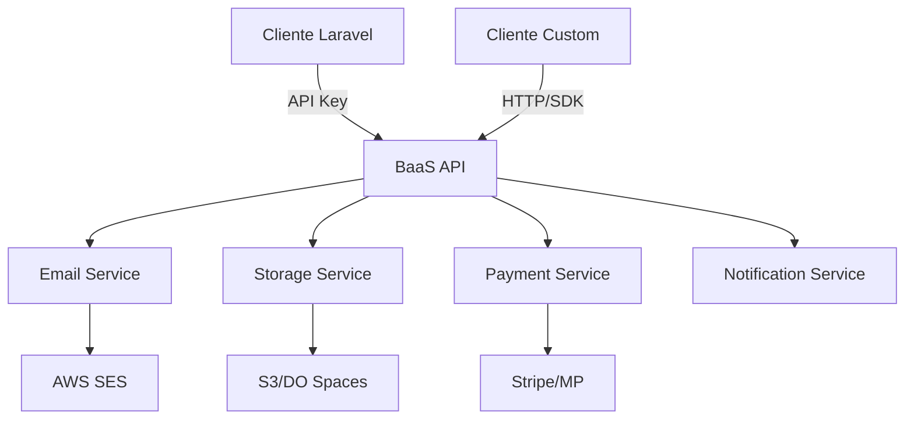

# Executive Overview — BaaS Multi-Proyecto

**Proyecto:** Backend as a Service (BaaS)  
**Usuario inicial:** Tus propios clientes y desarrollos  
**Timeframe MVP:** 4–6 semanas  
**Stack:** Laravel 12 (API only)

---

## Qué se va a implementar

Un **BaaS desacoplado** que provee servicios transversales vía API/SDK para acelerar el desarrollo de proyectos custom y semi-custom, eliminando la necesidad de reimplementar funcionalidades comunes en cada cliente.

**Principio rector:**  
*"Todo lo que no diferencia al negocio del cliente, va al BaaS."*

---

## Por qué es necesario

### Problema actual

* **Repetición constante** de código transversal (emails, notificaciones, pagos, storage).
* **Tiempo de desarrollo** desperdiciado en infraestructura no diferenciadora.
* **Sin modelo de ingresos recurrentes** que financie el desarrollo continuo.
* **Inconsistencia** entre proyectos en funcionalidades comunes.

### Solución propuesta

Un BaaS centralizado que:

* Elimina duplicación de esfuerzo.
* Genera **ingresos por suscripción** constantes.
* Acelera time-to-market de nuevos clientes.
* Mantiene calidad y seguridad consistente.

---

## Beneficio clave para el negocio

* **Ingresos recurrentes** desde el primer cliente (modelo SaaS).
* **Aceleración de desarrollo** (menos tiempo = más proyectos).
* **Escalabilidad económica** (un BaaS → N clientes).
* **Diferenciador competitivo** frente a desarrollos custom tradicionales.
* **Validación incremental** de servicios según demanda real.

---

## Alcance funcional (MVP)

### Servicios iniciales candidatos

> [!IMPORTANT]
> Los servicios específicos se definirán **bajo demanda** según necesidades reales de los primeros clientes. No se implementa nada especulativo.

**Posibles servicios transversales:**

* **Email transaccional** (SES, SMTP)
* **Notificaciones** (push, SMS, webhooks)
* **Storage** (S3, archivos)
* **Pagos** (Stripe, MercadoPago)
* **Auth/SSO** (OAuth, JWT)
* **Feature flags**
* **Logs centralizados**
* **Rate limiting**

### Arquitectura base (MVP)

* **1 app Laravel 12** (API only, sin frontend complejo).
* **Auth por API Key** por proyecto.
* **Consumo vía:**
  * HTTP directo (REST/JSON)
  * SDK Laravel (paquete interno para tus proyectos)
* **Sin multi-tenant complejo:** `project_id` + `api_key`.
* **Rate limiting básico** por proyecto.
* **Logs claros** sin exponer datos sensibles.

---

## Qué NO incluye esta etapa

* Frontend de administración complejo.
* Onboarding self-service para clientes externos.
* Facturación automatizada.
* Múltiples planes/tiers.
* Servicios especulativos sin validación.
* Infraestructura multi-región.
* SLA garantizado.

---

## Arquitectura (alto nivel)

**Principios arquitectónicos:**

* **API-first:** Todo servicio expuesto vía REST.
* **Stateless:** Sin sesiones, solo API keys.
* **Desacoplado:** Cada servicio puede evolucionar independientemente.
* **Incremental:** Se agregan servicios bajo demanda.

---

## Estrategia de validación

### Fase 1: Bootstrapping (Semanas 1-2)

* Infraestructura base (Laravel API, auth, rate limiting).
* **1 servicio piloto** (el más urgente para tu primer cliente).
* SDK Laravel básico.

### Fase 2: Validación (Semanas 3-4)

* Integración con **tu primer proyecto real**.
* Ajustes según feedback de uso.
* Documentación básica de API.

### Fase 3: Consolidación (Semanas 5-6)

* **Segundo servicio** (si hay demanda validada).
* Hardening de seguridad.
* Preparación para segundo cliente.

> [!NOTE]
> No se agrega un tercer servicio hasta tener **al menos 2 clientes activos** usando los primeros dos.

---

## Modelo de monetización (pensado, no implementado)

### Pricing inicial (hipótesis)

* **Plan Base:** USD 50/mes por proyecto
  * Incluye: X emails, Y requests, Z storage
* **Overages:** Pay-as-you-go por excedentes
* **Enterprise:** Custom pricing para volúmenes altos

### Métricas clave

* **MRR** (Monthly Recurring Revenue)
* **Costo por proyecto** (infraestructura + overhead)
* **Margen por servicio**
* **Churn rate**

> [!WARNING]
> La monetización **no se implementa en el MVP**. Solo se diseña la estructura de costos para validar viabilidad.

---

## Impacto técnico

### Nuevo

* **Infraestructura BaaS** (Laravel API, base de datos, deploy).
* **Sistema de API keys** (generación, hash, rotación).
* **Rate limiting** por proyecto.
* **SDK Laravel** (paquete Composer interno).

### Modificado

* Tus proyectos actuales migran funcionalidades al BaaS.
* Refactor de código duplicado hacia consumo de API.

### Riesgos técnicos

* **Latencia adicional** (llamadas HTTP vs código local).
* **Punto único de falla** (si BaaS cae, afecta a todos).
* **Complejidad de debugging** distribuido.

---

## Impacto económico

### Costos iniciales (MVP)

* **Infraestructura:** ~USD 20-50/mes (DigitalOcean/AWS).
* **Servicios externos:** Variable según uso (SES, S3, etc.).
* **Desarrollo:** 4-6 semanas (costo de oportunidad).

### Proyección (12 meses)

* **3 clientes activos:** USD 150/mes (MRR).
* **Costos variables:** ~USD 30/mes.
* **Margen bruto:** ~80%.
* **Break-even:** ~6 meses (asumiendo 1 cliente/mes).

> [!CAUTION]
> Sin clientes validados, el BaaS es **costo puro**. La prioridad es conseguir el primer cliente pagando antes de agregar más servicios.

---

## Riesgos y mitigación

### Riesgo 1: No hay demanda real

**Mitigación:**

* Empezar con **tus propios proyectos** como clientes.
* Validar con clientes existentes antes de construir.
* Implementar solo servicios con uso confirmado.

### Riesgo 2: Complejidad de mantenimiento

**Mitigación:**

* Límite estricto de servicios en MVP.
* Documentación obligatoria por servicio.
* Tests automatizados desde día 1.

### Riesgo 3: Seguridad multi-proyecto

**Mitigación:**

* API keys hasheadas (bcrypt/argon2).
* Aislamiento estricto por `project_id`.
* Rate limiting agresivo.
* Logs sin datos sensibles.

### Riesgo 4: Dependencia crítica

**Mitigación:**

* Monitoring básico (uptime, errores).
* Backups automáticos.
* Estrategia de rollback clara.

---

## Nota de seguridad (obligatoria)

### Autenticación

* **API Keys hasheadas** (nunca en texto plano).
* **Rotación manual** disponible desde día 1.
* **Revocación inmediata** por proyecto.

### Autorización

* **Aislamiento por proyecto:** Un cliente nunca ve datos de otro.
* **Validación de permisos** en cada request.

### Datos sensibles

* **Webhooks firmados** (HMAC-SHA256).
* **Logs sin payloads** de usuario.
* **Cifrado en tránsito** (HTTPS obligatorio).
* **Cifrado en reposo** para credenciales externas.

### Rate limiting

* **Por proyecto:** Evita abuso individual.
* **Global:** Protege infraestructura.

---

## Criterios de éxito (MVP)

### Técnicos

* [ ] API funcionando con auth por API key.
* [ ] Al menos **1 servicio** productivo.
* [ ] SDK Laravel instalable vía Composer.
* [ ] Tests automatizados (>80% coverage).
* [ ] Documentación de API (OpenAPI/Postman).

### Negocio

* [ ] **1 cliente real** usando el BaaS en producción.
* [ ] Tiempo de integración < 1 día.
* [ ] Cero incidentes de seguridad.
* [ ] Costos variables < 20% del MRR.

### Estratégicos

* [ ] Decisión clara sobre **segundo servicio** basada en demanda.
* [ ] Modelo de pricing validado con al menos 1 cliente.
* [ ] Roadmap de próximos 3 servicios priorizado.

---

## Decisiones pendientes (pre-MVP)

> [!IMPORTANT]
> Estas decisiones deben tomarse **antes de escribir código**:

1. **¿Cuál es el primer servicio?**
   * Criterio: El que necesites **esta semana** para un cliente real.

2. **¿Hosting del BaaS?**
   * DigitalOcean App Platform vs AWS vs VPS manual.

3. **¿Base de datos?**
   * PostgreSQL vs MySQL (consistente con tus proyectos).

4. **¿Versionado de API?**
   * `/v1/` desde día 1 o sin versión inicial.

5. **¿Logs centralizados?**
   * Laravel Log vs servicio externo (Papertrail, Logtail).

---

## Próximos pasos

### Inmediato (antes de codear)

1. **Identificar primer cliente** que usará el BaaS.
2. **Definir primer servicio** según necesidad real.
3. **Crear `project-definition.md`** del BaaS.
4. **Crear `slices.md`** con orden de construcción.

### Semana 1

1. **Slice 0:** Infraestructura base + auth por API key.
2. **Slice 1:** Primer servicio (ej: email transaccional).

### Semana 2-4

1. Integración con primer cliente.
2. Iteración según feedback.
3. Documentación de API.

### Semana 5-6

1. Hardening de seguridad.
2. Preparación para segundo cliente.
3. Decisión sobre segundo servicio.

---

## Resultado esperado

Al finalizar el MVP (6 semanas):

* **BaaS funcionando** con al menos 1 servicio productivo.
* **1 cliente real** (tuyo) usando el BaaS en producción.
* **Modelo de negocio validado** (pricing, costos, margen).
* **Decisión informada** sobre qué servicios agregar.
* **Infraestructura escalable** para crecer sin reescribir.
* **Ingresos recurrentes** iniciados (aunque sean tuyos propios proyectos).

**Métrica de éxito final:**  
*"¿El próximo proyecto custom se desarrolla 50% más rápido usando el BaaS?"*

Si la respuesta es **sí**, el BaaS cumplió su objetivo.  
Si es **no**, hay que pivotar o cancelar.
